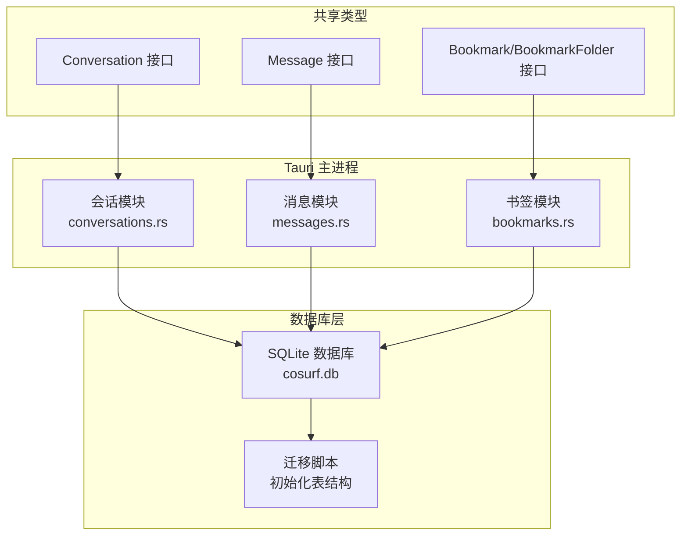
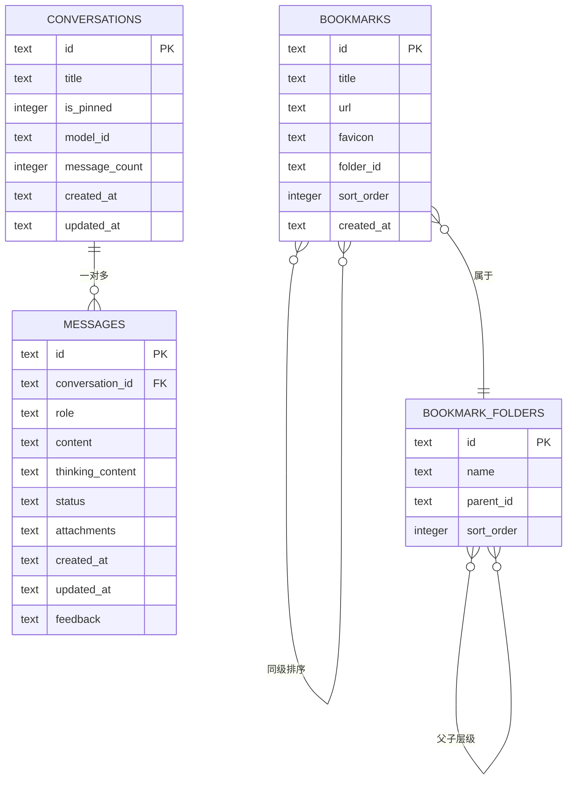
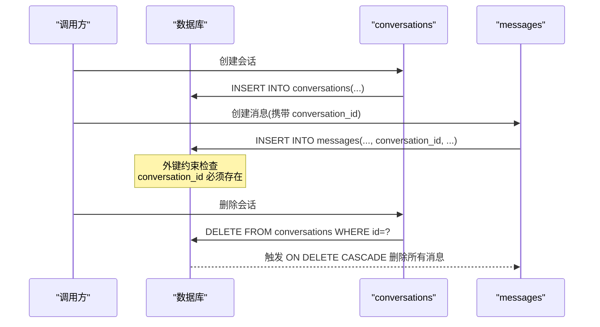
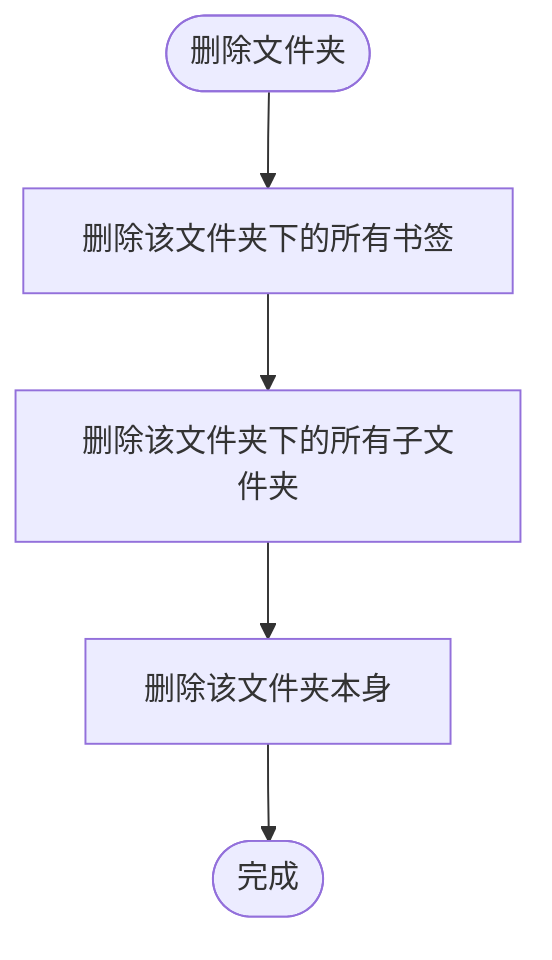
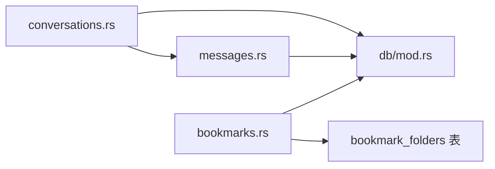

# 实体关系设计

<cite>
**本文引用的文件**
- [src-tauri/src/db/mod.rs](file://src-tauri/src/db/mod.rs)
- [src-tauri/src/db/conversations.rs](file://src-tauri/src/db/conversations.rs)
- [src-tauri/src/db/messages.rs](file://src-tauri/src/db/messages.rs)
- [src-tauri/src/db/bookmarks.rs](file://src-tauri/src/db/bookmarks.rs)
- [native/src/db/mod.rs](file://native/src/db/mod.rs)
- [packages/shared/src/conversation.ts](file://packages/shared/src/conversation.ts)
- [packages/shared/src/message.ts](file://packages/shared/src/message.ts)
- [packages/shared/src/bookmark.ts](file://packages/shared/src/bookmark.ts)
</cite>

## 目录
1. [简介](#简介)
2. [项目结构](#项目结构)
3. [核心组件](#核心组件)
4. [架构总览](#架构总览)
5. [详细组件分析](#详细组件分析)
6. [依赖分析](#依赖分析)
7. [性能考量](#性能考量)
8. [故障排查指南](#故障排查指南)
9. [结论](#结论)
10. [附录](#附录)

## 简介
本文件面向 CoSurf 的数据库实体关系设计，聚焦以下关键主题：
- 一对多关系模式：conversation 与 message 的父子关系、bookmark 与 bookmark_folder 的层级关系
- 外键约束与参照完整性保障
- 级联删除策略的应用场景与影响
- 查询性能与索引优化
- 实体关系图与 SQL 关系表达式
- 设计最佳实践与常见陷阱
- 如何通过关系设计保证数据一致性

## 项目结构
CoSurf 使用 SQLite 作为本地数据库，采用迁移脚本初始化表结构，并在运行时确保列存在性与数据迁移。数据库层位于 Tauri 主进程的 Rust 模块中，同时提供 N-API 的原生封装以供其他运行时使用。

图表来源
- [src-tauri/src/db/mod.rs:41-148](file://src-tauri/src/db/mod.rs#L41-L148)
- [src-tauri/src/db/conversations.rs:34-126](file://src-tauri/src/db/conversations.rs#L34-L126)
- [src-tauri/src/db/messages.rs:64-197](file://src-tauri/src/db/messages.rs#L64-L197)
- [src-tauri/src/db/bookmarks.rs:47-184](file://src-tauri/src/db/bookmarks.rs#L47-L184)
- [packages/shared/src/conversation.ts:1-14](file://packages/shared/src/conversation.ts#L1-L14)
- [packages/shared/src/message.ts:1-35](file://packages/shared/src/message.ts#L1-L35)
- [packages/shared/src/bookmark.ts:1-25](file://packages/shared/src/bookmark.ts#L1-L25)

章节来源
- [src-tauri/src/db/mod.rs:41-148](file://src-tauri/src/db/mod.rs#L41-L148)
- [src-tauri/src/db/conversations.rs:34-126](file://src-tauri/src/db/conversations.rs#L34-L126)
- [src-tauri/src/db/messages.rs:64-197](file://src-tauri/src/db/messages.rs#L64-L197)
- [src-tauri/src/db/bookmarks.rs:47-184](file://src-tauri/src/db/bookmarks.rs#L47-L184)
- [packages/shared/src/conversation.ts:1-14](file://packages/shared/src/conversation.ts#L1-L14)
- [packages/shared/src/message.ts:1-35](file://packages/shared/src/message.ts#L1-L35)
- [packages/shared/src/bookmark.ts:1-25](file://packages/shared/src/bookmark.ts#L1-L25)

## 核心组件
- 会话表 conversations：记录一次对话的基本信息，包括标题、置顶状态、模型 ID、消息数量与时间戳。
- 消息表 messages：记录对话中的每条消息，包含角色、内容、思考内容、状态、附件、反馈等。
- 书签表 bookmarks：记录浏览器书签，支持归属文件夹与排序。
- 书签文件夹表 bookmark_folders：记录书签的层级结构，支持父子关系与排序。
- 历史表 history、设置表 settings、模型配置表 model_configs、MCP 服务器表 mcp_servers：为系统功能提供支撑。

章节来源
- [src-tauri/src/db/mod.rs:44-129](file://src-tauri/src/db/mod.rs#L44-L129)
- [src-tauri/src/db/conversations.rs:7-17](file://src-tauri/src/db/conversations.rs#L7-L17)
- [src-tauri/src/db/messages.rs:24-36](file://src-tauri/src/db/messages.rs#L24-L36)
- [src-tauri/src/db/bookmarks.rs:9-29](file://src-tauri/src/db/bookmarks.rs#L9-L29)

## 架构总览
下图展示 CoSurf 数据库中的实体关系与外键约束：

图表来源
- [src-tauri/src/db/mod.rs:44-129](file://src-tauri/src/db/mod.rs#L44-L129)
- [native/src/db/mod.rs:63-162](file://native/src/db/mod.rs#L63-L162)

## 详细组件分析

### 一对多关系：conversation 与 message
- 外键约束：messages.conversation_id 引用 conversations.id，并设置 ON DELETE CASCADE。
- 参照完整性：删除父会话时，其所有消息将被级联删除；插入消息时必须存在对应的会话。
- 业务影响：
  - 会话删除即刻清理所有相关消息，避免悬挂数据。
  - 消息的有序展示依赖 conversation_id 索引，查询效率高。
- 性能要点：
  - 已创建索引 idx_messages_conversation_id，按会话查询消息具备良好性能。
  - 消息状态与反馈字段便于流式更新与统计。

图表来源
- [src-tauri/src/db/mod.rs:63-67](file://src-tauri/src/db/mod.rs#L63-L67)
- [src-tauri/src/db/conversations.rs:80-93](file://src-tauri/src/db/conversations.rs#L80-L93)
- [src-tauri/src/db/messages.rs:122-135](file://src-tauri/src/db/messages.rs#L122-L135)

章节来源
- [src-tauri/src/db/mod.rs:63-67](file://src-tauri/src/db/mod.rs#L63-L67)
- [src-tauri/src/db/conversations.rs:80-125](file://src-tauri/src/db/conversations.rs#L80-L125)
- [src-tauri/src/db/messages.rs:64-135](file://src-tauri/src/db/messages.rs#L64-L135)

### 层级关系：bookmark 与 bookmark_folder
- 结构设计：
  - bookmarks.folder_id 指向 bookmark_folders.id，形成“书签属于文件夹”的关系。
  - bookmark_folders.parent_id 指向自身 id，形成树形层级（父子关系）。
  - 两者均维护 sort_order 以支持同级排序。
- 参照完整性：
  - 书签删除：仅删除该书签，不级联删除文件夹。
  - 文件夹删除：先删除该文件夹下的所有书签，再删除该文件夹下的所有子文件夹，最后删除该文件夹本身。
- 查询模式：
  - 列出某文件夹下的书签：按 folder_id 与 sort_order 排序。
  - 列出某层级的文件夹：按 parent_id 与 sort_order 排序。

图表来源
- [src-tauri/src/db/bookmarks.rs:175-183](file://src-tauri/src/db/bookmarks.rs#L175-L183)

章节来源
- [src-tauri/src/db/bookmarks.rs:48-183](file://src-tauri/src/db/bookmarks.rs#L48-L183)

### 外键约束与参照完整性
- 外键启用：数据库初始化时开启 PRAGMA foreign_keys=ON。
- 级联删除：
  - 会话删除 → 级联删除消息（ON DELETE CASCADE）。
  - 文件夹删除 → 先删除其下书签与子文件夹，再删除自身（应用层顺序删除）。
- 约束检查：
  - 插入消息时 conversation_id 必须存在。
  - 书签的 folder_id 必须对应存在的文件夹。
  - 文件夹的 parent_id 必须对应存在的父文件夹（若非空）。

章节来源
- [src-tauri/src/db/mod.rs:24-25](file://src-tauri/src/db/mod.rs#L24-L25)
- [src-tauri/src/db/mod.rs:63-67](file://src-tauri/src/db/mod.rs#L63-L67)
- [src-tauri/src/db/bookmarks.rs:175-183](file://src-tauri/src/db/bookmarks.rs#L175-L183)

### 级联删除策略的应用场景与影响
- 场景一：会话删除
  - 应用：用户彻底清理一次对话。
  - 影响：自动清理所有消息，避免残留。
- 场景二：文件夹删除
  - 应用：用户整理书签结构。
  - 影响：需按顺序删除子项，防止违反外键约束。
- 注意事项：
  - 级联删除不可逆，应谨慎触发。
  - 对于无级联删除的场景（如书签删除），需确保业务逻辑不会产生悬挂数据。

章节来源
- [src-tauri/src/db/conversations.rs:111-117](file://src-tauri/src/db/conversations.rs#L111-L117)
- [src-tauri/src/db/bookmarks.rs:111-117](file://src-tauri/src/db/bookmarks.rs#L111-L117)
- [src-tauri/src/db/bookmarks.rs:175-183](file://src-tauri/src/db/bookmarks.rs#L175-L183)

### 查询性能与索引优化
- 已有索引：
  - idx_messages_conversation_id：加速按会话查询消息。
  - idx_history_visited_at：按访问时间倒序查询历史。
  - idx_mcp_servers_enabled：筛选启用的 MCP 服务器。
- 性能建议：
  - 在高频过滤字段上建立索引（如 created_at、updated_at）。
  - 对组合查询条件建立复合索引（如 folder_id + sort_order）。
  - 控制 JSON 文本大小，避免大字段参与排序或连接。

章节来源
- [src-tauri/src/db/mod.rs:67-67](file://src-tauri/src/db/mod.rs#L67-L67)
- [src-tauri/src/db/mod.rs:93-93](file://src-tauri/src/db/mod.rs#L93-L93)
- [src-tauri/src/db/mod.rs:131-131](file://src-tauri/src/db/mod.rs#L131-L131)

### 实体关系图与 SQL 关系表达式
- 关系图（见“架构总览”）
- SQL 关系表达式（示意）：
  - 会话与消息：FOREIGN KEY (conversation_id) REFERENCES conversations(id) ON DELETE CASCADE
  - 书签与文件夹：bookmarks.folder_id = bookmark_folders.id
  - 文件夹层级：bookmark_folders.parent_id = bookmark_folders.id（可为空）

章节来源
- [src-tauri/src/db/mod.rs:63-67](file://src-tauri/src/db/mod.rs#L63-L67)
- [src-tauri/src/db/mod.rs:79-84](file://src-tauri/src/db/mod.rs#L79-L84)

### 设计最佳实践与常见陷阱
- 最佳实践
  - 明确外键方向与删除策略，避免意外级联。
  - 为高频查询字段建立索引，平衡写入与读取性能。
  - 使用排序字段（sort_order）统一管理层次与顺序。
  - 对 JSON 文本字段进行序列化/反序列化，保持结构稳定。
- 常见陷阱
  - 忘记开启外键约束（PRAGMA foreign_keys=ON）。
  - 未按顺序删除层级节点导致外键冲突。
  - 在大字段上进行排序或连接，影响性能。
  - 插入消息前未校验父实体存在性。

章节来源
- [src-tauri/src/db/mod.rs:24-25](file://src-tauri/src/db/mod.rs#L24-L25)
- [src-tauri/src/db/bookmarks.rs:175-183](file://src-tauri/src/db/bookmarks.rs#L175-L183)

## 依赖分析
- 模块耦合
  - conversations.rs 与 messages.rs 通过外键耦合，删除策略强依赖。
  - bookmarks.rs 与 bookmark_folders.rs 通过字段耦合，删除顺序严格。
- 外部依赖
  - SQLite（rusqlite）提供关系型能力与外键约束。
  - 共享 TypeScript 接口用于前端/跨语言交互。

图表来源
- [src-tauri/src/db/conversations.rs:34-126](file://src-tauri/src/db/conversations.rs#L34-L126)
- [src-tauri/src/db/messages.rs:64-197](file://src-tauri/src/db/messages.rs#L64-L197)
- [src-tauri/src/db/bookmarks.rs:47-184](file://src-tauri/src/db/bookmarks.rs#L47-L184)
- [src-tauri/src/db/mod.rs:41-148](file://src-tauri/src/db/mod.rs#L41-L148)

章节来源
- [src-tauri/src/db/conversations.rs:34-126](file://src-tauri/src/db/conversations.rs#L34-L126)
- [src-tauri/src/db/messages.rs:64-197](file://src-tauri/src/db/messages.rs#L64-L197)
- [src-tauri/src/db/bookmarks.rs:47-184](file://src-tauri/src/db/bookmarks.rs#L47-L184)
- [src-tauri/src/db/mod.rs:41-148](file://src-tauri/src/db/mod.rs#L41-L148)

## 性能考量
- 索引命中：按 conversation_id 查询消息、按 folder_id 查询书签、按 parent_id 查询子文件夹均受益于索引。
- 写入成本：级联删除与排序字段更新带来额外开销，应在批量操作时合并事务。
- 存储结构：JSON 字段（如 attachments、feedback）便于扩展但可能影响排序与连接性能，建议控制字段大小与查询范围。

## 故障排查指南
- 外键约束错误
  - 现象：插入消息时报外键错误。
  - 排查：确认 conversation_id 对应的会话存在。
- 删除失败
  - 现象：删除会话或文件夹报错。
  - 排查：检查是否存在依赖实体；对于文件夹删除，确认删除顺序正确。
- 查询缓慢
  - 现象：按会话或书签查询慢。
  - 排查：确认索引已创建并生效；避免在大字段上进行排序或连接。

章节来源
- [src-tauri/src/db/messages.rs:122-135](file://src-tauri/src/db/messages.rs#L122-L135)
- [src-tauri/src/db/conversations.rs:111-117](file://src-tauri/src/db/conversations.rs#L111-L117)
- [src-tauri/src/db/bookmarks.rs:175-183](file://src-tauri/src/db/bookmarks.rs#L175-L183)

## 结论
CoSurf 的数据库关系设计以清晰的一对多与树形层级为核心，结合外键约束与索引策略，在保证参照完整性的同时兼顾了查询性能。通过明确的级联删除策略与严格的删除顺序，有效避免了悬挂数据。建议在后续演进中持续关注热点查询路径，按需补充索引与优化存储结构，以进一步提升整体性能与可维护性。

## 附录
- 类型映射参考
  - Conversation ↔ conversations
  - Message ↔ messages
  - Bookmark/BookmarkFolder ↔ bookmarks/bookmark_folders

章节来源
- [packages/shared/src/conversation.ts:1-14](file://packages/shared/src/conversation.ts#L1-L14)
- [packages/shared/src/message.ts:1-35](file://packages/shared/src/message.ts#L1-L35)
- [packages/shared/src/bookmark.ts:1-25](file://packages/shared/src/bookmark.ts#L1-L25)