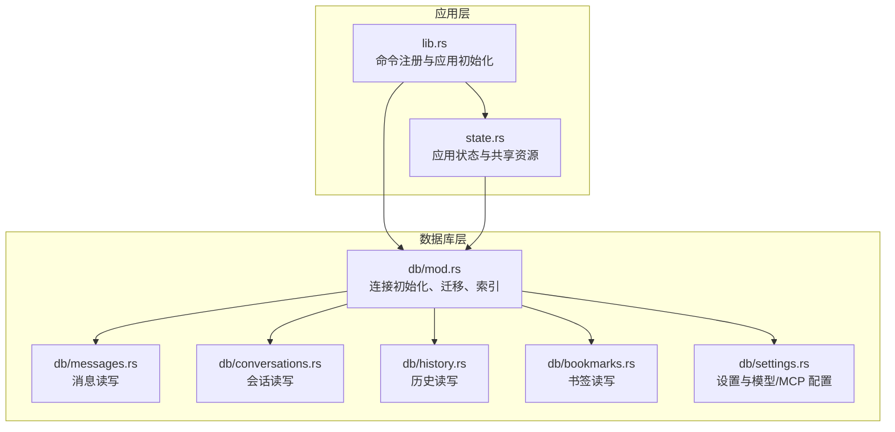
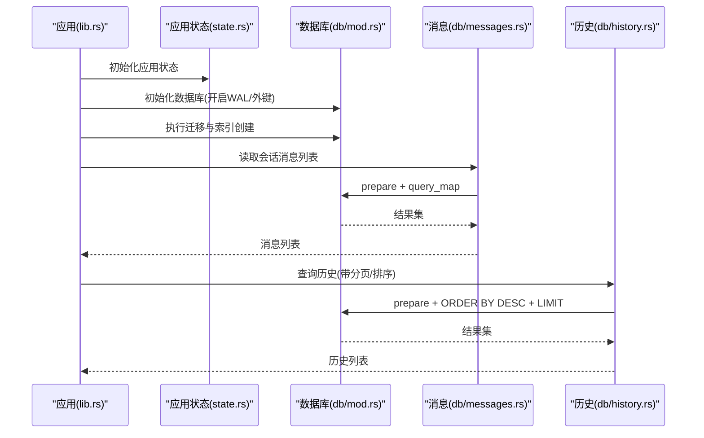
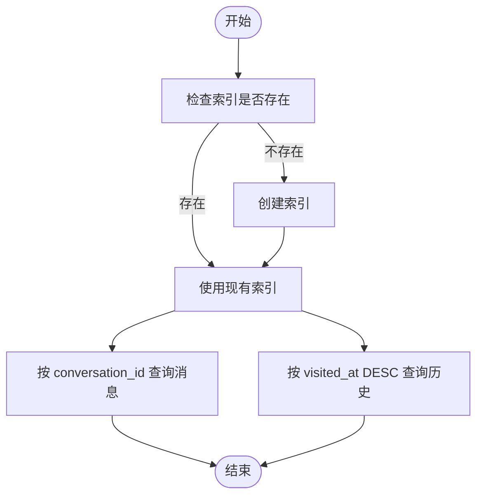
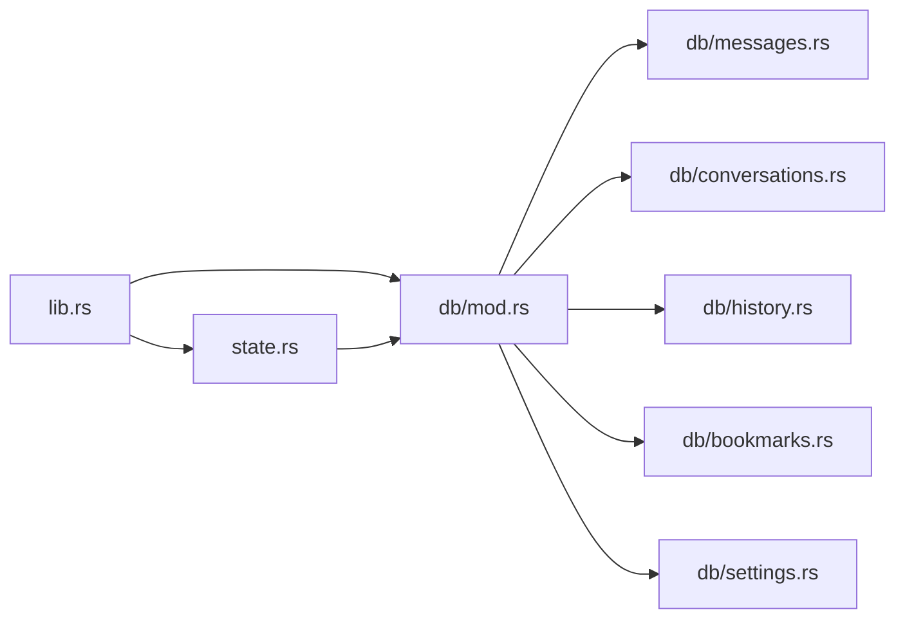

# 性能优化策略

<cite>
**本文引用的文件**
- [src-tauri/src/db/mod.rs](file://src-tauri/src/db/mod.rs)
- [src-tauri/src/db/messages.rs](file://src-tauri/src/db/messages.rs)
- [src-tauri/src/db/history.rs](file://src-tauri/src/db/history.rs)
- [src-tauri/src/db/conversations.rs](file://src-tauri/src/db/conversations.rs)
- [src-tauri/src/db/bookmarks.rs](file://src-tauri/src/db/bookmarks.rs)
- [src-tauri/src/db/settings.rs](file://src-tauri/src/db/settings.rs)
- [src-tauri/src/state.rs](file://src-tauri/src/state.rs)
- [src-tauri/src/lib.rs](file://src-tauri/src/lib.rs)
- [SUMMARIZE_PAGE_OPTIMIZATION.md](file://SUMMARIZE_PAGE_OPTIMIZATION.md)
- [docs/IQS_IMPLEMENTATION_SUMMARY.md](file://docs/IQS_IMPLEMENTATION_SUMMARY.md)
- [docs/MCP_SKILL_IMPLEMENTATION.md](file://docs/MCP_SKILL_IMPLEMENTATION.md)
</cite>

## 目录
1. [简介](#简介)
2. [项目结构](#项目结构)
3. [核心组件](#核心组件)
4. [架构总览](#架构总览)
5. [详细组件分析](#详细组件分析)
6. [依赖分析](#依赖分析)
7. [性能考量](#性能考量)
8. [故障排查指南](#故障排查指南)
9. [结论](#结论)
10. [附录](#附录)

## 简介
本文件面向 CoSurf 数据库性能优化，聚焦以下目标：
- 索引设计策略与查询优化效果：重点分析 idx_messages_conversation_id、idx_history_visited_at 等关键索引
- WAL 日志模式对并发性能的提升作用
- 查询优化技术：查询计划分析、执行效率评估、慢查询监控
- 数据访问模式优化：批量操作、连接复用、事务优化
- 性能监控指标与基准测试方法
- 内存使用优化与磁盘 I/O 优化策略
- 基于查询模式分析改进数据库设计的实践建议

## 项目结构
CoSurf 后端采用 Rust + Tauri 架构，数据库层基于 SQLite（rusqlite），通过自定义 Database 封装连接、迁移与索引初始化，并在应用启动阶段统一注册命令。

图表来源
- [src-tauri/src/lib.rs:108-214](file://src-tauri/src/lib.rs#L108-L214)
- [src-tauri/src/state.rs:25-79](file://src-tauri/src/state.rs#L25-L79)
- [src-tauri/src/db/mod.rs:11-272](file://src-tauri/src/db/mod.rs#L11-L272)

章节来源
- [src-tauri/src/lib.rs:41-107](file://src-tauri/src/lib.rs#L41-L107)
- [src-tauri/src/state.rs:9-23](file://src-tauri/src/state.rs#L9-L23)

## 核心组件
- 数据库连接与初始化：在数据库初始化时启用 WAL 模式与外键约束，并执行迁移与索引创建
- 表与索引：
  - messages：主键 id；索引 idx_messages_conversation_id（按会话查询消息）
  - history：主键 id；索引 idx_history_visited_at（按访问时间倒序查询）
  - conversations、bookmarks、settings、model_configs、mcp_servers 等
- 数据访问模式：
  - 读取：prepare + query_map 或 query_row
  - 写入：execute 或 execute_batch
  - 事务：通过批量执行或显式事务控制（见后续章节）

章节来源
- [src-tauri/src/db/mod.rs:16-30](file://src-tauri/src/db/mod.rs#L16-L30)
- [src-tauri/src/db/mod.rs:41-148](file://src-tauri/src/db/mod.rs#L41-L148)
- [src-tauri/src/db/messages.rs:64-94](file://src-tauri/src/db/messages.rs#L64-L94)
- [src-tauri/src/db/history.rs:24-44](file://src-tauri/src/db/history.rs#L24-L44)

## 架构总览
数据库层以单连接为中心，配合应用状态共享与命令注册，形成“命令驱动 + 数据访问”的结构。SQLite 在 WAL 模式下具备更好的并发读写能力，适合桌面应用的交互场景。

图表来源
- [src-tauri/src/lib.rs:50-73](file://src-tauri/src/lib.rs#L50-L73)
- [src-tauri/src/state.rs:25-79](file://src-tauri/src/state.rs#L25-L79)
- [src-tauri/src/db/mod.rs:16-30](file://src-tauri/src/db/mod.rs#L16-L30)
- [src-tauri/src/db/messages.rs:64-94](file://src-tauri/src/db/messages.rs#L64-L94)
- [src-tauri/src/db/history.rs:24-44](file://src-tauri/src/db/history.rs#L24-L44)

## 详细组件分析

### 索引设计与查询优化
- idx_messages_conversation_id
  - 作用：加速按 conversation_id 的消息查询，避免全表扫描
  - 查询优化效果：在消息列表读取、流式增量更新等场景显著降低 CPU 与 I/O 开销
- idx_history_visited_at
  - 作用：支持历史记录按访问时间倒序分页查询
  - 查询优化效果：在历史浏览、搜索历史等场景减少排序成本

图表来源
- [src-tauri/src/db/mod.rs:67](file://src-tauri/src/db/mod.rs#L67)
- [src-tauri/src/db/mod.rs:93](file://src-tauri/src/db/mod.rs#L93)
- [src-tauri/src/db/messages.rs:66](file://src-tauri/src/db/messages.rs#L66)
- [src-tauri/src/db/history.rs:26](file://src-tauri/src/db/history.rs#L26)

章节来源
- [src-tauri/src/db/mod.rs:67](file://src-tauri/src/db/mod.rs#L67)
- [src-tauri/src/db/mod.rs:93](file://src-tauri/src/db/mod.rs#L93)
- [src-tauri/src/db/messages.rs:64-94](file://src-tauri/src/db/messages.rs#L64-L94)
- [src-tauri/src/db/history.rs:24-44](file://src-tauri/src/db/history.rs#L24-L44)

### WAL 日志模式与并发性能
- 在数据库初始化时启用 PRAGMA journal_mode=WAL，提升并发读写吞吐，降低锁竞争
- 适用于多线程/异步场景（如消息流式增量更新、历史写入）

章节来源
- [src-tauri/src/db/mod.rs:24](file://src-tauri/src/db/mod.rs#L24)

### 查询优化技术
- 查询计划分析
  - 使用 EXPLAIN QUERY PLAN（SQLite 原生）分析 SQL 执行路径，确认索引命中情况
  - 关注 ORDER BY、LIMIT、WHERE 条件与索引覆盖度
- 执行效率评估
  - 通过 tracing 记录关键命令耗时，结合数据库层 prepare/query_map 的执行路径定位瓶颈
- 慢查询监控
  - 建议在数据库层包装执行计时，对超过阈值的查询输出警告日志

章节来源
- [src-tauri/src/lib.rs:17-21](file://src-tauri/src/lib.rs#L17-L21)
- [src-tauri/src/db/messages.rs:152-166](file://src-tauri/src/db/messages.rs#L152-L166)

### 数据访问模式优化
- 批量操作
  - 使用 execute_batch 执行多条 DDL/DML，减少往返开销
  - 在迁移与初始化阶段集中执行
- 连接复用
  - Database 持有单个 Connection，通过 Mutex 在命令间复用，避免频繁打开/关闭
- 事务优化
  - 对于多步写入（如消息增量更新），尽量合并为单事务，减少锁持有时间
  - 注意 WAL 模式下的写放大与 fsync 策略

章节来源
- [src-tauri/src/db/mod.rs:42-133](file://src-tauri/src/db/mod.rs#L42-L133)
- [src-tauri/src/db/messages.rs:152-175](file://src-tauri/src/db/messages.rs#L152-L175)
- [src-tauri/src/state.rs:9-23](file://src-tauri/src/state.rs#L9-L23)

### 性能监控指标与基准测试
- 指标建议
  - 数据库层：查询耗时分布、索引命中率、WAL checkpoint 频率
  - 应用层：命令平均耗时、并发请求数、内存占用（含响应缓存）
- 基准测试方法
  - 使用 SQLite 自带的 .bench 命令或编写基准测试脚本，模拟高频读写场景
  - 对比 WAL 与 DELETE 模式下的吞吐差异

章节来源
- [docs/IQS_IMPLEMENTATION_SUMMARY.md:232-237](file://docs/IQS_IMPLEMENTATION_SUMMARY.md#L232-L237)

### 内存使用优化与磁盘 I/O 优化
- 内存优化
  - 使用 query_map 逐行映射，避免一次性加载大结果集
  - 响应缓存（如页面内容提取）及时清理，防止内存泄漏
- 磁盘 I/O 优化
  - WAL 模式减少写锁争用，合理设置 checkpoint 间隔
  - 对频繁查询的列建立合适索引，避免隐式排序

章节来源
- [src-tauri/src/db/messages.rs:64-94](file://src-tauri/src/db/messages.rs#L64-L94)
- [src-tauri/src/db/history.rs:24-44](file://src-tauri/src/db/history.rs#L24-L44)
- [src-tauri/src/state.rs:14-15](file://src-tauri/src/state.rs#L14-L15)
- [SUMMARIZE_PAGE_OPTIMIZATION.md:89-96](file://SUMMARIZE_PAGE_OPTIMIZATION.md#L89-L96)

### 基于查询模式分析改进数据库设计
- 常见查询模式
  - 按会话查询消息：需保证 idx_messages_conversation_id 命中
  - 历史倒序分页：需保证 idx_history_visited_at 命中
- 设计改进建议
  - 为高频过滤/排序列建立复合索引（如同时按 conversation_id 与 created_at）
  - 对大字段（content/thinking_content）采用分离存储或压缩策略
  - 引入只读副本或物化视图，减轻主库压力

章节来源
- [src-tauri/src/db/messages.rs:66](file://src-tauri/src/db/messages.rs#L66)
- [src-tauri/src/db/history.rs:27](file://src-tauri/src/db/history.rs#L27)

## 依赖分析
- 组件耦合
  - lib.rs 统一注册命令，依赖各模块的命令函数
  - state.rs 管理共享资源（数据库、技能管理器、响应缓存等）
  - db/mod.rs 作为中心枢纽，负责连接、迁移与索引
- 外部依赖
  - rusqlite：SQLite 绑定
  - tracing/tracing-subscriber：日志与性能观测

图表来源
- [src-tauri/src/lib.rs:108-214](file://src-tauri/src/lib.rs#L108-L214)
- [src-tauri/src/state.rs:25-79](file://src-tauri/src/state.rs#L25-L79)
- [src-tauri/src/db/mod.rs:11-272](file://src-tauri/src/db/mod.rs#L11-L272)

章节来源
- [src-tauri/src/lib.rs:108-214](file://src-tauri/src/lib.rs#L108-L214)
- [src-tauri/src/state.rs:25-79](file://src-tauri/src/state.rs#L25-L79)

## 性能考量
- 并发与锁
  - WAL 模式提升并发读写，但需关注 checkpoint 与 fsync 策略
- 索引维护
  - 频繁写入场景下，索引维护成本上升；可通过批量写入与定期重建策略平衡
- I/O 与内存
  - 控制单次查询返回大小，避免 OOM；对临时缓存设置 TTL

## 故障排查指南
- 常见问题
  - 查询慢：检查 EXPLAIN QUERY PLAN，确认索引是否命中
  - 写入阻塞：检查 WAL checkpoint 频率与磁盘写入速度
  - 内存增长：核查响应缓存清理逻辑与长生命周期对象
- 工具与手段
  - tracing 日志定位瓶颈
  - SQLite PRAGMA 命令查看统计信息

章节来源
- [src-tauri/src/lib.rs:17-21](file://src-tauri/src/lib.rs#L17-L21)
- [SUMMARIZE_PAGE_OPTIMIZATION.md:89-101](file://SUMMARIZE_PAGE_OPTIMIZATION.md#L89-L101)

## 结论
通过对 idx_messages_conversation_id、idx_history_visited_at 等关键索引的使用与 WAL 模式的启用，CoSurf 在消息与历史查询场景中获得了显著的查询性能提升。结合批量操作、连接复用与事务优化，可在高并发桌面应用中保持稳定表现。建议持续通过 EXPLAIN QUERY PLAN、tracing 与基准测试完善性能治理，并根据查询模式迭代索引与表结构设计。

## 附录
- 相关文档与实现参考
  - 页面内容提取优化（请求-响应机制、超时控制、内存管理）
  - IQS 工具性能优化（超时、并发限制、日志记录）
  - MCP/技能连接池优化与安全考虑

章节来源
- [SUMMARIZE_PAGE_OPTIMIZATION.md:54-85](file://SUMMARIZE_PAGE_OPTIMIZATION.md#L54-L85)
- [SUMMARIZE_PAGE_OPTIMIZATION.md:89-101](file://SUMMARIZE_PAGE_OPTIMIZATION.md#L89-L101)
- [docs/IQS_IMPLEMENTATION_SUMMARY.md:232-237](file://docs/IQS_IMPLEMENTATION_SUMMARY.md#L232-L237)
- [docs/MCP_SKILL_IMPLEMENTATION.md:390-413](file://docs/MCP_SKILL_IMPLEMENTATION.md#L390-L413)