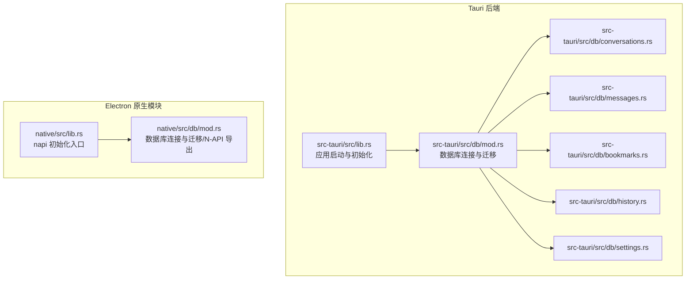
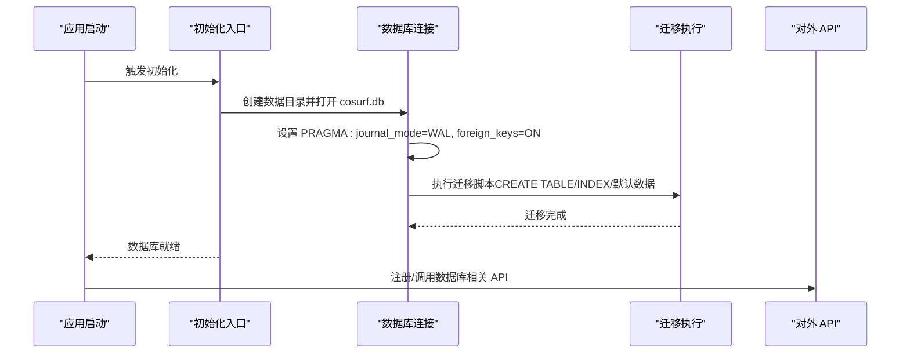
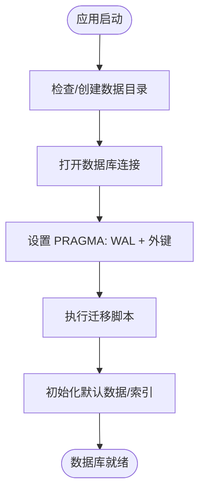
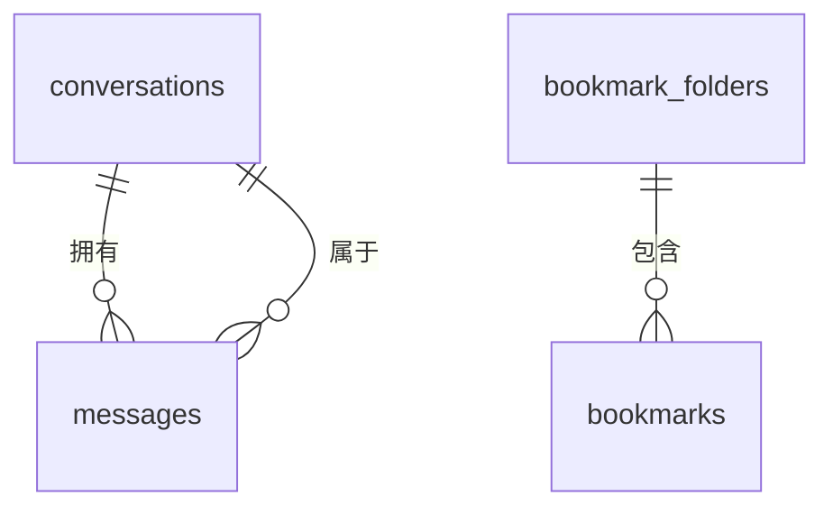
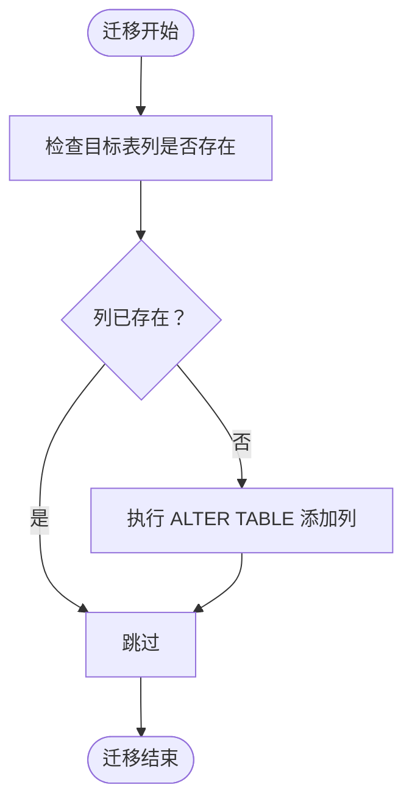
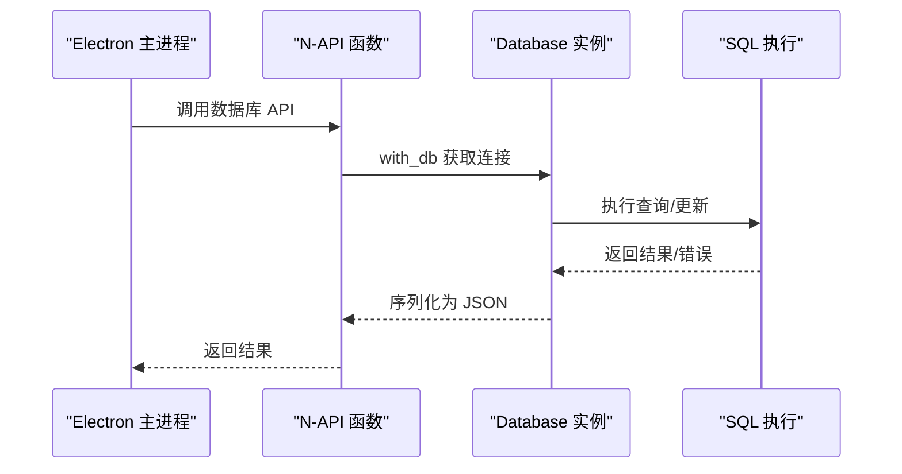
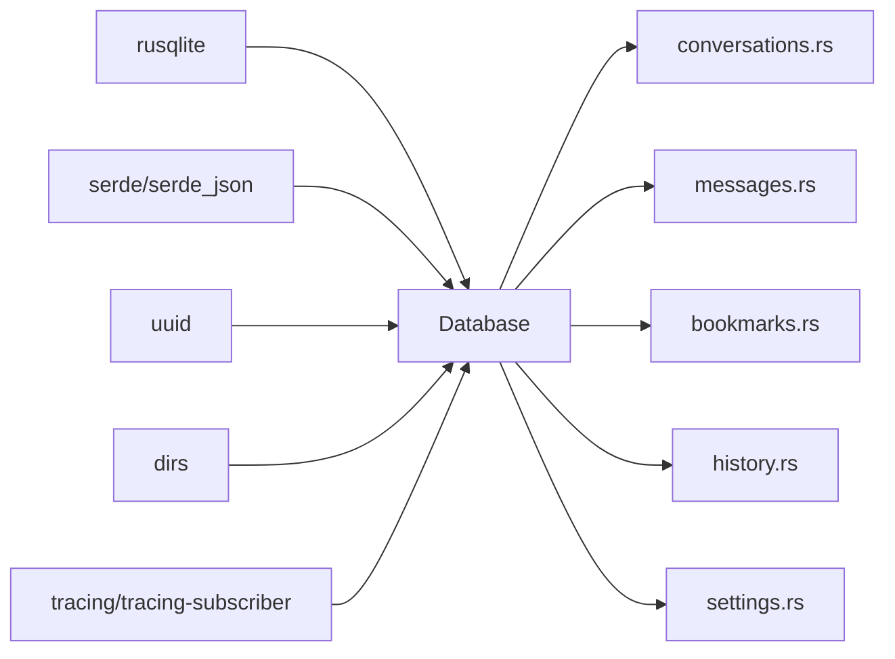

# 数据库架构

<cite>
**本文引用的文件**
- [native/src/db/mod.rs](file://native/src/db/mod.rs)
- [src-tauri/src/db/mod.rs](file://src-tauri/src/db/mod.rs)
- [src-tauri/src/db/bookmarks.rs](file://src-tauri/src/db/bookmarks.rs)
- [src-tauri/src/db/conversations.rs](file://src-tauri/src/db/conversations.rs)
- [src-tauri/src/db/messages.rs](file://src-tauri/src/db/messages.rs)
- [src-tauri/src/db/history.rs](file://src-tauri/src/db/history.rs)
- [src-tauri/src/db/settings.rs](file://src-tauri/src/db/settings.rs)
- [native/src/lib.rs](file://native/src/lib.rs)
- [src-tauri/src/lib.rs](file://src-tauri/src/lib.rs)
- [native/src/error.rs](file://native/src/error.rs)
- [agent.md](file://agent.md)
</cite>

## 目录
1. [简介](#简介)
2. [项目结构](#项目结构)
3. [核心组件](#核心组件)
4. [架构总览](#架构总览)
5. [详细组件分析](#详细组件分析)
6. [依赖关系分析](#依赖关系分析)
7. [性能考量](#性能考量)
8. [故障排查指南](#故障排查指南)
9. [结论](#结论)
10. [附录](#附录)

## 简介
本文件系统性梳理 CoSurf 的数据库架构与实现，重点覆盖 SQLite 的整体设计思路与架构原则，包括 WAL 日志模式、外键约束启用、数据库连接管理等关键设计决策；阐述数据库初始化流程（数据目录创建、连接建立、迁移执行）；解释数据库配置参数（PRAGMA）选择原因及对性能与可靠性的影响；说明数据库生命周期管理（连接池策略、事务处理、错误处理机制）；并提供架构图与设计决策的技术背景，以及性能优化建议与最佳实践。

**更新** 本版本反映了数据库架构的简化，移除了 IQS API Key 相关的功能，专注于核心数据库功能的稳定性和一致性。

## 项目结构
CoSurf 的数据库层在两个运行时中分别实现：
- Tauri 后端：位于 src-tauri/src/db，提供命令接口与业务封装。
- Electron 原生模块（N-API）：位于 native/src/db，提供跨平台原生能力，导出统一的数据库 API。

二者共享相同的数据库模式与迁移逻辑，但入口初始化方式不同：
- Tauri：应用启动时在 setup 阶段初始化数据库并注入应用状态。
- Electron：主进程启动时通过 napi 调用 native_init 完成数据库初始化。

图表来源
- [src-tauri/src/lib.rs:50-73](file://src-tauri/src/lib.rs#L50-L73)
- [src-tauri/src/db/mod.rs:15-30](file://src-tauri/src/db/mod.rs#L15-L30)
- [native/src/lib.rs:28-56](file://native/src/lib.rs#L28-L56)
- [native/src/db/mod.rs:40-54](file://native/src/db/mod.rs#L40-L54)

章节来源
- [src-tauri/src/lib.rs:50-73](file://src-tauri/src/lib.rs#L50-L73)
- [native/src/lib.rs:28-56](file://native/src/lib.rs#L28-L56)

## 核心组件
- 数据库连接与迁移
  - Tauri 与原生模块均在连接建立后立即启用 WAL 模式与外键约束，并执行迁移脚本，保证一致性与可靠性。
- 表与索引
  - 核心表：conversations、messages、bookmarks、bookmark_folders、history、settings、model_configs、mcp_servers。
  - 辅助表：agent_prompts（原生模块迁移时初始化）。
  - 索引：messages.conversation_id、history.visited_at、mcp_servers.enabled。
- N-API 导出
  - 原生模块将数据库操作以 napi 函数形式导出，供 Electron 主进程调用，避免阻塞 UI 线程。
- 错误处理
  - 统一的 AppError 枚举，涵盖数据库、HTTP、JSON、AI Provider、配置、未找到、内部错误等，便于上层捕获与处理。

**更新** IQS API Key 相关的配置键（如 `iqs.api_key`）已被移除，系统现在专注于核心数据库功能的稳定性和一致性。

章节来源
- [src-tauri/src/db/mod.rs:41-148](file://src-tauri/src/db/mod.rs#L41-L148)
- [native/src/db/mod.rs:40-54](file://native/src/db/mod.rs#L40-L54)
- [native/src/db/mod.rs:60-173](file://native/src/db/mod.rs#L60-L173)
- [native/src/error.rs:5-37](file://native/src/error.rs#L5-L37)

## 架构总览
下图展示数据库初始化与访问的关键路径，以及迁移与 PRAGMA 设置的时机。

图表来源
- [src-tauri/src/db/mod.rs:15-30](file://src-tauri/src/db/mod.rs#L15-L30)
- [native/src/db/mod.rs:40-54](file://native/src/db/mod.rs#L40-L54)
- [src-tauri/src/lib.rs:62-66](file://src-tauri/src/lib.rs#L62-L66)
- [native/src/lib.rs:41-42](file://native/src/lib.rs#L41-L42)

## 详细组件分析

### 数据库连接与生命周期
- 连接建立
  - 在应用数据目录下创建 cosurf.db 文件，打开连接后立即设置 PRAGMA。
- WAL 模式
  - 使用 WAL 模式提升并发读写性能，降低锁竞争，适合桌面应用的交互场景。
- 外键约束
  - 启用外键约束，配合级联删除（messages.conversation_id 外键），保障数据一致性。
- 迁移与默认数据
  - 执行迁移脚本创建核心表与索引；原生模块迁移中还会初始化 agent_prompts 默认数据。
- 生命周期管理
  - Tauri：在 setup 阶段创建 Database 实例并注入 AppState，贯穿应用生命周期。
  - 原生模块：通过 lazy_static 与 Mutex 管理全局单例，提供 init_database 与 with_db 访问器。

图表来源
- [src-tauri/src/db/mod.rs:15-30](file://src-tauri/src/db/mod.rs#L15-L30)
- [native/src/db/mod.rs:40-54](file://native/src/db/mod.rs#L40-L54)
- [src-tauri/src/db/mod.rs:41-148](file://src-tauri/src/db/mod.rs#L41-L148)
- [native/src/db/mod.rs:60-173](file://native/src/db/mod.rs#L60-L173)

章节来源
- [src-tauri/src/db/mod.rs:15-30](file://src-tauri/src/db/mod.rs#L15-L30)
- [native/src/db/mod.rs:40-54](file://native/src/db/mod.rs#L40-L54)
- [src-tauri/src/lib.rs:62-66](file://src-tauri/src/lib.rs#L62-L66)
- [native/src/lib.rs:41-42](file://native/src/lib.rs#L41-L42)

### 表结构与关系
- conversations
  - 存储对话元数据（标题、置顶、模型 ID、消息计数、时间戳）。
- messages
  - 存储消息内容与状态，外键关联 conversations，支持 thinking_content 与 feedback。
- bookmarks / bookmark_folders
  - 书签与文件夹，支持排序与层级（parent_id）。
- history
  - 浏览历史，按 visited_at 倒序查询。
- settings
  - 键值对设置，用于 Skills 目录等配置。
- model_configs
  - AI 模型配置，支持多模型与激活状态。
- mcp_servers
  - MCP 服务配置（stdio/http/streamable-http/sse），支持 headers、超时等。
- agent_prompts（原生模块迁移）
  - 存储可配置的 System Prompt，默认初始化。

**更新** IQS API Key 相关的配置键已被移除，settings 表现在专注于核心配置项如 Skills 目录等。

图表来源
- [src-tauri/src/db/mod.rs:44-132](file://src-tauri/src/db/mod.rs#L44-L132)
- [native/src/db/mod.rs:63-162](file://native/src/db/mod.rs#L63-L162)

章节来源
- [src-tauri/src/db/mod.rs:44-132](file://src-tauri/src/db/mod.rs#L44-L132)
- [native/src/db/mod.rs:63-162](file://native/src/db/mod.rs#L63-L162)
- [agent.md:225-242](file://agent.md#L225-L242)

### 迁移与列演进
- 通用迁移
  - CREATE TABLE/INDEX 与列存在性检查，缺失列通过 ALTER TABLE 动态补齐。
- 特定迁移
  - Tauri：确保 thinking_content 存在并进行内容迁移；补齐 mcp_servers 所需列；确保 feedback 列存在。
  - 原生模块：初始化 agent_prompts 默认数据集。
- 设计要点
  - 通过 PRAGMA table_info 查询列是否存在，避免重复迁移与破坏性变更。
  - 迁移过程记录日志，便于问题定位。

**更新** 迁移脚本已移除 IQS API Key 相关的列和配置，专注于核心数据库结构的稳定性。

图表来源
- [src-tauri/src/db/mod.rs:150-266](file://src-tauri/src/db/mod.rs#L150-L266)
- [native/src/db/mod.rs:175-188](file://native/src/db/mod.rs#L175-L188)

章节来源
- [src-tauri/src/db/mod.rs:150-266](file://src-tauri/src/db/mod.rs#L150-L266)
- [native/src/db/mod.rs:175-188](file://native/src/db/mod.rs#L175-L188)

### N-API 导出与调用链
- 原生模块通过 napi 函数导出数据库操作，如列出对话、创建消息、管理书签、浏览历史、模型配置与 MCP 服务器等。
- 调用链
  - Electron 主进程调用 napi 函数 → 原生模块 with_db 获取全局数据库实例 → 执行 SQL 并返回 JSON 结果。
- 错误映射
  - AppError 统一转换为 napi::Error，便于前端捕获。

图表来源
- [native/src/db/mod.rs:26-33](file://native/src/db/mod.rs#L26-L33)
- [native/src/db/mod.rs:258-324](file://native/src/db/mod.rs#L258-L324)
- [native/src/db/mod.rs:395-416](file://native/src/db/mod.rs#L395-L416)

章节来源
- [native/src/db/mod.rs:26-33](file://native/src/db/mod.rs#L26-L33)
- [native/src/db/mod.rs:258-324](file://native/src/db/mod.rs#L258-L324)
- [native/src/db/mod.rs:395-416](file://native/src/db/mod.rs#L395-L416)

### 业务模块封装（Tauri）
- 会话与消息
  - conversations.rs 与 messages.rs 提供 CRUD 与流式更新（append_message_content、complete_message、set_message_feedback）。
- 书签与文件夹
  - bookmarks.rs 支持按文件夹分组、排序与层级管理。
- 历史记录
  - history.rs 支持分页查询、模糊搜索与清理。
- 设置与模型/MCP
  - settings.rs 提供键值设置、模型配置（含激活切换）、MCP 服务器配置（含 HTTP/SSE/STDIO 等类型）。

**更新** settings 模块现在专注于核心配置项，移除了 IQS API Key 相关的复杂逻辑，简化了配置管理。

章节来源
- [src-tauri/src/db/conversations.rs:34-127](file://src-tauri/src/db/conversations.rs#L34-L127)
- [src-tauri/src/db/messages.rs:64-198](file://src-tauri/src/db/messages.rs#L64-L198)
- [src-tauri/src/db/bookmarks.rs:47-185](file://src-tauri/src/db/bookmarks.rs#L47-L185)
- [src-tauri/src/db/history.rs:23-97](file://src-tauri/src/db/history.rs#L23-L97)
- [src-tauri/src/db/settings.rs:179-539](file://src-tauri/src/db/settings.rs#L179-L539)

## 依赖关系分析
- 组件耦合
  - Database 结构体持有 rusqlite::Connection，各业务模块通过 impl Database 扩展方法访问底层连接。
  - 原生模块通过 with_db 闭包统一获取连接，避免直接暴露 Connection。
- 外部依赖
  - rusqlite：SQLite 驱动。
  - serde/serde_json：序列化/反序列化。
  - uuid：生成唯一 ID。
  - dirs/tracing/tracing-subscriber：环境路径与日志。
- 潜在风险
  - 全局单例 + Mutex：在高并发写入场景下需关注锁竞争；当前通过 spawn_blocking 或 N-API 调用规避主线程阻塞。
  - 迁移幂等性：依赖 PRAGMA table_info 检查列存在性，确保多次运行安全。

**更新** 依赖关系保持稳定，IQS API Key 相关的外部依赖已被移除，减少了系统的复杂性。

图表来源
- [src-tauri/src/db/mod.rs:7](file://src-tauri/src/db/mod.rs#L7)
- [native/src/db/mod.rs:6](file://native/src/db/mod.rs#L6)
- [src-tauri/src/db/conversations.rs:1](file://src-tauri/src/db/conversations.rs#L1)
- [src-tauri/src/db/messages.rs:1](file://src-tauri/src/db/messages.rs#L1)
- [src-tauri/src/db/bookmarks.rs:1](file://src-tauri/src/db/bookmarks.rs#L1)
- [src-tauri/src/db/history.rs:1](file://src-tauri/src/db/history.rs#L1)
- [src-tauri/src/db/settings.rs:1](file://src-tauri/src/db/settings.rs#L1)

章节来源
- [src-tauri/src/db/mod.rs:7](file://src-tauri/src/db/mod.rs#L7)
- [native/src/db/mod.rs:6](file://native/src/db/mod.rs#L6)

## 性能考量
- WAL 模式
  - 提升并发读性能，减少写放大；适合频繁读写的对话与消息场景。
- 外键约束
  - 保证数据一致性，避免脏数据；级联删除简化清理逻辑。
- 索引
  - messages.conversation_id：加速按会话查询。
  - history.visited_at：加速历史倒序查询与搜索。
  - mcp_servers.enabled：加速启用服务器筛选。
- 连接与线程
  - 原生模块通过 N-API 导出，避免阻塞 UI；Tauri 场景下建议将 IO 放在线程池或异步任务中。
- 迁移与启动时间
  - 迁移仅在首次或列缺失时执行，尽量避免在热路径中重复开销。

**更新** 性能考量保持不变，IQS API Key 相关的性能优化已被移除，系统现在更加专注于核心数据库性能。

[本节为通用性能讨论，无需特定文件引用]

## 故障排查指南
- 数据库未初始化
  - 症状：调用数据库 API 抛出"Database not initialized"。
  - 排查：确认应用启动阶段已调用 init_database（Tauri）或 native_init（Electron）。
- 迁移失败
  - 症状：表结构异常或列缺失。
  - 排查：检查 run_migrations 输出日志；确认 PRAGMA table_info 查询逻辑与 ALTER TABLE 条件。
- 外键约束导致删除失败
  - 症状：删除会话时报外键约束错误。
  - 排查：确认消息是否已随会话删除（ON DELETE CASCADE）。
- 错误类型映射
  - AppError::Database：数据库层错误，建议重试或检查 SQL。
  - AppError::NotFound：资源不存在，检查 ID 与查询条件。
  - AppError::Internal：其他内部错误，查看日志定位。

**更新** 故障排查指南已更新，移除了 IQS API Key 相关的故障排查项，专注于核心数据库问题的诊断。

章节来源
- [native/src/db/mod.rs:18-33](file://native/src/db/mod.rs#L18-L33)
- [src-tauri/src/db/mod.rs:150-266](file://src-tauri/src/db/mod.rs#L150-L266)
- [native/src/error.rs:5-37](file://native/src/error.rs#L5-L37)

## 结论
CoSurf 的数据库架构以 SQLite 为核心，结合 WAL 模式与外键约束，兼顾性能与一致性；通过统一的迁移机制与列演进策略，确保数据库结构随需求平滑演进；在 Tauri 与 Electron 双运行时中保持一致的 API 语义与错误模型。整体设计遵循"最小改动、最大收益"的原则，既满足桌面应用的交互需求，也为未来扩展（如更多索引、分区、备份策略）预留空间。

**更新** 本版本反映了数据库架构的简化，移除了 IQS API Key 相关的复杂功能，使系统更加稳定和易于维护。

[本节为总结性内容，无需特定文件引用]

## 附录

### 数据库初始化流程（步骤分解）
- 创建数据目录
- 打开 cosurf.db
- 设置 PRAGMA：journal_mode=WAL、foreign_keys=ON
- 执行迁移：创建表、索引、默认数据
- 注册/导出 API（原生模块）

**更新** 初始化流程已简化，移除了 IQS API Key 相关的初始化步骤，专注于核心数据库功能。

章节来源
- [src-tauri/src/db/mod.rs:15-30](file://src-tauri/src/db/mod.rs#L15-L30)
- [native/src/db/mod.rs:40-54](file://native/src/db/mod.rs#L40-L54)
- [src-tauri/src/lib.rs:62-66](file://src-tauri/src/lib.rs#L62-L66)
- [native/src/lib.rs:41-42](file://native/src/lib.rs#L41-L42)

### 关键 PRAGMA 与索引说明
- journal_mode=WAL
  - 提升并发读性能，降低写阻塞。
- foreign_keys=ON
  - 启用外键约束，配合级联删除。
- 索引
  - messages(conversation_id)：按会话查询。
  - history(visited_at DESC)：历史倒序与搜索。
  - mcp_servers(enabled)：启用服务器筛选。

**更新** 索引说明保持不变，IQS API Key 相关的索引已被移除。

章节来源
- [src-tauri/src/db/mod.rs:24-25](file://src-tauri/src/db/mod.rs#L24-L25)
- [native/src/db/mod.rs:48-49](file://native/src/db/mod.rs#L48-L49)
- [src-tauri/src/db/mod.rs:67](file://src-tauri/src/db/mod.rs#L67)
- [src-tauri/src/db/mod.rs:93](file://src-tauri/src/db/mod.rs#L93)
- [src-tauri/src/db/mod.rs:131](file://src-tauri/src/db/mod.rs#L131)