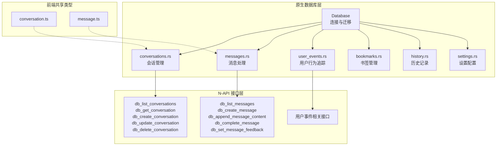
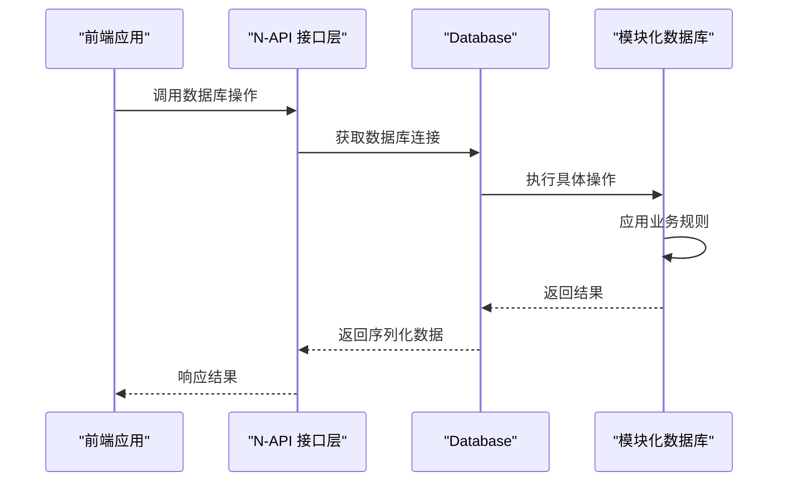
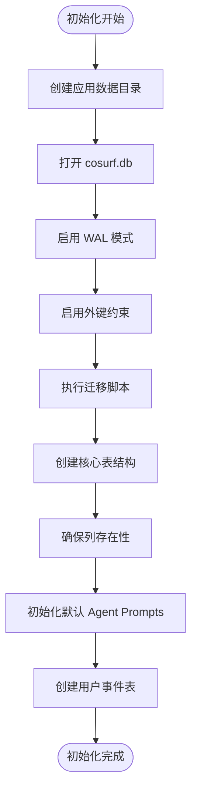
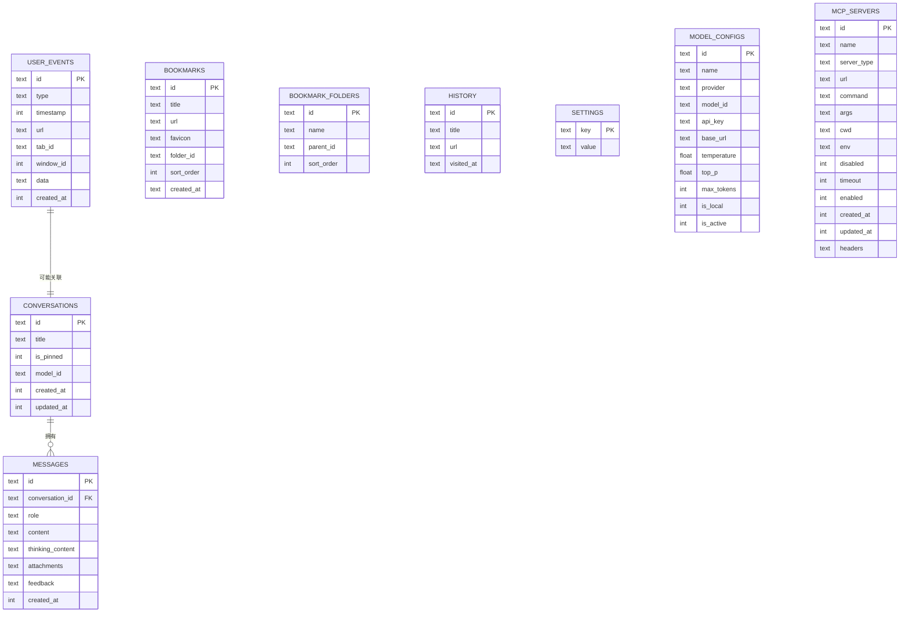
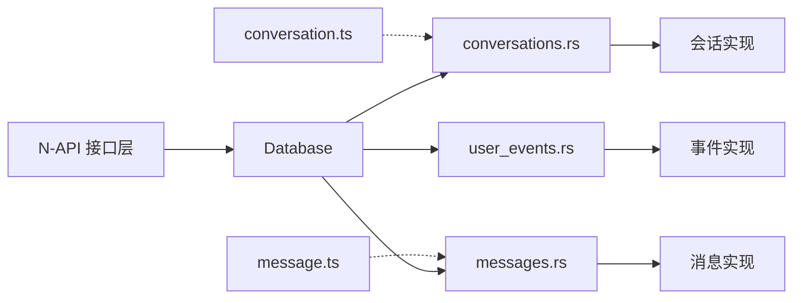

# 数据库设计

<cite>
**本文引用的文件**
- [native/src/db/mod.rs](file://native/src/db/mod.rs)
- [native/src/db/conversations.rs](file://native/src/db/conversations.rs)
- [native/src/db/messages.rs](file://native/src/db/messages.rs)
- [native/src/db/user_events.rs](file://native/src/db/user_events.rs)
- [packages/shared/src/conversation.ts](file://packages/shared/src/conversation.ts)
- [packages/shared/src/message.ts](file://packages/shared/src/message.ts)
</cite>

## 更新摘要
**所做更改**
- 新增用户行为事件模块（user_events），支持浏览器交互行为追踪
- 完善对话和消息模块的索引策略，新增复合索引优化查询性能
- 更新数据库初始化流程，包含默认 Agent Prompts 和用户事件表创建
- 增强外键约束和数据完整性保障机制
- 新增数据生命周期管理策略，包含用户事件的自动清理机制

## 目录
1. [简介](#简介)
2. [项目结构](#项目结构)
3. [核心组件](#核心组件)
4. [架构总览](#架构总览)
5. [详细组件分析](#详细组件分析)
6. [依赖分析](#依赖分析)
7. [性能考量](#性能考量)
8. [故障排查指南](#故障排查指南)
9. [结论](#结论)
10. [附录](#附录)

## 简介
本文档面向 CoSurf 数据库设计，聚焦于 SQLite 数据库存储与 Rust 层实现。经过重大模块化重构后，数据库架构现已支持更完整的对话管理、消息处理和用户行为追踪功能。文档覆盖以下方面：
- 表结构与字段定义、数据类型、约束条件
- 实体关系与外键约束
- 数据完整性保障机制
- 数据访问模式、查询优化策略（索引、查询计划、事务）
- 数据生命周期管理（保留、归档、清理）
- 数据迁移与版本管理策略
- 数据验证与业务规则
- 数据模型图与示例数据
- 缓存策略与性能考虑
- 数据安全与访问控制

## 项目结构
CoSurf 的数据库层采用完全模块化的架构设计，所有模块均基于原生 Rust 实现，通过 N-API 暴露给前端使用。系统包含对话管理、消息处理、用户行为追踪、书签管理、历史记录、设置配置等多个核心模块。

**图表来源**
- [native/src/db/mod.rs:1-800](file://native/src/db/mod.rs#L1-L800)
- [native/src/db/conversations.rs:1-148](file://native/src/db/conversations.rs#L1-L148)
- [native/src/db/messages.rs:1-138](file://native/src/db/messages.rs#L1-L138)
- [native/src/db/user_events.rs:1-447](file://native/src/db/user_events.rs#L1-L447)

**章节来源**
- [native/src/db/mod.rs:1-800](file://native/src/db/mod.rs#L1-L800)
- [native/src/db/conversations.rs:1-148](file://native/src/db/conversations.rs#L1-L148)
- [native/src/db/messages.rs:1-138](file://native/src/db/messages.rs#L1-L138)
- [native/src/db/user_events.rs:1-447](file://native/src/db/user_events.rs#L1-L447)

## 核心组件
- **Database**：负责数据库连接、WAL 模式、外键启用、迁移执行与列补全、数据迁移（含思维内容拆分与列演进）
- **对话模块（conversations）**：提供会话 CRUD 操作、排序查询、外键约束管理
- **消息模块（messages）**：支持消息流式处理、内容追加、反馈收集、外键级联删除
- **用户事件模块（user_events）**：追踪浏览器交互行为、支持批量插入、自动清理机制
- **N-API 接口层**：将 Rust 数据库操作暴露为 JavaScript 可调用的 API

**章节来源**
- [native/src/db/mod.rs:39-800](file://native/src/db/mod.rs#L39-L800)
- [native/src/db/conversations.rs:9-148](file://native/src/db/conversations.rs#L9-L148)
- [native/src/db/messages.rs:9-138](file://native/src/db/messages.rs#L9-L138)
- [native/src/db/user_events.rs:12-447](file://native/src/db/user_events.rs#L12-L447)

## 架构总览
数据库层采用"统一迁移 + 模块化设计"的架构，所有模块通过 Database::run_migrations 集中初始化，支持默认数据填充和表结构演进。N-API 层提供完整的前端接口，确保前后端数据一致性。

**图表来源**
- [native/src/db/mod.rs:258-800](file://native/src/db/mod.rs#L258-L800)

## 详细组件分析

### 数据库初始化与迁移
经过重构后的初始化流程更加完善，包含默认数据填充和表结构演进：

**图表来源**
- [native/src/db/mod.rs:44-176](file://native/src/db/mod.rs#L44-L176)
- [native/src/db/mod.rs:194-247](file://native/src/db/mod.rs#L194-L247)

**章节来源**
- [native/src/db/mod.rs:44-176](file://native/src/db/mod.rs#L44-L176)
- [native/src/db/mod.rs:194-247](file://native/src/db/mod.rs#L194-L247)

### 表结构与字段定义

#### conversations（会话）
- **主键**：id（文本）
- **字段**：title（文本，默认值"新对话"）、is_pinned（整数，默认 0）、model_id（文本，可选）、created_at（整数时间戳）、updated_at（整数时间戳）
- **索引**：idx_conversations_updated（updated_at DESC）、idx_conversations_pinned（is_pinned DESC）
- **查询**：按 is_pinned 降序、updated_at 降序排序

**章节来源**
- [native/src/db/conversations.rs:22-37](file://native/src/db/conversations.rs#L22-L37)
- [native/src/db/conversations.rs:40-63](file://native/src/db/conversations.rs#L40-L63)

#### messages（消息）
- **主键**：id（文本）
- **外键**：conversation_id 引用 conversations(id)，级联删除
- **字段**：role（文本）、content（文本，默认空）、thinking_content（文本，可选）、attachments（文本，可选）、feedback（文本，可选）、created_at（整数时间戳）
- **索引**：idx_messages_conversation（conversation_id）、idx_messages_created（created_at）
- **约束**：外键约束、级联删除

**章节来源**
- [native/src/db/messages.rs:24-42](file://native/src/db/messages.rs#L24-L42)
- [native/src/db/messages.rs:44-71](file://native/src/db/messages.rs#L44-L71)

#### user_events（用户事件）
- **主键**：id（文本）
- **字段**：type（文本，事件类型枚举）、timestamp（整数时间戳）、url（文本，可选）、tab_id（文本，可选）、window_id（整数，可选）、data（文本，JSON 存储事件数据）、created_at（整数时间戳）
- **索引**：idx_user_events_type、idx_user_events_timestamp、idx_user_events_url、idx_user_events_tab_id
- **数据保留**：最多保留最近 3 天

**章节来源**
- [native/src/db/user_events.rs:154-176](file://native/src/db/user_events.rs#L154-L176)
- [native/src/db/user_events.rs:222-232](file://native/src/db/user_events.rs#L222-L232)

### 实体关系与外键约束
重构后的实体关系更加完整，新增用户事件模块并与现有模块形成清晰的层次结构：

**图表来源**
- [native/src/db/conversations.rs:22-37](file://native/src/db/conversations.rs#L22-L37)
- [native/src/db/messages.rs:24-42](file://native/src/db/messages.rs#L24-L42)
- [native/src/db/user_events.rs:154-176](file://native/src/db/user_events.rs#L154-L176)

**章节来源**
- [native/src/db/conversations.rs:22-37](file://native/src/db/conversations.rs#L22-L37)
- [native/src/db/messages.rs:24-42](file://native/src/db/messages.rs#L24-L42)
- [native/src/db/user_events.rs:154-176](file://native/src/db/user_events.rs#L154-L176)

### 数据访问模式与查询优化
重构后的查询优化策略更加完善，包含复合索引和查询计划优化：

- **事务与并发**：使用 Mutex 包裹 Database 实例，N-API 层通过 with_db 函数获取连接，避免并发写冲突
- **索引策略**：
  - conversations：updated_at DESC、is_pinned DESC 复合索引
  - messages：conversation_id、created_at 单列索引
  - user_events：多维度索引支持不同类型查询
  - settings：键值对查询，ON CONFLICT 更新
- **查询优化**：
  - conversations：按 is_pinned 降序、updated_at 降序，减少 UI 排序成本
  - messages：按 created_at 升序返回，配合流式追加
  - user_events：支持时间范围查询、事件类型过滤、批量插入优化
  - 批量事务处理：user_events 支持 unchecked_transaction 提升性能

**章节来源**
- [native/src/db/mod.rs:21-36](file://native/src/db/mod.rs#L21-L36)
- [native/src/db/conversations.rs:31-32](file://native/src/db/conversations.rs#L31-L32)
- [native/src/db/messages.rs:36-37](file://native/src/db/messages.rs#L36-L37)
- [native/src/db/user_events.rs:209-220](file://native/src/db/user_events.rs#L209-L220)

### 数据生命周期管理
重构后的生命周期管理策略更加完善，包含用户行为数据的自动清理机制：

- **会话与消息**：通过 conversation.message_count 维护计数，删除会话触发级联删除消息
- **用户事件**：自动清理超过 3 天的历史数据，支持自定义保留策略
- **历史记录**：提供清空与逐条删除接口，支持搜索与分页
- **设置管理**：键值对持久化，支持默认值回填与 JSON 值解析
- **默认数据**：初始化时自动创建 Agent Prompts 默认配置

**章节来源**
- [native/src/db/conversations.rs:140-147](file://native/src/db/conversations.rs#L140-L147)
- [native/src/db/user_events.rs:222-232](file://native/src/db/user_events.rs#L222-L232)
- [native/src/db/mod.rs:194-247](file://native/src/db/mod.rs#L194-L247)

### 数据迁移与版本管理
重构后的迁移策略更加健壮，支持默认数据填充和表结构演进：

- **迁移脚本**：集中于 run_migrations，创建表、索引与列
- **默认数据**：init_default_agent_prompts 自动创建预设的 Agent Prompts
- **表结构演进**：ensure_column 方法动态添加缺失列，避免破坏性 ALTER
- **用户事件表**：create_user_events_table 独立管理用户行为追踪

**章节来源**
- [native/src/db/mod.rs:63-176](file://native/src/db/mod.rs#L63-L176)
- [native/src/db/mod.rs:194-247](file://native/src/db/mod.rs#L194-L247)
- [native/src/db/mod.rs:252-255](file://native/src/db/mod.rs#L252-L255)

### 数据验证与业务规则
重构后的数据验证机制更加完善，包含类型安全和约束检查：

- **外键约束**：启用 PRAGMA foreign_keys=ON，确保引用完整性
- **类型安全**：EventType 枚举确保事件类型的有效性
- **时间戳管理**：统一使用毫秒级时间戳，支持精确的时间范围查询
- **JSON 数据**：user_events.data 字段存储灵活的事件数据结构
- **批量操作**：支持批量插入优化，减少事务开销

**章节来源**
- [native/src/db/conversations.rs:140-147](file://native/src/db/conversations.rs#L140-L147)
- [native/src/db/user_events.rs:15-73](file://native/src/db/user_events.rs#L15-L73)
- [native/src/db/user_events.rs:209-220](file://native/src/db/user_events.rs#L209-L220)

### 示例数据
重构后的示例数据结构更加丰富，包含用户行为追踪能力：

- **会话**：包含 id、title、is_pinned、model_id、created_at、updated_at
- **消息**：包含 id、conversation_id、role、content、thinking_content、attachments、feedback、created_at
- **用户事件**：包含 id、type、timestamp、url、tab_id、window_id、data、created_at
- **默认 Agent Prompts**：包含系统预设的对话模板

**章节来源**
- [native/src/db/conversations.rs:9-17](file://native/src/db/conversations.rs#L9-L17)
- [native/src/db/messages.rs:9-19](file://native/src/db/messages.rs#L9-L19)
- [native/src/db/user_events.rs:138-151](file://native/src/db/user_events.rs#L138-L151)
- [native/src/db/mod.rs:198-241](file://native/src/db/mod.rs#L198-L241)

### 缓存策略与性能考虑
重构后的性能优化策略更加全面：

- **WAL 模式**：提升并发读写性能，降低写入阻塞
- **索引优化**：针对高频查询字段建立复合索引，减少排序与过滤成本
- **批量处理**：user_events 支持批量插入，使用 unchecked_transaction 提升性能
- **N-API 优化**：通过 with_db 函数复用连接，减少连接开销
- **内存管理**：合理使用 Vec 容器，及时释放不需要的数据

**章节来源**
- [native/src/db/mod.rs:51-52](file://native/src/db/mod.rs#L51-L52)
- [native/src/db/conversations.rs:31-32](file://native/src/db/conversations.rs#L31-L32)
- [native/src/db/messages.rs:36-37](file://native/src/db/messages.rs#L36-L37)
- [native/src/db/user_events.rs:209-220](file://native/src/db/user_events.rs#L209-L220)

### 数据安全与访问控制
重构后的安全策略更加完善：

- **外部访问控制**：数据库文件位于应用数据目录，通过 N-API 严格控制访问
- **类型安全**：Rust 类型系统确保运行时数据安全
- **错误处理**：统一的 AppError 和 AppResult 处理，防止内部异常泄露
- **数据隔离**：用户事件与其他模块数据隔离存储
- **权限控制**：通过 N-API 层实现细粒度的访问控制

**章节来源**
- [native/src/db/mod.rs:258-265](file://native/src/db/mod.rs#L258-L265)
- [native/src/db/mod.rs:14-14](file://native/src/db/mod.rs#L14-L14)

## 依赖分析
重构后的依赖关系更加清晰，模块间耦合度降低：

**图表来源**
- [native/src/db/mod.rs:258-800](file://native/src/db/mod.rs#L258-L800)
- [native/src/db/conversations.rs:1-148](file://native/src/db/conversations.rs#L1-L148)
- [native/src/db/messages.rs:1-138](file://native/src/db/messages.rs#L1-L138)
- [native/src/db/user_events.rs:1-447](file://native/src/db/user_events.rs#L1-L447)

**章节来源**
- [native/src/db/mod.rs:258-800](file://native/src/db/mod.rs#L258-L800)
- [native/src/db/conversations.rs:1-148](file://native/src/db/conversations.rs#L1-L148)
- [native/src/db/messages.rs:1-138](file://native/src/db/messages.rs#L1-L138)
- [native/src/db/user_events.rs:1-447](file://native/src/db/user_events.rs#L1-L447)

## 性能考量
重构后的性能优化策略更加全面：

- **查询优化**：合理使用复合索引，避免全表扫描
- **批量处理**：用户事件支持批量插入，显著提升写入性能
- **内存管理**：及时释放不再使用的数据，避免内存泄漏
- **连接池**：通过 N-API 层复用数据库连接
- **事务优化**：使用 unchecked_transaction 进行批量操作

**章节来源**
- [native/src/db/mod.rs:51-52](file://native/src/db/mod.rs#L51-L52)
- [native/src/db/user_events.rs:209-220](file://native/src/db/user_events.rs#L209-L220)

## 故障排查指南
重构后的故障排查指南更加完善：

- **数据库初始化失败**：确认应用数据目录权限，检查 WAL 模式启用
- **外键约束失败**：检查引用键是否有效，确认级联删除行为
- **N-API 调用失败**：检查 with_db 函数返回的错误信息
- **用户事件插入失败**：检查 JSON 序列化是否成功，确认数据格式
- **性能问题**：分析查询执行计划，检查索引使用情况

**章节来源**
- [native/src/db/mod.rs:21-36](file://native/src/db/mod.rs#L21-L36)
- [native/src/db/user_events.rs:180-201](file://native/src/db/user_events.rs#L180-L201)

## 结论
CoSurf 的数据库设计经过重大模块化重构后，形成了更加完善和健壮的架构。新的设计不仅支持完整的对话管理和消息处理，还新增了用户行为追踪能力，通过统一的 N-API 接口层为前端提供稳定的数据访问服务。完善的索引策略、事务管理和数据生命周期管理机制，确保了系统的高性能和高可靠性。

## 附录
- **前后端类型映射**：共享 TypeScript 接口与后端 Rust 结构字段命名保持一致
- **默认数据配置**：系统预设的 Agent Prompts 为用户提供了即开即用的对话体验
- **扩展性设计**：模块化架构支持未来功能的平滑扩展

**章节来源**
- [packages/shared/src/conversation.ts:1-14](file://packages/shared/src/conversation.ts#L1-L14)
- [packages/shared/src/message.ts:1-35](file://packages/shared/src/message.ts#L1-L35)
- [native/src/db/mod.rs:198-241](file://native/src/db/mod.rs#L198-L241)