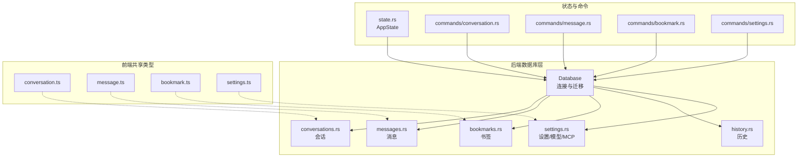
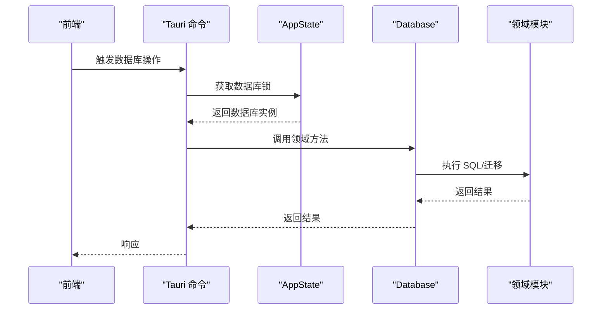
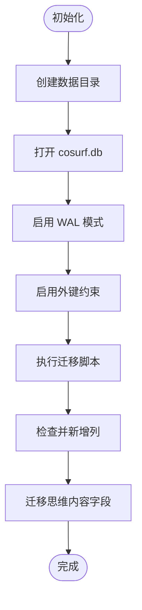
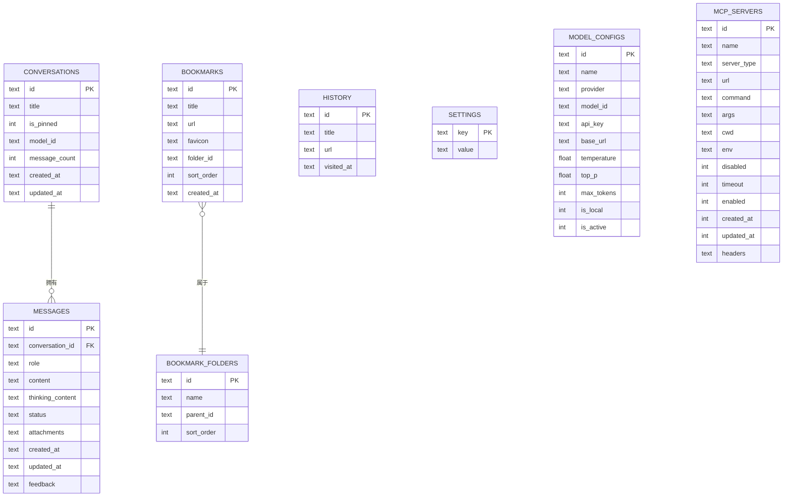
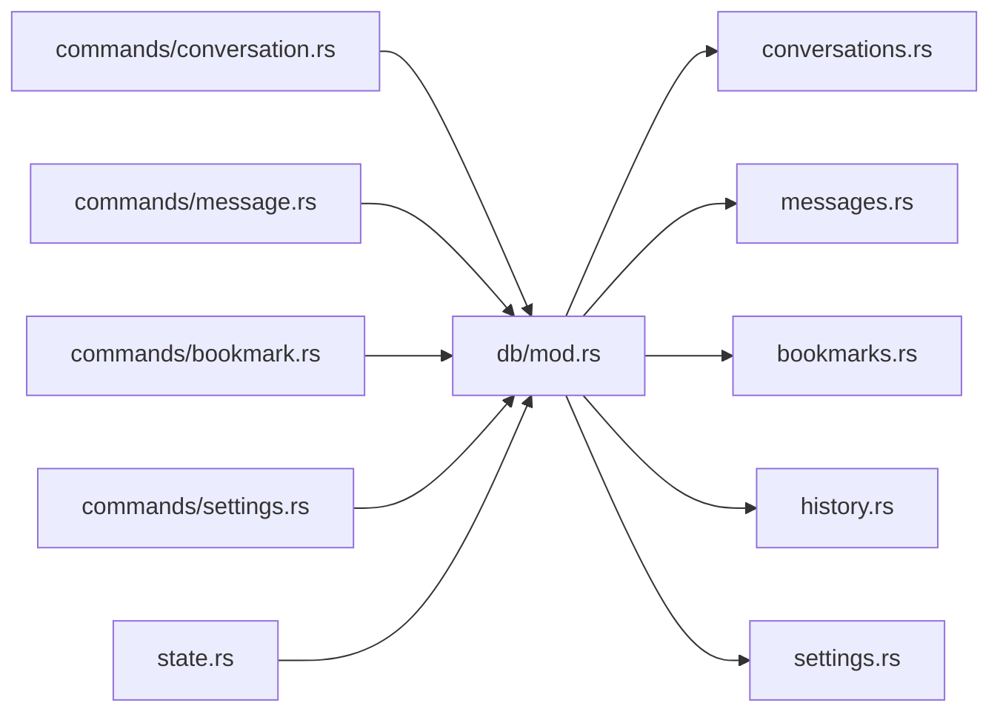

# 数据库设计

<cite>
**本文引用的文件**
- [src-tauri/src/db/mod.rs](file://src-tauri/src/db/mod.rs)
- [src-tauri/src/db/conversations.rs](file://src-tauri/src/db/conversations.rs)
- [src-tauri/src/db/messages.rs](file://src-tauri/src/db/messages.rs)
- [src-tauri/src/db/bookmarks.rs](file://src-tauri/src/db/bookmarks.rs)
- [src-tauri/src/db/history.rs](file://src-tauri/src/db/history.rs)
- [src-tauri/src/db/settings.rs](file://src-tauri/src/db/settings.rs)
- [packages/shared/src/conversation.ts](file://packages/shared/src/conversation.ts)
- [packages/shared/src/message.ts](file://packages/shared/src/message.ts)
- [packages/shared/src/bookmark.ts](file://packages/shared/src/bookmark.ts)
- [packages/shared/src/settings.ts](file://packages/shared/src/settings.ts)
- [src-tauri/src/state.rs](file://src-tauri/src/state.rs)
- [src-tauri/src/commands/conversation.rs](file://src-tauri/src/commands/conversation.rs)
- [src-tauri/src/commands/message.rs](file://src-tauri/src/commands/message.rs)
- [src-tauri/src/commands/bookmark.rs](file://src-tauri/src/commands/bookmark.rs)
- [src-tauri/src/commands/settings.rs](file://src-tauri/src/commands/settings.rs)
</cite>

## 目录
1. [简介](#简介)
2. [项目结构](#项目结构)
3. [核心组件](#核心组件)
4. [架构总览](#架构总览)
5. [详细组件分析](#详细组件分析)
6. [依赖分析](#依赖分析)
7. [性能考量](#性能考量)
8. [故障排查指南](#故障排查指南)
9. [结论](#结论)
10. [附录](#附录)

## 简介
本文件面向 CoSurf 数据库设计，聚焦于 SQLite 数据库存储与 Rust 层实现。文档覆盖以下方面：
- 表结构与字段定义、数据类型、约束条件
- 实体关系与外键约束
- 数据完整性保障机制
- 数据访问模式、查询优化策略（索引、查询计划、事务）
- 数据生命周期管理（保留、归档、清理）
- 数据迁移与版本管理策略
- 数据验证与业务规则
- 数据模型图与示例数据
- 缓存策略与性能考虑
- 数据安全与访问控制

## 项目结构
CoSurf 的数据库层位于 Tauri 后端，采用模块化组织，每个领域（会话、消息、书签、历史、设置）对应独立模块，并由统一的 Database 结构进行封装与迁移管理。

图表来源
- [src-tauri/src/db/mod.rs:1-272](file://src-tauri/src/db/mod.rs#L1-L272)
- [src-tauri/src/db/conversations.rs:1-127](file://src-tauri/src/db/conversations.rs#L1-L127)
- [src-tauri/src/db/messages.rs:1-198](file://src-tauri/src/db/messages.rs#L1-L198)
- [src-tauri/src/db/bookmarks.rs:1-185](file://src-tauri/src/db/bookmarks.rs#L1-L185)
- [src-tauri/src/db/history.rs:1-97](file://src-tauri/src/db/history.rs#L1-L97)
- [src-tauri/src/db/settings.rs:1-540](file://src-tauri/src/db/settings.rs#L1-L540)
- [src-tauri/src/state.rs:1-77](file://src-tauri/src/state.rs#L1-L77)
- [src-tauri/src/commands/conversation.rs:1-73](file://src-tauri/src/commands/conversation.rs#L1-L73)
- [src-tauri/src/commands/message.rs:1-99](file://src-tauri/src/commands/message.rs#L1-L99)
- [src-tauri/src/commands/bookmark.rs:1-75](file://src-tauri/src/commands/bookmark.rs#L1-L75)
- [src-tauri/src/commands/settings.rs:1-615](file://src-tauri/src/commands/settings.rs#L1-L615)
- [packages/shared/src/conversation.ts:1-14](file://packages/shared/src/conversation.ts#L1-L14)
- [packages/shared/src/message.ts:1-35](file://packages/shared/src/message.ts#L1-L35)
- [packages/shared/src/bookmark.ts:1-25](file://packages/shared/src/bookmark.ts#L1-L25)
- [packages/shared/src/settings.ts:1-47](file://packages/shared/src/settings.ts#L1-L47)

章节来源
- [src-tauri/src/db/mod.rs:1-272](file://src-tauri/src/db/mod.rs#L1-L272)
- [src-tauri/src/state.rs:1-77](file://src-tauri/src/state.rs#L1-L77)

## 核心组件
- Database：负责数据库连接、WAL 模式、外键启用、迁移执行与列补全、数据迁移（含思维内容拆分与列演进）
- 各领域模块：conversations、messages、bookmarks、history、settings，提供 CRUD 与查询方法
- 命令层：Tauri 命令桥接到数据库模块，统一错误处理
- 共享类型：前端 TypeScript 接口与后端 Rust 结构保持一致命名风格

章节来源
- [src-tauri/src/db/mod.rs:11-272](file://src-tauri/src/db/mod.rs#L11-L272)
- [src-tauri/src/db/conversations.rs:7-127](file://src-tauri/src/db/conversations.rs#L7-L127)
- [src-tauri/src/db/messages.rs:7-198](file://src-tauri/src/db/messages.rs#L7-L198)
- [src-tauri/src/db/bookmarks.rs:7-185](file://src-tauri/src/db/bookmarks.rs#L7-L185)
- [src-tauri/src/db/history.rs:7-97](file://src-tauri/src/db/history.rs#L7-L97)
- [src-tauri/src/db/settings.rs:7-540](file://src-tauri/src/db/settings.rs#L7-L540)
- [src-tauri/src/commands/conversation.rs:1-73](file://src-tauri/src/commands/conversation.rs#L1-L73)
- [src-tauri/src/commands/message.rs:1-99](file://src-tauri/src/commands/message.rs#L1-L99)
- [src-tauri/src/commands/bookmark.rs:1-75](file://src-tauri/src/commands/bookmark.rs#L1-L75)
- [src-tauri/src/commands/settings.rs:1-615](file://src-tauri/src/commands/settings.rs#L1-L615)
- [packages/shared/src/conversation.ts:1-14](file://packages/shared/src/conversation.ts#L1-L14)
- [packages/shared/src/message.ts:1-35](file://packages/shared/src/message.ts#L1-L35)
- [packages/shared/src/bookmark.ts:1-25](file://packages/shared/src/bookmark.ts#L1-L25)
- [packages/shared/src/settings.ts:1-47](file://packages/shared/src/settings.ts#L1-L47)

## 架构总览
数据库层采用“统一迁移 + 领域模块”的设计，迁移脚本集中于 Database::run_migrations，涵盖核心表、索引与列演进；各模块提供领域内查询与更新逻辑；命令层通过 AppState 暴露数据库实例，实现线程安全访问。

图表来源
- [src-tauri/src/state.rs:9-23](file://src-tauri/src/state.rs#L9-L23)
- [src-tauri/src/commands/conversation.rs:8-73](file://src-tauri/src/commands/conversation.rs#L8-L73)
- [src-tauri/src/commands/message.rs:7-99](file://src-tauri/src/commands/message.rs#L7-L99)
- [src-tauri/src/commands/bookmark.rs:7-75](file://src-tauri/src/commands/bookmark.rs#L7-L75)
- [src-tauri/src/commands/settings.rs:9-615](file://src-tauri/src/commands/settings.rs#L9-L615)
- [src-tauri/src/db/mod.rs:41-148](file://src-tauri/src/db/mod.rs#L41-L148)

## 详细组件分析

### 数据库初始化与迁移
- 初始化：创建应用数据目录，打开 cosurf.db，启用 WAL 与外键
- 迁移：创建核心表、索引与列；执行列演进与数据迁移（如思维内容拆分）

图表来源
- [src-tauri/src/db/mod.rs:16-40](file://src-tauri/src/db/mod.rs#L16-L40)
- [src-tauri/src/db/mod.rs:41-148](file://src-tauri/src/db/mod.rs#L41-L148)
- [src-tauri/src/db/mod.rs:150-215](file://src-tauri/src/db/mod.rs#L150-L215)
- [src-tauri/src/db/mod.rs:217-266](file://src-tauri/src/db/mod.rs#L217-L266)

章节来源
- [src-tauri/src/db/mod.rs:16-40](file://src-tauri/src/db/mod.rs#L16-L40)
- [src-tauri/src/db/mod.rs:41-148](file://src-tauri/src/db/mod.rs#L41-L148)

### 表结构与字段定义

#### conversations（会话）
- 主键：id（文本）
- 字段：title（文本，默认值 New Conversation）、is_pinned（整数，默认 0）、model_id（文本，默认空）、message_count（整数，默认 0）、created_at（文本）、updated_at（文本）
- 约束：非空、默认值、整数布尔化
- 查询：按 is_pinned 降序、updated_at 降序排序

章节来源
- [src-tauri/src/db/mod.rs:44-52](file://src-tauri/src/db/mod.rs#L44-L52)
- [src-tauri/src/db/conversations.rs:35-58](file://src-tauri/src/db/conversations.rs#L35-L58)

#### messages（消息）
- 主键：id（文本）
- 外键：conversation_id 引用 conversations(id)，级联删除
- 字段：role（文本，CHECK 限定枚举）、content（文本，默认空）、thinking_content（文本，默认空）、status（文本，CHECK 限定枚举，默认 pending）、attachments（文本，JSON，默认空数组）、created_at（文本）、updated_at（文本）、feedback（文本，默认空）
- 约束：CHECK、外键、默认值
- 索引：idx_messages_conversation_id

章节来源
- [src-tauri/src/db/mod.rs:54-67](file://src-tauri/src/db/mod.rs#L54-L67)
- [src-tauri/src/db/messages.rs:24-36](file://src-tauri/src/db/messages.rs#L24-L36)
- [src-tauri/src/db/messages.rs:65-94](file://src-tauri/src/db/messages.rs#L65-L94)

#### bookmarks（书签）
- 主键：id（文本）
- 字段：title（文本）、url（文本）、favicon（文本，可选）、folder_id（文本，可选）、sort_order（整数，默认 0）、created_at（文本）
- 索引：无显式索引（建议按需添加）

章节来源
- [src-tauri/src/db/mod.rs:69-77](file://src-tauri/src/db/mod.rs#L69-L77)
- [src-tauri/src/db/bookmarks.rs:48-70](file://src-tauri/src/db/bookmarks.rs#L48-L70)

#### bookmark_folders（书签文件夹）
- 主键：id（文本）
- 字段：name（文本）、parent_id（文本，可选）、sort_order（整数，默认 0）
- 索引：无显式索引（建议按需添加）

章节来源
- [src-tauri/src/db/mod.rs:79-84](file://src-tauri/src/db/mod.rs#L79-L84)
- [src-tauri/src/db/bookmarks.rs:119-141](file://src-tauri/src/db/bookmarks.rs#L119-L141)

#### history（历史）
- 主键：id（文本）
- 字段：title（文本，默认空）、url（文本）、visited_at（文本）
- 索引：idx_history_visited_at（按 visited_at 降序）

章节来源
- [src-tauri/src/db/mod.rs:86-93](file://src-tauri/src/db/mod.rs#L86-L93)
- [src-tauri/src/db/history.rs:24-44](file://src-tauri/src/db/history.rs#L24-L44)

#### settings（设置）
- 主键：key（文本）
- 字段：value（文本）
- 使用：键值对存储通用设置；另有 model_configs、mcp_servers 独立表

章节来源
- [src-tauri/src/db/mod.rs:95-98](file://src-tauri/src/db/mod.rs#L95-L98)
- [src-tauri/src/db/settings.rs:180-197](file://src-tauri/src/db/settings.rs#L180-L197)

#### model_configs（模型配置）
- 主键：id（文本）
- 字段：name、provider、model_id、api_key（可选）、base_url（可选）、temperature（实数，默认 0.7）、top_p（实数，默认 1.0）、max_tokens（整数，默认 4096）、is_local（整数，默认 0）、is_active（整数，默认 0）

章节来源
- [src-tauri/src/db/mod.rs:100-112](file://src-tauri/src/db/mod.rs#L100-L112)
- [src-tauri/src/db/settings.rs:217-231](file://src-tauri/src/db/settings.rs#L217-L231)

#### mcp_servers（MCP 服务器）
- 主键：id（文本）
- 字段：name、server_type（文本，默认 stdio）、url（可选）、command（可选）、args（JSON 文本，可选）、cwd（可选）、env（JSON 文本，可选）、disabled（整数，默认 0）、timeout（整数，可选）、enabled（整数，默认 1）、created_at（整数时间戳）、updated_at（整数时间戳）、headers（JSON 文本，可选）
- 索引：idx_mcp_servers_enabled

章节来源
- [src-tauri/src/db/mod.rs:114-129](file://src-tauri/src/db/mod.rs#L114-L129)
- [src-tauri/src/db/mod.rs:131-131](file://src-tauri/src/db/mod.rs#L131-L131)
- [src-tauri/src/db/settings.rs:380-394](file://src-tauri/src/db/settings.rs#L380-L394)

### 实体关系与外键约束

图表来源
- [src-tauri/src/db/mod.rs:44-129](file://src-tauri/src/db/mod.rs#L44-L129)
- [src-tauri/src/db/messages.rs:64-64](file://src-tauri/src/db/messages.rs#L64-L64)

章节来源
- [src-tauri/src/db/mod.rs:44-129](file://src-tauri/src/db/mod.rs#L44-L129)

### 数据访问模式与查询优化
- 事务与并发：使用 Mutex 包裹 Database 实例，命令层通过 AppState 获取锁，避免并发写冲突
- 索引策略：
  - messages.conversation_id：加速按会话查询
  - history.visited_at：降序索引，支持时间倒序浏览
  - mcp_servers.enabled：过滤启用的服务器
- 查询优化：
  - conversations：按 is_pinned 降序、updated_at 降序，减少 UI 排序成本
  - messages：按 created_at 升序返回，配合流式追加
  - history：分页查询，LIMIT/OFFSET 控制数量
  - settings：键值对查询，ON CONFLICT 更新
- 列演进：ensure_* 方法动态添加缺失列，避免破坏性 ALTER

章节来源
- [src-tauri/src/state.rs:9-23](file://src-tauri/src/state.rs#L9-L23)
- [src-tauri/src/commands/conversation.rs:8-73](file://src-tauri/src/commands/conversation.rs#L8-L73)
- [src-tauri/src/commands/message.rs:7-99](file://src-tauri/src/commands/message.rs#L7-L99)
- [src-tauri/src/commands/bookmark.rs:7-75](file://src-tauri/src/commands/bookmark.rs#L7-L75)
- [src-tauri/src/commands/settings.rs:9-615](file://src-tauri/src/commands/settings.rs#L9-L615)
- [src-tauri/src/db/mod.rs:67-67](file://src-tauri/src/db/mod.rs#L67-L67)
- [src-tauri/src/db/mod.rs:93-93](file://src-tauri/src/db/mod.rs#L93-L93)
- [src-tauri/src/db/mod.rs:131-131](file://src-tauri/src/db/mod.rs#L131-L131)

### 数据生命周期管理
- 会话与消息：通过 conversation.message_count 维护计数，删除会话触发级联删除消息
- 历史记录：提供清空与逐条删除接口，支持搜索与分页
- 书签：支持文件夹与层级结构，删除文件夹会级联删除其下书签
- 设置：键值对持久化，支持默认值回填与 JSON 值解析
- 模型与 MCP：支持启用/禁用、激活模型切换、服务器配置导入导出

章节来源
- [src-tauri/src/db/conversations.rs:111-125](file://src-tauri/src/db/conversations.rs#L111-L125)
- [src-tauri/src/db/messages.rs:177-183](file://src-tauri/src/db/messages.rs#L177-L183)
- [src-tauri/src/db/history.rs:87-95](file://src-tauri/src/db/history.rs#L87-L95)
- [src-tauri/src/db/bookmarks.rs:175-183](file://src-tauri/src/db/bookmarks.rs#L175-L183)
- [src-tauri/src/db/settings.rs:180-197](file://src-tauri/src/db/settings.rs#L180-L197)
- [src-tauri/src/db/settings.rs:320-329](file://src-tauri/src/db/settings.rs#L320-L329)

### 数据迁移与版本管理
- 迁移脚本：集中于 run_migrations，创建表、索引与列
- 列演进：ensure_thinking_content_column、ensure_message_column、ensure_mcp_server_columns
- 数据迁移：从旧格式 content 中分离 thinking_content，更新字段与时间戳
- 版本演进：通过列存在性检查与条件 ALTER，平滑升级

章节来源
- [src-tauri/src/db/mod.rs:41-148](file://src-tauri/src/db/mod.rs#L41-L148)
- [src-tauri/src/db/mod.rs:150-215](file://src-tauri/src/db/mod.rs#L150-L215)
- [src-tauri/src/db/mod.rs:217-266](file://src-tauri/src/db/mod.rs#L217-L266)

### 数据验证与业务规则
- 消息角色与状态：通过 CHECK 约束限制枚举值
- 外键约束：启用 PRAGMA foreign_keys=ON，确保引用完整性
- 流式更新：append_message_content 支持 thinking_content 与 content 分别追加，状态切换为 streaming
- 反馈字段：feedback 仅允许空字符串、like、dislike
- MCP 类型：server_type 支持 stdio/http/streamableHttp/sse，字符串解析与序列化

章节来源
- [src-tauri/src/db/mod.rs:57-60](file://src-tauri/src/db/mod.rs#L57-L60)
- [src-tauri/src/db/messages.rs:152-175](file://src-tauri/src/db/messages.rs#L152-L175)
- [src-tauri/src/db/settings.rs:28-69](file://src-tauri/src/db/settings.rs#L28-L69)

### 示例数据
- 会话：包含 id、title、is_pinned、model_id、message_count、created_at、updated_at
- 消息：包含 id、conversation_id、role、content、thinking_content、status、attachments、created_at、updated_at、feedback
- 书签：包含 id、title、url、favicon、folder_id、sort_order、created_at
- 历史：包含 id、title、url、visited_at
- 设置：键值对，支持 JSON 值解析
- 模型配置：包含 id、name、provider、model_id、api_key、base_url、temperature、top_p、max_tokens、is_local、is_active
- MCP 服务器：包含 id、name、server_type、url、command、args、cwd、env、disabled、timeout、enabled、created_at、updated_at、headers

章节来源
- [src-tauri/src/db/conversations.rs:9-17](file://src-tauri/src/db/conversations.rs#L9-L17)
- [src-tauri/src/db/messages.rs:24-36](file://src-tauri/src/db/messages.rs#L24-L36)
- [src-tauri/src/db/bookmarks.rs:9-19](file://src-tauri/src/db/bookmarks.rs#L9-L19)
- [src-tauri/src/db/history.rs:9-14](file://src-tauri/src/db/history.rs#L9-L14)
- [src-tauri/src/db/settings.rs:7-23](file://src-tauri/src/db/settings.rs#L7-L23)
- [src-tauri/src/db/settings.rs:72-114](file://src-tauri/src/db/settings.rs#L72-L114)

### 缓存策略与性能考虑
- WAL 模式：提升并发读写性能，降低写入阻塞
- 索引：针对高频查询字段建立索引，减少排序与过滤成本
- 流式消息：thinking_content 与 content 分离，支持增量渲染
- 锁粒度：命令层通过 Mutex 访问 Database，避免竞态
- 分页与限制：历史记录分页查询，控制单次返回量

章节来源
- [src-tauri/src/db/mod.rs:24-25](file://src-tauri/src/db/mod.rs#L24-L25)
- [src-tauri/src/db/mod.rs:67-67](file://src-tauri/src/db/mod.rs#L67-L67)
- [src-tauri/src/db/mod.rs:93-93](file://src-tauri/src/db/mod.rs#L93-L93)
- [src-tauri/src/db/messages.rs:152-175](file://src-tauri/src/db/messages.rs#L152-L175)
- [src-tauri/src/state.rs:9-23](file://src-tauri/src/state.rs#L9-L23)

### 数据安全与访问控制
- 外部访问：数据库文件位于应用数据目录，通过 Tauri 命令暴露有限 API，避免直接外部访问
- 配置存储：敏感信息（如 API Key）通过 settings 表存储，前端不直接接触
- 运行时校验：命令层统一错误包装，防止内部异常泄露
- 目录隔离：Skills 目录与数据目录分离，确保资源隔离

章节来源
- [src-tauri/src/db/mod.rs:21-22](file://src-tauri/src/db/mod.rs#L21-L22)
- [src-tauri/src/db/settings.rs:368-376](file://src-tauri/src/db/settings.rs#L368-L376)
- [src-tauri/src/commands/settings.rs:169-195](file://src-tauri/src/commands/settings.rs#L169-L195)
- [src-tauri/src/state.rs:27-53](file://src-tauri/src/state.rs#L27-L53)

## 依赖分析
- Database 作为中心枢纽，被各领域模块调用
- 命令层依赖 AppState，间接依赖 Database
- 共享类型与后端结构保持命名一致性，便于跨语言同步

图表来源
- [src-tauri/src/commands/conversation.rs:1-73](file://src-tauri/src/commands/conversation.rs#L1-L73)
- [src-tauri/src/commands/message.rs:1-99](file://src-tauri/src/commands/message.rs#L1-L99)
- [src-tauri/src/commands/bookmark.rs:1-75](file://src-tauri/src/commands/bookmark.rs#L1-L75)
- [src-tauri/src/commands/settings.rs:1-615](file://src-tauri/src/commands/settings.rs#L1-L615)
- [src-tauri/src/db/mod.rs:1-272](file://src-tauri/src/db/mod.rs#L1-L272)
- [src-tauri/src/state.rs:1-77](file://src-tauri/src/state.rs#L1-L77)

章节来源
- [src-tauri/src/commands/conversation.rs:1-73](file://src-tauri/src/commands/conversation.rs#L1-L73)
- [src-tauri/src/commands/message.rs:1-99](file://src-tauri/src/commands/message.rs#L1-L99)
- [src-tauri/src/commands/bookmark.rs:1-75](file://src-tauri/src/commands/bookmark.rs#L1-L75)
- [src-tauri/src/commands/settings.rs:1-615](file://src-tauri/src/commands/settings.rs#L1-L615)
- [src-tauri/src/db/mod.rs:1-272](file://src-tauri/src/db/mod.rs#L1-L272)
- [src-tauri/src/state.rs:1-77](file://src-tauri/src/state.rs#L1-L77)

## 性能考量
- 读多写少场景：合理使用索引，避免全表扫描
- 流式写入：消息追加使用字符串拼接与状态切换，减少多次往返
- 分页查询：历史记录使用 LIMIT/OFFSET，避免一次性加载过多
- WAL 模式：提升并发写入吞吐，降低锁竞争
- 列演进：通过 PRAGMA 与 ALTER 动态补列，避免停机迁移

章节来源
- [src-tauri/src/db/mod.rs:24-25](file://src-tauri/src/db/mod.rs#L24-L25)
- [src-tauri/src/db/messages.rs:152-175](file://src-tauri/src/db/messages.rs#L152-L175)
- [src-tauri/src/db/history.rs:24-44](file://src-tauri/src/db/history.rs#L24-L44)

## 故障排查指南
- 数据库未初始化：确认初始化流程（目录创建、WAL、外键、迁移）
- 外键约束失败：检查引用键是否有效，确认级联删除行为
- 列缺失：检查 ensure_* 方法是否执行成功，必要时手动 ALTER
- 锁竞争：命令层错误包装中查看 LOCK_ERROR，确认并发访问是否正确
- MCP 连接测试：使用命令层提供的 test_mcp_server，检查超时与解析错误

章节来源
- [src-tauri/src/db/mod.rs:16-40](file://src-tauri/src/db/mod.rs#L16-L40)
- [src-tauri/src/db/mod.rs:150-215](file://src-tauri/src/db/mod.rs#L150-L215)
- [src-tauri/src/commands/settings.rs:265-306](file://src-tauri/src/commands/settings.rs#L265-L306)

## 结论
CoSurf 的数据库设计以 SQLite 为核心，采用集中迁移与领域模块化组织，结合 WAL、索引与列演进策略，满足会话、消息、书签、历史与设置等核心场景的数据完整性与性能需求。通过命令层与 AppState 的统一抽象，实现了安全、可维护的数据访问模式。

## 附录
- 前后端类型映射：共享 TypeScript 接口与后端 Rust 结构字段命名保持一致，便于跨语言协作与契约稳定

章节来源
- [packages/shared/src/conversation.ts:1-14](file://packages/shared/src/conversation.ts#L1-L14)
- [packages/shared/src/message.ts:1-35](file://packages/shared/src/message.ts#L1-L35)
- [packages/shared/src/bookmark.ts:1-25](file://packages/shared/src/bookmark.ts#L1-L25)
- [packages/shared/src/settings.ts:1-47](file://packages/shared/src/settings.ts#L1-L47)