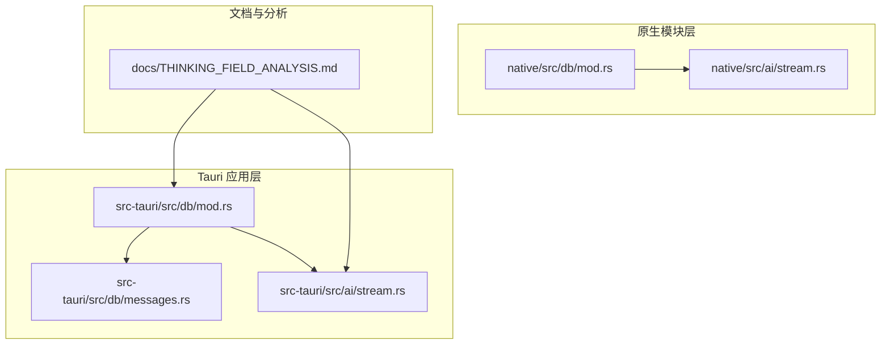
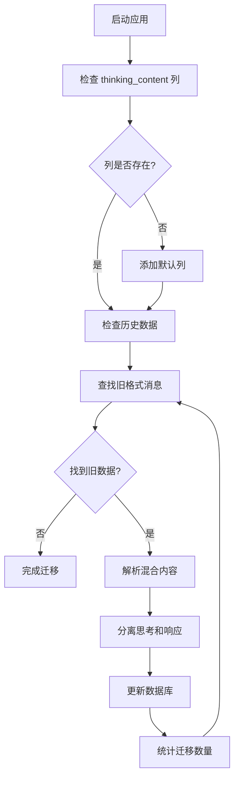
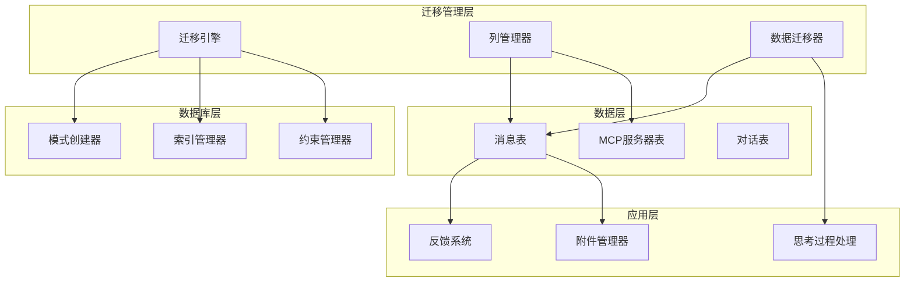
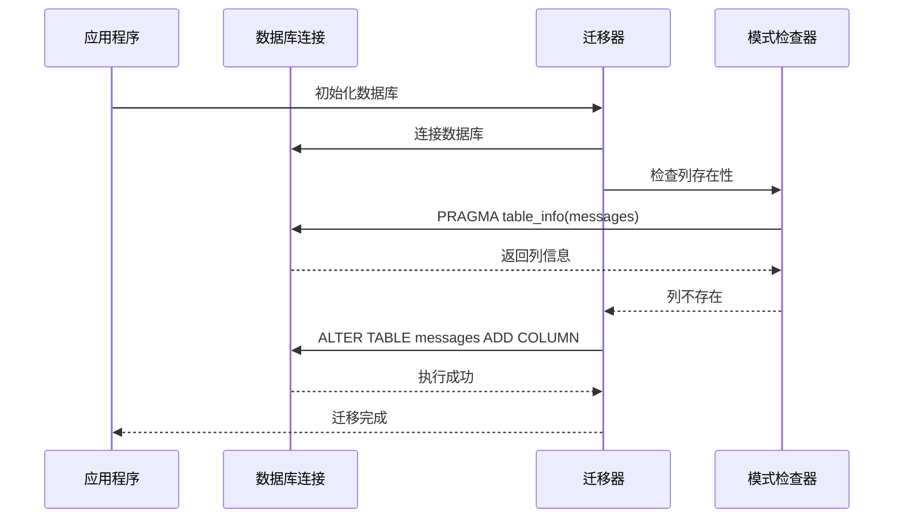
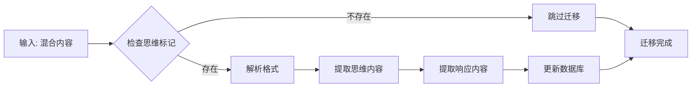
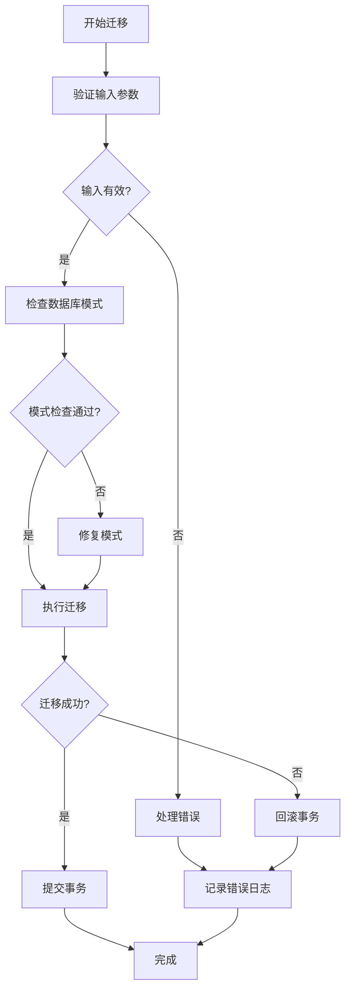
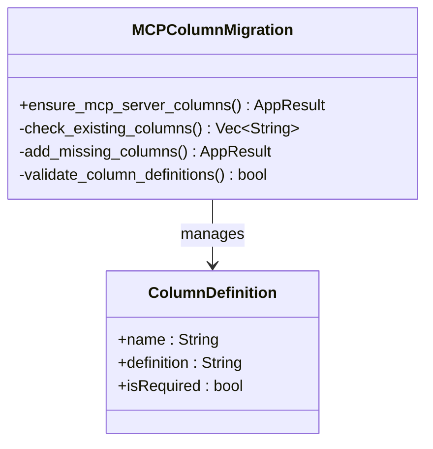
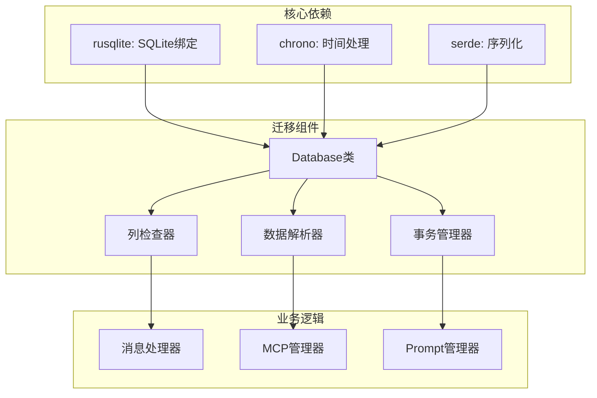
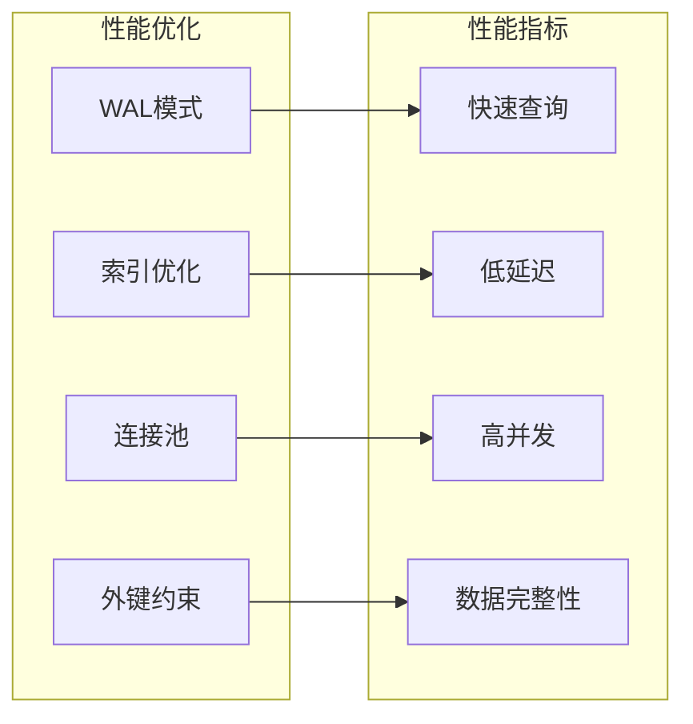
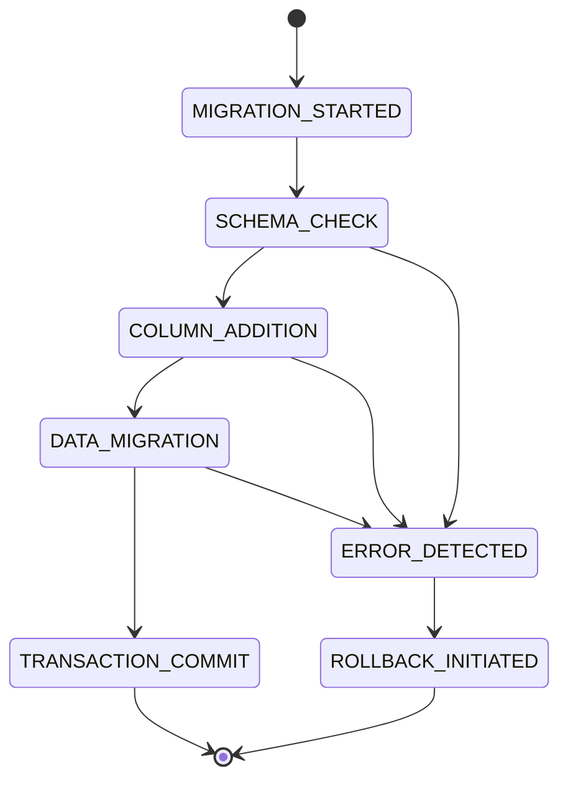

# 数据迁移策略

<cite>
**本文档引用的文件**
- [src-tauri/src/db/mod.rs](file://src-tauri/src/db/mod.rs)
- [src-tauri/src/db/messages.rs](file://src-tauri/src/db/messages.rs)
- [native/src/db/mod.rs](file://native/src/db/mod.rs)
- [src-tauri/src/ai/stream.rs](file://src-tauri/src/ai/stream.rs)
- [native/src/ai/stream.rs](file://native/src/ai/stream.rs)
- [docs/THINKING_FIELD_ANALYSIS.md](file://docs/THINKING_FIELD_ANALYSIS.md)
</cite>

## 目录
1. [引言](#引言)
2. [项目结构](#项目结构)
3. [核心组件](#核心组件)
4. [架构概览](#架构概览)
5. [详细组件分析](#详细组件分析)
6. [依赖关系分析](#依赖关系分析)
7. [性能考量](#性能考量)
8. [故障排除指南](#故障排除指南)
9. [结论](#结论)
10. [附录](#附录)

## 引言

CoSurf 项目采用 SQLite 作为主要数据存储，实现了完整的数据库迁移策略。该策略确保了应用在不同版本间的平滑升级，同时保证了数据的完整性和向后兼容性。本文档深入分析了 CoSurf 的数据迁移机制，重点关注运行时迁移功能、数据格式演进策略以及完整性保护措施。

## 项目结构

CoSurf 项目采用多层架构设计，数据库相关代码分布在多个模块中：



**图表来源**
- [src-tauri/src/db/mod.rs:1-272](file://src-tauri/src/db/mod.rs#L1-L272)
- [native/src/db/mod.rs:1-242](file://native/src/db/mod.rs#L1-L242)

**章节来源**
- [src-tauri/src/db/mod.rs:1-272](file://src-tauri/src/db/mod.rs#L1-L272)
- [native/src/db/mod.rs:1-242](file://native/src/db/mod.rs#L1-L242)

## 核心组件

### 数据库迁移引擎

CoSurf 实现了两套独立的数据库迁移系统，分别服务于不同的运行环境：

#### Tauri 版本迁移系统
- **位置**: `src-tauri/src/db/mod.rs`
- **特点**: 支持完整的数据库初始化、列添加、数据迁移和索引创建
- **功能**: 自动检测缺失的列并添加默认值

#### 原生模块迁移系统  
- **位置**: `native/src/db/mod.rs`
- **特点**: 专注于 N-API 导出功能，提供简化版迁移支持
- **功能**: 基础列存在性检查和默认值设置

**章节来源**
- [src-tauri/src/db/mod.rs:41-148](file://src-tauri/src/db/mod.rs#L41-L148)
- [native/src/db/mod.rs:60-173](file://native/src/db/mod.rs#L60-L173)

### 思考内容迁移机制

项目实现了专门的思考内容字段迁移机制，用于处理历史数据格式的演进：



**图表来源**
- [src-tauri/src/db/mod.rs:172-215](file://src-tauri/src/db/mod.rs#L172-L215)

**章节来源**
- [src-tauri/src/db/mod.rs:150-215](file://src-tauri/src/db/mod.rs#L150-L215)

## 架构概览

CoSurf 的数据迁移架构采用了多层次的设计模式，确保了系统的可扩展性和维护性：



**图表来源**
- [src-tauri/src/db/mod.rs:41-148](file://src-tauri/src/db/mod.rs#L41-L148)
- [src-tauri/src/db/messages.rs:64-198](file://src-tauri/src/db/messages.rs#L64-L198)

## 详细组件分析

### 运行时迁移功能

#### ensure_thinking_content_column 动态列添加机制

该机制实现了智能的列添加功能，确保应用程序能够优雅地处理数据库结构的变化：



**图表来源**
- [src-tauri/src/db/mod.rs:150-170](file://src-tauri/src/db/mod.rs#L150-L170)

#### migrate_thinking_content 数据格式演进

该函数负责将历史的混合内容格式迁移到新的分离式结构：



**图表来源**
- [src-tauri/src/db/mod.rs:172-215](file://src-tauri/src/db/mod.rs#L172-L215)

**章节来源**
- [src-tauri/src/db/mod.rs:150-215](file://src-tauri/src/db/mod.rs#L150-L215)

### 数据完整性保护措施

#### 多层验证机制

CoSurf 实现了多层次的数据完整性保护：

1. **列存在性检查**: 使用 `PRAGMA table_info` 查询确保列存在
2. **数据格式验证**: 通过正则表达式和字符串匹配验证数据格式
3. **事务性操作**: 所有迁移操作都在事务中执行，确保原子性
4. **回滚机制**: 在迁移失败时自动回滚未完成的操作

#### 错误处理策略



**图表来源**
- [src-tauri/src/db/mod.rs:172-215](file://src-tauri/src/db/mod.rs#L172-L215)

**章节来源**
- [src-tauri/src/db/mod.rs:172-215](file://src-tauri/src/db/mod.rs#L172-L215)

### MCP 服务器列迁移

项目还实现了对 MCP 服务器配置的动态迁移：



**图表来源**
- [src-tauri/src/db/mod.rs:235-266](file://src-tauri/src/db/mod.rs#L235-L266)

**章节来源**
- [src-tauri/src/db/mod.rs:235-266](file://src-tauri/src/db/mod.rs#L235-L266)

## 依赖关系分析

### 组件耦合度分析

CoSurf 的数据库迁移系统展现了良好的模块化设计：



**图表来源**
- [src-tauri/src/db/mod.rs:1-272](file://src-tauri/src/db/mod.rs#L1-L272)

**章节来源**
- [src-tauri/src/db/mod.rs:1-272](file://src-tauri/src/db/mod.rs#L1-L272)

### 外部依赖集成

项目集成了多种外部库来支持迁移功能：

- **rusqlite**: 提供 SQLite 数据库访问能力
- **chrono**: 处理时间戳和日期格式
- **serde**: 支持 JSON 序列化和反序列化
- **tracing**: 提供结构化日志记录

## 性能考量

### 迁移性能优化

CoSurf 在迁移过程中采用了多项性能优化策略：

1. **批量操作**: 将多个迁移步骤合并执行，减少数据库往返次数
2. **索引优化**: 在迁移完成后重新创建必要的索引
3. **内存管理**: 使用流式处理避免大量数据的内存占用
4. **并发控制**: 通过数据库连接池管理并发访问

### 数据库性能特性



**图表来源**
- [src-tauri/src/db/mod.rs:24-26](file://src-tauri/src/db/mod.rs#L24-L26)

## 故障排除指南

### 常见迁移问题及解决方案

#### 迁移失败诊断

当迁移操作失败时，系统会记录详细的错误信息：

1. **检查数据库连接**: 确保应用程序具有足够的权限访问数据库文件
2. **验证磁盘空间**: 确保有足够的磁盘空间进行迁移操作
3. **检查数据完整性**: 使用 SQLite 工具验证数据库文件的完整性
4. **查看日志文件**: 分析迁移过程中的详细日志信息

#### 回滚机制

如果迁移过程中发生错误，系统会自动执行回滚操作：



**图表来源**
- [src-tauri/src/db/mod.rs:172-215](file://src-tauri/src/db/mod.rs#L172-L215)

**章节来源**
- [src-tauri/src/db/mod.rs:172-215](file://src-tauri/src/db/mod.rs#L172-L215)

### 测试策略和验证方法

#### 单元测试覆盖

CoSurf 实现了全面的测试策略来验证迁移功能：

1. **迁移功能测试**: 验证列添加和数据迁移的正确性
2. **边界条件测试**: 测试空数据、异常数据和边界值
3. **性能测试**: 评估大规模数据迁移的性能表现
4. **兼容性测试**: 确保迁移功能在不同 SQLite 版本上的兼容性

#### 验证方法

- **数据一致性检查**: 使用哈希算法验证数据迁移前后的一致性
- **查询性能测试**: 比较迁移前后的查询性能差异
- **内存使用监控**: 监控迁移过程中的内存使用情况
- **并发访问测试**: 验证多线程环境下迁移操作的稳定性

## 结论

CoSurf 的数据迁移策略展现了现代应用程序数据管理的最佳实践。通过实现运行时迁移、数据格式演进和完整性保护机制，项目确保了用户数据的安全性和应用的持续演进能力。

### 主要成就

1. **智能迁移**: 自动检测和修复数据库结构问题
2. **向后兼容**: 保持对历史数据的完全兼容
3. **性能优化**: 采用多种技术确保迁移过程的高效性
4. **错误处理**: 实现完善的错误检测和恢复机制

### 未来发展方向

1. **增量迁移**: 实现更细粒度的增量迁移功能
2. **迁移监控**: 添加迁移进度跟踪和状态报告
3. **自动化测试**: 增强自动化测试覆盖率
4. **性能分析**: 提供迁移性能的深度分析工具

## 附录

### 迁移脚本示例

以下是一个典型的迁移脚本执行流程：

```sql
-- 检查列存在性
PRAGMA table_info(messages);

-- 添加新列
ALTER TABLE messages ADD COLUMN thinking_content TEXT NOT NULL DEFAULT '';

-- 迁移历史数据
UPDATE messages 
SET thinking_content = SUBSTR(content, 1, POSITION('💭💬' IN content) - 1),
    content = SUBSTR(content, POSITION('💭💬' IN content) + 6)
WHERE role = 'assistant' 
AND thinking_content = '' 
AND content LIKE '%💭 Thinking...%';

-- 创建索引
CREATE INDEX IF NOT EXISTS idx_messages_thinking_content ON messages(thinking_content);
```

### 执行流程

1. **初始化阶段**: 应用启动时自动检测数据库状态
2. **迁移阶段**: 执行必要的数据库结构更新
3. **验证阶段**: 确认迁移操作的成功完成
4. **清理阶段**: 优化数据库性能和索引

### 最佳实践

- **定期备份**: 在执行重大迁移前创建数据库备份
- **测试环境**: 在生产环境部署前先在测试环境验证
- **监控告警**: 设置迁移过程的监控和告警机制
- **文档记录**: 详细记录每次迁移的操作和结果