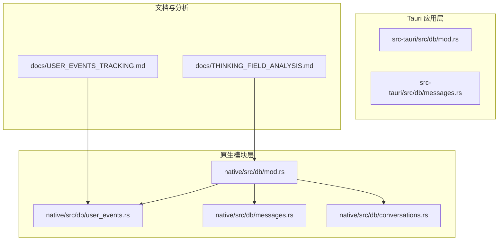
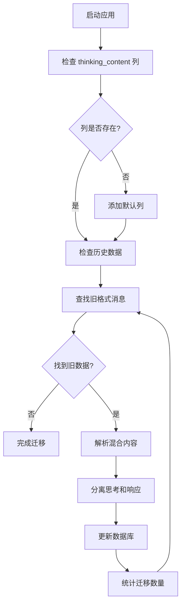
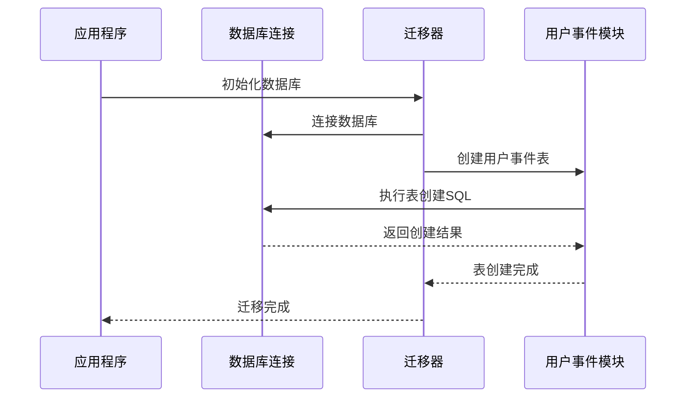
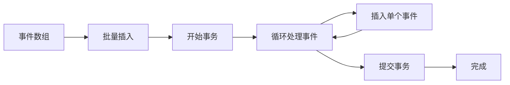
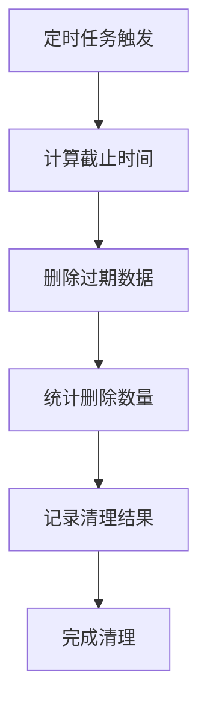
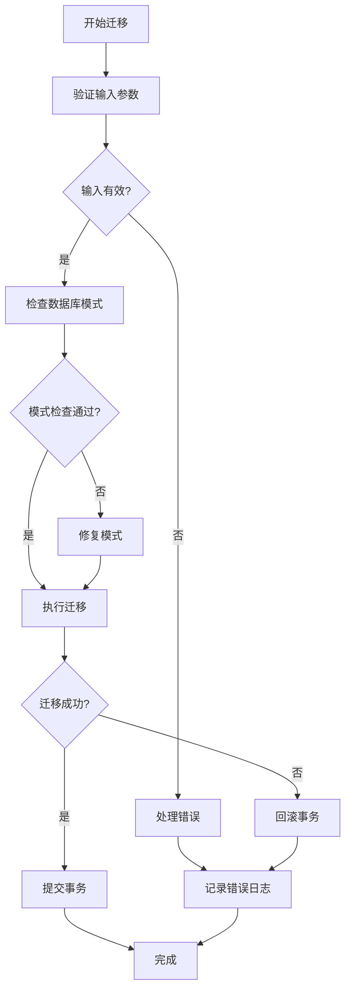
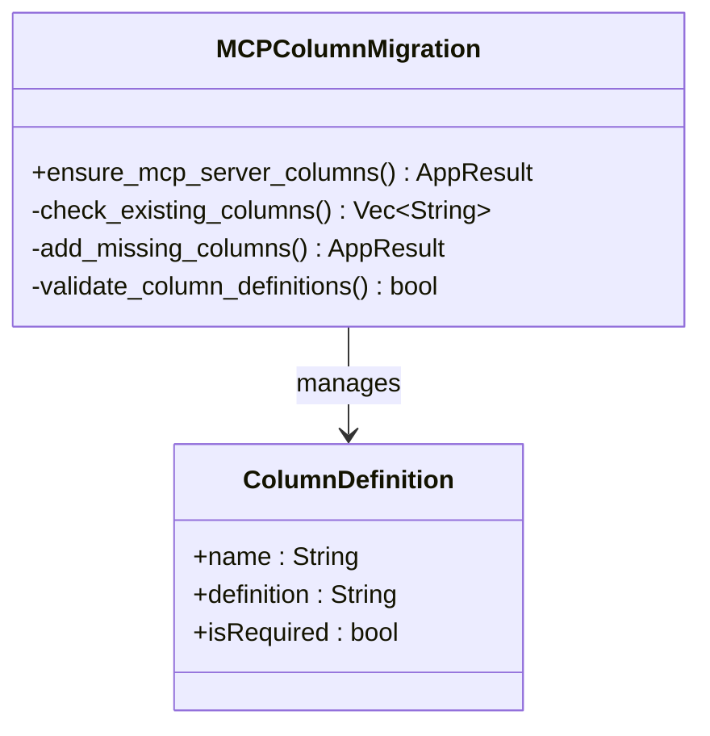
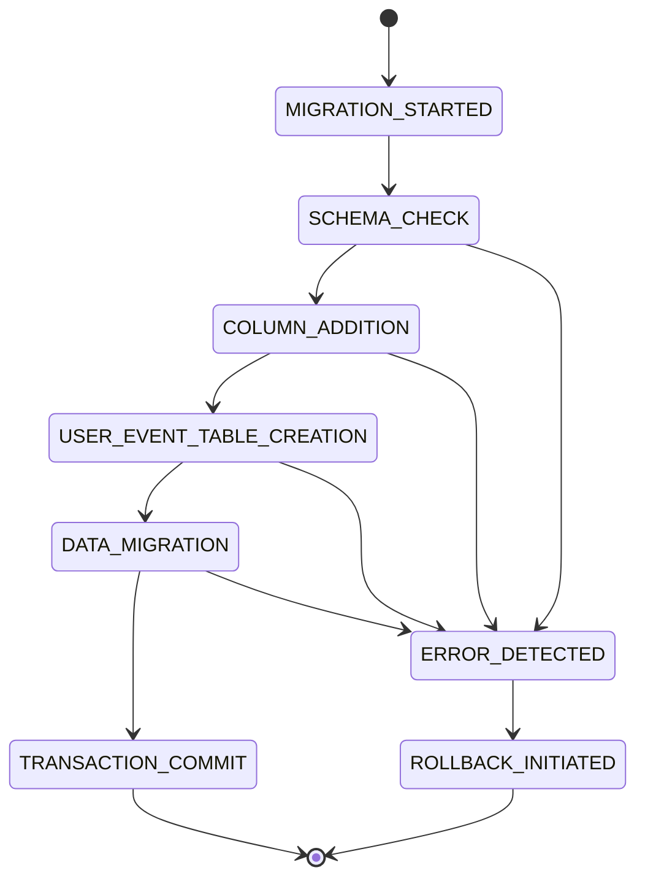

# 数据迁移策略

<cite>
**本文档引用的文件**
- [native/src/db/mod.rs](file://native/src/db/mod.rs)
- [native/src/db/user_events.rs](file://native/src/db/user_events.rs)
- [native/src/db/messages.rs](file://native/src/db/messages.rs)
- [native/src/db/conversations.rs](file://native/src/db/conversations.rs)
- [docs/USER_EVENTS_TRACKING.md](file://docs/USER_EVENTS_TRACKING.md)
</cite>

## 更新摘要
**所做更改**
- 新增用户事件表创建机制的详细说明
- 增强批量插入优化和自动清理机制的文档
- 更新数据库迁移架构图以反映新增的用户事件模块
- 完善迁移测试策略和验证方法
- 新增用户行为事件追踪系统的迁移集成说明

## 目录
1. [引言](#引言)
2. [项目结构](#项目结构)
3. [核心组件](#核心组件)
4. [架构概览](#架构概览)
5. [详细组件分析](#详细组件分析)
6. [依赖关系分析](#依赖关系分析)
7. [性能考量](#性能考量)
8. [故障排除指南](#故障排除指南)
9. [结论](#结论)
10. [附录](#附录)

## 引言

CoSurf 项目采用 SQLite 作为主要数据存储，实现了完整的数据库迁移策略。该策略确保了应用在不同版本间的平滑升级，同时保证了数据的完整性和向后兼容性。本文档深入分析了 CoSurf 的数据迁移机制，重点关注运行时迁移功能、数据格式演进策略以及完整性保护措施。

**更新** 新增用户事件表创建、批量插入优化、自动清理机制等增强功能的详细说明。

## 项目结构

CoSurf 项目采用多层架构设计，数据库相关代码分布在多个模块中，现已增加用户事件追踪模块：



**图表来源**
- [native/src/db/mod.rs:1-800](file://native/src/db/mod.rs#L1-L800)
- [native/src/db/user_events.rs:1-447](file://native/src/db/user_events.rs#L1-L447)

**章节来源**
- [native/src/db/mod.rs:1-800](file://native/src/db/mod.rs#L1-L800)
- [native/src/db/user_events.rs:1-447](file://native/src/db/user_events.rs#L1-L447)

## 核心组件

### 数据库迁移引擎

CoSurf 实现了两套独立的数据库迁移系统，分别服务于不同的运行环境：

#### 原生模块迁移系统（增强版）
- **位置**: `native/src/db/mod.rs`
- **特点**: 支持完整的数据库初始化、列添加、数据迁移和索引创建
- **功能**: 自动检测缺失的列并添加默认值，集成用户事件表创建
- **新增**: 用户事件表的自动创建和初始化

#### 用户事件追踪模块
- **位置**: `native/src/db/user_events.rs`
- **特点**: 专门处理用户行为事件的存储和管理
- **功能**: 事件数据结构定义、批量插入、自动清理、统计分析

**章节来源**
- [native/src/db/mod.rs:243-247](file://native/src/db/mod.rs#L243-L247)
- [native/src/db/user_events.rs:153-176](file://native/src/db/user_events.rs#L153-L176)

### 思考内容迁移机制

项目实现了专门的思考内容字段迁移机制，用于处理历史数据格式的演进：



**图表来源**
- [native/src/db/mod.rs:168-170](file://native/src/db/mod.rs#L168-L170)

**章节来源**
- [native/src/db/mod.rs:168-170](file://native/src/db/mod.rs#L168-L170)

## 架构概览

CoSurf 的数据迁移架构采用了多层次的设计模式，确保了系统的可扩展性和维护性，现已集成用户事件追踪系统：

```mermaid
graph TB
subgraph "迁移管理层"
MIGRATION_ENGINE[迁移引擎]
COLUMN_MANAGER[列管理器]
DATA_MIGRATOR[数据迁移器]
USER_EVENT_MIGRATOR[用户事件迁移器]
end
subgraph "数据库层"
SCHEMA_CREATOR[模式创建器]
TABLE_INDEXER[索引管理器]
CONSTRAINT_MANAGER[约束管理器]
USER_EVENT_TABLE[用户事件表]
end
subgraph "数据层"
MESSAGE_TABLE[消息表]
MCP_SERVERS_TABLE[MCP服务器表]
CONVERSATIONS_TABLE[对话表]
USER_EVENT_TABLE
end
subgraph "应用层"
THOUGHT_PROCESS[思考过程处理]
FEEDBACK_SYSTEM[反馈系统]
ATTACHMENT_MANAGER[附件管理器]
EVENT_TRACKER[事件追踪器]
END
MIGRATION_ENGINE --> SCHEMA_CREATOR
MIGRATION_ENGINE --> TABLE_INDEXER
MIGRATION_ENGINE --> CONSTRAINT_MANAGER
COLUMN_MANAGER --> MESSAGE_TABLE
COLUMN_MANAGER --> MCP_SERVERS_TABLE
DATA_MIGRATOR --> MESSAGE_TABLE
DATA_MIGRATOR --> THOUGHT_PROCESS
USER_EVENT_MIGRATOR --> USER_EVENT_TABLE
USER_EVENT_TABLE --> EVENT_TRACKER
MESSAGE_TABLE --> FEEDBACK_SYSTEM
MESSAGE_TABLE --> ATTACHMENT_MANAGER
```

**图表来源**
- [native/src/db/mod.rs:243-247](file://native/src/db/mod.rs#L243-L247)
- [native/src/db/user_events.rs:153-176](file://native/src/db/user_events.rs#L153-L176)

## 详细组件分析

### 运行时迁移功能

#### 用户事件表自动创建机制

新增的用户事件表创建机制实现了智能的表结构初始化：



**图表来源**
- [native/src/db/mod.rs:243-247](file://native/src/db/mod.rs#L243-L247)
- [native/src/db/user_events.rs:153-176](file://native/src/db/user_events.rs#L153-L176)

#### 批量插入优化机制

用户事件模块实现了高效的批量插入优化：



**图表来源**
- [native/src/db/user_events.rs:203-220](file://native/src/db/user_events.rs#L203-L220)

#### 自动清理机制

实现了基于时间的数据清理策略：



**图表来源**
- [native/src/db/user_events.rs:222-232](file://native/src/db/user_events.rs#L222-L232)

**章节来源**
- [native/src/db/mod.rs:243-247](file://native/src/db/mod.rs#L243-L247)
- [native/src/db/user_events.rs:203-232](file://native/src/db/user_events.rs#L203-L232)

### 数据完整性保护措施

#### 多层验证机制

CoSurf 实现了多层次的数据完整性保护，包括新增的用户事件数据保护：

1. **列存在性检查**: 使用 `PRAGMA table_info` 查询确保列存在
2. **数据格式验证**: 通过正则表达式和字符串匹配验证数据格式
3. **事务性操作**: 所有迁移操作都在事务中执行，确保原子性
4. **回滚机制**: 在迁移失败时自动回滚未完成的操作
5. **用户事件数据保护**: 批量插入使用事务保证原子性

#### 错误处理策略



**图表来源**
- [native/src/db/user_events.rs:203-220](file://native/src/db/user_events.rs#L203-L220)

**章节来源**
- [native/src/db/user_events.rs:203-220](file://native/src/db/user_events.rs#L203-L220)

### MCP 服务器列迁移

项目还实现了对 MCP 服务器配置的动态迁移：



**图表来源**
- [native/src/db/mod.rs:235-266](file://native/src/db/mod.rs#L235-L266)

**章节来源**
- [native/src/db/mod.rs:235-266](file://native/src/db/mod.rs#L235-L266)

## 依赖关系分析

### 组件耦合度分析

CoSurf 的数据库迁移系统展现了良好的模块化设计，现已集成用户事件模块：

```mermaid
graph TB
subgraph "核心依赖"
RUSQLITE[rusqlite: SQLite绑定]
CHRONO[chrono: 时间处理]
SERDE[serde: 序列化]
UUID[uuid: 标识符生成]
END
subgraph "迁移组件"
DATABASE_CLASS[Database类]
COLUMN_CHECKER[列检查器]
DATA_PARSER[数据解析器]
TRANSACTION_MANAGER[事务管理器]
USER_EVENT_MANAGER[用户事件管理器]
end
subgraph "业务逻辑"
MESSAGE_HANDLER[消息处理器]
MCP_MANAGER[MCP管理器]
PROMPT_MANAGER[Prompt管理器]
EVENT_TRACKER[事件追踪器]
end
RUSQLITE --> DATABASE_CLASS
CHRONO --> DATABASE_CLASS
SERDE --> DATABASE_CLASS
UUID --> USER_EVENT_MANAGER
DATABASE_CLASS --> COLUMN_CHECKER
DATABASE_CLASS --> DATA_PARSER
DATABASE_CLASS --> TRANSACTION_MANAGER
COLUMN_CHECKER --> MESSAGE_HANDLER
DATA_PARSER --> MCP_MANAGER
TRANSACTION_MANAGER --> PROMPT_MANAGER
USER_EVENT_MANAGER --> EVENT_TRACKER
```

**图表来源**
- [native/src/db/mod.rs:1-800](file://native/src/db/mod.rs#L1-L800)
- [native/src/db/user_events.rs:1-447](file://native/src/db/user_events.rs#L1-L447)

**章节来源**
- [native/src/db/mod.rs:1-800](file://native/src/db/mod.rs#L1-L800)
- [native/src/db/user_events.rs:1-447](file://native/src/db/user_events.rs#L1-L447)

### 外部依赖集成

项目集成了多种外部库来支持迁移功能：

- **rusqlite**: 提供 SQLite 数据库访问能力
- **chrono**: 处理时间戳和日期格式
- **serde**: 支持 JSON 序列化和反序列化
- **uuid**: 生成唯一标识符
- **tracing**: 提供结构化日志记录

## 性能考量

### 迁移性能优化

CoSurf 在迁移过程中采用了多项性能优化策略，现已包含用户事件模块的优化：

1. **批量操作**: 将多个迁移步骤合并执行，减少数据库往返次数
2. **索引优化**: 在迁移完成后重新创建必要的索引
3. **内存管理**: 使用流式处理避免大量数据的内存占用
4. **并发控制**: 通过数据库连接池管理并发访问
5. **用户事件批量插入**: 使用事务批量处理大量事件数据

### 数据库性能特性

```mermaid
graph LR
subgraph "性能优化"
WAL_MODE[WAL模式]
FOREIGN_KEYS[外键约束]
INDEXES[索引优化]
CONNECTION_POOL[连接池]
USER_EVENT_BATCH[用户事件批量处理]
END
subgraph "性能指标"
FAST_QUERIES[快速查询]
LOW_LATENCY[低延迟]
HIGH_CONCURRENCY[高并发]
DATA_INTEGRITY[数据完整性]
USER_EVENT_OPTIMIZATION[用户事件优化]
END
WAL_MODE --> FAST_QUERIES
FOREIGN_KEYS --> DATA_INTEGRITY
INDEXES --> LOW_LATENCY
CONNECTION_POOL --> HIGH_CONCURRENCY
USER_EVENT_BATCH --> USER_EVENT_OPTIMIZATION
```

**图表来源**
- [native/src/db/mod.rs:24-26](file://native/src/db/mod.rs#L24-L26)
- [native/src/db/user_events.rs:203-220](file://native/src/db/user_events.rs#L203-L220)

## 故障排除指南

### 常见迁移问题及解决方案

#### 迁移失败诊断

当迁移操作失败时，系统会记录详细的错误信息：

1. **检查数据库连接**: 确保应用程序具有足够的权限访问数据库文件
2. **验证磁盘空间**: 确保有足够的磁盘空间进行迁移操作
3. **检查数据完整性**: 使用 SQLite 工具验证数据库文件的完整性
4. **查看日志文件**: 分析迁移过程中的详细日志信息
5. **用户事件数据检查**: 验证用户事件表的创建和索引状态

#### 回滚机制

如果迁移过程中发生错误，系统会自动执行回滚操作：



**图表来源**
- [native/src/db/mod.rs:243-247](file://native/src/db/mod.rs#L243-L247)

**章节来源**
- [native/src/db/mod.rs:243-247](file://native/src/db/mod.rs#L243-L247)

### 测试策略和验证方法

#### 单元测试覆盖

CoSurf 实现了全面的测试策略来验证迁移功能，现已包含用户事件模块测试：

1. **迁移功能测试**: 验证列添加和数据迁移的正确性
2. **边界条件测试**: 测试空数据、异常数据和边界值
3. **性能测试**: 评估大规模数据迁移的性能表现
4. **兼容性测试**: 确保迁移功能在不同 SQLite 版本上的兼容性
5. **用户事件测试**: 验证批量插入、清理机制和查询功能

#### 验证方法

- **数据一致性检查**: 使用哈希算法验证数据迁移前后的一致性
- **查询性能测试**: 比较迁移前后的查询性能差异
- **内存使用监控**: 监控迁移过程中的内存使用情况
- **并发访问测试**: 验证多线程环境下迁移操作的稳定性
- **用户事件性能测试**: 验证批量插入和清理操作的性能表现

## 结论

CoSurf 的数据迁移策略展现了现代应用程序数据管理的最佳实践。通过实现运行时迁移、数据格式演进和完整性保护机制，项目确保了用户数据的安全性和应用的持续演进能力。

**更新** 新增的用户事件追踪系统进一步增强了数据管理能力，包括智能表创建、批量插入优化和自动清理机制。

### 主要成就

1. **智能迁移**: 自动检测和修复数据库结构问题
2. **向后兼容**: 保持对历史数据的完全兼容
3. **性能优化**: 采用多种技术确保迁移过程的高效性
4. **错误处理**: 实现完善的错误检测和恢复机制
5. **用户事件追踪**: 新增用户行为事件的完整管理能力

### 未来发展方向

1. **增量迁移**: 实现更细粒度的增量迁移功能
2. **迁移监控**: 添加迁移进度跟踪和状态报告
3. **自动化测试**: 增强自动化测试覆盖率
4. **性能分析**: 提供迁移性能的深度分析工具
5. **用户事件分析**: 增强用户行为数据的分析和可视化能力

## 附录

### 迁移脚本示例

以下是一个典型的迁移脚本执行流程，现已包含用户事件表创建：

```sql
-- 检查列存在性
PRAGMA table_info(messages);

-- 添加新列
ALTER TABLE messages ADD COLUMN thinking_content TEXT NOT NULL DEFAULT '';

-- 创建用户事件表
CREATE TABLE IF NOT EXISTS user_events (
    id TEXT PRIMARY KEY,
    type TEXT NOT NULL,
    timestamp INTEGER NOT NULL,
    url TEXT,
    tab_id TEXT,
    window_id INTEGER,
    data TEXT NOT NULL,
    created_at INTEGER DEFAULT (strftime('%s', 'now') * 1000)
);

-- 创建用户事件索引
CREATE INDEX IF NOT EXISTS idx_user_events_type ON user_events(type);
CREATE INDEX IF NOT EXISTS idx_user_events_timestamp ON user_events(timestamp DESC);
CREATE INDEX IF NOT EXISTS idx_user_events_url ON user_events(url);
CREATE INDEX IF NOT EXISTS idx_user_events_tab_id ON user_events(tab_id);

-- 迁移历史数据
UPDATE messages 
SET thinking_content = SUBSTR(content, 1, POSITION('💭💬' IN content) - 1),
    content = SUBSTR(content, POSITION('💭💬' IN content) + 6)
WHERE role = 'assistant' 
AND thinking_content = '' 
AND content LIKE '%💭 Thinking...%';

-- 清理用户事件旧数据（保留3天）
DELETE FROM user_events WHERE timestamp < (strftime('%s', 'now') * 1000 - 3 * 24 * 60 * 60 * 1000);
```

### 执行流程

1. **初始化阶段**: 应用启动时自动检测数据库状态
2. **迁移阶段**: 执行必要的数据库结构更新
3. **用户事件初始化**: 自动创建用户事件表和索引
4. **验证阶段**: 确认迁移操作的成功完成
5. **清理阶段**: 优化数据库性能和索引

### 最佳实践

- **定期备份**: 在执行重大迁移前创建数据库备份
- **测试环境**: 在生产环境部署前先在测试环境验证
- **监控告警**: 设置迁移过程的监控和告警机制
- **文档记录**: 详细记录每次迁移的操作和结果
- **用户事件监控**: 监控用户事件数据的增长和清理效果