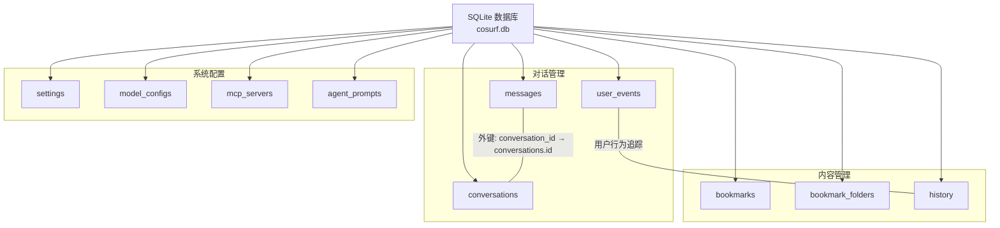
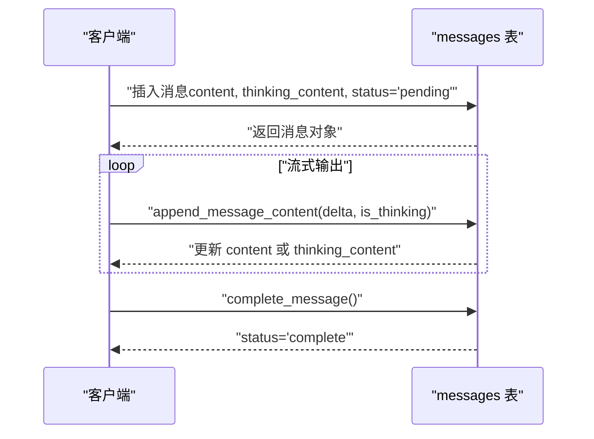
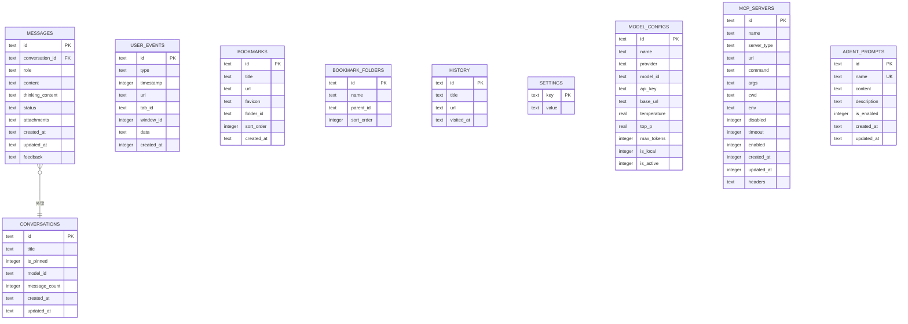

# 表结构定义

<cite>
**本文引用的文件**
- [native/src/db/mod.rs](file://native/src/db/mod.rs)
- [native/src/db/conversations.rs](file://native/src/db/conversations.rs)
- [native/src/db/messages.rs](file://native/src/db/messages.rs)
- [native/src/db/user_events.rs](file://native/src/db/user_events.rs)
- [packages/shared/src/conversation.ts](file://packages/shared/src/conversation.ts)
- [packages/shared/src/message.ts](file://packages/shared/src/message.ts)
</cite>

## 目录
1. [简介](#简介)
2. [项目结构与数据库架构](#项目结构与数据库架构)
3. [核心表结构总览](#核心表结构总览)
4. [表结构详解](#表结构详解)
   - [conversations 表：对话管理](#conversations-表对话管理)
   - [messages 表：消息存储与状态管理](#messages-表消息存储与状态管理)
   - [user_events 表：用户行为事件追踪](#user-events-表用户行为事件追踪)
   - [bookmarks 表：书签组织](#bookmarks-表书签组织)
   - [history 表：浏览记录](#history-表浏览记录)
   - [settings 表：配置存储](#settings-表配置存储)
   - [model_configs 表：模型配置管理](#model-configs-表模型配置管理)
   - [mcp_servers 表：MCP 服务器配置](#mcp-servers-表mcp-服务器配置)
   - [agent_prompts 表：智能体提示词管理](#agent-prompts-表智能体提示词管理)
5. [表间关系与参照完整性](#表间关系与参照完整性)
6. [索引策略与性能考量](#索引策略与性能考量)
7. [数据类型选择与技术考量](#数据类型选择与技术考量)
8. [使用场景与最佳实践](#使用场景与最佳实践)
9. [故障排查与维护建议](#故障排查与维护建议)
10. [结论](#结论)

## 简介
本文件面向 CoSurf 的数据库层，系统性梳理并解释核心表结构：conversations、messages、user_events、bookmarks、history、settings、model_configs、mcp_servers、agent_prompts。文档覆盖字段定义、数据类型、约束条件、默认值、主键/外键设计、索引策略、表间关系、参照完整性、以及数据类型选择的技术考量与性能影响。同时给出各表的典型使用场景与最佳实践，帮助开发者与运维人员高效理解与维护数据库结构。

## 项目结构与数据库架构
CoSurf 使用 SQLite 作为本地数据库，采用 rusqlite 访问。数据库初始化时启用 WAL 模式与外键约束，并在应用启动时执行迁移脚本以确保表结构一致。迁移脚本中包含 conversations、messages、user_events、bookmarks、bookmark_folders、history、settings、model_configs、mcp_servers、agent_prompts 等表的创建与索引。

**图表来源**
- [native/src/db/mod.rs:63-176](file://native/src/db/mod.rs#L63-L176)

**章节来源**
- [native/src/db/mod.rs:44-176](file://native/src/db/mod.rs#L44-L176)

## 核心表结构总览
- conversations：按会话维度存储对话元信息（标题、置顶、模型、消息计数、时间戳）。
- messages：按消息维度存储对话内容、角色、状态、附件、思考内容、反馈等。
- user_events：按用户行为事件维度存储标签页、页面交互、滚动等行为数据。
- bookmarks：按书签维度存储书签条目及排序；bookmark_folders 提供层级分组能力。
- history：按访问记录维度存储页面标题、URL、访问时间。
- settings：键值对配置存储，用于应用设置、模型配置、MCP 服务器配置等。
- model_configs：模型配置管理，支持多种大模型提供商。
- mcp_servers：MCP（Model Context Protocol）服务器配置管理。
- agent_prompts：智能体提示词模板管理。

**章节来源**
- [native/src/db/mod.rs:63-176](file://native/src/db/mod.rs#L63-L176)

## 表结构详解

### conversations 表：对话管理
**设计理念**：以"会话"为中心，记录对话的元信息与状态，便于列表展示与导航。

**主键**：id（TEXT，PRIMARY KEY），UUID 字符串。

**关键字段**：
- title：TEXT，NOT NULL，默认"New Conversation"，用于界面显示。
- is_pinned：INTEGER，NOT NULL，默认 0（布尔语义），用于置顶排序。
- model_id：TEXT，NOT NULL，默认空字符串，标识当前会话使用的模型。
- message_count：INTEGER，NOT NULL，默认 0，用于统计消息数量。
- created_at / updated_at：TEXT，NOT NULL，RFC3339 时间字符串，用于排序与审计。

**约束与默认值**：
- 所有字段均显式声明 NOT NULL 或默认值，避免 NULL 干扰查询与排序。

**外键关系**：
- 无外键，但 messages 表通过 conversation_id 引用本表 id。

**索引策略**：
- idx_messages_conversation_id：按 conversation_id 建立索引，加速按会话查询。

**使用场景**：
- 列表对话：按 is_pinned DESC、updated_at DESC 排序。
- 创建对话：生成 UUID，填充默认值。
- 更新对话：支持重命名、置顶切换、模型切换。
- 删除对话：级联删除消息（见下文）。

**章节来源**
- [native/src/db/mod.rs:66-87](file://native/src/db/mod.rs#L66-L87)
- [native/src/db/conversations.rs:19-37](file://native/src/db/conversations.rs#L19-L37)

### messages 表：消息存储与状态管理
**设计理念**：以"消息"为中心，支持流式输出、思考内容分离、附件、反馈等丰富能力。

**主键**：id（TEXT，PRIMARY KEY），UUID 字符串。

**关键字段**：
- conversation_id：TEXT，NOT NULL，外键引用 conversations.id，ON DELETE CASCADE。
- role：TEXT，NOT NULL，CHECK 约束限定为 'user' | 'assistant' | 'system'。
- content：TEXT，NOT NULL，默认空字符串，常规回复内容。
- thinking_content：TEXT，NOT NULL，默认空字符串，新增字段，用于分离"思考过程"。
- status：TEXT，NOT NULL，默认 'pending'，CHECK 约束限定为 'pending' | 'streaming' | 'complete' | 'error'。
- attachments：TEXT，NOT NULL，默认 '[]'，JSON 数组字符串，存储附件元数据。
- created_at / updated_at：TEXT，NOT NULL，RFC3339 时间字符串。
- feedback：TEXT，NOT NULL，默认空字符串，用户反馈（"" | "like" | "dislike"）。

**约束与默认值**：
- CHECK 约束保证 role 与 status 的取值范围。
- 默认值确保新字段不会导致 NULL。

**外键关系**：
- 外键 conversation_id → conversations.id，ON DELETE CASCADE。

**索引策略**：
- idx_messages_conversation_id：按 conversation_id 建立索引，加速按会话查询。

**使用场景**：
- 创建消息：生成 UUID，写入 content/thinking_content/status/attachments。
- 流式追加：append_message_content 支持 thinking_content 与 content 分别追加。
- 完成消息：complete_message 将 status 设为 'complete'。
- 设置反馈：set_message_feedback 更新 feedback 字段。
- 删除消息：delete_message；删除会话时 cascade 删除消息。

**图表来源**
- [native/src/db/messages.rs:98-124](file://native/src/db/messages.rs#L98-L124)

**章节来源**
- [native/src/db/mod.rs:76-89](file://native/src/db/mod.rs#L76-L89)
- [native/src/db/messages.rs:21-42](file://native/src/db/messages.rs#L21-L42)

### user_events 表：用户行为事件追踪
**设计理念**：追踪和存储用户在浏览器中的行为事件，支持数据分析和用户画像构建。

**主键**：id（TEXT，PRIMARY KEY），UUID 字符串。

**关键字段**：
- type：TEXT，NOT NULL，事件类型枚举（tab_open、tab_close、page_click、page_scroll、url_change 等）。
- timestamp：INTEGER，NOT NULL，Unix 毫秒时间戳，用于事件排序。
- url：TEXT，可选，发生事件的页面 URL。
- tab_id：TEXT，可选，标签页 ID。
- window_id：INTEGER，可选，窗口 ID。
- data：TEXT，NOT NULL，JSON 字符串，存储事件相关数据。
- created_at：INTEGER，NOT NULL，默认当前时间戳。

**事件类型枚举**：
- 标签页事件：tab_open、tab_close、tab_switch
- 页面交互：page_click、page_scroll、page_stay、url_change
- 表单输入：form_input
- 窗口调整：window_resize
- 页面加载：page_load

**索引策略**：
- idx_user_events_type：按事件类型建立索引。
- idx_user_events_timestamp：按时间戳降序索引。
- idx_user_events_url：按 URL 建立索引。
- idx_user_events_tab_id：按标签页 ID 建立索引。

**使用场景**：
- 用户行为分析：统计页面停留时间、点击热力图等。
- 性能监控：分析页面加载时间和用户交互模式。
- 个性化推荐：基于用户行为构建兴趣模型。
- 数据清理：保留最近 3 天的事件数据。

**章节来源**
- [native/src/db/mod.rs:155-164](file://native/src/db/mod.rs#L155-L164)
- [native/src/db/user_events.rs:154-176](file://native/src/db/user_events.rs#L154-L176)

### bookmarks 表：书签组织
**设计理念**：支持书签条目与文件夹的两级组织，提供排序与层级管理。

**主键**：id（TEXT，PRIMARY KEY），UUID 字符串。

**关键字段**：
- title / url：TEXT，NOT NULL，书签标题与地址。
- favicon：TEXT，可选，图标地址。
- folder_id：TEXT，可选，指向 bookmark_folders.id，形成层级关系。
- sort_order：INTEGER，NOT NULL，默认 0，用于同文件夹内排序。
- created_at：TEXT，NOT NULL，RFC3339 时间字符串。

**外键关系**：
- folder_id → bookmark_folders.id（逻辑引用，迁移脚本未显式外键）。

**索引策略**：
- 无显式索引，按 folder_id 查询时可考虑建立索引提升性能。

**使用场景**：
- 列出根级或指定文件夹下的书签，按 sort_order 升序。
- 创建书签：计算最大排序号并递增。
- 创建文件夹：计算最大排序号并递增。
- 删除文件夹：先删除其下所有书签，再删除文件夹本身。

**章节来源**
- [native/src/db/mod.rs:91-106](file://native/src/db/mod.rs#L91-L106)

### history 表：浏览记录
**设计理念**：记录用户的页面访问历史，支持搜索与分页。

**主键**：id（TEXT，PRIMARY KEY），UUID 字符串。

**关键字段**：
- title：TEXT，NOT NULL，默认空字符串。
- url：TEXT，NOT NULL。
- visited_at：TEXT，NOT NULL，RFC3339 时间字符串。

**索引策略**：
- idx_history_visited_at：visited_at 降序索引，优化按时间倒序查询。

**使用场景**：
- 列表历史：LIMIT + OFFSET 分页，visited_at DESC。
- 搜索历史：title 或 url 模糊匹配，visited_at DESC。
- 添加历史：插入一条记录。
- 清空历史：DELETE FROM history。

**章节来源**
- [native/src/db/mod.rs:108-115](file://native/src/db/mod.rs#L108-L115)

### settings 表：配置存储
**设计理念**：以键值对形式存储应用配置，支持 JSON 值与复杂结构。

**主键**：key（TEXT，PRIMARY KEY）。

**关键字段**：
- value：TEXT，NOT NULL，存储 JSON 字符串或简单字符串。

**使用场景**：
- get_setting / set_setting：读取/更新配置，支持 ON CONFLICT(key) DO UPDATE。
- get_all_settings：聚合为 JSON 对象。
- 与 model_configs、mcp_servers 等表配合，存储模型与工具服务器配置。

**章节来源**
- [native/src/db/mod.rs:117-120](file://native/src/db/mod.rs#L117-L120)

### model_configs 表：模型配置管理
**设计理念**：集中管理各种大模型的配置参数，支持多提供商集成。

**主键**：id（TEXT，PRIMARY KEY），UUID 字符串。

**关键字段**：
- name：TEXT，NOT NULL，模型配置名称。
- provider：TEXT，NOT NULL，模型提供商（如 OpenAI、Claude、Local 等）。
- model_id：TEXT，NOT NULL，具体模型标识符。
- api_key：TEXT，可选，API 密钥。
- base_url：TEXT，可选，自定义 API 基础 URL。
- temperature：REAL，NOT NULL，默认 0.7，控制生成随机性。
- top_p：REAL，NOT NULL，默认 1.0，核采样概率。
- max_tokens：INTEGER，NOT NULL，默认 4096，最大生成 token 数。
- is_local：INTEGER，NOT NULL，默认 0，是否为本地模型。
- is_active：INTEGER，NOT NULL，默认 0，当前激活的模型。

**使用场景**：
- 列出所有模型配置，按激活状态和名称排序。
- 获取当前激活的模型配置。
- 创建、更新、删除模型配置。
- 切换激活的模型。

**章节来源**
- [native/src/db/mod.rs:122-134](file://native/src/db/mod.rs#L122-L134)

### mcp_servers 表：MCP 服务器配置
**设计理念**：管理 MCP（Model Context Protocol）服务器连接配置，支持多种传输方式。

**主键**：id（TEXT，PRIMARY KEY），UUID 字符串。

**关键字段**：
- name：TEXT，NOT NULL，服务器名称。
- server_type：TEXT，NOT NULL，默认 "stdio"，传输方式（stdio、http、sse）。
- url：TEXT，可选，HTTP URL（当 server_type 为 http/sse 时）。
- command：TEXT，可选，命令行（当 server_type 为 stdio 时）。
- args：TEXT，可选，命令行参数。
- cwd：TEXT，可选，工作目录。
- env：TEXT，可选，环境变量（JSON 字符串）。
- disabled：INTEGER，NOT NULL，默认 0，是否禁用。
- timeout：INTEGER，可选，超时时间（毫秒）。
- enabled：INTEGER，NOT NULL，默认 1，是否启用。
- created_at / updated_at：INTEGER，NOT NULL，默认当前时间戳。
- headers：TEXT，可选，HTTP 请求头（JSON 字符串）。

**索引策略**：
- idx_mcp_servers_enabled：按启用状态建立索引。

**使用场景**：
- 列出所有 MCP 服务器，按名称排序。
- 创建、更新、删除 MCP 服务器配置。
- 测试 MCP 服务器连接。
- 加载 MCP 服务器供 AI 功能使用。

**章节来源**
- [native/src/db/mod.rs:136-151](file://native/src/db/mod.rs#L136-L151)

### agent_prompts 表：智能体提示词管理
**设计理念**：存储可配置的智能体提示词模板，支持多场景的系统提示词管理。

**主键**：id（TEXT，PRIMARY KEY），UUID 字符串。

**关键字段**：
- name：TEXT，NOT NULL，唯一标识的提示词名称。
- content：TEXT，NOT NULL，提示词内容。
- description：TEXT，可选，描述说明。
- is_enabled：INTEGER，NOT NULL，默认 1，是否启用。
- created_at / updated_at：TEXT，NOT NULL，RFC3339 时间字符串。

**唯一约束**：
- name：UNIQUE，确保提示词名称唯一。

**使用场景**：
- 列出所有提示词模板，按名称排序。
- 获取特定名称的提示词模板。
- 创建、更新、删除提示词模板。
- 启用/禁用提示词模板。
- 初始化默认提示词模板集合。

**章节来源**
- [native/src/db/mod.rs:156-164](file://native/src/db/mod.rs#L156-L164)

## 表间关系与参照完整性
- conversations 与 messages：
  - 一对多：一个会话包含多个消息。
  - 外键：messages.conversation_id → conversations.id，ON DELETE CASCADE。
  - 影响：删除会话时自动删除其下所有消息。
- bookmarks 与 bookmark_folders：
  - 一对多：一个文件夹包含多个书签。
  - folder_id → bookmark_folders.id（逻辑引用，迁移脚本未显式外键）。
- user_events 与 history：
  - 无直接外键关系，但都记录用户浏览行为。
- model_configs 与 mcp_servers：
  - settings 表提供统一的键值存储，二者通过应用逻辑进行配置管理。
- agent_prompts 与系统配置：
  - 通过 settings 表存储相关配置项。

**图表来源**
- [native/src/db/mod.rs:66-176](file://native/src/db/mod.rs#L66-L176)

**章节来源**
- [native/src/db/mod.rs:66-176](file://native/src/db/mod.rs#L66-L176)

## 索引策略与性能考量
- messages 表：
  - idx_messages_conversation_id：按 conversation_id 建立索引，显著提升按会话查询与删除性能。
- history 表：
  - idx_history_visited_at：visited_at 降序索引，优化分页与时间倒序查询。
- bookmarks 表：
  - 可考虑为 folder_id 建立索引，以提升按文件夹查询的性能。
- conversations 表：
  - 当前无显式索引，但查询按 is_pinned DESC、updated_at DESC 排序。可在生产环境评估添加复合索引以优化排序性能。
- settings 表：
  - key 为主键，查询效率高；批量读取时可利用 get_all_settings 聚合为 JSON 对象，减少往返。
- user_events 表：
  - 多个索引组合支持高效的事件查询和统计分析。
- model_configs 表：
  - 按 is_active 和 name 排序，支持快速获取激活模型。
- mcp_servers 表：
  - idx_mcp_servers_enabled：按启用状态索引，支持快速筛选可用服务器。

**章节来源**
- [native/src/db/mod.rs:89](file://native/src/db/mod.rs#L89)
- [native/src/db/mod.rs:115](file://native/src/db/mod.rs#L115)
- [native/src/db/mod.rs:153](file://native/src/db/mod.rs#L153)
- [native/src/db/conversations.rs:31-32](file://native/src/db/conversations.rs#L31-L32)
- [native/src/db/user_events.rs:168-171](file://native/src/db/user_events.rs#L168-L171)

## 数据类型选择与技术考量
- TEXT 主键与外键：
  - 使用 UUID 字符串作为主键，便于跨服务/跨语言一致性与可读性；SQLite 中 TEXT 与 BLOB 在性能上差异不大，且 TEXT 更易调试。
- 时间戳：
  - conversations/messages 使用 RFC3339 字符串（ISO 8601），便于人类阅读与跨语言解析；user_events/history 使用 Unix 毫秒时间戳，便于精确的时间计算和排序。
- JSON 字段：
  - attachments 使用 JSON 字符串存储数组，便于灵活扩展；user_events 的 data 字段存储复杂事件数据，序列化/反序列化开销可控。
- 枚举约束：
  - role 与 status 使用 CHECK 约束，确保数据质量；user_events.type 使用枚举类型，通过字符串表示。
- 索引与排序：
  - visited_at 使用降序索引，提升时间倒序查询性能；可结合 LIMIT/OFFSET 实现高效分页。
- 外键与级联：
  - conversations 与 messages 的级联删除，简化了会话生命周期管理；需注意删除会话的副作用。
- 数据保留策略：
  - user_events 表采用时间戳过滤，实现数据自动清理，避免无限增长。

**章节来源**
- [native/src/db/mod.rs:66-176](file://native/src/db/mod.rs#L66-L176)
- [native/src/db/messages.rs:98-124](file://native/src/db/messages.rs#L98-L124)
- [native/src/db/user_events.rs:222-232](file://native/src/db/user_events.rs#L222-L232)

## 使用场景与最佳实践
- 对话管理（conversations）：
  - 列表展示：按 is_pinned DESC、updated_at DESC 排序，确保置顶与最新会话优先。
  - 创建会话：使用 UUID 生成 id，填充默认值，created_at/updated_at 使用同一时间戳。
  - 更新会话：仅更新必要字段，避免不必要的写放大。
- 消息管理（messages）：
  - 流式输出：区分 thinking_content 与 content，分别追加，保持 UI 响应性。
  - 状态机：严格遵循 pending → streaming → complete/error 的状态流转。
  - 附件处理：统一序列化为 JSON 字符串，便于跨端传输与解析。
- 用户行为追踪（user_events）：
  - 事件分类：合理使用事件类型枚举，便于后续分析。
  - 数据清理：定期清理过期事件，控制数据库大小。
  - 性能优化：利用多索引支持高效查询和统计。
- 书签管理（bookmarks）：
  - 排序：每次新增书签时计算最大排序号并递增，保证稳定顺序。
  - 文件夹：删除文件夹前先删除其下所有书签，避免悬挂引用。
- 浏览历史（history）：
  - 分页：使用 LIMIT/OFFSET，visited_at DESC，避免全表扫描。
  - 搜索：LIKE 模糊匹配 title/url，注意索引命中与性能。
- 配置存储（settings）：
  - 键值对：使用 ON CONFLICT(key) DO UPDATE，避免重复插入。
  - 聚合读取：get_all_settings 返回 JSON 对象，减少多次查询。
- 模型配置（model_configs）：
  - 多提供商支持：统一管理不同提供商的配置参数。
  - 激活机制：通过 is_active 字段实现模型切换。
- MCP 服务器（mcp_servers）：
  - 传输方式：支持 stdio、http、sse 多种传输协议。
  - 连接测试：提供测试接口验证服务器连通性。
- 提示词管理（agent_prompts）：
  - 模板化：通过提示词模板实现智能体行为标准化。
  - 启用控制：通过 is_enabled 字段灵活控制提示词使用。

**章节来源**
- [native/src/db/conversations.rs:39-148](file://native/src/db/conversations.rs#L39-L148)
- [native/src/db/messages.rs:44-138](file://native/src/db/messages.rs#L44-L138)
- [native/src/db/user_events.rs:178-286](file://native/src/db/user_events.rs#L178-286)
- [native/src/db/mod.rs:522-738](file://native/src/db/mod.rs#L522-L738)

## 故障排查与维护建议
- 新字段兼容性：
  - 迁移脚本包含 ensure_column 函数，自动检测并添加缺失列，避免升级失败。
- 外键约束：
  - 启用 PRAGMA foreign_keys=ON，确保参照完整性；删除会话时依赖 CASCADE 删除消息。
- 索引缺失：
  - 若按 folder_id 查询书签性能不佳，建议手动添加索引。
- 时间字段：
  - 统一使用 RFC3339 字符串，避免时区与解析问题；如需更高性能，可考虑转换为整数时间戳。
- JSON 字段：
  - 附件 JSON 必须合法，否则反序列化会回退为空数组；建议在写入前校验 JSON 结构。
- 数据清理：
  - user_events 表定期清理过期数据，建议设置定时任务自动执行。
- 配置管理：
  - settings 表支持动态配置，注意配置项的版本兼容性。
- 模型配置：
  - model_configs 表支持热切换，注意切换时的资源释放和重新初始化。

**章节来源**
- [native/src/db/mod.rs:178-191](file://native/src/db/mod.rs#L178-L191)
- [native/src/db/mod.rs:222-232](file://native/src/db/mod.rs#L222-L232)

## 结论
CoSurf 的数据库层围绕"会话-消息"主线，辅以用户行为追踪、内容管理、系统配置、模型管理和智能体提示词五大支撑面，结构清晰、约束明确、索引合理。通过 UUID 主键、CHECK 约束、JSON 字段与级联删除等设计，既保证了数据一致性与扩展性，又兼顾了开发效率与用户体验。新增的 user_events 表为用户行为分析提供了强大支持，agent_prompts 表实现了智能体行为的模板化管理。建议在生产环境中根据实际查询模式补充必要的索引，并持续关注字段演进与迁移策略，确保系统长期稳定运行。