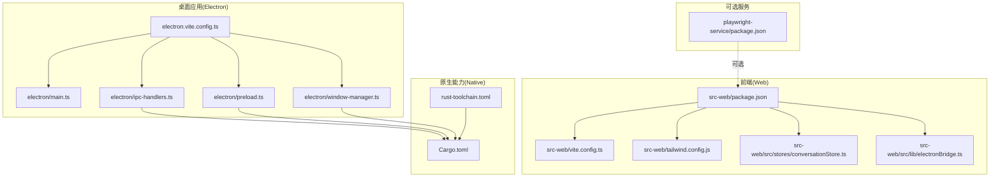
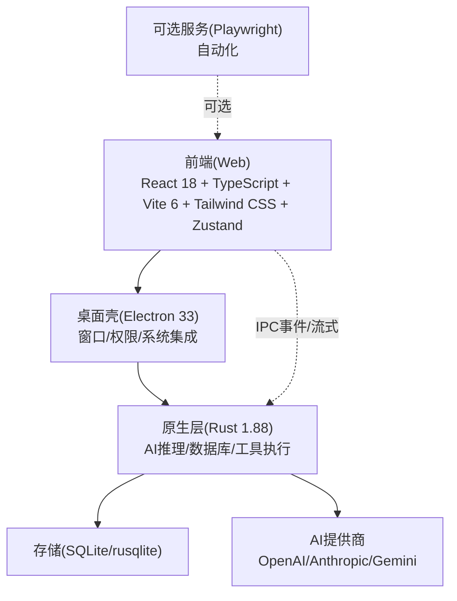
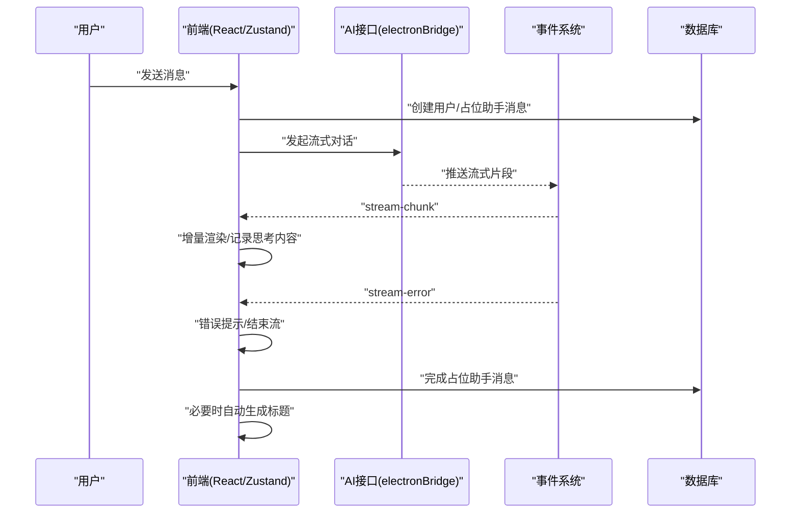
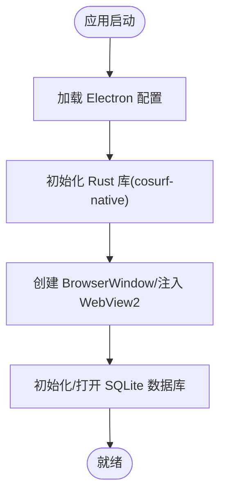
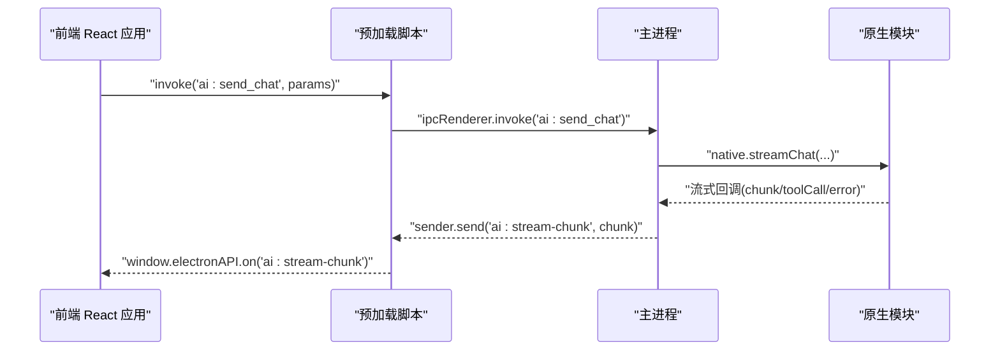
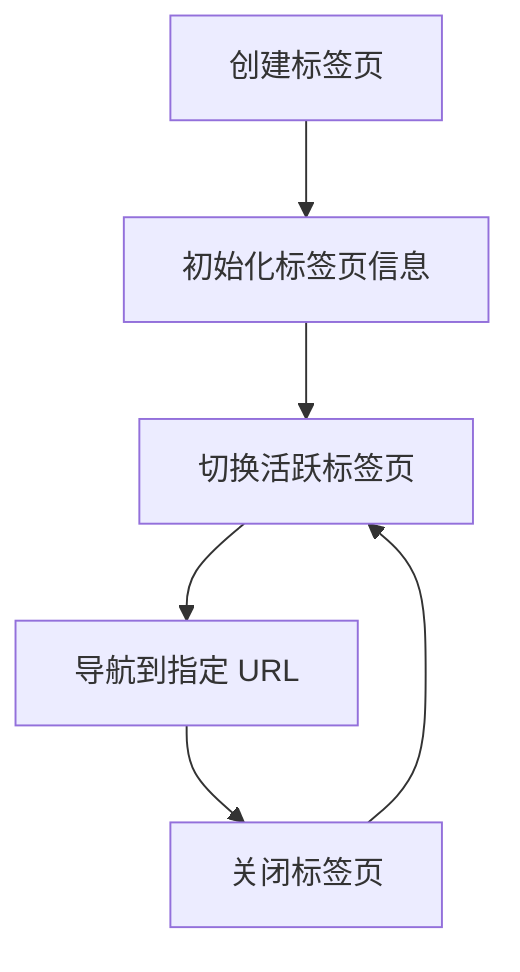
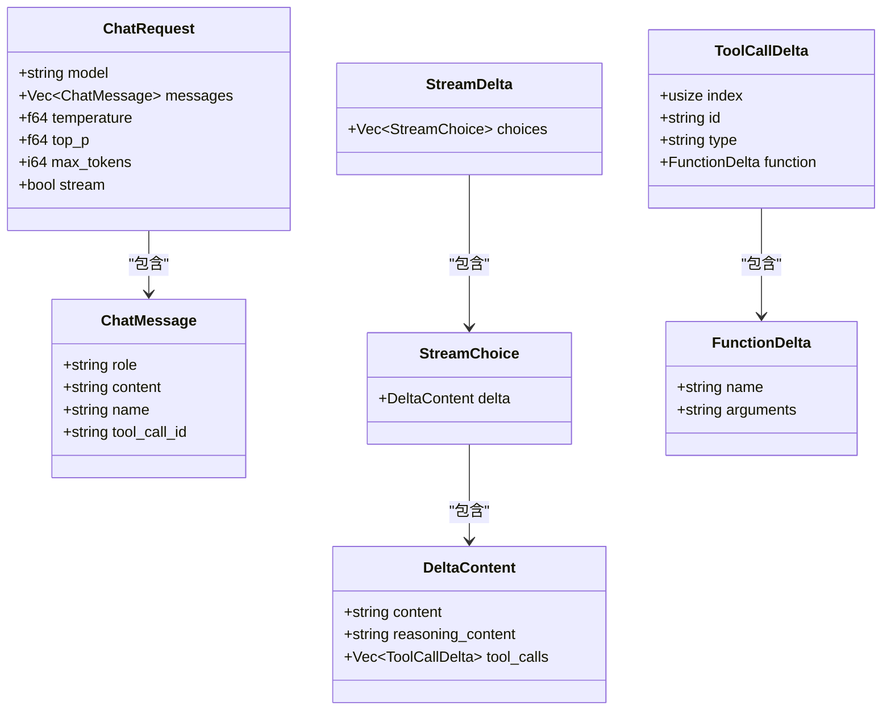
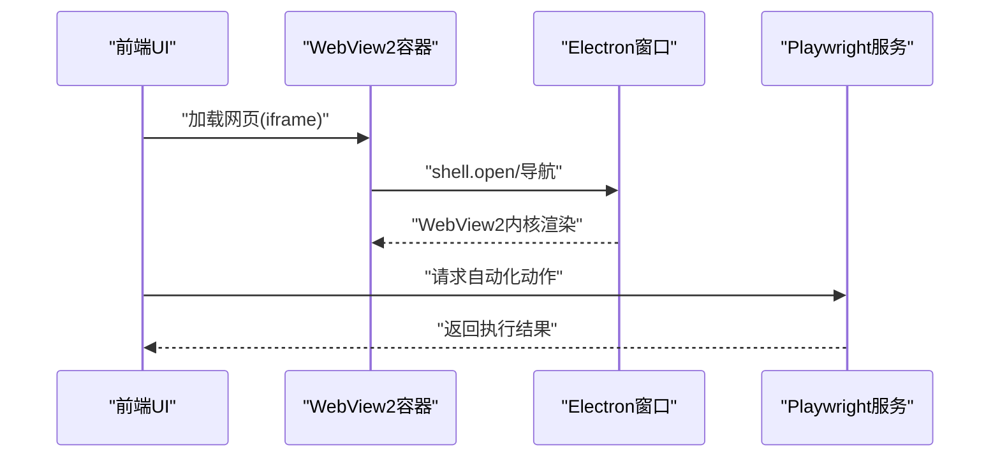
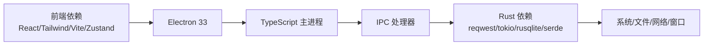

# 技术栈

<cite>
**本文引用的文件**
- [package.json](file://package.json)
- [src-web/package.json](file://src-web/package.json)
- [electron.vite.config.ts](file://electron.vite.config.ts)
- [electron/main.ts](file://electron/main.ts)
- [electron/preload.ts](file://electron/preload.ts)
- [electron/window-manager.ts](file://electron/window-manager.ts)
- [electron/ipc-handlers.ts](file://electron/ipc-handlers.ts)
- [src-web/src/lib/electronBridge.ts](file://src-web/src/lib/electronBridge.ts)
- [src-web/src/lib/tauri.ts](file://src-web/src/lib/tauri.ts)
- [src-web/src/stores/conversationStore.ts](file://src-web/src/stores/conversationStore.ts)
- [src-web/vite.config.ts](file://src-web/vite.config.ts)
- [src-web/tailwind.config.js](file://src-web/tailwind.config.js)
- [Cargo.toml](file://Cargo.toml)
- [rust-toolchain.toml](file://rust-toolchain.toml)
- [playwright-service/package.json](file://playwright-service/package.json)
</cite>

## 更新摘要
**所做更改**
- 将技术栈从 Tauri 替换为 Electron，删除所有 Tauri 相关依赖和配置
- 更新桌面应用架构：从 Tauri 2.x + Rust + WebView2 替换为 Electron 33 + TypeScript + Vite 6
- 更新 IPC 通信机制：从 Tauri invoke/listen/emit 替换为 Electron IPC
- 更新窗口管理：从 Tauri 窗口配置替换为 Electron BrowserWindow + WebContentsView
- 更新浏览器集成：保持 WebView2 内核但通过 Electron 实现
- 更新 AI 集成：保持多模型支持但通过 Electron IPC 实现

## 目录
1. [引言](#引言)
2. [项目结构](#项目结构)
3. [核心组件](#核心组件)
4. [架构总览](#架构总览)
5. [详细组件分析](#详细组件分析)
6. [依赖关系分析](#依赖关系分析)
7. [性能考量](#性能考量)
8. [故障排查指南](#故障排查指南)
9. [结论](#结论)
10. [附录](#附录)

## 引言
本文件系统化梳理 CoSurf 的技术栈与架构设计，覆盖前端（React 18、TypeScript、Vite 6、Tailwind CSS、Zustand）、桌面应用（Electron 33、TypeScript、Vite 6）、原生能力（Rust 1.88、SQLite rusqlite）、AI 集成（OpenAI/Anthropic/Gemini 多模型适配）、浏览器集成（WebView2 内核与 Playwright 可选自动化服务）。文档同时给出版本兼容性、性能对比与学习曲线评估，并总结技术选型的权衡与未来演进方向。

## 项目结构
CoSurf 采用多包工作区组织，前端位于 src-web，桌面应用与原生能力由 Electron/Rust 提供，AI 与数据库逻辑集中在 native 子工程，Playwright 可选自动化服务独立于主应用。

**图表来源**
- [src-web/package.json:1-44](file://src-web/package.json#L1-L44)
- [src-web/vite.config.ts:1-36](file://src-web/vite.config.ts#L1-L36)
- [src-web/tailwind.config.js:1-95](file://src-web/tailwind.config.js#L1-L95)
- [src-web/src/stores/conversationStore.ts:1-365](file://src-web/src/stores/conversationStore.ts#L1-L365)
- [electron.vite.config.ts:1-74](file://electron.vite.config.ts#L1-L74)
- [electron/main.ts:1-232](file://electron/main.ts#L1-L232)
- [electron/preload.ts:1-232](file://electron/preload.ts#L1-L232)
- [electron/window-manager.ts:1-249](file://electron/window-manager.ts#L1-L249)
- [electron/ipc-handlers.ts:1-739](file://electron/ipc-handlers.ts#L1-L739)
- [Cargo.toml:1-29](file://Cargo.toml#L1-L29)
- [rust-toolchain.toml:1-4](file://rust-toolchain.toml#L1-L4)
- [playwright-service/package.json:1-24](file://playwright-service/package.json#L1-L24)

**章节来源**
- [package.json:1-45](file://package.json#L1-L45)
- [src-web/package.json:1-44](file://src-web/package.json#L1-L44)
- [electron.vite.config.ts:1-74](file://electron.vite.config.ts#L1-L74)
- [Cargo.toml:1-29](file://Cargo.toml#L1-L29)
- [playwright-service/package.json:1-24](file://playwright-service/package.json#L1-L24)

## 核心组件
- 前端框架与构建
  - React 18：组件化 UI，配合 Zustand 管理轻量状态。
  - TypeScript：强类型保障开发体验与可维护性。
  - Vite 6：快速开发与高效打包，目标浏览器为 Chrome 120。
  - Tailwind CSS：原子化样式与主题变量，支持深色模式与动画。
  - Zustand：极简状态管理，避免样板代码。
- 桌面应用与原生
  - Electron 33：跨平台桌面应用框架，TypeScript 主进程 + Web 前端。
  - TypeScript：强类型保障主进程开发体验。
  - Vite 6：前端构建工具，与 Electron 开发服务器集成。
  - Rust 1.88：稳定工具链，启用格式化与 Clippy。
  - SQLite（rusqlite）：嵌入式数据库，支持"捆绑"特性，便于分发。
- AI 集成
  - 多模型适配：OpenAI、Anthropic、Gemini 等，统一请求/响应数据结构与流式传输。
  - 流式对话：前端增量渲染，后端事件驱动持久化。
- 浏览器集成
  - WebView2 内核：通过 Electron 配置启用，支持最小化安全策略与附加启动参数。
  - Playwright 可选自动化服务：独立进程，提供网页自动化能力。

**章节来源**
- [src-web/package.json:14-26](file://src-web/package.json#L14-L26)
- [src-web/vite.config.ts:31-34](file://src-web/vite.config.ts#L31-L34)
- [src-web/tailwind.config.js:8-94](file://src-web/tailwind.config.js#L8-L94)
- [electron/main.ts:32-91](file://electron/main.ts#L32-L91)
- [electron/preload.ts:13-28](file://electron/preload.ts#L13-L28)
- [Cargo.toml:13-28](file://Cargo.toml#L13-L28)
- [src-web/src/lib/electronBridge.ts:13-100](file://src-web/src/lib/electronBridge.ts#L13-L100)

## 架构总览
CoSurf 采用"前端 Web + 桌面壳（Electron）+ 原生能力（Rust）"三层架构。前端负责交互与状态，Electron 提供窗口、系统与插件能力，Rust 负责 AI 推理、数据库与工具执行等高性能任务；可选 Playwright 服务提供网页自动化能力。

**图表来源**
- [src-web/package.json:14-26](file://src-web/package.json#L14-L26)
- [electron/main.ts:13-25](file://electron/main.ts#L13-L25)
- [Cargo.toml:41-46](file://Cargo.toml#L41-L46)
- [src-web/src/lib/electronBridge.ts:32-46](file://src-web/src/lib/electronBridge.ts#L32-L46)
- [playwright-service/package.json:14-22](file://playwright-service/package.json#L14-L22)

## 详细组件分析

### 前端技术栈：React 18 + TypeScript + Vite 6 + Tailwind CSS + Zustand
- React 18
  - 组件化 UI，结合 Zustand 进行会话与消息状态管理。
  - 会话发送流程：本地预写消息 → 持久化占位 → 观察流事件 → 增量渲染 → 完成标记。
- TypeScript
  - 在 store、API、事件类型上提供类型约束，降低运行时风险。
- Vite 6
  - 开发服务器端口与热更新配置，构建目标 Chrome 120，使用 esbuild 最小化。
- Tailwind CSS
  - 主题变量与暗色模式，动画与关键帧，确保一致的视觉语言。
- Zustand
  - 会话状态集中管理，包含加载、发送、停止、标题自动生成等逻辑。

**图表来源**
- [src-web/src/stores/conversationStore.ts:103-243](file://src-web/src/stores/conversationStore.ts#L103-L243)
- [src-web/src/stores/conversationStore.ts:254-304](file://src-web/src/stores/conversationStore.ts#L254-L304)

**章节来源**
- [src-web/src/stores/conversationStore.ts:1-365](file://src-web/src/stores/conversationStore.ts#L1-L365)
- [src-web/vite.config.ts:14-34](file://src-web/vite.config.ts#L14-L34)
- [src-web/tailwind.config.js:8-94](file://src-web/tailwind.config.js#L8-L94)

### 桌面应用技术栈：Electron 33 + TypeScript + Vite 6
- Electron 33
  - 应用入口由 TypeScript 主进程启动，配置包含窗口尺寸、CSP、WebView 安装模式等。
  - 构建阶段联动前端打包与共享包编译。
- TypeScript
  - 主进程、预加载脚本、窗口管理器均使用 TypeScript，提供类型安全保障。
- Vite 6
  - 与 Electron 开发服务器集成，支持热重载和快速开发。

**图表来源**
- [electron/main.ts:178-208](file://electron/main.ts#L178-L208)
- [electron/main.ts:32-91](file://electron/main.ts#L32-L91)
- [electron/main.ts:94-113](file://electron/main.ts#L94-L113)

**章节来源**
- [electron/main.ts:1-232](file://electron/main.ts#L1-L232)
- [electron/vite.config.ts:14-74](file://electron.vite.config.ts#L14-L74)
- [electron/preload.ts:1-232](file://electron/preload.ts#L1-L232)
- [electron/window-manager.ts:1-249](file://electron/window-manager.ts#L1-L249)
- [electron/ipc-handlers.ts:1-739](file://electron/ipc-handlers.ts#L1-L739)

### IPC 通信机制：Electron IPC 替代 Tauri
- Electron IPC
  - 主进程通过 ipcMain.handle 注册处理器，渲染进程通过 ipcRenderer.invoke 调用。
  - 预加载脚本通过 contextBridge 暴露安全 API 给前端 React 应用。
  - 支持白名单机制，确保只有授权通道可以通信。
- 通信桥接层
  - src-web/src/lib/electronBridge.ts 提供统一 API 接口，替代 @tauri-apps/api。
  - 支持 invoke、on、send、once、removeAllListeners 等方法。
  - 向后兼容 listen/emit 别名。

**图表来源**
- [electron/preload.ts:178-224](file://electron/preload.ts#L178-L224)
- [electron/ipc-handlers.ts:230-314](file://electron/ipc-handlers.ts#L230-L314)
- [src-web/src/lib/electronBridge.ts:32-46](file://src-web/src/lib/electronBridge.ts#L32-L46)

**章节来源**
- [electron/preload.ts:30-138](file://electron/preload.ts#L30-L138)
- [electron/ipc-handlers.ts:48-538](file://electron/ipc-handlers.ts#L48-L538)
- [src-web/src/lib/electronBridge.ts:13-100](file://src-web/src/lib/electronBridge.ts#L13-L100)
- [src-web/src/lib/tauri.ts:1-20](file://src-web/src/lib/tauri.ts#L1-L20)

### 窗口管理：Electron WebContentsView 替代 Tauri iframe
- 多标签页管理
  - 使用 Electron 的 WebContentsView 实现真正的多标签页浏览。
  - 每个标签页拥有独立的渲染进程，不受 X-Frame-Options / CSP 限制。
  - 支持弹出窗口拦截，将 target="_blank" 链接转为 CoSurf 内部新标签页。
- 窗口控制
  - 支持最小化、最大化、关闭、窗口状态查询。
  - 自定义协议注册（cosurf://），支持 fetch API 和 CORS。
- 网络拦截
  - 移除所有 CSP 和 X-Frame-Options 响应头，确保网页正常加载。

**图表来源**
- [electron/window-manager.ts:83-106](file://electron/window-manager.ts#L83-L106)
- [electron/window-manager.ts:113-132](file://electron/window-manager.ts#L113-L132)
- [electron/window-manager.ts:137-157](file://electron/window-manager.ts#L137-L157)

**章节来源**
- [electron/window-manager.ts:14-249](file://electron/window-manager.ts#L14-L249)
- [electron/main.ts:32-91](file://electron/main.ts#L32-L91)
- [electron/main.ts:115-144](file://electron/main.ts#L115-L144)

### AI 集成：多模型支持与流式架构
- 数据模型
  - ChatMessage/ChatRequest/ChatResponse：统一聊天消息与请求/响应结构。
  - StreamDelta/ToolCallDelta：支持内容增量与工具调用增量。
- 适配策略
  - 通过 ModelConfig 动态切换提供商与 API 地址，自动拼接 endpoint 与设置请求头。
  - Anthropic 特殊头部与工具 Beta 标识，其他提供商使用通用 Bearer Token。
- 流式传输
  - 前端监听 ai:stream-chunk 事件，按片段增量渲染；错误事件 ai:stream-error 用于降级展示。
  - 后端将片段直接持久化，前端仅负责 UI 更新与完成标记。

**图表来源**
- [src-web/src/stores/conversationStore.ts:172-242](file://src-web/src/stores/conversationStore.ts#L172-L242)

**章节来源**
- [src-web/src/stores/conversationStore.ts:103-243](file://src-web/src/stores/conversationStore.ts#L103-L243)
- [src-web/src/stores/conversationStore.ts:254-304](file://src-web/src/stores/conversationStore.ts#L254-L304)

### 浏览器集成：WebView2 内核与 Playwright 可选自动化
- WebView2 内核
  - Electron 配置启用 WebView2 并设置附加启动参数，修复 shell.open 权限问题；前端通过 iframe 容器承载网页。
- Playwright 可选自动化服务
  - 独立服务进程，提供 Fastify 服务器与 Playwright 控制器，用于网页自动化场景（如示例技能）。

**图表来源**
- [electron/main.ts:80-88](file://electron/main.ts#L80-L88)
- [playwright-service/package.json:14-22](file://playwright-service/package.json#L14-L22)

**章节来源**
- [electron/main.ts:32-91](file://electron/main.ts#L32-L91)
- [playwright-service/package.json:1-24](file://playwright-service/package.json#L1-L24)

## 依赖关系分析
- 前端依赖
  - React 生态、Zustand、Tailwind CSS、Vite 插件与 TypeScript。
  - 与 Electron IPC 桥接层协作，暴露系统能力。
- 桌面与原生
  - Electron 33 依赖各插件（shell、dialog、fs、global-shortcut、http、notification、window-state、updater）。
  - TypeScript 主进程、预加载脚本、窗口管理器。
  - Rust 侧依赖 reqwest、futures、tokio、rusqlite、regex、serde 等。
- 工作区与工具链
  - 工作区统一版本与特性，Rust 工具链锁定 1.88。

**图表来源**
- [src-web/package.json:14-26](file://src-web/package.json#L14-L26)
- [electron/vite.config.ts:14-74](file://electron.vite.config.ts#L14-L74)
- [electron/main.ts:13-25](file://electron/main.ts#L13-L25)
- [Cargo.toml:13-21](file://Cargo.toml#L13-L21)

**章节来源**
- [src-web/package.json:14-26](file://src-web/package.json#L14-L26)
- [electron/vite.config.ts:14-74](file://electron.vite.config.ts#L14-L74)
- [Cargo.toml:13-21](file://Cargo.toml#L13-L21)

## 性能考量
- 构建与运行
  - Vite 6 目标 Chrome 120，esbuild 最小化，减少打包体积与冷启动时间。
  - Electron 33 通过 CSP 限制与 WebView 安装模式提升安全性与稳定性。
- 数据与网络
  - SQLite 嵌入式存储，rusqlite "捆绑"特性减少外部依赖；流式 AI 响应降低内存峰值。
- 并发与异步
  - Rust 使用 tokio 全功能运行时，配合 futures 管理并发任务；前端使用 Zustand 降低状态同步开销。
- 可选自动化
  - Playwright 服务独立进程，避免阻塞主应用 UI。

**章节来源**
- [src-web/vite.config.ts:31-34](file://src-web/vite.config.ts#L31-L34)
- [electron/main.ts:58-76](file://electron/main.ts#L58-L76)
- [Cargo.toml:41-46](file://Cargo.toml#L41-L46)

## 故障排查指南
- 构建与开发
  - Node/PNPM 版本要求：Node >= 20，PNPM >= 9；工具链 Rust 1.88。
  - Vite 端口冲突：确认 1420/1421 未被占用；检查 HMR host 配置。
- Electron 配置
  - WebView 安装模式与附加启动参数需与目标系统兼容；CSP 严格模式下注意资源加载。
- IPC 通信
  - 若未收到流式片段，检查事件监听与模型配置；确认 API Key 与 base_url 正确。
  - 工具调用错误：前端监听 ai:stream-error，显示错误信息并结束流。
- 数据库
  - SQLite 初始化失败：检查 rusqlite "捆绑"特性与安装路径；确认权限与目录存在。

**章节来源**
- [package.json:39-42](file://package.json#L39-L42)
- [src-web/vite.config.ts:14-28](file://src-web/vite.config.ts#L14-L28)
- [electron/main.ts:58-76](file://electron/main.ts#L58-L76)
- [src-web/src/lib/electronBridge.ts:32-46](file://src-web/src/lib/electronBridge.ts#L32-L46)
- [Cargo.toml:41-46](file://Cargo.toml#L41-L46)

## 结论
CoSurf 的技术栈围绕"现代前端 + 桌面壳 + 原生高性能"展开：前端以 React 18 + TypeScript + Vite 6 + Tailwind CSS + Zustand 组合提供流畅体验；桌面应用以 Electron 33 + TypeScript + Vite 6 提供安全、可控与高性能的原生能力；原生层以 Rust 1.88 + SQLite(rusqlite) 提供底层支持；AI 集成通过多模型适配与流式传输实现低延迟与高可用；浏览器集成采用 WebView2 内核并辅以可选 Playwright 服务满足复杂自动化需求。整体选型兼顾易用性、性能与可维护性，适合构建下一代 AI 驱动的桌面阅读与思考工具。

## 附录
- 版本兼容性
  - Node >= 20，PNPM >= 9；Rust 1.88；Chrome 120（Vite 目标）。
- 学习曲线评估
  - 前端：React/TypeScript/Vite/Tailwind/Zustand 均为主流技术，社区成熟；流式状态管理与事件驱动为新增要点。
  - 桌面应用：Electron 33 + TypeScript 对新手较陡峭，建议从官方示例与 CLI 入手；IPC 通信机制为新增要点。
  - 原生能力：Rust 1.88 + SQLite 与 rusqlite 文档完善。
  - AI 集成：多模型适配与流式传输为关键点，建议先实现单一模型再扩展。
- 未来演进方向
  - 前端：探索 React Server Components 与更细粒度的状态分区；Tailwind 进一步主题化与组件库沉淀。
  - 桌面应用：引入更多 Electron 插件与能力边界扩展；优化窗口管理和 IPC 性能。
  - 原生能力：引入更多 Rust 生态工具与能力边界扩展；优化数据库索引与查询计划。
  - AI：标准化工具调用协议，增强工具注册与权限控制；探索本地模型与混合推理。
  - 浏览器与自动化：WebView2 行为一致性测试；Playwright 服务可观测性与错误恢复。