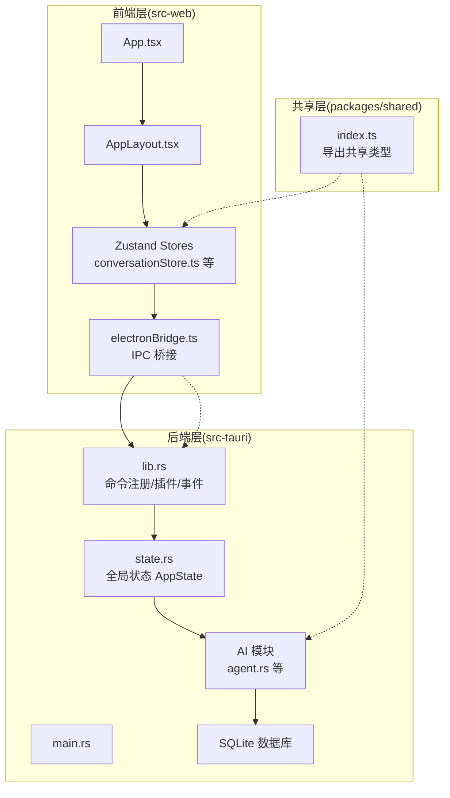
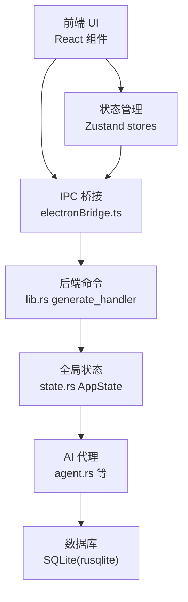
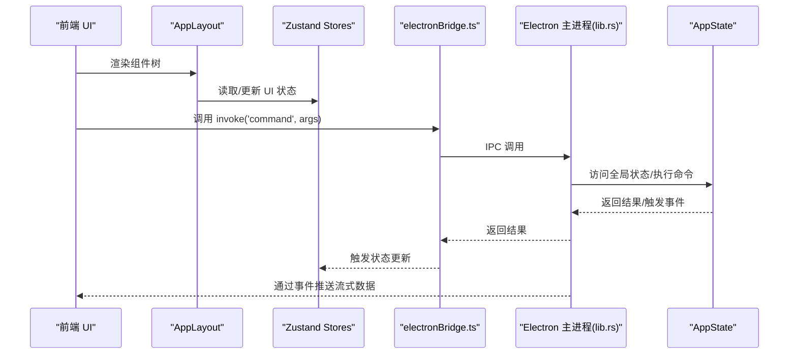
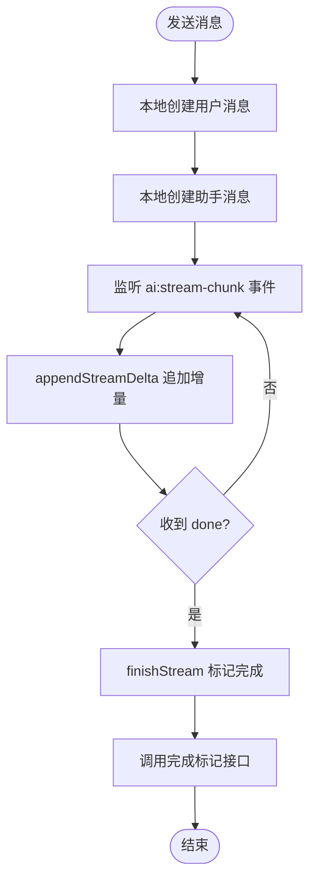
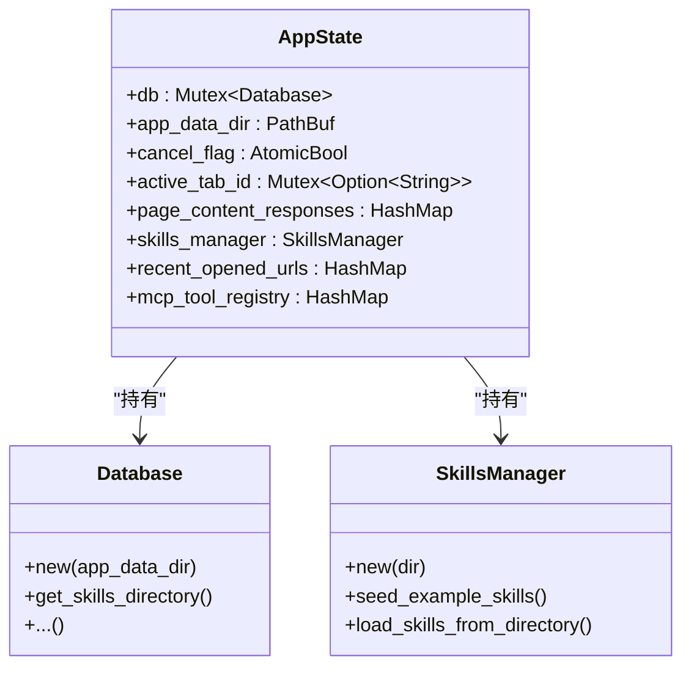
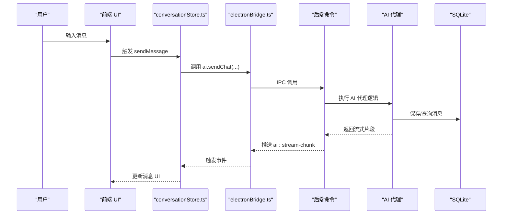
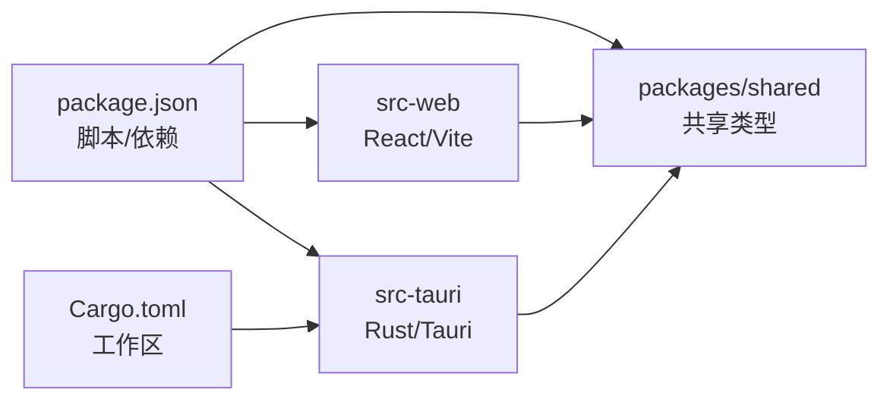

# 整体架构

<cite>
**本文引用的文件**
- [README.md](file://README.md)
- [src-tauri/src/main.rs](file://src-tauri/src/main.rs)
- [src-tauri/tauri.conf.json](file://src-tauri/tauri.conf.json)
- [src-tauri/src/lib.rs](file://src-tauri/src/lib.rs)
- [src-tauri/src/state.rs](file://src-tauri/src/state.rs)
- [src-web/src/App.tsx](file://src-web/src/App.tsx)
- [src-web/src/components/layout/AppLayout.tsx](file://src-web/src/components/layout/AppLayout.tsx)
- [src-web/src/lib/tauri.ts](file://src-web/src/lib/tauri.ts)
- [src-web/src/lib/electronBridge.ts](file://src-web/src/lib/electronBridge.ts)
- [src-web/src/stores/conversationStore.ts](file://src-web/src/stores/conversationStore.ts)
- [packages/shared/src/index.ts](file://packages/shared/src/index.ts)
- [Cargo.toml](file://Cargo.toml)
- [package.json](file://package.json)
</cite>

## 目录
1. [引言](#引言)
2. [项目结构](#项目结构)
3. [核心组件](#核心组件)
4. [架构总览](#架构总览)
5. [详细组件分析](#详细组件分析)
6. [依赖分析](#依赖分析)
7. [性能考量](#性能考量)
8. [故障排查指南](#故障排查指南)
9. [结论](#结论)
10. [附录](#附录)

## 引言
本架构文档面向 CoSurf 项目，系统性阐述“前端-应用-数据”三层分离的设计理念与实现方式，重点说明前端 React 应用与后端 Electron 应用的协作模式，覆盖组件树结构、状态管理模式、事件驱动机制；并从用户界面到 AI 代理再到数据库的完整数据流，解释架构决策的技术考量，包括为何采用 Electron 而非传统 Tauri，以及该架构带来的性能与安全优势。

## 项目结构
CoSurf 采用多包工作区组织，核心分为三部分：
- 前端 React 应用：src-web，负责 UI 呈现、状态管理与用户交互
- 后端 Electron 应用：src-tauri，负责系统命令、AI 代理、数据库与浏览器自动化
- 共享类型定义：packages/shared，提供跨包类型一致性

图表来源
- [src-web/src/App.tsx:1-8](file://src-web/src/App.tsx#L1-L8)
- [src-web/src/components/layout/AppLayout.tsx:1-209](file://src-web/src/components/layout/AppLayout.tsx#L1-L209)
- [src-web/src/stores/conversationStore.ts:1-365](file://src-web/src/stores/conversationStore.ts#L1-L365)
- [src-web/src/lib/electronBridge.ts:1-100](file://src-web/src/lib/electronBridge.ts#L1-L100)
- [src-tauri/src/main.rs:1-6](file://src-tauri/src/main.rs#L1-L6)
- [src-tauri/src/lib.rs:108-214](file://src-tauri/src/lib.rs#L108-L214)
- [src-tauri/src/state.rs:1-77](file://src-tauri/src/state.rs#L1-L77)
- [packages/shared/src/index.ts:1-9](file://packages/shared/src/index.ts#L1-L9)

章节来源
- [README.md:213-328](file://README.md#L213-L328)
- [package.json:14-30](file://package.json#L14-L30)
- [Cargo.toml:1-29](file://Cargo.toml#L1-L29)

## 核心组件
- 前端应用入口与布局
  - 应用入口：App.tsx 负责主题初始化与根组件挂载
  - 主布局：AppLayout.tsx 组织导航栏、标签栏、侧边栏、WebView2 容器、AI 面板等，并处理全局快捷键与事件监听
- 状态管理
  - Zustand stores：conversationStore.ts 管理对话与消息流式状态，其他 stores 管理标签、设置、下载、截图等
- 通信桥接
  - electronBridge.ts：封装 Electron IPC，提供 invoke/on/send 等统一接口，替代 Tauri API
  - tauri.ts：标记为废弃，当前不再使用 Tauri IPC
- 后端入口与命令
  - main.rs：应用入口，委托 cosurf_lib::run
  - lib.rs：注册插件、初始化数据库与全局状态，集中注册所有 Tauri 命令
  - state.rs：全局状态 AppState，持有数据库句柄、技能管理器、MCP 工具注册表等
- 共享类型
  - packages/shared：导出消息、会话、标签、书签、下载、模型、工具、设置等类型，保证前后端一致

章节来源
- [src-web/src/App.tsx:1-8](file://src-web/src/App.tsx#L1-L8)
- [src-web/src/components/layout/AppLayout.tsx:17-209](file://src-web/src/components/layout/AppLayout.tsx#L17-L209)
- [src-web/src/stores/conversationStore.ts:1-365](file://src-web/src/stores/conversationStore.ts#L1-L365)
- [src-web/src/lib/tauri.ts:1-20](file://src-web/src/lib/tauri.ts#L1-L20)
- [src-web/src/lib/electronBridge.ts:1-100](file://src-web/src/lib/electronBridge.ts#L1-L100)
- [src-tauri/src/main.rs:1-6](file://src-tauri/src/main.rs#L1-L6)
- [src-tauri/src/lib.rs:108-214](file://src-tauri/src/lib.rs#L108-L214)
- [src-tauri/src/state.rs:1-77](file://src-tauri/src/state.rs#L1-L77)
- [packages/shared/src/index.ts:1-9](file://packages/shared/src/index.ts#L1-L9)

## 架构总览
CoSurf 采用“前端-应用-数据”三层分离：
- 前端层：React/Vite + Zustand，负责 UI 呈现与用户交互
- 应用层：Electron 主进程 + Rust 后端（通过 IPC 暴露命令），负责业务逻辑、AI 代理、数据库与系统能力
- 数据层：SQLite（rusqlite）持久化，配合内存缓存与工具注册表

协作模式与通信协议：
- 前端通过 electronBridge.ts 与 Electron 主进程通信，主进程暴露命令与事件，实现“命令调用 + 事件推送”的双向通信
- 后端通过 Tauri 命令注册机制集中暴露能力，前端按需调用
- 共享类型通过 packages/shared 保证前后端一致

图表来源
- [src-web/src/lib/electronBridge.ts:32-76](file://src-web/src/lib/electronBridge.ts#L32-L76)
- [src-tauri/src/lib.rs:108-214](file://src-tauri/src/lib.rs#L108-L214)
- [src-tauri/src/state.rs:25-77](file://src-tauri/src/state.rs#L25-L77)

章节来源
- [src-tauri/tauri.conf.json:6-11](file://src-tauri/tauri.conf.json#L6-L11)
- [src-web/src/lib/electronBridge.ts:1-100](file://src-web/src/lib/electronBridge.ts#L1-L100)
- [src-tauri/src/lib.rs:108-214](file://src-tauri/src/lib.rs#L108-L214)

## 详细组件分析

### 前端-应用协作：组件树与事件驱动
- 组件树
  - App.tsx 作为根组件，初始化主题后渲染 AppLayout.tsx
  - AppLayout.tsx 组织导航栏、标签栏、侧边栏、WebView2 容器、AI 面板、设置页、工具箱面板与截图遮罩
  - 通过 Zustand stores 管理 UI 状态、对话状态、标签状态等
- 事件驱动
  - 全局快捷键：AppLayout.tsx 监听键盘事件，触发 UI 行为或创建对话
  - 事件监听：AppLayout.tsx 监听 webview:create-tab 等事件，协调标签页创建与后端响应
  - 流式事件：conversationStore.ts 监听 ai:stream-chunk/ai:stream-error 等事件，增量更新消息 UI

图表来源
- [src-web/src/components/layout/AppLayout.tsx:31-84](file://src-web/src/components/layout/AppLayout.tsx#L31-L84)
- [src-web/src/components/layout/AppLayout.tsx:118-150](file://src-web/src/components/layout/AppLayout.tsx#L118-L150)
- [src-web/src/stores/conversationStore.ts:173-243](file://src-web/src/stores/conversationStore.ts#L173-L243)
- [src-web/src/lib/electronBridge.ts:32-76](file://src-web/src/lib/electronBridge.ts#L32-L76)
- [src-tauri/src/lib.rs:108-214](file://src-tauri/src/lib.rs#L108-L214)

章节来源
- [src-web/src/App.tsx:1-8](file://src-web/src/App.tsx#L1-L8)
- [src-web/src/components/layout/AppLayout.tsx:17-209](file://src-web/src/components/layout/AppLayout.tsx#L17-L209)
- [src-web/src/stores/conversationStore.ts:1-365](file://src-web/src/stores/conversationStore.ts#L1-L365)

### 状态管理模式：Zustand 与后端联动
- conversationStore.ts
  - 负责对话列表、消息列表、流式状态与标题生成
  - 通过 electronBridge.ts 调用后端命令，监听 ai:stream-chunk/ai:stream-error 事件，增量更新消息
  - 在消息完成时调用后端完成标记，确保持久化
- 其他 stores
  - tabStore、settingsStore、uiStore、downloadStore、screenshotStore 等分别管理标签、设置、UI、下载、截图状态

图表来源
- [src-web/src/stores/conversationStore.ts:103-243](file://src-web/src/stores/conversationStore.ts#L103-L243)
- [src-web/src/stores/conversationStore.ts:254-304](file://src-web/src/stores/conversationStore.ts#L254-L304)

章节来源
- [src-web/src/stores/conversationStore.ts:1-365](file://src-web/src/stores/conversationStore.ts#L1-L365)

### 后端命令与全局状态：AppState
- 全局状态 AppState
  - 持有数据库句柄、应用数据目录、取消标志、活动标签 ID、页面内容响应缓存、技能管理器、最近打开 URL 记录、MCP 工具注册表
  - 在应用启动时初始化数据库与技能目录，加载示例技能并同步到用户目录
- 命令注册
  - lib.rs 中集中注册对话、消息、书签、设置、AI、浏览器、页面上下文、截图、Skills 等命令
  - 通过 generate_handler 暴露给前端调用

图表来源
- [src-tauri/src/state.rs:9-77](file://src-tauri/src/state.rs#L9-L77)

章节来源
- [src-tauri/src/state.rs:1-77](file://src-tauri/src/state.rs#L1-L77)
- [src-tauri/src/lib.rs:108-214](file://src-tauri/src/lib.rs#L108-L214)

### 数据流：从 UI 到 AI 代理再到数据库
- 用户输入 → 前端 Zustand → Electron IPC → 后端命令 → AI 代理 → 数据库
- 流式输出：后端通过事件向前端推送增量内容，前端即时渲染

图表来源
- [src-web/src/stores/conversationStore.ts:103-243](file://src-web/src/stores/conversationStore.ts#L103-L243)
- [src-web/src/lib/electronBridge.ts:32-76](file://src-web/src/lib/electronBridge.ts#L32-L76)
- [src-tauri/src/lib.rs:108-214](file://src-tauri/src/lib.rs#L108-L214)

章节来源
- [src-web/src/stores/conversationStore.ts:1-365](file://src-web/src/stores/conversationStore.ts#L1-L365)

### 架构决策：为何选择 Electron 而非传统 Tauri
- 当前实现现状
  - 前端通信桥接 electronBridge.ts 明确替代 Tauri API，前端已迁移至 Electron IPC
  - tauri.ts 标记为废弃，不再使用 Tauri invoke/listen
- 技术考量
  - Electron 更契合现有前端生态与开发流程，便于与 WebView2、系统能力集成
  - 通过 tauri.conf.json 的 build.devUrl 与 dev/build 前置命令，仍可与 Tauri 开发体验协同
  - 若未来需要，可在 Electron 之上叠加 Tauri 能力，或在不同构建目标间切换

章节来源
- [src-web/src/lib/tauri.ts:1-20](file://src-web/src/lib/tauri.ts#L1-L20)
- [src-web/src/lib/electronBridge.ts:1-100](file://src-web/src/lib/electronBridge.ts#L1-L100)
- [src-tauri/tauri.conf.json:6-11](file://src-tauri/tauri.conf.json#L6-L11)

## 依赖分析
- 工作区与包管理
  - package.json 定义了开发脚本与依赖，支持 Electron/Vite 开发与构建
  - Cargo.toml 定义工作区成员（src-tauri、native），统一版本与特性
- 前后端依赖
  - 前端通过 electronBridge.ts 与 Electron 主进程通信
  - 后端通过 Tauri 插件与命令系统暴露能力，共享类型通过 packages/shared 提供

图表来源
- [package.json:14-30](file://package.json#L14-L30)
- [Cargo.toml:1-29](file://Cargo.toml#L1-L29)
- [packages/shared/src/index.ts:1-9](file://packages/shared/src/index.ts#L1-L9)

章节来源
- [package.json:14-30](file://package.json#L14-L30)
- [Cargo.toml:1-29](file://Cargo.toml#L1-L29)

## 性能考量
- 前端性能
  - 使用 Zustand 管理局部状态，减少不必要的重渲染
  - 流式事件增量更新，避免全量刷新
- 后端性能
  - Tauri 插件与命令集中注册，降低 IPC 成本
  - AppState 缓存页面内容与工具注册表，减少重复计算
- 构建优化
  - Cargo release 配置启用 LTO、优化级别与符号剥离，减小体积与提升运行时性能

章节来源
- [src-tauri/src/lib.rs:41-107](file://src-tauri/src/lib.rs#L41-L107)
- [Cargo.toml:23-29](file://Cargo.toml#L23-L29)

## 故障排查指南
- 常见问题定位
  - 前端：通过控制台搜索 ConversationStore/AIPanel 日志，定位流式输出与渲染问题
  - 后端：设置 RUST_LOG=debug，搜索 Agent Loop、工具执行、MCP 通信日志
  - 数据库：使用 DB Browser for SQLite 查看 rusqlite 数据
- 端口与 WebView2
  - 端口冲突：修改 Vite 开发端口
  - WebView2：确保系统已安装最新 WebView2 Runtime

章节来源
- [README.md:534-556](file://README.md#L534-L556)

## 结论
CoSurf 采用“前端-应用-数据”三层分离架构，前端 React 应用通过 Electron IPC 与后端 Rust 应用协作，结合 Zustand 状态管理与事件驱动机制，实现了从 UI 到 AI 代理再到数据库的完整数据流。当前实现已迁移至 Electron，具备良好的开发与构建体验；若未来需要，可在现有基础上扩展 Tauri 能力。该架构兼顾性能与安全性，适合桌面端 AI 阅读与思考场景。

## 附录
- 技术栈概览
  - 前端：React 18 + TypeScript + Vite 6 + Zustand 5
  - 后端：Rust 1.88 + Tauri 2.x（当前以 Electron 为主，保留 Tauri 配置）
  - 数据库：SQLite（rusqlite）
  - 浏览器内核：WebView2（Windows）

章节来源
- [README.md:102-116](file://README.md#L102-L116)