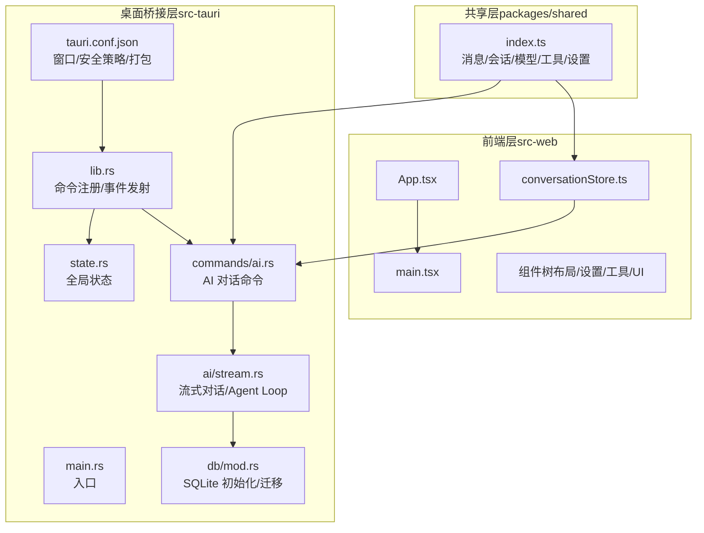
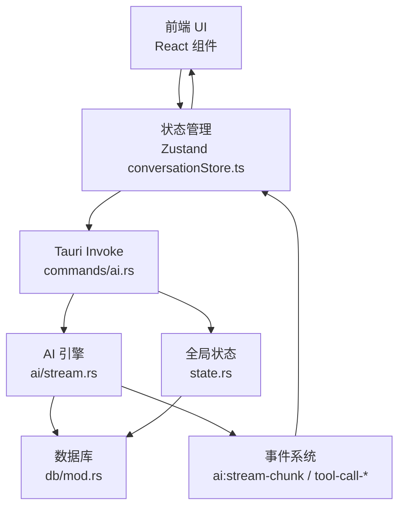
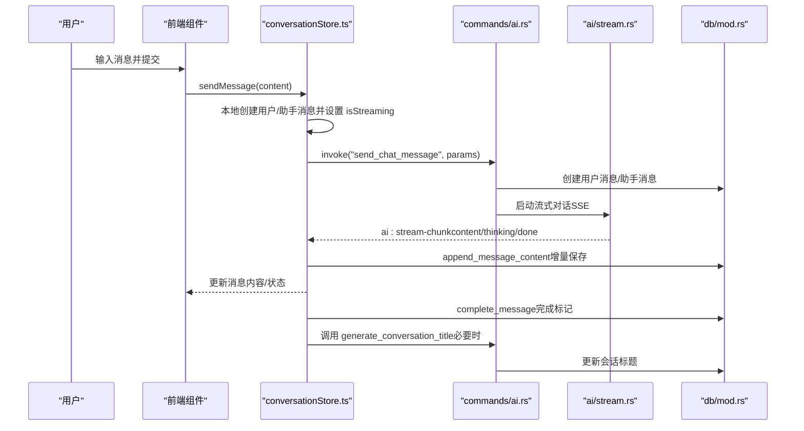
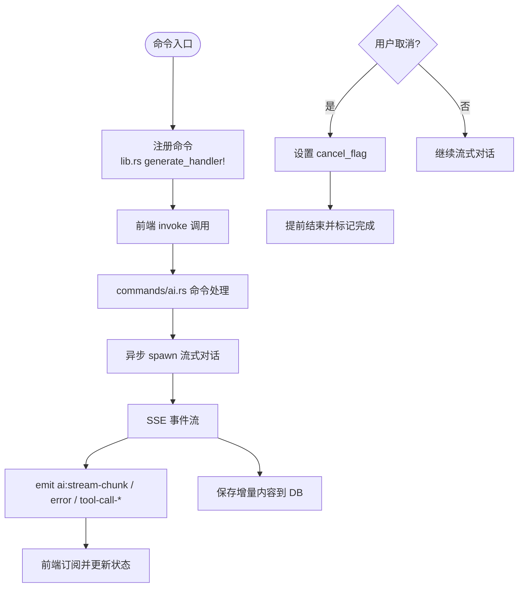
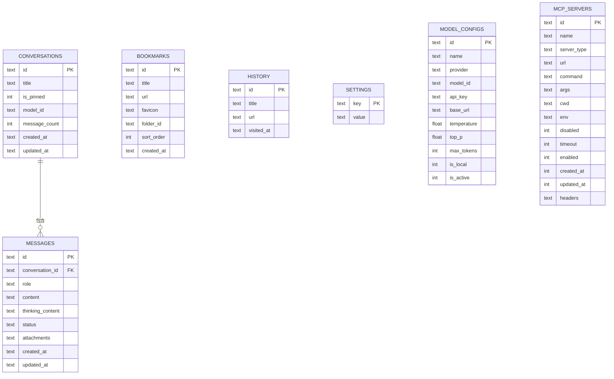
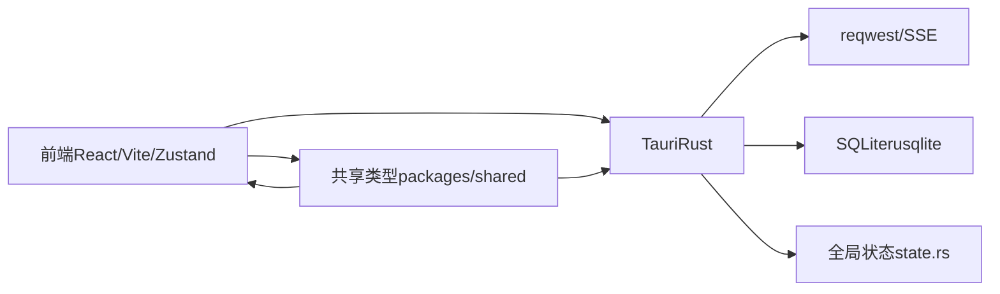
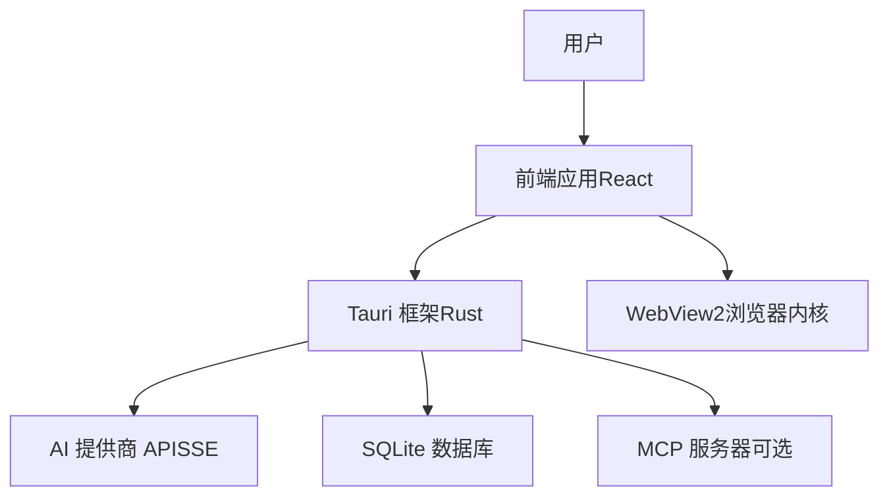

# 架构设计

<cite>
**本文引用的文件**
- [README.md](file://README.md)
- [Cargo.toml](file://Cargo.toml)
- [package.json](file://package.json)
- [src-tauri/tauri.conf.json](file://src-tauri/tauri.conf.json)
- [src-tauri/src/lib.rs](file://src-tauri/src/lib.rs)
- [src-tauri/src/main.rs](file://src-tauri/src/main.rs)
- [src-tauri/src/commands/ai.rs](file://src-tauri/src/commands/ai.rs)
- [src-tauri/src/ai/stream.rs](file://src-tauri/src/ai/stream.rs)
- [src-tauri/src/db/mod.rs](file://src-tauri/src/db/mod.rs)
- [src-tauri/src/state.rs](file://src-tauri/src/state.rs)
- [src-web/src/App.tsx](file://src-web/src/App.tsx)
- [src-web/src/main.tsx](file://src-web/src/main.tsx)
- [src-web/src/stores/conversationStore.ts](file://src-web/src/stores/conversationStore.ts)
- [packages/shared/src/index.ts](file://packages/shared/src/index.ts)
</cite>

## 目录
1. [引言](#引言)
2. [项目结构](#项目结构)
3. [核心组件](#核心组件)
4. [架构总览](#架构总览)
5. [详细组件分析](#详细组件分析)
6. [依赖分析](#依赖分析)
7. [性能考虑](#性能考虑)
8. [故障排查指南](#故障排查指南)
9. [结论](#结论)
10. [附录](#附录)

## 引言
CoSurf 是一款面向桌面端的 AI 原生阅读助手，采用前端-应用-数据三层分离的架构设计。其目标是在用户浏览网页的同时，提供 AI 驱动的深度理解、记忆与决策支持，将阅读行为转化为可沉淀的个人知识资产。系统通过 Tauri 框架承载 Rust 后端与 WebView2 前端，结合 SQLite 数据持久化与流式 AI 对话，形成稳定、高效、可扩展的桌面应用。

## 项目结构
项目采用多包工作区组织，核心分为三部分：
- 前端（React + TypeScript + Vite）：src-web
- 桌面桥接与后端（Tauri + Rust）：src-tauri
- 共享类型定义：packages/shared
- 可选自动化服务：playwright-service
- 示例与脚本：examples、scripts

**图表来源**
- [src-web/src/App.tsx:1-8](file://src-web/src/App.tsx#L1-L8)
- [src-web/src/main.tsx:1-52](file://src-web/src/main.tsx#L1-L52)
- [src-web/src/stores/conversationStore.ts:1-365](file://src-web/src/stores/conversationStore.ts#L1-L365)
- [src-tauri/src/lib.rs:108-217](file://src-tauri/src/lib.rs#L108-L217)
- [src-tauri/src/main.rs:1-6](file://src-tauri/src/main.rs#L1-L6)
- [src-tauri/src/commands/ai.rs:1-397](file://src-tauri/src/commands/ai.rs#L1-L397)
- [src-tauri/src/ai/stream.rs:1-778](file://src-tauri/src/ai/stream.rs#L1-L778)
- [src-tauri/src/db/mod.rs:1-272](file://src-tauri/src/db/mod.rs#L1-L272)
- [src-tauri/src/state.rs:1-77](file://src-tauri/src/state.rs#L1-L77)
- [src-tauri/tauri.conf.json:1-72](file://src-tauri/tauri.conf.json#L1-L72)
- [packages/shared/src/index.ts:1-9](file://packages/shared/src/index.ts#L1-L9)

**章节来源**
- [README.md: 213-328:213-328](file://README.md#L213-L328)
- [src-tauri/tauri.conf.json: 1-L72:1-72](file://src-tauri/tauri.conf.json#L1-L72)
- [src-tauri/src/lib.rs: 108-L217:108-217](file://src-tauri/src/lib.rs#L108-L217)

## 核心组件
- 前端应用与状态管理
  - 应用入口与主题：App.tsx、main.tsx
  - 对话状态管理：Zustand conversationStore.ts，负责消息流式拼接、思考内容渲染、工具调用事件监听与标题自动生成
- 桌面桥接与命令层
  - Tauri 入口与插件：lib.rs 注册命令、事件与插件；main.rs 启动入口
  - AI 对话命令：commands/ai.rs 提供发送消息、停止生成、流式片段追加与完成、生成会话标题
  - 流式对话与 Agent Loop：ai/stream.rs 实现 SSE 流式接收、工具调用解析与并行执行、重复调用检测与强制终止、思考内容与正式内容的区分
- 数据层
  - SQLite 初始化与迁移：db/mod.rs 创建表、索引与列迁移（含 thinking_content、feedback 等）
  - 全局状态：state.rs 管理数据库句柄、取消标志、活动标签、页面内容缓存、Skills 管理器、MCP 工具注册表等
- 共享类型
  - packages/shared 提供消息、会话、模型、工具、设置等类型，前后端共享

**章节来源**
- [src-web/src/App.tsx: 1-L8:1-8](file://src-web/src/App.tsx#L1-L8)
- [src-web/src/main.tsx: 1-L52:1-52](file://src-web/src/main.tsx#L1-L52)
- [src-web/src/stores/conversationStore.ts: 1-L365:1-365](file://src-web/src/stores/conversationStore.ts#L1-L365)
- [src-tauri/src/lib.rs: 108-L217:108-217](file://src-tauri/src/lib.rs#L108-L217)
- [src-tauri/src/commands/ai.rs: 1-L397:1-397](file://src-tauri/src/commands/ai.rs#L1-L397)
- [src-tauri/src/ai/stream.rs: 1-L778:1-778](file://src-tauri/src/ai/stream.rs#L1-L778)
- [src-tauri/src/db/mod.rs: 1-L272:1-272](file://src-tauri/src/db/mod.rs#L1-L272)
- [src-tauri/src/state.rs: 1-L77:1-77](file://src-tauri/src/state.rs#L1-L77)
- [packages/shared/src/index.ts: 1-L9:1-9](file://packages/shared/src/index.ts#L1-L9)

## 架构总览
CoSurf 采用三层分离与事件驱动的架构模式：
- 前端层：React + Zustand，负责 UI 呈现、用户交互、事件监听与状态更新
- 应用层（Tauri/Rust）：命令处理器与 AI 引擎，负责业务编排、工具调度、事件发射与持久化
- 数据层：SQLite（rusqlite），负责会话、消息、书签、历史、设置等数据的持久化与迁移

**图表来源**
- [src-web/src/stores/conversationStore.ts: 1-L365:1-365](file://src-web/src/stores/conversationStore.ts#L1-L365)
- [src-tauri/src/commands/ai.rs: 1-L397:1-397](file://src-tauri/src/commands/ai.rs#L1-L397)
- [src-tauri/src/ai/stream.rs: 1-L778:1-778](file://src-tauri/src/ai/stream.rs#L1-L778)
- [src-tauri/src/db/mod.rs: 1-L272:1-272](file://src-tauri/src/db/mod.rs#L1-L272)
- [src-tauri/src/state.rs: 1-L77:1-77](file://src-tauri/src/state.rs#L1-L77)

## 详细组件分析

### 前端组件树与状态管理模式
- 组件树
  - App.tsx 作为根组件，挂载 AppLayout，再由布局组件组合 TabBar、NavigationBar、Sidebar、WebContentView、AIPanel、SettingsPage 等
  - UI 组件库包含 IconButton、Tooltip、ScreenshotOverlay、ScreenshotSelector 等基础 UI
- 状态管理
  - conversationStore.ts 使用 Zustand 管理会话列表、消息列表、流式状态、加载状态
  - 流式处理：sendMessage 触发后，本地预创建用户与助手消息，随后通过 Tauri 调用 AI 命令，监听 ai:stream-chunk 事件增量更新内容；工具调用后重置状态为 streaming
  - 标题自动生成：当对话轮数达到阈值且标题为默认值时，调用 AI 生成标题并持久化

**图表来源**
- [src-web/src/stores/conversationStore.ts: 103-L243:103-243](file://src-web/src/stores/conversationStore.ts#L103-L243)
- [src-tauri/src/commands/ai.rs: 17-L274:17-274](file://src-tauri/src/commands/ai.rs#L17-L274)
- [src-tauri/src/ai/stream.rs: 301-L602:301-602](file://src-tauri/src/ai/stream.rs#L301-L602)
- [src-tauri/src/db/mod.rs: 54-L65:54-65](file://src-tauri/src/db/mod.rs#L54-L65)

**章节来源**
- [src-web/src/App.tsx: 1-L8:1-8](file://src-web/src/App.tsx#L1-L8)
- [src-web/src/main.tsx: 1-L52:1-52](file://src-web/src/main.tsx#L1-L52)
- [src-web/src/stores/conversationStore.ts: 1-L365:1-365](file://src-web/src/stores/conversationStore.ts#L1-L365)

### 后端命令处理器与事件发射
- 命令注册
  - lib.rs 在 setup 阶段初始化数据库、应用状态，并集中注册所有 Tauri 命令（对话、消息、书签、设置、AI、浏览器、页面上下文、截图、Skills 等）
- 事件发射
  - ai/stream.rs 在流式过程中通过 app.emit 发射 ai:stream-chunk、ai:stream-error、ai:tool-call-start、ai:tool-call-result 等事件，前端订阅并更新 UI
- 取消机制
  - state.rs 提供 cancel_flag，ai.rs 的 stop_generation 将标志置位，流式循环检测后提前结束并标记消息完成

**图表来源**
- [src-tauri/src/lib.rs: 108-L217:108-217](file://src-tauri/src/lib.rs#L108-L217)
- [src-tauri/src/commands/ai.rs: 11-L14:11-14](file://src-tauri/src/commands/ai.rs#L11-L14)
- [src-tauri/src/ai/stream.rs: 379-L570:379-570](file://src-tauri/src/ai/stream.rs#L379-L570)
- [src-tauri/src/db/mod.rs: 54-L65:54-65](file://src-tauri/src/db/mod.rs#L54-L65)

**章节来源**
- [src-tauri/src/lib.rs: 108-L217:108-217](file://src-tauri/src/lib.rs#L108-L217)
- [src-tauri/src/commands/ai.rs: 1-L397:1-397](file://src-tauri/src/commands/ai.rs#L1-L397)
- [src-tauri/src/ai/stream.rs: 1-L778:1-778](file://src-tauri/src/ai/stream.rs#L1-L778)

### 数据库层与迁移策略
- 初始化与迁移
  - db/mod.rs 在首次启动时创建数据库文件、启用 WAL、外键约束，并执行建表与列迁移（如 thinking_content、feedback、mcp_servers 新增列）
  - 迁移逻辑包含历史数据解析与字段分离，确保向后兼容
- 表结构要点
  - conversations、messages、bookmarks、history、settings、model_configs、mcp_servers 等
  - messages 表新增 thinking_content 字段，支持思考过程与正式回复分离展示
- 索引优化
  - 为 messages(conversation_id) 与 history(visited_at) 建立索引，提升查询性能

**图表来源**
- [src-tauri/src/db/mod.rs: 44-L132:44-132](file://src-tauri/src/db/mod.rs#L44-L132)

**章节来源**
- [src-tauri/src/db/mod.rs: 1-L272:1-272](file://src-tauri/src/db/mod.rs#L1-L272)

### 设计模式应用
- MVC 模式
  - View：React 组件树（AppLayout、AIPanel、Sidebar 等）
  - Controller：Zustand stores（conversationStore.ts）与 Tauri commands（commands/ai.rs）
  - Model：SQLite 表结构与 Rust 数据访问层（db/mod.rs）
- 事件驱动模式
  - 前后端通过 Tauri 事件通道通信（ai:stream-chunk、ai:stream-error、ai:tool-call-*），实现松耦合的数据流
- 流式处理模式
  - SSE 流式响应，前端增量渲染；思考内容与正式内容分离，支持“打字机”体验

**章节来源**
- [src-web/src/stores/conversationStore.ts: 1-L365:1-365](file://src-web/src/stores/conversationStore.ts#L1-L365)
- [src-tauri/src/commands/ai.rs: 1-L397:1-397](file://src-tauri/src/commands/ai.rs#L1-L397)
- [src-tauri/src/ai/stream.rs: 1-L778:1-778](file://src-tauri/src/ai/stream.rs#L1-L778)

## 依赖分析
- 技术栈与版本
  - 桌面框架：Tauri 2.x
  - 前端：React 18 + TypeScript + Vite 6
  - 状态管理：Zustand 5
  - 后端：Rust 1.88
  - 数据库：SQLite（rusqlite）
  - HTTP：reqwest + reqwest-eventsource
  - 浏览器内核：WebView2（Windows）
  - 可选自动化：Playwright（可选侧车服务）
  - MCP 客户端：原生 Rust 实现（JSON-RPC 2.0）
- 关键依赖关系
  - 前端通过 Tauri invoke 调用后端命令，命令处理后经事件发射到前端
  - AI 流式对话依赖 SSE 事件源，工具调用通过工具调度器并行执行
  - 数据持久化统一走 SQLite，消息表支持 thinking_content 与 feedback 字段

**图表来源**
- [src-tauri/Cargo.toml: 21-L70:21-70](file://src-tauri/Cargo.toml#L21-L70)
- [package.json: 14-L47:14-47](file://package.json#L14-L47)
- [src-tauri/tauri.conf.json: 6-L11:6-11](file://src-tauri/tauri.conf.json#L6-L11)

**章节来源**
- [README.md: 102-L116:102-116](file://README.md#L102-L116)
- [src-tauri/Cargo.toml: 1-L70:1-70](file://src-tauri/Cargo.toml#L1-L70)
- [package.json: 1-L48:1-48](file://package.json#L1-L48)
- [src-tauri/tauri.conf.json: 1-L72:1-72](file://src-tauri/tauri.conf.json#L1-L72)

## 性能考虑
- 流式渲染与增量保存
  - SSE 流式接收，前端增量更新，后端逐块保存至数据库，降低一次性内存压力
- 并行工具执行
  - Agent Loop 对工具调用进行并行执行，缩短端到端响应时间
- 数据库优化
  - WAL 模式、外键约束、索引（messages.conversation_id、history.visited_at）提升读写性能
- 资源隔离与取消
  - cancel_flag 与 AtomicBool 实现快速取消，避免资源泄漏
- 构建优化
  - Cargo release profile 启用 LTO、代码压缩与符号剥离，减小二进制体积

**章节来源**
- [src-tauri/src/ai/stream.rs: 180-L221:180-221](file://src-tauri/src/ai/stream.rs#L180-L221)
- [src-tauri/src/db/mod.rs: 24-L26:24-26](file://src-tauri/src/db/mod.rs#L24-L26)
- [Cargo.toml: 23-L29:23-29](file://Cargo.toml#L23-L29)

## 故障排查指南
- 前端常见问题
  - 流式输出日志：控制台搜索 “[ConversationStore]”
  - AIPanel 渲染日志：搜索 “[AIPanel]”
  - 端口冲突：修改 Vite 端口（默认 1420）
- 后端常见问题
  - 日志级别：设置 RUST_LOG=debug 查看详细日志
  - Agent Loop 日志：搜索 “Agent Loop iteration”
  - 工具执行日志：搜索 “Found X tool calls”
  - MCP 通信日志：搜索 “MCP tool call response”
  - 数据库：使用 DB Browser for SQLite 查看数据
- 配置与网络
  - 确认模型配置与 API Key 正确
  - 确认 WebView2 Runtime 最新
  - 确认 MCP Server 连接参数正确

**章节来源**
- [README.md: 534-L556:534-556](file://README.md#L534-L556)

## 结论
CoSurf 通过前端-应用-数据三层分离与事件驱动的架构，实现了高性能、可扩展的 AI 阅读助手。Tauri + Rust 提供安全可靠的桌面桥接，React + Zustand 实现灵活的 UI 与状态管理，SQLite 保障数据持久化与迁移兼容。流式对话与 Agent Loop 使 AI 能够自主完成复杂任务，结合工具调度与 MCP 集成，满足多样化的扩展需求。

## 附录
- 系统上下文图（概念性）

- 部署拓扑说明（概念性）
  - 开发模式：前端 Vite 服务（http://localhost:1420）+ Tauri 后端热重载
  - 生产模式：Tauri 打包为 MSI/NSIS 安装包，内置 WebView2 Runtime，应用数据目录存放 cosurf.db