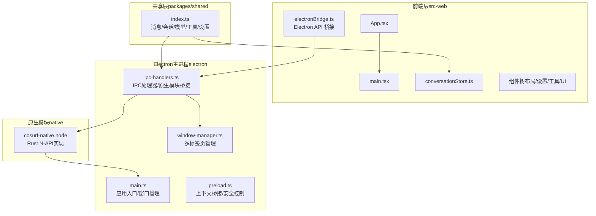
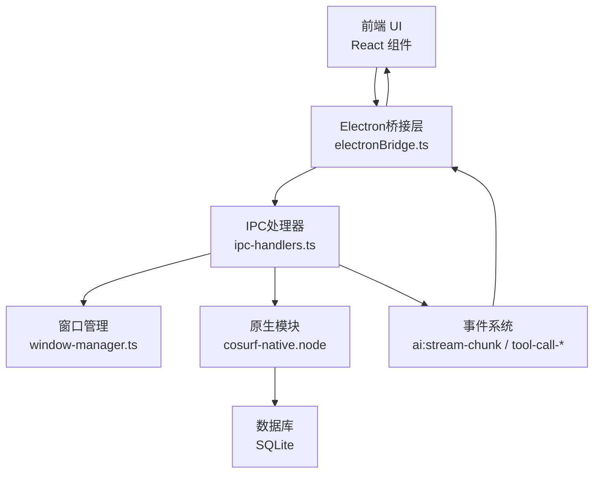
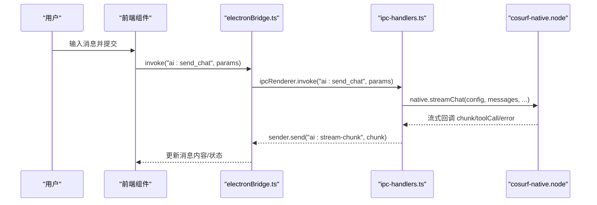
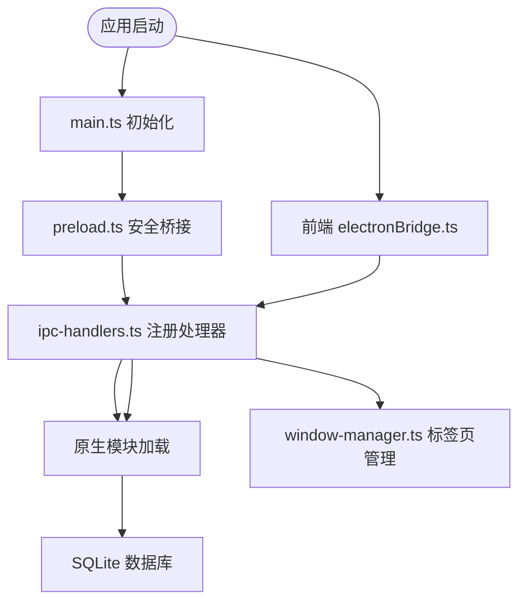
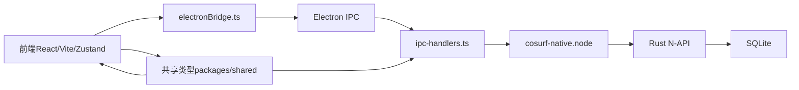
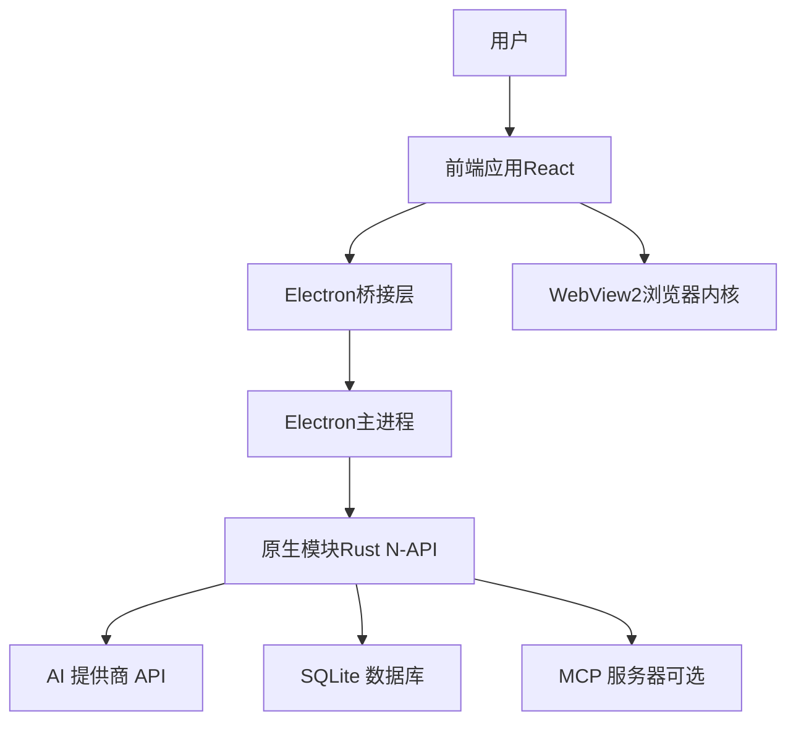

# 架构设计

<cite>
**本文引用的文件**
- [README.md](file://README.md)
- [Cargo.toml](file://Cargo.toml)
- [package.json](file://package.json)
- [electron/main.ts](file://electron/main.ts)
- [electron/preload.ts](file://electron/preload.ts)
- [electron/ipc-handlers.ts](file://electron/ipc-handlers.ts)
- [electron/window-manager.ts](file://electron/window-manager.ts)
- [src-web/src/lib/electronBridge.ts](file://src-web/src/lib/electronBridge.ts)
- [src-web/src/lib/tauri.ts](file://src-web/src/lib/tauri.ts)
- [src-web/src/App.tsx](file://src-web/src/App.tsx)
- [src-web/src/main.tsx](file://src-web/src/main.tsx)
- [src-web/src/stores/conversationStore.ts](file://src-web/src/stores/conversationStore.ts)
- [packages/shared/src/index.ts](file://packages/shared/src/index.ts)
</cite>

## 更新摘要
**所做更改**
- 完全替换 Tauri 架构为 Electron 架构
- 删除所有 Tauri 相关组件和配置
- 新增 Electron 主进程、渲染进程、IPC 通信机制
- 更新前端桥接层以适配 Electron API
- 重构系统边界和组件交互关系
- 更新技术栈选择说明和架构图表

## 目录
1. [引言](#引言)
2. [项目结构](#项目结构)
3. [核心组件](#核心组件)
4. [架构总览](#架构总览)
5. [详细组件分析](#详细组件分析)
6. [依赖分析](#依赖分析)
7. [性能考虑](#性能考虑)
8. [故障排查指南](#故障排查指南)
9. [结论](#结论)
10. [附录](#附录)

## 引言
CoSurf 是一款面向桌面端的 AI 原生阅读助手，采用前端-应用-数据三层分离的架构设计。系统通过 Electron 框架承载 Rust 后端与 WebView2 前端，结合 SQLite 数据持久化与流式 AI 对话，形成稳定、高效、可扩展的桌面应用。该架构相比之前的 Tauri 实现，在多标签页管理、原生模块集成和系统级功能方面具有显著优势。

## 项目结构
项目采用多包工作区组织，核心分为四部分：
- 前端（React + TypeScript + Vite）：src-web
- Electron 主进程：electron/main.ts
- IPC 处理器：electron/ipc-handlers.ts
- 共享类型定义：packages/shared
- 原生模块：native（Rust N-API 实现）
- 可选自动化服务：playwright-service
- 示例与脚本：examples、scripts

**图表来源**
- [src-web/src/App.tsx:1-8](file://src-web/src/App.tsx#L1-L8)
- [src-web/src/main.tsx:1-52](file://src-web/src/main.tsx#L1-L52)
- [src-web/src/stores/conversationStore.ts:1-365](file://src-web/src/stores/conversationStore.ts#L1-L365)
- [electron/main.ts:1-232](file://electron/main.ts#L1-L232)
- [electron/preload.ts:1-232](file://electron/preload.ts#L1-L232)
- [electron/ipc-handlers.ts:1-739](file://electron/ipc-handlers.ts#L1-L739)
- [electron/window-manager.ts:1-249](file://electron/window-manager.ts#L1-L249)
- [packages/shared/src/index.ts:1-9](file://packages/shared/src/index.ts#L1-L9)

**章节来源**
- [README.md: 213-328:213-328](file://README.md#L213-L328)
- [electron/main.ts: 1-L232:1-232](file://electron/main.ts#L1-L232)
- [electron/preload.ts: 1-L232:1-232](file://electron/preload.ts#L1-L232)
- [electron/ipc-handlers.ts: 1-L739:1-739](file://electron/ipc-handlers.ts#L1-L739)
- [electron/window-manager.ts: 1-L249:1-249](file://electron/window-manager.ts#L1-L249)

## 核心组件
- 前端应用与状态管理
  - 应用入口与主题：App.tsx、main.tsx
  - 对话状态管理：Zustand conversationStore.ts，负责消息流式拼接、思考内容渲染、工具调用事件监听与标题自动生成
  - Electron 桥接层：electronBridge.ts 提供统一的 IPC API，替代 Tauri 的 invoke/listen/emit
- Electron 主进程与窗口管理
  - 主进程入口：main.ts 负责应用生命周期、窗口创建、原生模块初始化、网络拦截
  - 预加载脚本：preload.ts 提供安全的上下文桥接，实现白名单机制
  - IPC 处理器：ipc-handlers.ts 注册所有 IPC 通道，桥接前端与原生模块
  - 多标签页管理：window-manager.ts 实现真正的多标签页浏览，每个标签页独立渲染进程
- 原生模块与数据层
  - Rust N-API 实现：cosurf-native.node 提供数据库、AI 对话、截图、工具等核心功能
  - 数据持久化：SQLite（rusqlite）通过原生模块访问，支持会话、消息、书签、历史等数据
- 共享类型
  - packages/shared 提供消息、会话、模型、工具、设置等类型，前后端共享

**章节来源**
- [src-web/src/App.tsx: 1-L8:1-8](file://src-web/src/App.tsx#L1-L8)
- [src-web/src/main.tsx: 1-L52:1-52](file://src-web/src/main.tsx#L1-L52)
- [src-web/src/stores/conversationStore.ts: 1-L365:1-365](file://src-web/src/stores/conversationStore.ts#L1-L365)
- [src-web/src/lib/electronBridge.ts: 1-L100:1-100](file://src-web/src/lib/electronBridge.ts#L1-L100)
- [electron/main.ts: 1-L232:1-232](file://electron/main.ts#L1-L232)
- [electron/preload.ts: 1-L232:1-232](file://electron/preload.ts#L1-L232)
- [electron/ipc-handlers.ts: 1-L739:1-739](file://electron/ipc-handlers.ts#L1-L739)
- [electron/window-manager.ts: 1-L249:1-249](file://electron/window-manager.ts#L1-L249)
- [packages/shared/src/index.ts: 1-L9:1-9](file://packages/shared/src/index.ts#L1-L9)

## 架构总览
CoSurf 采用三层分离与事件驱动的架构模式：
- 前端层：React + Zustand，负责 UI 呈现、用户交互、事件监听与状态更新
- 应用层（Electron/Rust）：主进程负责窗口管理、IPC 处理、原生模块桥接；原生模块提供核心业务能力
- 数据层：SQLite（rusqlite）通过 Rust N-API 访问，负责会话、消息、书签、历史、设置等数据的持久化

**图表来源**
- [src-web/src/stores/conversationStore.ts: 1-L365:1-365](file://src-web/src/stores/conversationStore.ts#L1-L365)
- [src-web/src/lib/electronBridge.ts: 1-L100:1-100](file://src-web/src/lib/electronBridge.ts#L1-L100)
- [electron/ipc-handlers.ts: 1-L739:1-739](file://electron/ipc-handlers.ts#L1-L739)
- [electron/window-manager.ts: 1-L249:1-249](file://electron/window-manager.ts#L1-L249)
- [electron/main.ts: 1-L232:1-232](file://electron/main.ts#L1-L232)

## 详细组件分析

### 前端组件树与 Electron 桥接层
- 组件树
  - App.tsx 作为根组件，挂载 AppLayout，再由布局组件组合 TabBar、NavigationBar、Sidebar、WebContentView、AIPanel、SettingsPage 等
  - UI 组件库包含 IconButton、Tooltip、ScreenshotOverlay、ScreenshotSelector 等基础 UI
- Electron 桥接层
  - electronBridge.ts 提供统一的 API 接口：invoke（替代 Tauri invoke）、on/send（替代 Tauri listen/emit）
  - 支持参数转换：将 Tauri 风格的命名参数转换为 Electron IPC 的位置参数
  - 安全控制：通过 preload.ts 的白名单机制限制 IPC 通道访问
  - 向后兼容：提供 listen/emit 别名，保持 API 一致性

**图表来源**
- [src-web/src/stores/conversationStore.ts: 103-L243:103-243](file://src-web/src/stores/conversationStore.ts#L103-L243)
- [src-web/src/lib/electronBridge.ts: 33-L46:33-46](file://src-web/src/lib/electronBridge.ts#L33-L46)
- [electron/ipc-handlers.ts: 230-L314:230-314](file://electron/ipc-handlers.ts#L230-L314)
- [electron/preload.ts: 178-L223:178-223](file://electron/preload.ts#L178-L223)

**章节来源**
- [src-web/src/App.tsx: 1-L8:1-8](file://src-web/src/App.tsx#L1-L8)
- [src-web/src/main.tsx: 1-L52:1-52](file://src-web/src/main.tsx#L1-L52)
- [src-web/src/stores/conversationStore.ts: 1-L365:1-365](file://src-web/src/stores/conversationStore.ts#L1-L365)
- [src-web/src/lib/electronBridge.ts: 1-L100:1-100](file://src-web/src/lib/electronBridge.ts#L1-L100)

### Electron 主进程与 IPC 处理机制
- 主进程职责
  - 应用入口：main.ts 初始化原生模块、配置网络拦截、创建主窗口、注册全局快捷键
  - 窗口管理：支持无边框窗口、自定义协议、CSP/X-Frame-Options 移除
  - 生命周期：处理窗口关闭、激活、退出等事件
- IPC 处理器
  - 通道注册：ipc-handlers.ts 注册所有 IPC 通道，包括数据库操作、AI 对话、标签页管理、截图等
  - 原生模块桥接：将前端 IPC 调用转发到 Rust N-API 实现
  - 流式回调：支持 AI 对话的流式 chunk、工具调用回调、错误处理
  - 安全控制：通过白名单机制限制 IPC 通道访问
- 预加载脚本
  - 上下文桥接：通过 contextBridge 暴露安全的 API 给前端
  - 白名单控制：定义允许的 IPC 通道清单，防止恶意访问
  - 窗口控制：提供窗口最小化、最大化、关闭等控制 API

**图表来源**
- [electron/main.ts: 178-L208:178-208](file://electron/main.ts#L178-L208)
- [electron/preload.ts: 178-L223:178-223](file://electron/preload.ts#L178-L223)
- [electron/ipc-handlers.ts: 48-L524:48-524](file://electron/ipc-handlers.ts#L48-L524)
- [electron/window-manager.ts: 29-L106:29-106](file://electron/window-manager.ts#L29-L106)

**章节来源**
- [electron/main.ts: 1-L232:1-232](file://electron/main.ts#L1-L232)
- [electron/preload.ts: 1-L232:1-232](file://electron/preload.ts#L1-L232)
- [electron/ipc-handlers.ts: 1-L739:1-739](file://electron/ipc-handlers.ts#L1-L739)
- [electron/window-manager.ts: 1-L249:1-249](file://electron/window-manager.ts#L1-L249)

### 原生模块与数据库层
- 原生模块实现
  - Rust N-API：cosurf-native.node 通过 napi-rs 框架实现，提供数据库、AI 对话、截图、工具等核心功能
  - 方法映射：snake_case Rust 函数自动转换为 camelCase JavaScript 方法
  - 错误处理：统一的错误包装和异常处理机制
- 数据库层
  - SQLite 访问：通过原生模块访问，支持完整的 CRUD 操作
  - 表结构：conversations、messages、bookmarks、history、settings、model_configs、mcp_servers 等
  - 迁移策略：支持列添加、数据迁移、向后兼容
- AI 对话引擎
  - 流式处理：支持 SSE 风格的流式回调
  - 工具调用：支持并行工具执行和结果聚合
  - 取消机制：通过取消令牌实现快速中断

**章节来源**
- [electron/ipc-handlers.ts: 14-L35:14-35](file://electron/ipc-handlers.ts#L14-L35)
- [electron/ipc-handlers.ts: 191-L225:191-225](file://electron/ipc-handlers.ts#L191-L225)
- [electron/ipc-handlers.ts: 228-L331:228-331](file://electron/ipc-handlers.ts#L228-L331)

### 设计模式应用
- MVC 模式
  - View：React 组件树（AppLayout、AIPanel、Sidebar 等）
  - Controller：Zustand stores（conversationStore.ts）与 Electron IPC 处理器（ipc-handlers.ts）
  - Model：原生模块提供的数据访问层（cosurf-native.node）
- 事件驱动模式
  - 前后端通过 Electron IPC 通道通信（ai:stream-chunk、ai:tool-call-*），实现松耦合的数据流
  - 预加载脚本提供白名单机制，确保事件安全传输
- 流式处理模式
  - 原生模块的流式回调，前端增量渲染；思考内容与正式内容分离，支持"打字机"体验
- 多标签页模式
  - 每个标签页拥有独立的渲染进程，互不影响，突破 CSP/X-Frame-Options 限制

**章节来源**
- [src-web/src/stores/conversationStore.ts: 1-L365:1-365](file://src-web/src/stores/conversationStore.ts#L1-L365)
- [electron/ipc-handlers.ts: 1-L739:1-739](file://electron/ipc-handlers.ts#L1-L739)
- [electron/window-manager.ts: 1-L249:1-249](file://electron/window-manager.ts#L1-L249)

## 依赖分析
- 技术栈与版本
  - 桌面框架：Electron 33.0.0
  - 前端：React 18 + TypeScript + Vite 6
  - 状态管理：Zustand 5
  - 后端：Rust 1.88 + N-API
  - 数据库：SQLite（rusqlite）
  - IPC：Electron IPC + 预加载脚本白名单
  - 浏览器内核：WebView2（Windows）
  - 原生模块：Rust N-API（napi-rs）
  - 可选自动化：Playwright（可选侧车服务）
- 关键依赖关系
  - 前端通过 electronBridge.ts 调用 Electron IPC，IPC 处理器转发到原生模块
  - 原生模块通过 N-API 与 Rust 代码交互，提供数据库、AI、截图等功能
  - 多标签页管理器提供真正的独立渲染进程，突破 CSP 限制
  - 预加载脚本提供安全的上下文桥接，实现白名单机制

**图表来源**
- [package.json: 29-L42:29-42](file://package.json#L29-L42)
- [Cargo.toml: 13-L29:13-29](file://Cargo.toml#L13-L29)
- [electron/package.json: 1-L45:1-45](file://electron/package.json#L1-L45)

**章节来源**
- [README.md: 102-L116:102-116](file://README.md#L102-L116)
- [package.json: 1-L45:1-45](file://package.json#L1-L45)
- [Cargo.toml: 1-L29:1-29](file://Cargo.toml#L1-L29)

## 性能考虑
- 流式渲染与增量保存
  - 原生模块的流式回调，前端增量更新，原生模块逐块保存至数据库，降低一次性内存压力
- 并行工具执行
  - Agent Loop 对工具调用进行并行执行，缩短端到端响应时间
- 多标签页优化
  - 每个标签页独立渲染进程，避免相互影响，提升整体稳定性
- 原生模块性能
  - Rust N-API 提供接近原生的性能，减少 JavaScript 与原生代码间的转换开销
- 资源隔离与取消
  - 取消令牌与原子操作实现快速取消，避免资源泄漏
- 构建优化
  - Cargo release profile 启用 LTO、代码压缩与符号剥离，减小二进制体积

**章节来源**
- [electron/ipc-handlers.ts: 242-L314:242-314](file://electron/ipc-handlers.ts#L242-L314)
- [electron/window-manager.ts: 7-L12:7-12](file://electron/window-manager.ts#L7-L12)
- [Cargo.toml: 23-L29:23-29](file://Cargo.toml#L23-L29)

## 故障排查指南
- 前端常见问题
  - 流式输出日志：控制台搜索 "[ConversationStore]"
  - AIPanel 渲染日志：搜索 "[AIPanel]"
  - Electron API 可用性：检查 electronBridge.ts 的 isElectron() 检测
  - IPC 通道白名单：确认通道是否在 preload.ts 的白名单中
- Electron 主进程问题
  - 应用启动日志：搜索 "[CoSurf] Application Starting"
  - 原生模块初始化：检查 cosurf-native.node 是否正确加载
  - 网络拦截：确认 CSP/X-Frame-Options 移除是否生效
  - 窗口控制：验证窗口最小化、最大化功能
- 原生模块问题
  - 日志级别：设置 RUST_LOG=debug 查看详细日志
  - 方法可用性：检查原生方法是否正确导出（snake_case → camelCase 映射）
  - 数据库连接：确认 SQLite 文件路径和权限
- 配置与网络
  - 确认模型配置与 API Key 正确
  - 确认 WebView2 Runtime 最新
  - 确认 MCP Server 连接参数正确

**章节来源**
- [README.md: 534-L556:534-556](file://README.md#L534-L556)
- [electron/main.ts: 178-L208:178-208](file://electron/main.ts#L178-L208)
- [electron/preload.ts: 31-L138:31-138](file://electron/preload.ts#L31-L138)

## 结论
CoSurf 通过前端-应用-数据三层分离与事件驱动的架构，实现了高性能、可扩展的 AI 阅读助手。Electron + Rust 提供强大的桌面应用能力，React + Zustand 实现灵活的 UI 与状态管理，原生模块通过 N-API 桥接提供核心业务功能。多标签页管理突破 CSP 限制，流式对话与 Agent Loop 使 AI 能够自主完成复杂任务，结合工具调度与 MCP 集成，满足多样化的扩展需求。

## 附录
- 系统上下文图（概念性）

- 部署拓扑说明（概念性）
  - 开发模式：前端 Vite 服务（http://localhost:1420）+ Electron 主进程热重载
  - 生产模式：Electron 打包为安装包，内置 WebView2 Runtime，应用数据目录存放 cosurf.db
  - 原生模块：编译为 cosurf-native.node，通过 require 动态加载