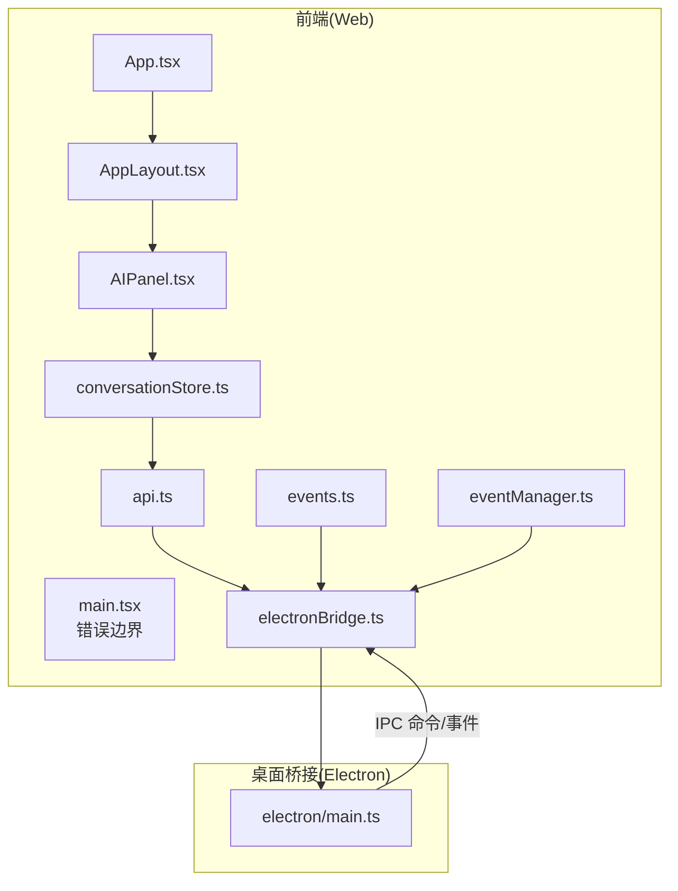
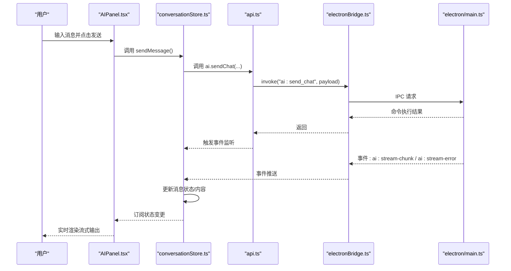
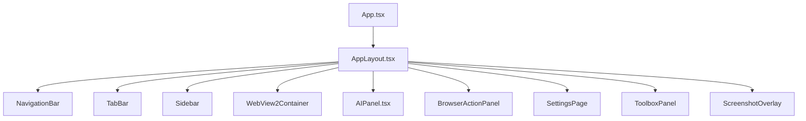
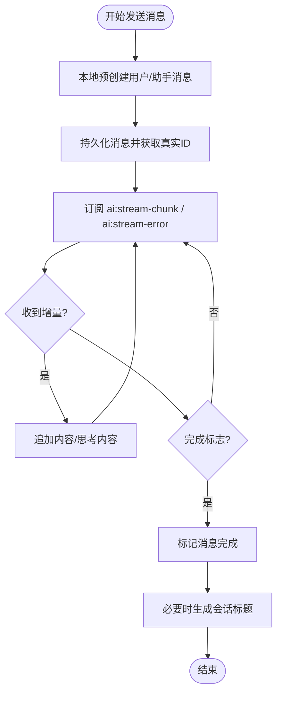
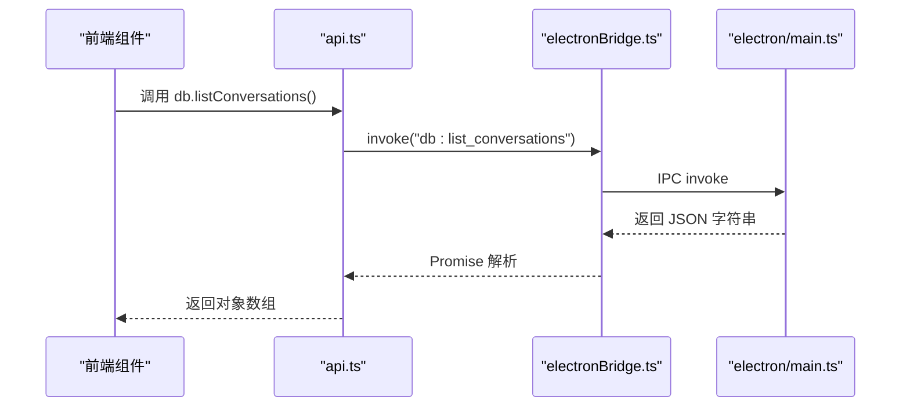
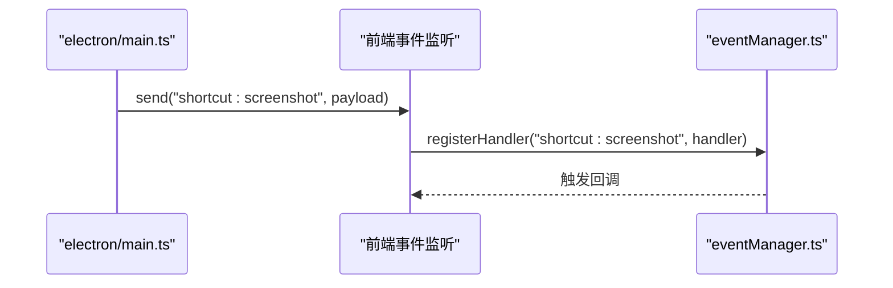
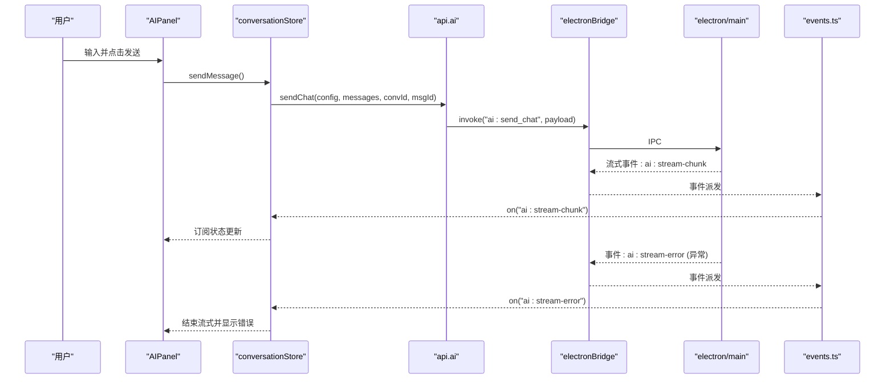
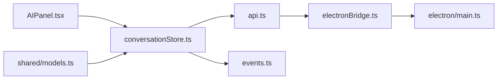

# 组件交互

<cite>
**本文引用的文件**
- [src-web/src/App.tsx](file://src-web/src/App.tsx)
- [src-web/src/main.tsx](file://src-web/src/main.tsx)
- [src-web/src/components/layout/AppLayout.tsx](file://src-web/src/components/layout/AppLayout.tsx)
- [src-web/src/components/layout/AIPanel.tsx](file://src-web/src/components/layout/AIPanel.tsx)
- [src-web/src/stores/conversationStore.ts](file://src-web/src/stores/conversationStore.ts)
- [src-web/src/lib/api.ts](file://src-web/src/lib/api.ts)
- [src-web/src/lib/events.ts](file://src-web/src/lib/events.ts)
- [src-web/src/lib/electronBridge.ts](file://src-web/src/lib/electronBridge.ts)
- [src-web/src/lib/eventManager.ts](file://src-web/src/lib/eventManager.ts)
- [packages/shared/src/conversation.ts](file://packages/shared/src/conversation.ts)
- [packages/shared/src/message.ts](file://packages/shared/src/message.ts)
- [src-tauri/src/lib.rs](file://src-tauri/src/lib.rs)
- [electron/main.ts](file://electron/main.ts)
</cite>

## 目录
1. [引言](#引言)
2. [项目结构](#项目结构)
3. [核心组件](#核心组件)
4. [架构总览](#架构总览)
5. [详细组件分析](#详细组件分析)
6. [依赖分析](#依赖分析)
7. [性能考虑](#性能考虑)
8. [故障排查指南](#故障排查指南)
9. [结论](#结论)
10. [附录](#附录)

## 引言
本文件面向 CoSurf 项目的前端与后端交互，聚焦以下目标：
- 前端组件树的层次结构与布局组件、功能组件、工具组件的协作方式
- 状态管理模式：Zustand store 的数据流与组件订阅机制
- IPC 通信机制：Tauri 原生 IPC 与 Electron IPC 的实现差异与使用场景
- 事件系统设计：前端事件总线与后端事件驱动的协调方式
- 数据流向：从用户输入到 AI 响应的完整链路，含错误处理与状态同步
- 提供交互时序图与数据流图，并给出可操作的调试方法

## 项目结构
CoSurf 采用“Web 前端 + 桌面桥接”的混合架构：
- 前端基于 React + TypeScript，使用 Zustand 管理状态，通过 Electron IPC 与主进程通信
- 后端主进程负责窗口、标签页、网络拦截、全局快捷键等系统级能力；同时通过 IPC 暴露命令接口
- Tauri 路径仍保留但已弃用，当前统一迁移至 Electron

图表来源
- [src-web/src/App.tsx:1-8](file://src-web/src/App.tsx#L1-L8)
- [src-web/src/main.tsx:1-52](file://src-web/src/main.tsx#L1-L52)
- [src-web/src/components/layout/AppLayout.tsx:1-209](file://src-web/src/components/layout/AppLayout.tsx#L1-L209)
- [src-web/src/components/layout/AIPanel.tsx:1-647](file://src-web/src/components/layout/AIPanel.tsx#L1-L647)
- [src-web/src/stores/conversationStore.ts:1-365](file://src-web/src/stores/conversationStore.ts#L1-L365)
- [src-web/src/lib/api.ts:1-429](file://src-web/src/lib/api.ts#L1-L429)
- [src-web/src/lib/events.ts:1-83](file://src-web/src/lib/events.ts#L1-L83)
- [src-web/src/lib/electronBridge.ts:1-100](file://src-web/src/lib/electronBridge.ts#L1-L100)
- [src-web/src/lib/eventManager.ts:1-108](file://src-web/src/lib/eventManager.ts#L1-L108)
- [electron/main.ts:1-172](file://electron/main.ts#L1-L172)

章节来源
- [src-web/src/App.tsx:1-8](file://src-web/src/App.tsx#L1-L8)
- [src-web/src/main.tsx:1-52](file://src-web/src/main.tsx#L1-L52)
- [src-web/src/components/layout/AppLayout.tsx:1-209](file://src-web/src/components/layout/AppLayout.tsx#L1-L209)
- [electron/main.ts:1-172](file://electron/main.ts#L1-L172)

## 核心组件
- 应用根节点与主题初始化：应用入口负责初始化主题并挂载顶层布局
- 错误边界：全局捕获前端渲染异常，提供重载按钮
- 布局容器：AppLayout 负责导航栏、标签栏、侧边栏、浏览器视图区、AI 面板、工具箱面板、截图覆盖层等布局与交互
- AI 面板：AIPanel 展示消息、模型选择、输入与发送/停止控制
- 状态管理：conversationStore 管理会话与消息流式状态，结合共享数据模型（Conversation/Message）

章节来源
- [src-web/src/App.tsx:1-8](file://src-web/src/App.tsx#L1-L8)
- [src-web/src/main.tsx:1-52](file://src-web/src/main.tsx#L1-L52)
- [src-web/src/components/layout/AppLayout.tsx:1-209](file://src-web/src/components/layout/AppLayout.tsx#L1-L209)
- [src-web/src/components/layout/AIPanel.tsx:1-647](file://src-web/src/components/layout/AIPanel.tsx#L1-L647)
- [src-web/src/stores/conversationStore.ts:1-365](file://src-web/src/stores/conversationStore.ts#L1-L365)
- [packages/shared/src/conversation.ts:1-14](file://packages/shared/src/conversation.ts#L1-L14)
- [packages/shared/src/message.ts:1-35](file://packages/shared/src/message.ts#L1-L35)

## 架构总览
前端通过 Electron IPC 与主进程通信，主进程负责系统级能力与命令分发。AI 对话采用流式事件推送，前端 Store 订阅事件并更新 UI。

图表来源
- [src-web/src/components/layout/AIPanel.tsx:67-74](file://src-web/src/components/layout/AIPanel.tsx#L67-L74)
- [src-web/src/stores/conversationStore.ts:103-243](file://src-web/src/stores/conversationStore.ts#L103-L243)
- [src-web/src/lib/api.ts:250-267](file://src-web/src/lib/api.ts#L250-L267)
- [src-web/src/lib/electronBridge.ts:33-46](file://src-web/src/lib/electronBridge.ts#L33-L46)
- [electron/main.ts:121-148](file://electron/main.ts#L121-L148)

## 详细组件分析

### 组件树与布局协作
- App.tsx 作为根组件，初始化主题后渲染 AppLayout
- AppLayout 负责全局快捷键、侧边栏宽度拖拽、标签页创建请求、模型与对话加载
- AIPanel 作为 AI 交互入口，承载消息列表、模型切换、输入与发送/停止
- 事件总线与桥接层统一了前端与主进程的通信

图表来源
- [src-web/src/App.tsx:1-8](file://src-web/src/App.tsx#L1-L8)
- [src-web/src/components/layout/AppLayout.tsx:17-209](file://src-web/src/components/layout/AppLayout.tsx#L17-L209)

章节来源
- [src-web/src/App.tsx:1-8](file://src-web/src/App.tsx#L1-L8)
- [src-web/src/components/layout/AppLayout.tsx:17-209](file://src-web/src/components/layout/AppLayout.tsx#L17-L209)

### 状态管理模式：Zustand Store
- conversationStore 负责会话列表、活动会话、消息集合、流式状态
- 发送消息流程：
  - 本地预创建用户与临时助手消息，立即渲染
  - 持久化消息并获取真实 ID
  - 订阅 ai:stream-chunk 与 ai:stream-error 事件，增量更新内容
  - 结束时标记消息完成并尝试自动生成标题
- 错误处理：捕获异常，追加错误提示，结束流式状态

图表来源
- [src-web/src/stores/conversationStore.ts:103-243](file://src-web/src/stores/conversationStore.ts#L103-L243)
- [src-web/src/lib/events.ts:15-35](file://src-web/src/lib/events.ts#L15-L35)

章节来源
- [src-web/src/stores/conversationStore.ts:1-365](file://src-web/src/stores/conversationStore.ts#L1-L365)
- [src-web/src/lib/events.ts:1-83](file://src-web/src/lib/events.ts#L1-L83)

### IPC 通信机制：Electron vs Tauri
- 当前统一采用 Electron IPC：
  - electronBridge.ts 提供 invoke/on/send 等 API，屏蔽主进程差异
  - api.ts 封装各模块命令（db/ai/tab/page/screenshot/skills/cache/dialog/shell/win）
  - events.ts 提供事件常量与 on/once/off 封装
- Tauri 路径已标记弃用，相关模块返回错误或警告
- 主进程 electron/main.ts 注册协议、窗口、标签页管理、全局快捷键与 IPC 处理器

图表来源
- [src-web/src/lib/api.ts:54-72](file://src-web/src/lib/api.ts#L54-L72)
- [src-web/src/lib/electronBridge.ts:33-46](file://src-web/src/lib/electronBridge.ts#L33-L46)
- [electron/main.ts:121-148](file://electron/main.ts#L121-L148)

章节来源
- [src-web/src/lib/electronBridge.ts:1-100](file://src-web/src/lib/electronBridge.ts#L1-L100)
- [src-web/src/lib/api.ts:1-429](file://src-web/src/lib/api.ts#L1-L429)
- [src-web/src/lib/tauri.ts:1-20](file://src-web/src/lib/tauri.ts#L1-L20)
- [electron/main.ts:1-172](file://electron/main.ts#L1-L172)

### 事件系统设计：前端事件总线与后端事件驱动
- 前端事件总线：
  - events.ts 定义事件常量与 on/once/off
  - eventManager.ts 提供请求-响应模式（带 requestId、超时、错误包装）
- 后端事件驱动：
  - electron/main.ts 注册全局快捷键，触发前端事件
  - 主进程通过 window.webContents.send 或自定义通道向前端推送事件
  - 示例：快捷键触发截图事件、AI 流式事件推送

图表来源
- [electron/main.ts:90-100](file://electron/main.ts#L90-L100)
- [src-web/src/lib/events.ts:51-66](file://src-web/src/lib/events.ts#L51-L66)
- [src-web/src/lib/eventManager.ts:87-93](file://src-web/src/lib/eventManager.ts#L87-L93)

章节来源
- [src-web/src/lib/events.ts:1-83](file://src-web/src/lib/events.ts#L1-L83)
- [src-web/src/lib/eventManager.ts:1-108](file://src-web/src/lib/eventManager.ts#L1-L108)
- [electron/main.ts:1-172](file://electron/main.ts#L1-L172)

### 数据流向：从用户输入到 AI 响应
- 用户在 AIPanel 输入消息，调用 conversationStore.sendMessage
- Store 本地预渲染后，通过 api.ai.sendChat 触发后端 AI 对话
- 后端流式事件通过 Electron IPC 推送至前端，Store 增量更新
- 完成后尝试自动生成会话标题并同步到数据库

图表来源
- [src-web/src/components/layout/AIPanel.tsx:67-74](file://src-web/src/components/layout/AIPanel.tsx#L67-L74)
- [src-web/src/stores/conversationStore.ts:103-243](file://src-web/src/stores/conversationStore.ts#L103-L243)
- [src-web/src/lib/api.ts:250-267](file://src-web/src/lib/api.ts#L250-L267)
- [src-web/src/lib/events.ts:15-35](file://src-web/src/lib/events.ts#L15-L35)
- [src-web/src/lib/electronBridge.ts:33-46](file://src-web/src/lib/electronBridge.ts#L33-L46)
- [electron/main.ts:121-148](file://electron/main.ts#L121-L148)

章节来源
- [src-web/src/components/layout/AIPanel.tsx:1-647](file://src-web/src/components/layout/AIPanel.tsx#L1-L647)
- [src-web/src/stores/conversationStore.ts:1-365](file://src-web/src/stores/conversationStore.ts#L1-L365)
- [src-web/src/lib/api.ts:1-429](file://src-web/src/lib/api.ts#L1-L429)
- [src-web/src/lib/events.ts:1-83](file://src-web/src/lib/events.ts#L1-L83)

## 依赖分析
- 组件耦合
  - AppLayout 依赖多个 Store 与事件系统，承担协调职责
  - AIPanel 依赖 conversationStore 与 settingsStore，负责 UI 与状态联动
  - conversationStore 依赖 api.ts 与 events.ts，形成“命令-事件”闭环
- 外部依赖
  - Electron 主进程提供系统能力与 IPC 通道
  - 共享类型模块（packages/shared）定义 Conversation/Message 等核心数据模型

图表来源
- [src-web/src/components/layout/AIPanel.tsx:22-40](file://src-web/src/components/layout/AIPanel.tsx#L22-L40)
- [src-web/src/stores/conversationStore.ts:1-25](file://src-web/src/stores/conversationStore.ts#L1-L25)
- [src-web/src/lib/api.ts:1-10](file://src-web/src/lib/api.ts#L1-L10)
- [src-web/src/lib/events.ts:14-35](file://src-web/src/lib/events.ts#L14-L35)
- [src-web/src/lib/electronBridge.ts:13-30](file://src-web/src/lib/electronBridge.ts#L13-L30)
- [packages/shared/src/conversation.ts:1-14](file://packages/shared/src/conversation.ts#L1-L14)
- [packages/shared/src/message.ts:1-35](file://packages/shared/src/message.ts#L1-L35)

章节来源
- [src-web/src/components/layout/AIPanel.tsx:1-647](file://src-web/src/components/layout/AIPanel.tsx#L1-L647)
- [src-web/src/stores/conversationStore.ts:1-365](file://src-web/src/stores/conversationStore.ts#L1-L365)
- [src-web/src/lib/api.ts:1-429](file://src-web/src/lib/api.ts#L1-L429)
- [src-web/src/lib/events.ts:1-83](file://src-web/src/lib/events.ts#L1-L83)
- [src-web/src/lib/electronBridge.ts:1-100](file://src-web/src/lib/electronBridge.ts#L1-L100)
- [packages/shared/src/conversation.ts:1-14](file://packages/shared/src/conversation.ts#L1-L14)
- [packages/shared/src/message.ts:1-35](file://packages/shared/src/message.ts#L1-L35)

## 性能考虑
- 流式渲染优化：前端按增量更新消息，避免整列表重渲染
- 事件去抖与去重：AppLayout 对重复标签页创建请求进行时间窗口去重
- 状态订阅粒度：AIPanel 订阅整个 conversationStore，确保消息与流式状态一致
- IPC 参数序列化：api.ts 统一封装 JSON 序列化/反序列化，减少错误

## 故障排查指南
- Electron API 不可用
  - 现象：调用 electronBridge.invoke 抛错或返回空
  - 排查：确认运行环境为 Electron；检查 preload 注入与 window.electronAPI 是否存在
- IPC 命令超时
  - 现象：api.ts 调用 Promise 超时
  - 排查：检查主进程是否正确注册对应 channel；查看主进程日志
- 流式事件未到达
  - 现象：ai:stream-chunk/ai:stream-error 未触发
  - 排查：确认 conversationStore 正确 on 监听；检查主进程事件发送逻辑
- 全局快捷键无效
  - 现象：Ctrl+Shift+X 无法触发截图
  - 排查：确认 electron/main.ts 已注册快捷键；macOS 权限与系统设置

调试方法
- 在 api.ts 与 electronBridge.ts 中打印 invoke/on/send 的调用栈
- 在 conversationStore.ts 中打印事件负载与状态变更
- 在 electron/main.ts 中打印 IPC 请求与事件发送

章节来源
- [src-web/src/lib/electronBridge.ts:33-46](file://src-web/src/lib/electronBridge.ts#L33-L46)
- [src-web/src/lib/api.ts:13-18](file://src-web/src/lib/api.ts#L13-L18)
- [src-web/src/stores/conversationStore.ts:172-242](file://src-web/src/stores/conversationStore.ts#L172-L242)
- [electron/main.ts:90-100](file://electron/main.ts#L90-L100)

## 结论
CoSurf 的前端采用 React + Zustand + Electron IPC 的组合，实现了清晰的组件分层与稳定的事件驱动数据流。通过统一的桥接层与事件管理器，前端能够可靠地与主进程协作，完成从用户输入到 AI 响应的完整链路。建议后续持续完善错误边界与事件超时处理，增强可观测性与可维护性。

## 附录
- 数据模型（共享）
  - 会话：包含 id、标题、是否置顶、模型 id、消息数、时间戳
  - 消息：包含角色、内容、思考内容、状态、附件、时间戳、反馈

章节来源
- [packages/shared/src/conversation.ts:1-14](file://packages/shared/src/conversation.ts#L1-L14)
- [packages/shared/src/message.ts:1-35](file://packages/shared/src/message.ts#L1-L35)