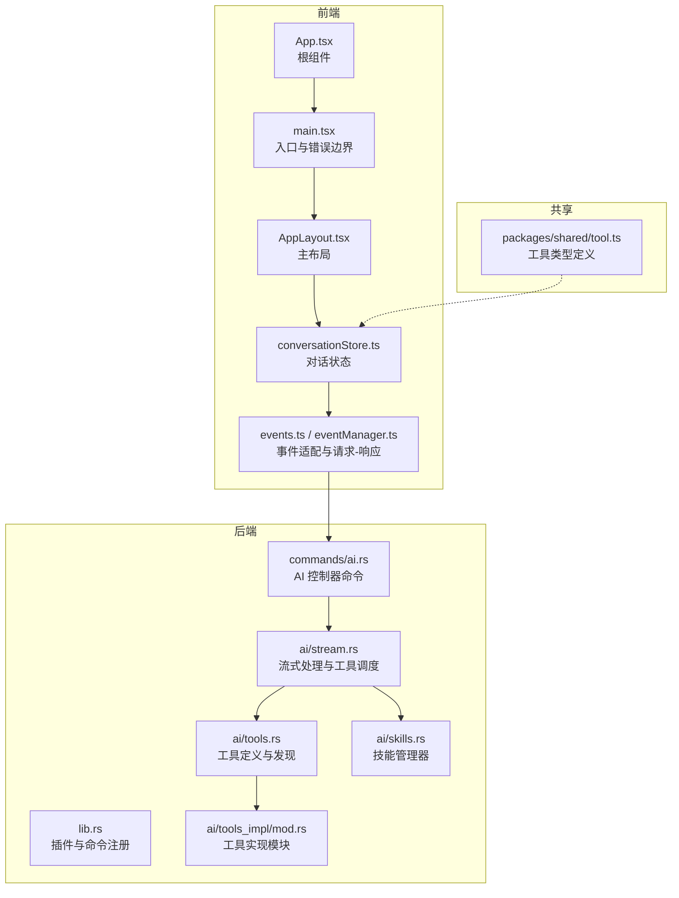
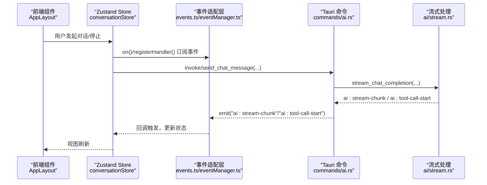
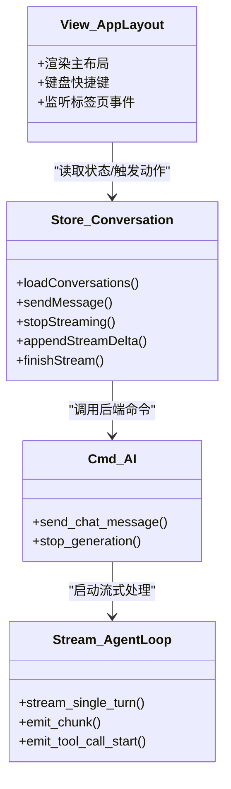
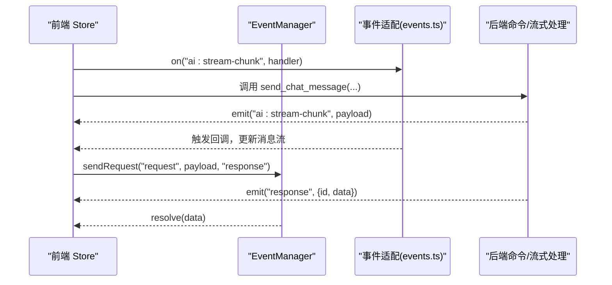
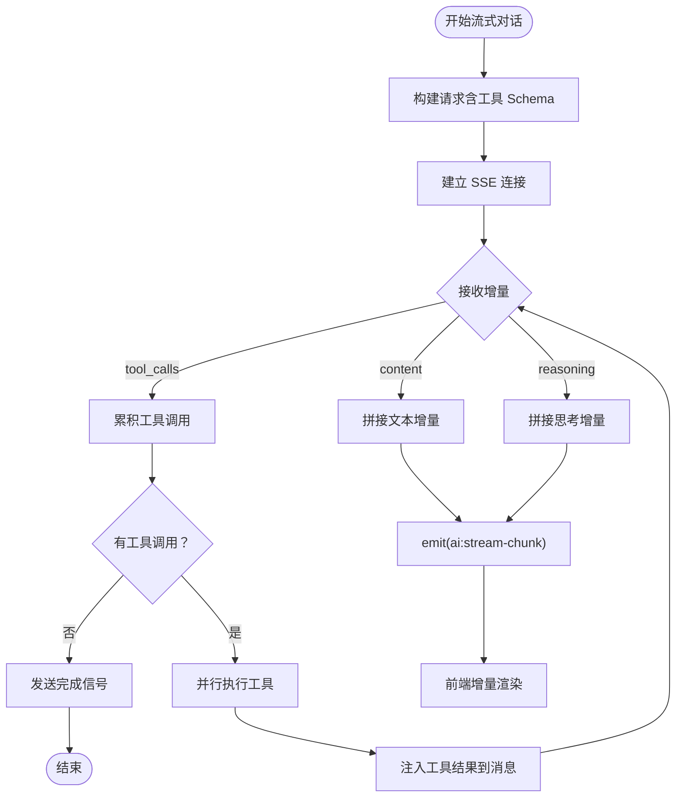
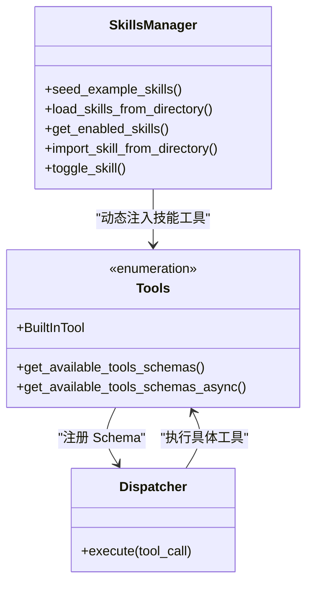
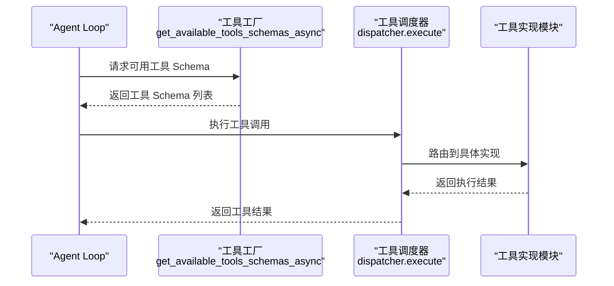
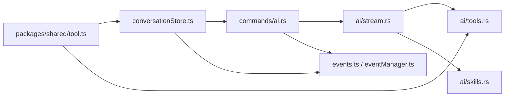

# 设计模式

<cite>
**本文引用的文件**
- [src-web/src/App.tsx](file://src-web/src/App.tsx)
- [src-web/src/main.tsx](file://src-web/src/main.tsx)
- [src-web/src/components/layout/AppLayout.tsx](file://src-web/src/components/layout/AppLayout.tsx)
- [src-web/src/stores/conversationStore.ts](file://src-web/src/stores/conversationStore.ts)
- [src-web/src/lib/events.ts](file://src-web/src/lib/events.ts)
- [src-web/src/lib/eventManager.ts](file://src-web/src/lib/eventManager.ts)
- [src-tauri/src/lib.rs](file://src-tauri/src/lib.rs)
- [src-tauri/src/commands/ai.rs](file://src-tauri/src/commands/ai.rs)
- [src-tauri/src/ai/stream.rs](file://src-tauri/src/ai/stream.rs)
- [src-tauri/src/ai/tools.rs](file://src-tauri/src/ai/tools.rs)
- [src-tauri/src/ai/skills.rs](file://src-tauri/src/ai/skills.rs)
- [src-tauri/src/ai/tools_impl/mod.rs](file://src-tauri/src/ai/tools_impl/mod.rs)
- [packages/shared/src/tool.ts](file://packages/shared/src/tool.ts)
- [agent.md](file://agent.md)
</cite>

## 目录
1. [引言](#引言)
2. [项目结构](#项目结构)
3. [核心组件](#核心组件)
4. [架构总览](#架构总览)
5. [详细组件分析](#详细组件分析)
6. [依赖关系分析](#依赖关系分析)
7. [性能考量](#性能考量)
8. [故障排查指南](#故障排查指南)
9. [结论](#结论)
10. [附录](#附录)

## 引言
本文件面向 CoSurf 项目，系统性梳理其采用的设计模式与实现细节，重点覆盖：
- MVC 模式：前端 React 组件作为视图层；后端 Tauri 命令作为控制器层。
- 事件驱动模式：前端 Zustand 状态管理与后端事件系统的协作。
- 流式处理模式：AI 对话与数据传输的流式实现。
- 插件系统：可扩展的技能与工具体系。
- 工厂模式：工具创建与管理的抽象与扩展。

文档旨在帮助开发者理解并正确应用这些模式，提升可维护性与可扩展性。

## 项目结构
CoSurf 采用前后端分离架构：
- 前端（React + Zustand）：负责 UI 展示与状态管理。
- 后端（Tauri + Rust）：负责业务控制、AI 对话、工具执行、数据库与系统集成。
- 共享包（packages/shared）：前后端共享的数据模型与类型定义。

**图表来源**
- [src-web/src/App.tsx:1-8](file://src-web/src/App.tsx#L1-L8)
- [src-web/src/main.tsx:1-52](file://src-web/src/main.tsx#L1-L52)
- [src-web/src/components/layout/AppLayout.tsx:1-209](file://src-web/src/components/layout/AppLayout.tsx#L1-L209)
- [src-web/src/stores/conversationStore.ts:1-365](file://src-web/src/stores/conversationStore.ts#L1-L365)
- [src-web/src/lib/events.ts:1-83](file://src-web/src/lib/events.ts#L1-L83)
- [src-web/src/lib/eventManager.ts:1-108](file://src-web/src/lib/eventManager.ts#L1-L108)
- [src-tauri/src/lib.rs:1-258](file://src-tauri/src/lib.rs#L1-L258)
- [src-tauri/src/commands/ai.rs:1-397](file://src-tauri/src/commands/ai.rs#L1-L397)
- [src-tauri/src/ai/stream.rs:1-778](file://src-tauri/src/ai/stream.rs#L1-L778)
- [src-tauri/src/ai/tools.rs:1-418](file://src-tauri/src/ai/tools.rs#L1-L418)
- [src-tauri/src/ai/skills.rs:1-567](file://src-tauri/src/ai/skills.rs#L1-L567)
- [src-tauri/src/ai/tools_impl/mod.rs:1-14](file://src-tauri/src/ai/tools_impl/mod.rs#L1-L14)
- [packages/shared/src/tool.ts:1-27](file://packages/shared/src/tool.ts#L1-L27)

**章节来源**
- [agent.md:31-142](file://agent.md#L31-L142)

## 核心组件
- 前端视图层：React 组件（如 AppLayout、AIPanel、Sidebar 等）负责渲染与用户交互。
- 前端控制器层：Zustand Store（如 conversationStore）封装业务流程与状态变更。
- 后端控制器层：Tauri 命令（如 send_chat_message、stop_generation）接收前端请求并协调资源。
- 后端事件系统：通过 Emitter/Listener 发射与监听事件（如 ai:stream-chunk、ai:tool-call-start）。
- 工具与技能系统：统一的工具定义与发现机制，支持内置工具、MCP 工具与可扩展的技能。

**章节来源**
- [src-web/src/components/layout/AppLayout.tsx:1-209](file://src-web/src/components/layout/AppLayout.tsx#L1-L209)
- [src-web/src/stores/conversationStore.ts:1-365](file://src-web/src/stores/conversationStore.ts#L1-L365)
- [src-tauri/src/commands/ai.rs:1-397](file://src-tauri/src/commands/ai.rs#L1-L397)
- [src-tauri/src/ai/stream.rs:1-778](file://src-tauri/src/ai/stream.rs#L1-L778)
- [src-tauri/src/ai/tools.rs:1-418](file://src-tauri/src/ai/tools.rs#L1-L418)
- [src-tauri/src/ai/skills.rs:1-567](file://src-tauri/src/ai/skills.rs#L1-L567)

## 架构总览
CoSurf 采用“前端视图 + 前端控制器 + 后端控制器 + 后端事件系统”的分层架构。前端通过 IPC 与后端交互，后端通过事件向前端推送流式数据与工具调用状态。

**图表来源**
- [src-web/src/stores/conversationStore.ts:172-243](file://src-web/src/stores/conversationStore.ts#L172-L243)
- [src-web/src/lib/events.ts:51-79](file://src-web/src/lib/events.ts#L51-L79)
- [src-web/src/lib/eventManager.ts:40-82](file://src-web/src/lib/eventManager.ts#L40-L82)
- [src-tauri/src/commands/ai.rs:17-274](file://src-tauri/src/commands/ai.rs#L17-L274)
- [src-tauri/src/ai/stream.rs:301-602](file://src-tauri/src/ai/stream.rs#L301-L602)

## 详细组件分析

### MVC 模式实现
- 视图层（View）：React 组件（如 AppLayout、AIPanel、Sidebar）负责渲染与用户交互。
- 控制器层（Controller）：前端使用 Zustand Store（如 conversationStore）封装业务流程；后端使用 Tauri 命令（如 send_chat_message）作为控制器。
- 模型层（Model）：共享类型（packages/shared）与后端数据库模型共同构成。

**图表来源**
- [src-web/src/components/layout/AppLayout.tsx:17-209](file://src-web/src/components/layout/AppLayout.tsx#L17-L209)
- [src-web/src/stores/conversationStore.ts:27-365](file://src-web/src/stores/conversationStore.ts#L27-L365)
- [src-tauri/src/commands/ai.rs:10-274](file://src-tauri/src/commands/ai.rs#L10-L274)
- [src-tauri/src/ai/stream.rs:301-378](file://src-tauri/src/ai/stream.rs#L301-L378)

**章节来源**
- [src-web/src/components/layout/AppLayout.tsx:1-209](file://src-web/src/components/layout/AppLayout.tsx#L1-L209)
- [src-web/src/stores/conversationStore.ts:1-365](file://src-web/src/stores/conversationStore.ts#L1-L365)
- [src-tauri/src/commands/ai.rs:1-397](file://src-tauri/src/commands/ai.rs#L1-L397)

### 事件驱动模式：前端 Zustand 与后端事件协作
- 前端事件适配：events.ts 提供 on/once/off 等统一 API，屏蔽 Electron/Tauri 的差异。
- 请求-响应：eventManager.ts 提供 sendRequest，支持超时与响应事件匹配。
- 后端事件发射：ai/stream.rs 在流式过程中发射 ai:stream-chunk、ai:tool-call-start 等事件；ai/commands.rs 将错误与完成信号转发至前端。

**图表来源**
- [src-web/src/lib/events.ts:51-79](file://src-web/src/lib/events.ts#L51-L79)
- [src-web/src/lib/eventManager.ts:40-82](file://src-web/src/lib/eventManager.ts#L40-L82)
- [src-tauri/src/commands/ai.rs:210-274](file://src-tauri/src/commands/ai.rs#L210-L274)
- [src-tauri/src/ai/stream.rs:650-714](file://src-tauri/src/ai/stream.rs#L650-L714)

**章节来源**
- [src-web/src/lib/events.ts:1-83](file://src-web/src/lib/events.ts#L1-L83)
- [src-web/src/lib/eventManager.ts:1-108](file://src-web/src/lib/eventManager.ts#L1-L108)
- [src-tauri/src/commands/ai.rs:1-397](file://src-tauri/src/commands/ai.rs#L1-L397)
- [src-tauri/src/ai/stream.rs:1-778](file://src-tauri/src/ai/stream.rs#L1-L778)

### 流式处理模式：AI 对话与数据传输
- 流式 SSE：ai/stream.rs 使用 reqwest-eventsource 接收流式增量，逐片 emit 到前端。
- Agent Loop：循环处理“对话 -> 工具调用 -> 结果注入 -> 再对话”，直至无工具调用或达到上限。
- 重复调用防护：对工具签名进行去重判断，必要时注入“强制停止”提示，避免无限循环。
- 前端增量渲染：conversationStore 根据 ai:stream-chunk 与 ai:tool-call-start 事件增量更新消息与 UI。

**图表来源**
- [src-tauri/src/ai/stream.rs:301-602](file://src-tauri/src/ai/stream.rs#L301-L602)
- [src-tauri/src/ai/stream.rs:650-714](file://src-tauri/src/ai/stream.rs#L650-L714)
- [src-web/src/stores/conversationStore.ts:172-243](file://src-web/src/stores/conversationStore.ts#L172-L243)

**章节来源**
- [src-tauri/src/ai/stream.rs:1-778](file://src-tauri/src/ai/stream.rs#L1-L778)
- [src-web/src/stores/conversationStore.ts:1-365](file://src-web/src/stores/conversationStore.ts#L1-L365)

### 插件系统：可扩展的技能与工具
- 技能（Skills）：以 Markdown 文件形式管理，frontmatter 包含元数据；仅在初始加载时解析 frontmatter，正文懒加载，降低启动成本。
- 工具（Tools）：内置工具与 MCP 工具统一以 JSON Schema 暴露给模型；支持动态发现与注册。
- 工具实现：tools_impl/dispatcher 负责路由与执行，便于扩展新工具。

**图表来源**
- [src-tauri/src/ai/skills.rs:84-280](file://src-tauri/src/ai/skills.rs#L84-L280)
- [src-tauri/src/ai/tools.rs:197-225](file://src-tauri/src/ai/tools.rs#L197-L225)
- [src-tauri/src/ai/tools_impl/mod.rs:1-14](file://src-tauri/src/ai/tools_impl/mod.rs#L1-L14)

**章节来源**
- [src-tauri/src/ai/skills.rs:1-567](file://src-tauri/src/ai/skills.rs#L1-L567)
- [src-tauri/src/ai/tools.rs:1-418](file://src-tauri/src/ai/tools.rs#L1-L418)
- [src-tauri/src/ai/tools_impl/mod.rs:1-14](file://src-tauri/src/ai/tools_impl/mod.rs#L1-L14)
- [packages/shared/src/tool.ts:1-27](file://packages/shared/src/tool.ts#L1-L27)

### 工厂模式：工具创建与管理
- 工具工厂：get_available_tools_schemas_async 作为“工厂方法”，聚合内置工具、技能工具与 MCP 工具，统一输出 OpenAI function schema。
- 工具执行器：dispatcher.execute 根据工具名路由到具体实现（如 open_url、web_search、run_command 等）。
- 可扩展性：新增工具只需在 tools.rs 定义 schema，在 tools_impl 下新增模块并在 dispatcher 中注册即可。

**图表来源**
- [src-tauri/src/ai/tools.rs:210-225](file://src-tauri/src/ai/tools.rs#L210-L225)
- [src-tauri/src/ai/tools_impl/mod.rs:1-14](file://src-tauri/src/ai/tools_impl/mod.rs#L1-L14)
- [src-tauri/src/ai/stream.rs:773-778](file://src-tauri/src/ai/stream.rs#L773-L778)

**章节来源**
- [src-tauri/src/ai/tools.rs:1-418](file://src-tauri/src/ai/tools.rs#L1-L418)
- [src-tauri/src/ai/tools_impl/mod.rs:1-14](file://src-tauri/src/ai/tools_impl/mod.rs#L1-L14)
- [src-tauri/src/ai/stream.rs:773-778](file://src-tauri/src/ai/stream.rs#L773-L778)

## 依赖关系分析
- 前端依赖后端命令与事件：conversationStore 依赖 commands/ai.rs 的 send_chat_message 与 stream 事件。
- 后端依赖工具与技能：stream.rs 依赖 tools.rs 的工具 Schema 与 skills.rs 的技能管理器。
- 共享类型：packages/shared/tool.ts 为工具类型定义，前后端共享。

**图表来源**
- [src-web/src/stores/conversationStore.ts:1-365](file://src-web/src/stores/conversationStore.ts#L1-L365)
- [src-tauri/src/commands/ai.rs:1-397](file://src-tauri/src/commands/ai.rs#L1-L397)
- [src-tauri/src/ai/stream.rs:1-778](file://src-tauri/src/ai/stream.rs#L1-L778)
- [src-tauri/src/ai/tools.rs:1-418](file://src-tauri/src/ai/tools.rs#L1-L418)
- [src-tauri/src/ai/skills.rs:1-567](file://src-tauri/src/ai/skills.rs#L1-L567)
- [src-web/src/lib/events.ts:1-83](file://src-web/src/lib/events.ts#L1-L83)
- [src-web/src/lib/eventManager.ts:1-108](file://src-web/src/lib/eventManager.ts#L1-L108)
- [packages/shared/src/tool.ts:1-27](file://packages/shared/src/tool.ts#L1-L27)

**章节来源**
- [src-web/src/stores/conversationStore.ts:1-365](file://src-web/src/stores/conversationStore.ts#L1-L365)
- [src-tauri/src/commands/ai.rs:1-397](file://src-tauri/src/commands/ai.rs#L1-L397)
- [src-tauri/src/ai/stream.rs:1-778](file://src-tauri/src/ai/stream.rs#L1-L778)
- [src-tauri/src/ai/tools.rs:1-418](file://src-tauri/src/ai/tools.rs#L1-L418)
- [src-tauri/src/ai/skills.rs:1-567](file://src-tauri/src/ai/skills.rs#L1-L567)
- [src-web/src/lib/events.ts:1-83](file://src-web/src/lib/events.ts#L1-L83)
- [src-web/src/lib/eventManager.ts:1-108](file://src-web/src/lib/eventManager.ts#L1-L108)
- [packages/shared/src/tool.ts:1-27](file://packages/shared/src/tool.ts#L1-L27)

## 性能考量
- 流式渲染：前端按增量更新消息，避免全量重绘，提升交互流畅度。
- 工具并发：Agent Loop 并行执行多个工具调用，缩短整体响应时间。
- 懒加载：技能正文懒加载，减少启动时 IO 与内存占用。
- 重复调用防护：通过签名去重与强制提示，避免无效循环，节省资源。
- 事件解耦：前端通过事件订阅与请求-响应模式，降低耦合度，便于扩展。

## 故障排查指南
- 前端错误边界：main.tsx 提供全局错误边界，捕获并展示错误信息，支持刷新重试。
- 后端错误事件：ai/stream.rs 在网络或解析错误时发射 ai:stream-error，并标记消息状态为 error。
- 事件监听泄漏：确保在组件卸载时移除事件监听（events.ts 提供 off/removeAllListeners）。
- 请求超时：eventManager.ts 的 sendRequest 支持超时与清理，避免悬挂请求。

**章节来源**
- [src-web/src/main.tsx:6-43](file://src-web/src/main.tsx#L6-L43)
- [src-tauri/src/ai/stream.rs:547-568](file://src-tauri/src/ai/stream.rs#L547-L568)
- [src-web/src/lib/events.ts:68-79](file://src-web/src/lib/events.ts#L68-L79)
- [src-web/src/lib/eventManager.ts:98-105](file://src-web/src/lib/eventManager.ts#L98-L105)

## 结论
CoSurf 通过清晰的分层与事件驱动机制，实现了前后端高效协作；借助流式处理与可扩展的工具/技能系统，满足复杂 AI 交互场景。遵循本文档的设计模式与最佳实践，可进一步提升系统的稳定性、可维护性与可扩展性。

## 附录
- 最佳实践清单
  - 前端：使用 Zues 的订阅模式管理长连接事件，避免重复监听；在组件卸载时统一清理。
  - 后端：命令层只做编排与校验，核心逻辑下沉到工具与技能模块；严格区分错误事件与完成事件。
  - 工具扩展：新增工具时，先在 tools.rs 定义 schema，再在 tools_impl 下实现，并在 dispatcher 中注册。
  - 技能扩展：遵循 Markdown frontmatter 规范，仅在需要时懒加载正文，避免阻塞初始化。