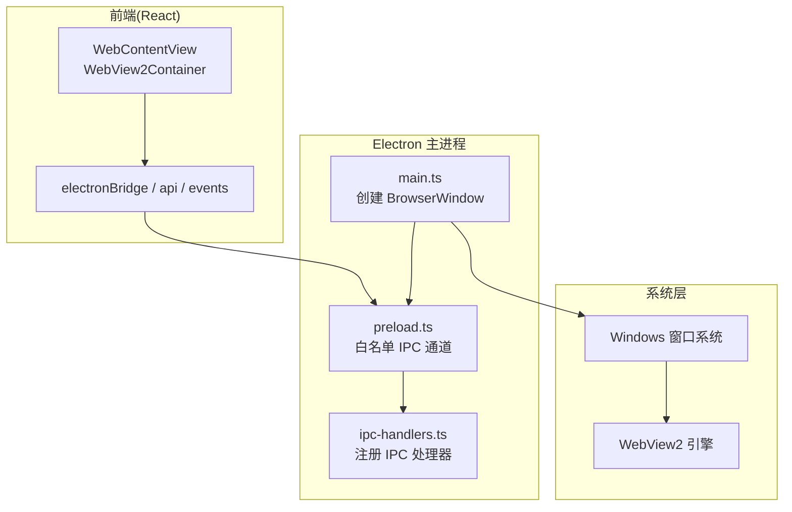
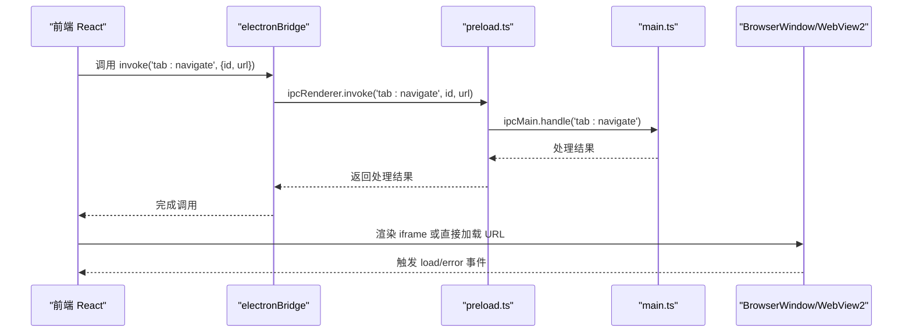
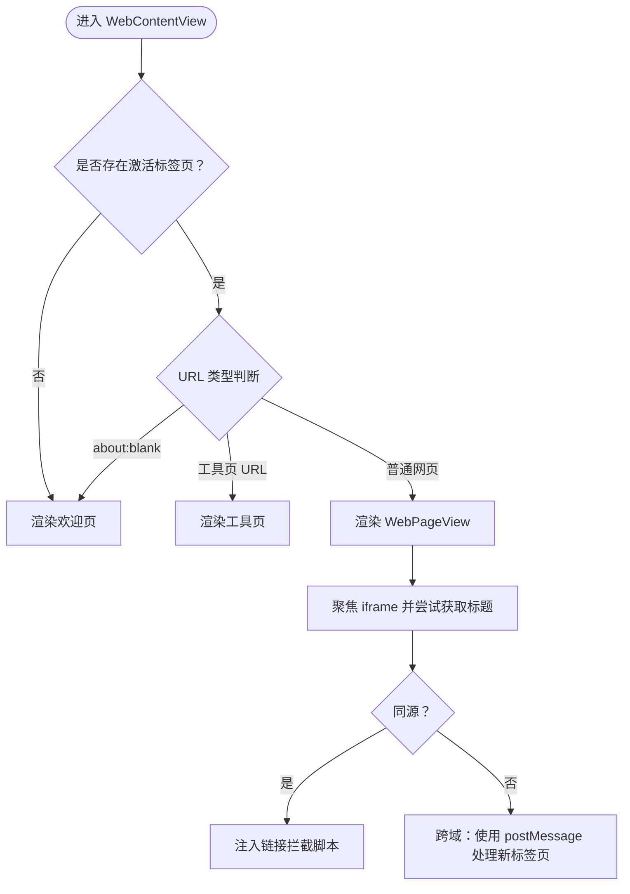
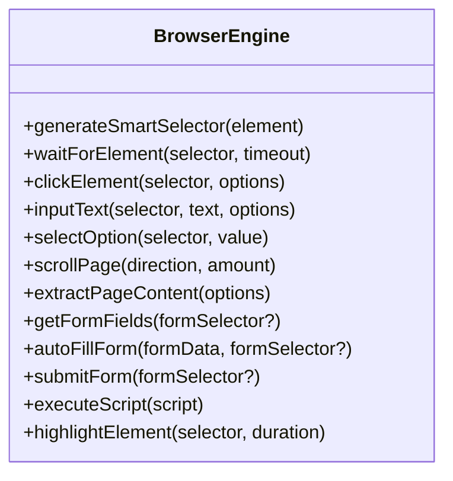
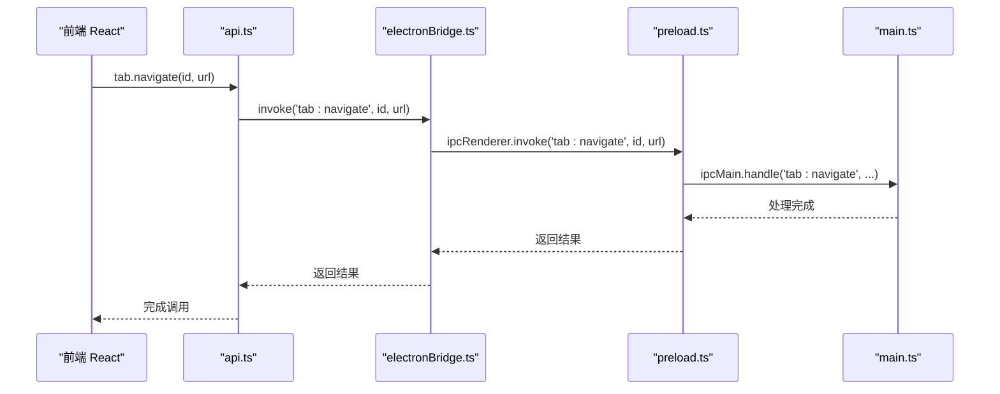
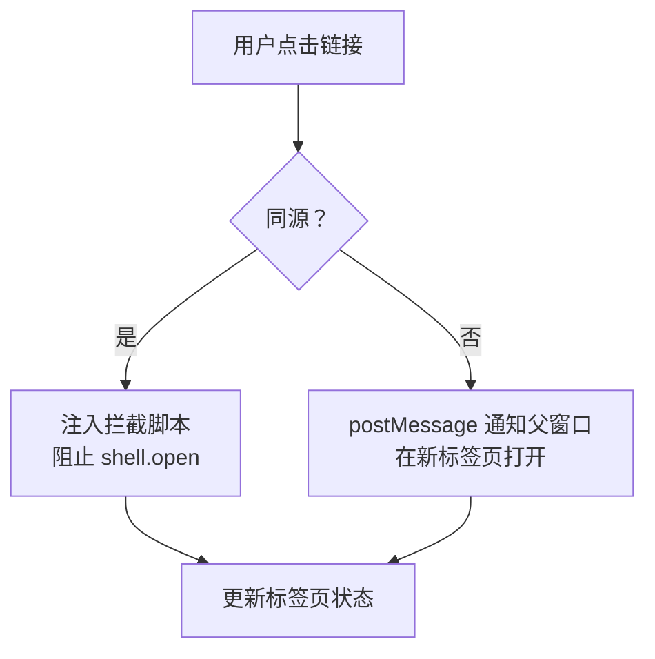
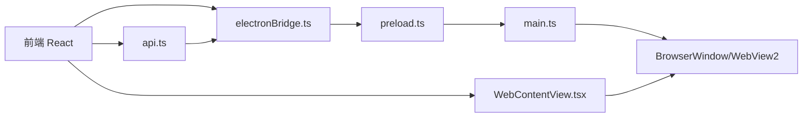

# WebView2 内核集成

<cite>
**本文档引用的文件**
- [WebView2Container.tsx](file://src-web/src/components/layout/WebView2Container.tsx)
- [WebContentView.tsx](file://src-web/src/components/layout/WebContentView.tsx)
- [browserEngine.ts](file://src-web/src/lib/browserEngine.ts)
- [tauri.conf.json](file://src-tauri/tauri.conf.json)
- [main.rs](file://src-tauri/src/main.rs)
- [lib.rs](file://src-tauri/src/lib.rs)
- [tauri.ts](file://src-web/src/lib/tauri.ts)
- [api.ts](file://src-web/src/lib/api.ts)
- [electronBridge.ts](file://src-web/src/lib/electronBridge.ts)
- [events.ts](file://src-web/src/lib/events.ts)
- [preload.ts](file://electron/preload.ts)
- [main.ts](file://electron/main.ts)
- [webview2-upgrade-plan.md](file://docs/webview2-upgrade-plan.md)
</cite>

## 目录
1. [简介](#简介)
2. [项目结构](#项目结构)
3. [核心组件](#核心组件)
4. [架构总览](#架构总览)
5. [详细组件分析](#详细组件分析)
6. [依赖关系分析](#依赖关系分析)
7. [性能考虑](#性能考虑)
8. [故障排除指南](#故障排除指南)
9. [结论](#结论)
10. [附录](#附录)

## 简介
本文件面向 CoSurf 项目中 WebView2 内核的集成与使用，重点解释以下方面：
- 为什么选择 WebView2 作为 Windows 浏览器内核
- WebView2 的初始化流程与运行时环境校验
- WebView2 的配置选项与功能开关
- 与 Tauri 框架的集成现状与迁移至 Electron 的路径
- 跨域限制的处理策略与安全配置
- 页面加载事件处理与性能优化建议
- 与 Electron 框架的对比与选择考量

## 项目结构
CoSurf 当前采用 React + Electron 的架构，WebView2 由 Electron 的 BrowserWindow 承载。前端通过 Electron IPC 与主进程通信，实现标签页管理、页面操作、截图等功能。

**图表来源**
- [main.ts:32-67](file://electron/main.ts#L32-L67)
- [preload.ts:178-223](file://electron/preload.ts#L178-L223)
- [WebContentView.tsx:417-423](file://src-web/src/components/layout/WebContentView.tsx#L417-L423)

**章节来源**
- [main.ts:32-67](file://electron/main.ts#L32-L67)
- [preload.ts:178-223](file://electron/preload.ts#L178-L223)
- [WebView2Container.tsx:1-13](file://src-web/src/components/layout/WebView2Container.tsx#L1-L13)

## 核心组件
- WebView2 容器与页面视图
  - WebView2Container 作为顶层容器，内部使用 WebContentView 渲染当前激活标签页。
  - WebContentView 负责根据激活标签页 URL 渲染欢迎页、工具页或 iframe 页面视图。
- 浏览器自动化引擎
  - browserEngine.ts 提供页面元素选择、点击、输入、滚动、内容提取等自动化能力，用于 AI Agent 的网页操作。
- IPC 通信层
  - electronBridge.ts 提供 invoke/listen/send 的桥接接口，屏蔽 Tauri 与 Electron 的差异。
  - api.ts 封装 Electron IPC 调用，提供数据库、AI、标签页、页面、截图、技能等统一 API。
  - events.ts 提供事件监听与一次性监听的统一接口。
- Tauri 配置与迁移
  - tauri.conf.json 定义了 Tauri 应用配置、安全策略与 WebView2 参数。
  - tauri.ts 标记 Tauri 模块已弃用，所有 IPC 已迁移至 Electron。

**章节来源**
- [WebView2Container.tsx:10-12](file://src-web/src/components/layout/WebView2Container.tsx#L10-L12)
- [WebContentView.tsx:417-423](file://src-web/src/components/layout/WebContentView.tsx#L417-L423)
- [browserEngine.ts:1-521](file://src-web/src/lib/browserEngine.ts#L1-L521)
- [electronBridge.ts:33-46](file://src-web/src/lib/electronBridge.ts#L33-L46)
- [api.ts:13-19](file://src-web/src/lib/api.ts#L13-L19)
- [events.ts:51-56](file://src-web/src/lib/events.ts#L51-L56)
- [tauri.conf.json:29-31](file://src-tauri/tauri.conf.json#L29-L31)
- [tauri.ts:6-12](file://src-web/src/lib/tauri.ts#L6-L12)

## 架构总览
CoSurf 的 WebView2 集成采用 Electron 的 BrowserWindow + WebView2 方案。前端通过 preload 暴露的安全 IPC 通道与主进程通信，主进程负责标签页管理、网络拦截、原生模块初始化等。

**图表来源**
- [electronBridge.ts:33-46](file://src-web/src/lib/electronBridge.ts#L33-L46)
- [preload.ts:178-185](file://electron/preload.ts#L178-L185)
- [main.ts:32-67](file://electron/main.ts#L32-L67)

**章节来源**
- [main.ts:32-67](file://electron/main.ts#L32-L67)
- [preload.ts:178-185](file://electron/preload.ts#L178-L185)
- [WebContentView.tsx:700-773](file://src-web/src/components/layout/WebContentView.tsx#L700-L773)

## 详细组件分析

### WebView2 容器与页面视图
- WebView2Container 仅作为包装组件，实际逻辑在 WebContentView 中实现。
- WebContentView 根据激活标签页状态决定渲染欢迎页、工具页或页面视图。
- 页面视图通过 iframe 加载目标 URL，并在加载完成后尝试注入链接拦截脚本（同源网站）。

**图表来源**
- [WebContentView.tsx:114-292](file://src-web/src/components/layout/WebContentView.tsx#L114-L292)
- [WebContentView.tsx:417-423](file://src-web/src/components/layout/WebContentView.tsx#L417-L423)

**章节来源**
- [WebView2Container.tsx:10-12](file://src-web/src/components/layout/WebView2Container.tsx#L10-L12)
- [WebContentView.tsx:114-292](file://src-web/src/components/layout/WebContentView.tsx#L114-L292)
- [WebContentView.tsx:417-423](file://src-web/src/components/layout/WebContentView.tsx#L417-L423)

### 浏览器自动化引擎（browserEngine.ts）
- 提供智能选择器生成、元素等待、点击、输入、选择、滚动、内容提取、表单自动填充与提交等能力。
- 适用于 AI Agent 的网页自动化操作，绕过同源限制，通过 Playwright 等工具实现深度交互。

**图表来源**
- [browserEngine.ts:22-521](file://src-web/src/lib/browserEngine.ts#L22-L521)

**章节来源**
- [browserEngine.ts:1-521](file://src-web/src/lib/browserEngine.ts#L1-L521)

### IPC 通信机制（Electron）
- electronBridge.ts 提供 invoke/listen/send 的桥接，屏蔽 Tauri 与 Electron 的差异。
- api.ts 封装 Electron IPC 调用，提供数据库、AI、标签页、页面、截图、技能等统一 API。
- events.ts 提供事件监听与一次性监听的统一接口。
- preload.ts 定义白名单 IPC 通道，确保仅允许授权通道进行通信。

**图表来源**
- [api.ts:289-316](file://src-web/src/lib/api.ts#L289-L316)
- [electronBridge.ts:33-46](file://src-web/src/lib/electronBridge.ts#L33-L46)
- [preload.ts:178-185](file://electron/preload.ts#L178-L185)
- [main.ts:121-148](file://electron/main.ts#L121-L148)

**章节来源**
- [electronBridge.ts:33-46](file://src-web/src/lib/electronBridge.ts#L33-L46)
- [api.ts:13-19](file://src-web/src/lib/api.ts#L13-L19)
- [events.ts:51-56](file://src-web/src/lib/events.ts#L51-L56)
- [preload.ts:30-175](file://electron/preload.ts#L30-L175)
- [main.ts:121-148](file://electron/main.ts#L121-L148)

### 跨域限制处理策略
- 同源网站：可在 iframe 内注入脚本，拦截链接点击与 window.open 调用，阻止 shell.open 权限错误。
- 跨域网站：无法注入脚本，通过 postMessage 与父窗口通信，实现“在新标签页打开”等行为。
- 项目文档建议：短期内维持 iframe 架构，增强 Playwright 集成以绕过同源限制；长期评估 Tauri 3.x 或转向 Electron 的原生 WebView2 方案。

**图表来源**
- [WebContentView.tsx:17-108](file://src-web/src/components/layout/WebContentView.tsx#L17-L108)
- [webview2-upgrade-plan.md:192-205](file://docs/webview2-upgrade-plan.md#L192-L205)

**章节来源**
- [WebContentView.tsx:17-108](file://src-web/src/components/layout/WebContentView.tsx#L17-L108)
- [webview2-upgrade-plan.md:192-205](file://docs/webview2-upgrade-plan.md#L192-L205)

### 安全配置（CSP 与权限控制）
- CSP 策略在 tauri.conf.json 中定义，涵盖 default-src、connect-src、img-src、media-src、style-src、font-src、frame-src、worker-src、script-src、object-src、base-uri、form-action 等。
- preload.ts 中定义 IPC 白名单，仅允许授权通道进行 invoke/on/send，防止任意通道被滥用。
- 项目当前已迁移至 Electron，Tauri 的 CSP 配置仍可作为参考。

**章节来源**
- [tauri.conf.json:29-31](file://src-tauri/tauri.conf.json#L29-L31)
- [preload.ts:30-175](file://electron/preload.ts#L30-L175)
- [tauri.ts:1-5](file://src-web/src/lib/tauri.ts#L1-L5)

### 页面加载事件处理
- WebPageView 监听 iframe 的 load 与 error 事件，更新标签页状态与历史记录。
- 对于跨域网站，通过后端事件系统（webview:get-tab-info、webview:get-tab-url）获取页面信息。
- 提供加载超时检测与错误处理，避免长时间无响应。

**章节来源**
- [WebContentView.tsx:700-773](file://src-web/src/components/layout/WebContentView.tsx#L700-L773)
- [WebContentView.tsx:182-250](file://src-web/src/components/layout/WebContentView.tsx#L182-L250)

## 依赖关系分析
- 前端依赖
  - electronBridge.ts 依赖 preload.ts 暴露的 ElectronAPI。
  - api.ts 依赖 electronBridge.ts 的 invoke/listen/send。
  - WebView2Container/WebContentView 依赖标签页状态与事件系统。
- 主进程依赖
  - main.ts 创建 BrowserWindow 并加载 preload。
  - preload.ts 仅暴露白名单 IPC 通道，确保安全。
  - ipc-handlers.ts 注册各类 IPC 处理器，实现标签页、页面、截图等功能。

**图表来源**
- [electronBridge.ts:33-46](file://src-web/src/lib/electronBridge.ts#L33-L46)
- [preload.ts:178-223](file://electron/preload.ts#L178-L223)
- [main.ts:32-67](file://electron/main.ts#L32-L67)
- [api.ts:13-19](file://src-web/src/lib/api.ts#L13-L19)
- [WebContentView.tsx:417-423](file://src-web/src/components/layout/WebContentView.tsx#L417-L423)

**章节来源**
- [electronBridge.ts:33-46](file://src-web/src/lib/electronBridge.ts#L33-L46)
- [preload.ts:178-223](file://electron/preload.ts#L178-L223)
- [main.ts:32-67](file://electron/main.ts#L32-L67)
- [api.ts:13-19](file://src-web/src/lib/api.ts#L13-L19)
- [WebContentView.tsx:417-423](file://src-web/src/components/layout/WebContentView.tsx#L417-L423)

## 性能考虑
- 内存管理
  - 及时移除事件监听器与观察者，避免内存泄漏。
  - 在标签页切换时销毁非激活标签页的 DOM，减少内存占用。
- 资源清理
  - 页面加载完成后及时释放超时定时器与监听器。
  - 对跨域页面，避免尝试访问 contentDocument，减少异常处理开销。
- 优化建议
  - 对频繁触发的事件（如滚动、输入）使用防抖/节流。
  - 合理设置加载超时时间，避免长时间阻塞 UI。
  - 使用 requestAnimationFrame 确保聚焦与渲染时机正确。

**章节来源**
- [WebContentView.tsx:562-593](file://src-web/src/components/layout/WebContentView.tsx#L562-L593)
- [WebContentView.tsx:137-151](file://src-web/src/components/layout/WebContentView.tsx#L137-L151)

## 故障排除指南
- shell.open 权限错误
  - 现象：页面脚本调用 shell.open 导致权限错误。
  - 处理：WebContentView 注入代理屏蔽 __TAURI__.shell，同时静默处理 Promise rejection 与 error 事件。
- 跨域页面无法注入脚本
  - 现象：跨域网站无法通过脚本拦截链接点击。
  - 处理：依赖 postMessage 与父窗口通信，或通过后端事件系统获取页面信息。
- 加载超时与错误
  - 现象：iframe 长时间无响应或加载失败。
  - 处理：设置加载超时检测，尝试访问 contentDocument 判断是否加载成功；跨域场景下不显示错误。
- Tauri 迁移相关
  - 现象：调用已弃用的 Tauri API。
  - 处理：使用 Electron IPC 与 api.ts/events.ts/electronBridge.ts 替代。

**章节来源**
- [WebContentView.tsx:137-180](file://src-web/src/components/layout/WebContentView.tsx#L137-L180)
- [WebContentView.tsx:781-800](file://src-web/src/components/layout/WebContentView.tsx#L781-L800)
- [tauri.ts:6-12](file://src-web/src/lib/tauri.ts#L6-L12)

## 结论
CoSurf 当前采用 Electron + WebView2 的方案，通过 iframe 承载网页并在必要时通过 Playwright 实现深度自动化。项目已明确迁移至 Electron，Tauri 的 CSP 与 WebView2 参数可作为参考。短期内维持 iframe 架构并增强自动化能力，长期可评估 Tauri 3.x 或转向 Electron 的原生 WebView2 方案。

## 附录

### WebView2 初始化与运行时环境
- Electron 主进程创建 BrowserWindow 时加载 preload，设置 webPreferences 包含 contextIsolation、nodeIntegration 等。
- WebView2 由 Electron 的 BrowserWindow 承载，前端通过 iframe 或直接加载 URL 的方式使用。

**章节来源**
- [main.ts:32-67](file://electron/main.ts#L32-L67)
- [WebContentView.tsx:417-423](file://src-web/src/components/layout/WebContentView.tsx#L417-L423)

### WebView2 配置选项（基于 Electron）
- 窗口尺寸、最小尺寸、无边框、隐藏标题栏等由 BrowserWindow 配置。
- additionalBrowserArgs 在 Tauri 配置中存在，Electron 场景下可通过 BrowserWindow 的 webPreferences 或自定义参数实现类似效果。

**章节来源**
- [tauri.conf.json:14-27](file://src-tauri/tauri.conf.json#L14-L27)
- [main.ts:32-48](file://electron/main.ts#L32-L48)

### 与 Tauri 的对比与选择
- Tauri 2.x 不支持动态创建多个 WebView 实例，因此 CoSurf 采用 iframe 方案。
- 项目已迁移至 Electron，具备更灵活的 IPC 与标签页管理能力。
- 若未来 Tauri 3.x 支持多 WebView2 实例，可考虑完全迁移到原生 WebView2 方案。

**章节来源**
- [WebView2Container.tsx:4-6](file://src-web/src/components/layout/WebView2Container.tsx#L4-L6)
- [webview2-upgrade-plan.md:192-240](file://docs/webview2-upgrade-plan.md#L192-L240)