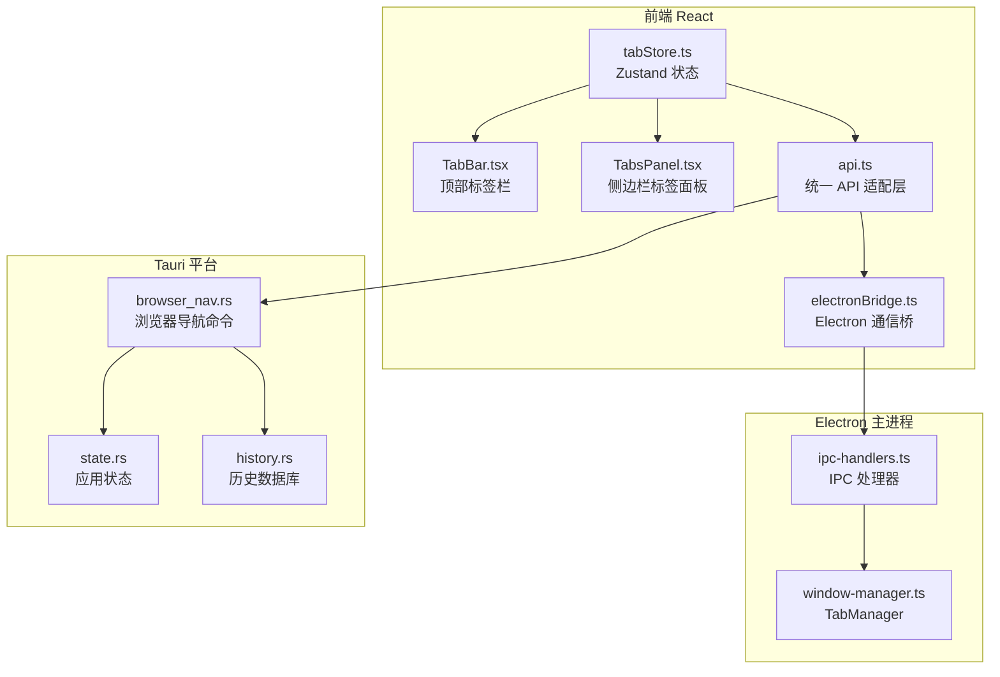
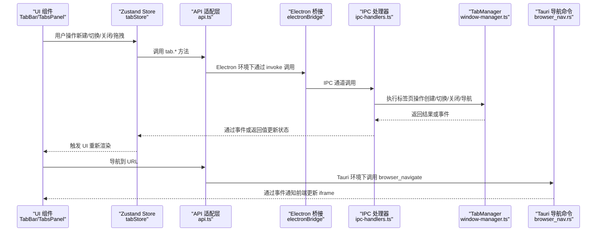
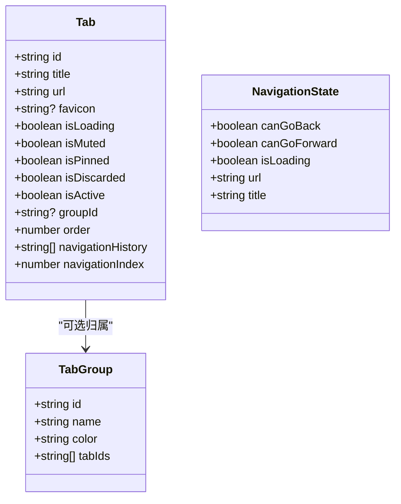
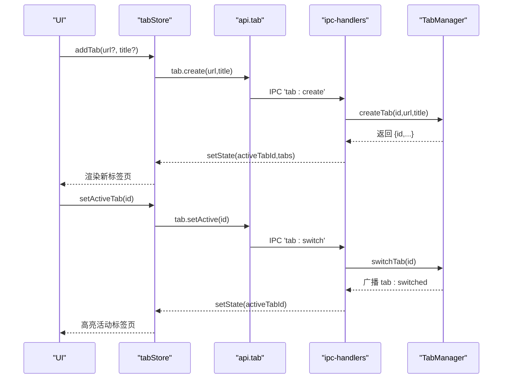
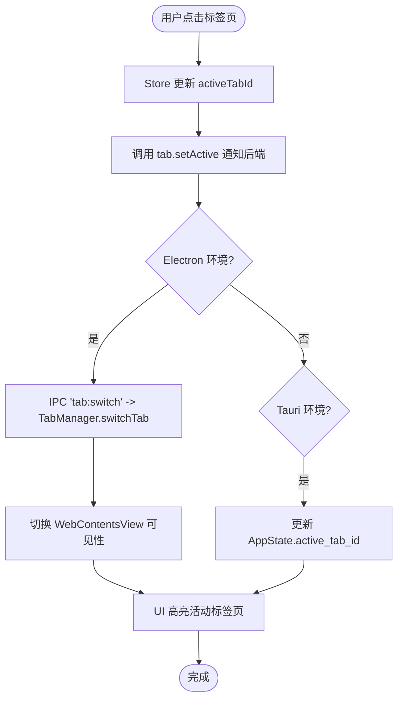
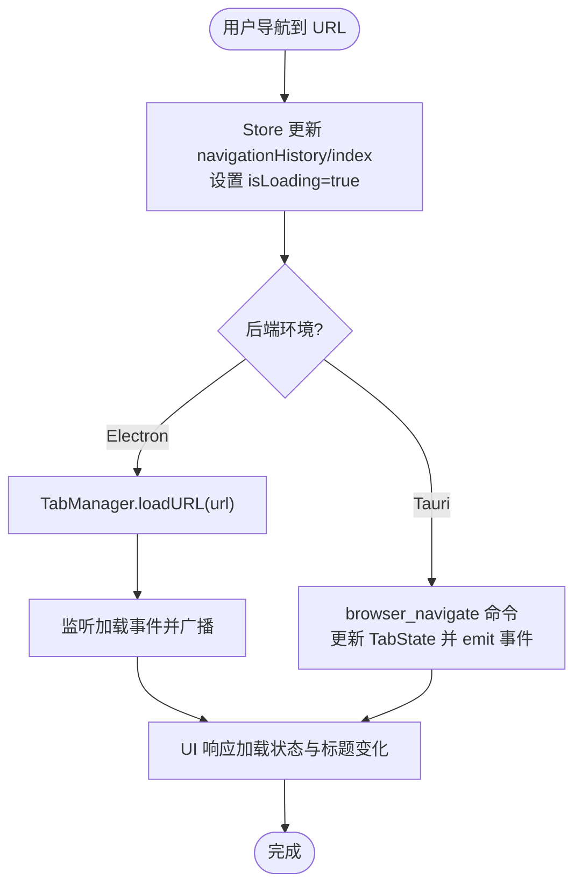
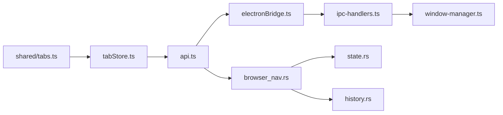

# 多标签页管理

<cite>
**本文档引用的文件**
- [packages/shared/src/tabs.ts](file://packages/shared/src/tabs.ts)
- [src-web/src/stores/tabStore.ts](file://src-web/src/stores/tabStore.ts)
- [src-web/src/components/layout/TabBar.tsx](file://src-web/src/components/layout/TabBar.tsx)
- [src-web/src/components/sidebar/TabsPanel.tsx](file://src-web/src/components/sidebar/TabsPanel.tsx)
- [src-web/src/lib/api.ts](file://src-web/src/lib/api.ts)
- [src-web/src/lib/electronBridge.ts](file://src-web/src/lib/electronBridge.ts)
- [electron/ipc-handlers.ts](file://electron/ipc-handlers.ts)
- [electron/window-manager.ts](file://electron/window-manager.ts)
- [src-tauri/src/state.rs](file://src-tauri/src/state.rs)
- [src-tauri/src/commands/browser_nav.rs](file://src-tauri/src/commands/browser_nav.rs)
- [src-tauri/src/db/history.rs](file://src-tauri/src/db/history.rs)
- [src-web/src/stores/historyStore.ts](file://src-web/src/stores/historyStore.ts)
</cite>

## 目录
1. [简介](#简介)
2. [项目结构](#项目结构)
3. [核心组件](#核心组件)
4. [架构总览](#架构总览)
5. [详细组件分析](#详细组件分析)
6. [依赖关系分析](#依赖关系分析)
7. [性能考量](#性能考量)
8. [故障排查指南](#故障排查指南)
9. [结论](#结论)
10. [附录](#附录)

## 简介
本文件系统性梳理 CoSurf 的多标签页管理系统，覆盖标签页状态模型、创建/激活/关闭/重命名流程、导航历史与切换、分组与排序、缓存策略、历史记录、跨进程通信、崩溃恢复、数量限制与资源管理、以及快捷键与体验优化建议。文档同时给出代码级架构图与流程图，帮助读者快速定位实现位置与关键逻辑。

## 项目结构
CoSurf 的标签页管理横跨前端 React Store、Electron 主进程与 Tauri 平台三部分：
- 前端层：Zustand 状态管理、UI 组件（标签栏、侧边栏标签面板）、API 适配层
- Electron 层：IPC 处理器、标签页管理器（WebContentsView）
- Tauri 层：命令模块（浏览器导航）、应用状态（最近打开 URL 缓存）

图表来源
- [src-web/src/stores/tabStore.ts:1-248](file://src-web/src/stores/tabStore.ts#L1-L248)
- [src-web/src/components/layout/TabBar.tsx:1-79](file://src-web/src/components/layout/TabBar.tsx#L1-L79)
- [src-web/src/components/sidebar/TabsPanel.tsx:1-139](file://src-web/src/components/sidebar/TabsPanel.tsx#L1-L139)
- [src-web/src/lib/api.ts:286-316](file://src-web/src/lib/api.ts#L286-L316)
- [src-web/src/lib/electronBridge.ts:1-100](file://src-web/src/lib/electronBridge.ts#L1-L100)
- [electron/ipc-handlers.ts:45-528](file://electron/ipc-handlers.ts#L45-L528)
- [electron/window-manager.ts:1-361](file://electron/window-manager.ts#L1-L361)
- [src-tauri/src/commands/browser_nav.rs:1-93](file://src-tauri/src/commands/browser_nav.rs#L1-L93)
- [src-tauri/src/state.rs:1-77](file://src-tauri/src/state.rs#L1-L77)
- [src-tauri/src/db/history.rs:1-97](file://src-tauri/src/db/history.rs#L1-L97)

章节来源
- [src-web/src/stores/tabStore.ts:1-248](file://src-web/src/stores/tabStore.ts#L1-L248)
- [electron/window-manager.ts:1-361](file://electron/window-manager.ts#L1-L361)
- [src-tauri/src/commands/browser_nav.rs:1-93](file://src-tauri/src/commands/browser_nav.rs#L1-L93)

## 核心组件
- 标签页数据模型：定义标签页 ID、URL、标题、加载状态、静音、置顶、丢弃、激活、分组、顺序、导航历史与索引等字段
- 前端状态管理：Zustand Store 提供标签页集合、活动标签页 ID、增删改查、拖拽重排、导航历史推进/回退
- UI 组件：顶部标签栏与侧边栏标签面板，支持点击切换、关闭、搜索过滤、状态图标展示
- 通信适配层：统一 API 适配层封装 Electron IPC 与 Tauri invoke，前端通过 tab.* 方法调用后端能力
- 主进程标签页管理：Electron 的 TabManager 使用 WebContentsView 实现真正多标签页，支持创建/切换/关闭/导航、加载事件、页面标题更新
- Tauri 导航命令：维护每标签页的导航历史、canGoBack/canGoForward 状态，并通过事件通知前端更新 iframe
- 应用状态：全局活跃标签页 ID、最近打开 URL 去重缓存等
- 历史记录：数据库持久化历史条目，前端 Store 支持查询、新增、清理

章节来源
- [packages/shared/src/tabs.ts:1-32](file://packages/shared/src/tabs.ts#L1-L32)
- [src-web/src/stores/tabStore.ts:1-248](file://src-web/src/stores/tabStore.ts#L1-L248)
- [src-web/src/components/layout/TabBar.tsx:1-79](file://src-web/src/components/layout/TabBar.tsx#L1-L79)
- [src-web/src/components/sidebar/TabsPanel.tsx:1-139](file://src-web/src/components/sidebar/TabsPanel.tsx#L1-L139)
- [src-web/src/lib/api.ts:286-316](file://src-web/src/lib/api.ts#L286-L316)
- [electron/ipc-handlers.ts:76-118](file://electron/ipc-handlers.ts#L76-L118)
- [electron/window-manager.ts:28-361](file://electron/window-manager.ts#L28-L361)
- [src-tauri/src/commands/browser_nav.rs:9-81](file://src-tauri/src/commands/browser_nav.rs#L9-L81)
- [src-tauri/src/state.rs:9-23](file://src-tauri/src/state.rs#L9-L23)
- [src-tauri/src/db/history.rs:1-97](file://src-tauri/src/db/history.rs#L1-L97)

## 架构总览
下图展示从前端触发到后端执行再到 UI 同步的关键交互链路。

图表来源
- [src-web/src/stores/tabStore.ts:38-229](file://src-web/src/stores/tabStore.ts#L38-L229)
- [src-web/src/lib/api.ts:286-316](file://src-web/src/lib/api.ts#L286-L316)
- [src-web/src/lib/electronBridge.ts:32-46](file://src-web/src/lib/electronBridge.ts#L32-L46)
- [electron/ipc-handlers.ts:76-118](file://electron/ipc-handlers.ts#L76-L118)
- [electron/window-manager.ts:84-172](file://electron/window-manager.ts#L84-L172)
- [src-tauri/src/commands/browser_nav.rs:32-81](file://src-tauri/src/commands/browser_nav.rs#L32-L81)

## 详细组件分析

### 标签页状态模型与存储结构
- 字段说明
  - 标识与元信息：id、title、url、favicon
  - 状态位：isLoading、isMuted、isPinned、isDiscarded、isActive
  - 分组与排序：groupId、order
  - 导航历史：navigationHistory（数组）、navigationIndex（当前索引）
- 设计要点
  - navigationHistory 采用“当前位置之后的历史被截断并追加”的策略，保证历史树的一致性
  - isActive 仅在 Store 中维护，便于 UI 精确高亮；后端通过 setActive 同步活跃状态
  - isDiscarded 用于内存回收标记（当前未启用具体回收逻辑）

图表来源
- [packages/shared/src/tabs.ts:1-32](file://packages/shared/src/tabs.ts#L1-L32)

章节来源
- [packages/shared/src/tabs.ts:1-32](file://packages/shared/src/tabs.ts#L1-L32)

### 标签页创建、激活、关闭与重命名
- 创建
  - 前端：生成唯一 id，初始化基础字段，设置为活动标签页，插入 Store
  - Electron：IPC 处理器调用 TabManager.createTab，创建 WebContentsView，加载 URL，监听加载事件并广播状态
  - Tauri：通过 browser_navigate 命令维护导航历史并通知前端更新 iframe
- 激活
  - 前端：setActiveTab 更新 activeTabId，并调用 tab.setActive 通知后端
  - Electron：TabManager.switchTab 切换可见视图并广播切换事件
  - Tauri：通过 AppState.active_tab_id 同步全局活跃标签页
- 关闭
  - 前端：closeTab 删除对应项，若关闭的是活动标签页，选择相邻项作为新活动项，最后至少保留一个标签页
  - Electron：TabManager.destroy 视图并清理映射
- 重命名
  - 当前实现未提供直接的 rename 方法；可通过 updateTab 动态更新 title 字段，UI 会自动反映

图表来源
- [src-web/src/stores/tabStore.ts:74-99](file://src-web/src/stores/tabStore.ts#L74-L99)
- [src-web/src/lib/api.ts:289-316](file://src-web/src/lib/api.ts#L289-L316)
- [electron/ipc-handlers.ts:76-118](file://electron/ipc-handlers.ts#L76-L118)
- [electron/window-manager.ts:84-172](file://electron/window-manager.ts#L84-L172)

章节来源
- [src-web/src/stores/tabStore.ts:74-129](file://src-web/src/stores/tabStore.ts#L74-L129)
- [electron/ipc-handlers.ts:76-118](file://electron/ipc-handlers.ts#L76-L118)
- [electron/window-manager.ts:179-217](file://electron/window-manager.ts#L179-L217)

### 标签页切换与焦点管理
- 前端 Store 通过 activeTabId 管理焦点，setActiveTab 会同步到后端并通过 window 全局变量暴露给 Electron 主进程
- Electron TabManager 通过 WebContentsView 的 setVisible 控制视图显隐，确保同一时刻仅有一个活跃视图
- Tauri 通过 AppState.active_tab_id 保持全局一致性

图表来源
- [src-web/src/stores/tabStore.ts:56-72](file://src-web/src/stores/tabStore.ts#L56-L72)
- [src-web/src/lib/api.ts:314-316](file://src-web/src/lib/api.ts#L314-L316)
- [electron/ipc-handlers.ts:116-118](file://electron/ipc-handlers.ts#L116-L118)
- [electron/window-manager.ts:179-217](file://electron/window-manager.ts#L179-L217)
- [src-tauri/src/state.rs:13-13](file://src-tauri/src/state.rs#L13-L13)

章节来源
- [src-web/src/stores/tabStore.ts:56-72](file://src-web/src/stores/tabStore.ts#L56-L72)
- [electron/window-manager.ts:179-217](file://electron/window-manager.ts#L179-L217)
- [src-tauri/src/state.rs:13-13](file://src-tauri/src/state.rs#L13-L13)

### 标签页导航历史与切换
- 前端 Store 维护 navigationHistory 与 navigationIndex，支持 goBack/goForward，更新时设置 isLoading
- Tauri browser_navigate 命令维护每标签页的 TabState，计算 canGoBack/canGoForward，并通过事件通知前端更新 iframe
- Electron 环境下，导航由 TabManager.loadURL 实现，监听 did-start-loading/did-stop-loading 更新 UI

图表来源
- [src-web/src/stores/tabStore.ts:152-228](file://src-web/src/stores/tabStore.ts#L152-L228)
- [src-tauri/src/commands/browser_nav.rs:32-81](file://src-tauri/src/commands/browser_nav.rs#L32-L81)
- [electron/window-manager.ts:119-142](file://electron/window-manager.ts#L119-L142)

章节来源
- [src-web/src/stores/tabStore.ts:152-228](file://src-web/src/stores/tabStore.ts#L152-L228)
- [electron/window-manager.ts:119-142](file://electron/window-manager.ts#L119-L142)
- [src-tauri/src/commands/browser_nav.rs:32-81](file://src-tauri/src/commands/browser_nav.rs#L32-L81)

### 标签页分组与排序
- 数据模型支持 groupId 与 order 字段，便于分组与排序
- 当前 UI（TabBar/TabsPanel）未提供分组显示与排序拖拽功能；可通过扩展 UI 与 Store 的 reorderTabs/updateTab 实现
- 建议：在 TabsPanel 中增加分组筛选与拖拽排序，Store 中维护分组 tabIds 列表

章节来源
- [packages/shared/src/tabs.ts:18-23](file://packages/shared/src/tabs.ts#L18-L23)
- [src-web/src/stores/tabStore.ts:139-149](file://src-web/src/stores/tabStore.ts#L139-L149)
- [src-web/src/components/sidebar/TabsPanel.tsx:1-139](file://src-web/src/components/sidebar/TabsPanel.tsx#L1-L139)

### 标签页缓存策略与内存管理
- 页面内容缓存（Tauri）
  - 提供 page_cache 命令，按最大年龄清理过期缓存文件，避免磁盘膨胀
- 最近打开 URL 去重（Tauri）
  - AppState.recent_opened_urls 使用 HashMap+Instant 记录最近 5 秒内的重复请求，避免重复打开
- 前端 Store
  - 通过 isActive/isDiscarded 状态位标记，结合 UI 懒加载与卸载策略减少内存占用
- 主进程视图
  - Electron TabManager.destroy 释放 WebContentsView，防止内存泄漏

章节来源
- [src-tauri/src/commands/page_cache.rs:128-159](file://src-tauri/src/commands/page_cache.rs#L128-L159)
- [src-tauri/src/state.rs:18-19](file://src-tauri/src/state.rs#L18-L19)
- [electron/window-manager.ts:222-251](file://electron/window-manager.ts#L222-L251)
- [src-web/src/stores/tabStore.ts:22-36](file://src-web/src/stores/tabStore.ts#L22-L36)

### 标签页历史记录
- 数据库持久化
  - history.rs 提供 list/search/add/clear/delete 等接口，按访问时间倒序排列
- 前端 Store
  - historyStore.ts 支持搜索、新增、删除、清空，自动刷新列表
- 与标签页的关系
  - 浏览历史与标签页导航历史不同：前者持久化、后者仅在当前会话有效

章节来源
- [src-tauri/src/db/history.rs:24-96](file://src-tauri/src/db/history.rs#L24-L96)
- [src-web/src/stores/historyStore.ts:49-99](file://src-web/src/stores/historyStore.ts#L49-L99)

### 标签页间数据共享与通信
- 全局变量桥接
  - 前端 Store 在初始化与变更时同步 activeTabId 与 navigateTo/updateTab 至 window.__cosurf_*，供 Electron 主进程工具使用
- 事件驱动
  - Electron TabManager 通过 webContents.send 广播 tab:* 事件，前端组件订阅以保持 UI 一致
- 命令式调用
  - api.tab.* 封装 IPC/Tauri invoke，统一前后端交互

章节来源
- [src-web/src/stores/tabStore.ts:231-247](file://src-web/src/stores/tabStore.ts#L231-L247)
- [electron/window-manager.ts:123-149](file://electron/window-manager.ts#L123-L149)
- [src-web/src/lib/api.ts:289-316](file://src-web/src/lib/api.ts#L289-L316)

### 崩溃恢复与健壮性
- 标签页数量保障
  - 关闭最后一个标签页时，Store 自动创建一个 about:blank 新标签页，避免无活动标签页
- 导航历史一致性
  - 前端在导航时截断当前位置后的历史并追加，保证历史树正确性
- 主进程异常处理
  - TabManager.loadURL/executeJavaScript 包裹错误日志，避免前端崩溃影响主进程
- 去重与超时
  - open_url 工具对 5 秒内重复请求进行去重提示，15 秒超时等待前端响应

章节来源
- [src-web/src/stores/tabStore.ts:104-109](file://src-web/src/stores/tabStore.ts#L104-L109)
- [src-web/src/stores/tabStore.ts:152-171](file://src-web/src/stores/tabStore.ts#L152-L171)
- [electron/window-manager.ts:113-116](file://electron/window-manager.ts#L113-L116)
- [src-tauri/src/ai/tools_impl/open_url.rs:40-64](file://src-tauri/src/ai/tools_impl/open_url.rs#L40-L64)
- [src-tauri/src/ai/tools_impl/open_url.rs:132-145](file://src-tauri/src/ai/tools_impl/open_url.rs#L132-L145)

### 数量限制与资源管理
- 标签页上限
  - 代码未设置硬性上限；可通过 UI 与 Store 增加限制与提示
- 资源回收
  - Electron TabManager.destroy 释放 WebContentsView
  - 前端 Store 通过 isActive/isDiscarded 状态位与 UI 卸载策略降低内存压力
  - Tauri page_cache 命令定期清理过期缓存文件

章节来源
- [electron/window-manager.ts:222-251](file://electron/window-manager.ts#L222-L251)
- [src-web/src/stores/tabStore.ts:22-36](file://src-web/src/stores/tabStore.ts#L22-L36)
- [src-tauri/src/commands/page_cache.rs:128-159](file://src-tauri/src/commands/page_cache.rs#L128-L159)

### 快捷键与用户体验优化
- 快捷键
  - 代码未提供快捷键绑定；可在 UI 组件中注册键盘事件（如 Ctrl+T/Ctrl+W/Alt+左/右）并调用相应 Store 方法
- 体验优化
  - TabBar/TabsPanel 提供搜索过滤、状态图标、悬停关闭按钮、加载动画等
  - 建议：支持 Ctrl+Tab 切换、双击标签页新建、右键菜单（复制链接/在新标签页打开/固定/静音）

章节来源
- [src-web/src/components/layout/TabBar.tsx:1-79](file://src-web/src/components/layout/TabBar.tsx#L1-L79)
- [src-web/src/components/sidebar/TabsPanel.tsx:1-139](file://src-web/src/components/sidebar/TabsPanel.tsx#L1-L139)

## 依赖关系分析
- 前端 Store 依赖 shared 的 Tab/TabGroup/NavigationState 类型
- API 适配层依赖 Electron 桥接或 Tauri invoke
- Electron IPC 依赖 TabManager 的 WebContentsView 生命周期
- Tauri 导航命令依赖全局 TabState 与数据库历史

图表来源
- [packages/shared/src/tabs.ts:1-32](file://packages/shared/src/tabs.ts#L1-L32)
- [src-web/src/stores/tabStore.ts:1-6](file://src-web/src/stores/tabStore.ts#L1-L6)
- [src-web/src/lib/api.ts:1-10](file://src-web/src/lib/api.ts#L1-L10)
- [src-web/src/lib/electronBridge.ts:1-30](file://src-web/src/lib/electronBridge.ts#L1-L30)
- [electron/ipc-handlers.ts:45-514](file://electron/ipc-handlers.ts#L45-L514)
- [electron/window-manager.ts:1-361](file://electron/window-manager.ts#L1-L361)
- [src-tauri/src/commands/browser_nav.rs:1-93](file://src-tauri/src/commands/browser_nav.rs#L1-L93)
- [src-tauri/src/state.rs:1-77](file://src-tauri/src/state.rs#L1-L77)
- [src-tauri/src/db/history.rs:1-97](file://src-tauri/src/db/history.rs#L1-L97)

章节来源
- [src-web/src/stores/tabStore.ts:1-6](file://src-web/src/stores/tabStore.ts#L1-L6)
- [src-web/src/lib/api.ts:1-10](file://src-web/src/lib/api.ts#L1-L10)
- [electron/ipc-handlers.ts:45-514](file://electron/ipc-handlers.ts#L45-L514)

## 性能考量
- 渲染性能
  - 将 tabs 与 activeTabId 分别订阅，避免对象引用导致的无限重渲染
  - 使用最小化状态更新（仅更新受影响字段），减少 UI 重绘
- 内存管理
  - 及时销毁不再需要的 WebContentsView
  - 使用 isDiscarded 标记与 UI 卸载策略降低内存占用
- I/O 与网络
  - 导航时设置 isLoading，避免频繁重试
  - 历史记录与缓存定期清理，避免磁盘与内存膨胀

章节来源
- [src-web/src/stores/tabStore.ts:7-9](file://src-web/src/stores/tabStore.ts#L7-L9)
- [electron/window-manager.ts:222-251](file://electron/window-manager.ts#L222-L251)
- [src-tauri/src/commands/page_cache.rs:128-159](file://src-tauri/src/commands/page_cache.rs#L128-L159)

## 故障排查指南
- 无法创建标签页
  - 检查 IPC 'tab:create' 是否成功返回 id
  - 确认 TabManager.createTab 是否创建 WebContentsView 并加载 URL
- 标签页不切换
  - 检查 setActiveTab 是否调用 tab.setActive
  - 确认 Electron IPC 'tab:switch' 与 TabManager.switchTab 是否执行
- 导航无效
  - 前端 Store 是否更新 navigationHistory 与 navigationIndex
  - Tauri browser_navigate 是否发出 webview:navigating 事件
- 历史记录缺失
  - 确认 historyStore.addHistory 是否被调用
  - 检查数据库 history 表写入是否成功

章节来源
- [electron/ipc-handlers.ts:76-118](file://electron/ipc-handlers.ts#L76-L118)
- [electron/window-manager.ts:179-217](file://electron/window-manager.ts#L179-L217)
- [src-tauri/src/commands/browser_nav.rs:32-81](file://src-tauri/src/commands/browser_nav.rs#L32-L81)
- [src-web/src/stores/historyStore.ts:63-78](file://src-web/src/stores/historyStore.ts#L63-L78)
- [src-tauri/src/db/history.rs:70-85](file://src-tauri/src/db/history.rs#L70-L85)

## 结论
CoSurf 的多标签页系统在前端、Electron 与 Tauri 之间形成了清晰的职责边界：前端负责状态与 UI，Electron 负责真实多标签页渲染与事件，Tauri 负责命令式导航与持久化。现有实现提供了完整的生命周期管理、导航历史与去重保护，但缺少分组排序 UI 与快捷键绑定。建议后续增强：分组/排序 UI、快捷键、崩溃恢复与资源上限策略。

## 附录
- 相关文件路径与用途概览
  - packages/shared/src/tabs.ts：标签页数据模型定义
  - src-web/src/stores/tabStore.ts：标签页状态与操作逻辑
  - src-web/src/components/layout/TabBar.tsx：顶部标签栏 UI
  - src-web/src/components/sidebar/TabsPanel.tsx：侧边栏标签面板 UI
  - src-web/src/lib/api.ts：统一 API 适配层
  - src-web/src/lib/electronBridge.ts：Electron 通信桥
  - electron/ipc-handlers.ts：IPC 处理器
  - electron/window-manager.ts：Electron 标签页管理器
  - src-tauri/src/commands/browser_nav.rs：Tauri 导航命令
  - src-tauri/src/state.rs：应用全局状态
  - src-tauri/src/db/history.rs：历史记录数据库
  - src-web/src/stores/historyStore.ts：历史记录 Store