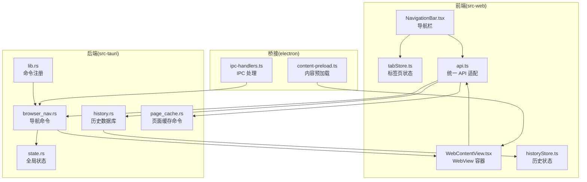
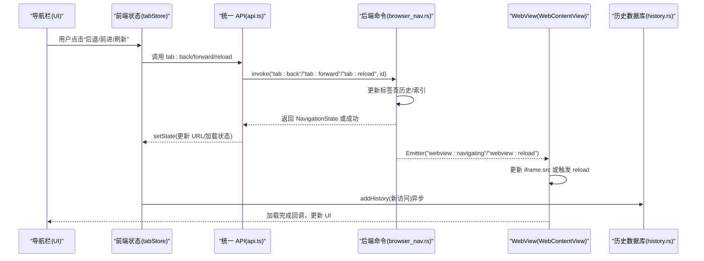
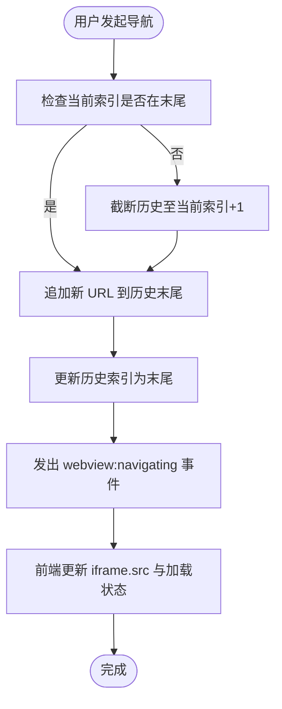
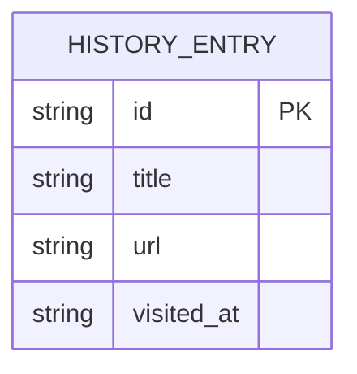
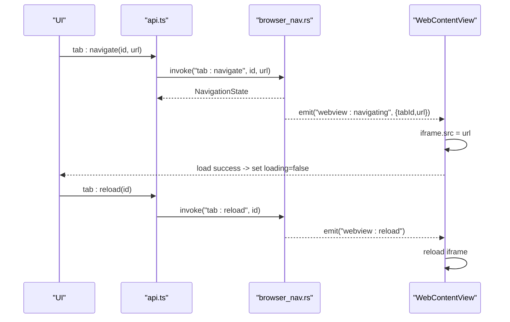
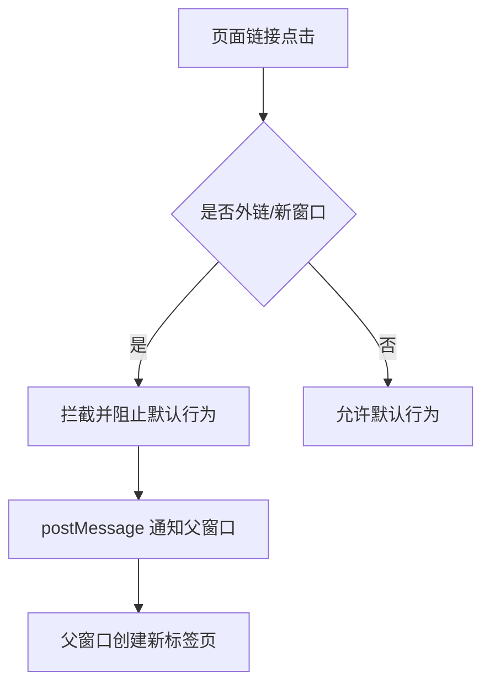
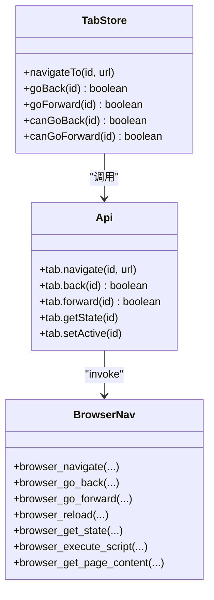
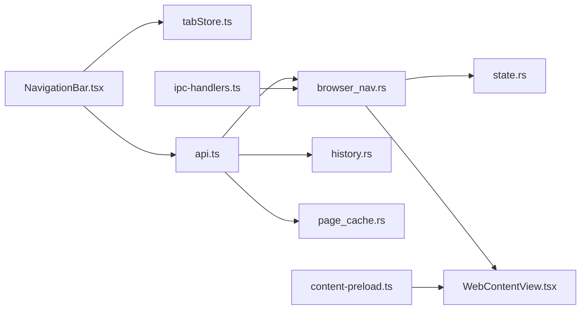

# 导航控制

<cite>
**本文引用的文件**
- [browser_nav.rs](file://src-tauri/src/commands/browser_nav.rs)
- [tabStore.ts](file://src-web/src/stores/tabStore.ts)
- [NavigationBar.tsx](file://src-web/src/components/layout/NavigationBar.tsx)
- [WebContentView.tsx](file://src-web/src/components/layout/WebContentView.tsx)
- [api.ts](file://src-web/src/lib/api.ts)
- [history.rs](file://src-tauri/src/db/history.rs)
- [historyStore.ts](file://src-web/src/stores/historyStore.ts)
- [state.rs](file://src-tauri/src/state.rs)
- [page_cache.rs](file://src-tauri/src/commands/page_cache.rs)
- [cache.rs](file://native/src/cache.rs)
- [lib.rs](file://src-tauri/src/lib.rs)
- [ipc-handlers.ts](file://electron/ipc-handlers.ts)
- [content-preload.ts](file://electron/content-preload.ts)
</cite>

## 目录
1. [简介](#简介)
2. [项目结构](#项目结构)
3. [核心组件](#核心组件)
4. [架构总览](#架构总览)
5. [详细组件分析](#详细组件分析)
6. [依赖关系分析](#依赖关系分析)
7. [性能考虑](#性能考虑)
8. [故障排查指南](#故障排查指南)
9. [结论](#结论)
10. [附录](#附录)

## 简介
本文件面向 CoSurf 的浏览器导航控制系统，系统性阐述导航命令的实现机制（前进、后退、刷新、停止加载）、导航历史的维护与管理（存储、查询、清理）、导航事件处理流程（开始、进度、完成）、权限与安全检查、导航状态同步（UI 与历史）、错误处理与异常策略、导航与 AI 的集成（AI 导航建议与智能跳转）、性能优化（预加载与缓存）、API 接口与使用方法，以及导航历史的搜索与过滤。

## 项目结构
CoSurf 采用前端 React + 后端 Tauri/Rust 的桌面应用架构。导航控制涉及前端状态管理、IPC 通信、后端命令处理、数据库与缓存模块，以及 Electron 桥接层。

**图表来源**
- [NavigationBar.tsx:32-388](file://src-web/src/components/layout/NavigationBar.tsx#L32-L388)
- [WebContentView.tsx:114-200](file://src-web/src/components/layout/WebContentView.tsx#L114-L200)
- [tabStore.ts:38-248](file://src-web/src/stores/tabStore.ts#L38-L248)
- [api.ts:288-340](file://src-web/src/lib/api.ts#L288-L340)
- [browser_nav.rs:32-81](file://src-tauri/src/commands/browser_nav.rs#L32-L81)
- [history.rs:24-96](file://src-tauri/src/db/history.rs#L24-L96)
- [page_cache.rs:162-253](file://src-tauri/src/commands/page_cache.rs#L162-L253)
- [state.rs:9-23](file://src-tauri/src/state.rs#L9-L23)
- [lib.rs:151-180](file://src-tauri/src/lib.rs#L151-L180)
- [ipc-handlers.ts:576-605](file://electron/ipc-handlers.ts#L576-L605)
- [content-preload.ts:1-42](file://electron/content-preload.ts#L1-L42)

**章节来源**
- [NavigationBar.tsx:32-388](file://src-web/src/components/layout/NavigationBar.tsx#L32-L388)
- [tabStore.ts:38-248](file://src-web/src/stores/tabStore.ts#L38-L248)
- [api.ts:288-340](file://src-web/src/lib/api.ts#L288-L340)
- [browser_nav.rs:32-81](file://src-tauri/src/commands/browser_nav.rs#L32-L81)
- [history.rs:24-96](file://src-tauri/src/db/history.rs#L24-L96)
- [page_cache.rs:162-253](file://src-tauri/src/commands/page_cache.rs#L162-L253)
- [state.rs:9-23](file://src-tauri/src/state.rs#L9-L23)
- [lib.rs:151-180](file://src-tauri/src/lib.rs#L151-L180)
- [ipc-handlers.ts:576-605](file://electron/ipc-handlers.ts#L576-L605)
- [content-preload.ts:1-42](file://electron/content-preload.ts#L1-L42)

## 核心组件
- 前端导航状态与 UI
  - 标签页状态管理：负责本地历史栈、前进/后退索引、加载状态与 UI 同步。
  - 导航栏组件：提供后退/前进/刷新/主页等交互入口，并根据状态禁用按钮。
- 后端导航命令
  - 维护每个标签页的导航历史与索引，发出事件驱动前端更新。
  - 提供刷新、后退、前进、获取状态、执行脚本、获取页面内容等命令。
- 数据库与历史
  - 提供历史列表、搜索、新增、清空、删除接口，支持前端历史面板。
- 缓存与性能
  - 页面缓存模块（文件系统 + SHA256 文件名），支持保存、加载、过期清理。
- 桥接与安全
  - Electron 桥接层负责 WebView2 标签页的导航与安全拦截，防止页面脚本滥用后端 API。

**章节来源**
- [tabStore.ts:14-229](file://src-web/src/stores/tabStore.ts#L14-L229)
- [NavigationBar.tsx:96-126](file://src-web/src/components/layout/NavigationBar.tsx#L96-L126)
- [browser_nav.rs:32-206](file://src-tauri/src/commands/browser_nav.rs#L32-L206)
- [history.rs:24-96](file://src-tauri/src/db/history.rs#L24-L96)
- [page_cache.rs:46-159](file://src-tauri/src/commands/page_cache.rs#L46-L159)
- [ipc-handlers.ts:576-605](file://electron/ipc-handlers.ts#L576-L605)

## 架构总览
导航控制的端到端流程如下：

**图表来源**
- [NavigationBar.tsx:109-126](file://src-web/src/components/layout/NavigationBar.tsx#L109-L126)
- [tabStore.ts:174-214](file://src-web/src/stores/tabStore.ts#L174-L214)
- [api.ts:299-315](file://src-web/src/lib/api.ts#L299-L315)
- [browser_nav.rs:32-93](file://src-tauri/src/commands/browser_nav.rs#L32-L93)
- [WebContentView.tsx:700-704](file://src-web/src/components/layout/WebContentView.tsx#L700-L704)
- [history.rs:70-85](file://src-tauri/src/db/history.rs#L70-L85)

## 详细组件分析

### 导航命令与状态机
- 前端状态机
  - 每个标签页维护本地历史数组与当前索引，后退/前进仅移动索引并更新 URL 与加载状态。
  - 导航到新 URL 时，若当前索引非末尾，需截断后续历史再追加。
- 后端命令
  - 维护全局 HashMap 存储每个标签页的 TabState（当前 URL、历史数组、索引）。
  - 导航、后退、前进均发出事件通知前端更新 iframe；刷新发出 reload 事件。
  - 获取状态返回 can_go_back/can_go_forward/is_loading 等 UI 所需信息。
- 状态同步
  - 前端 store 更新后，UI 立即反映；后端状态变更通过事件驱动前端同步。

**图表来源**
- [browser_nav.rs:51-61](file://src-tauri/src/commands/browser_nav.rs#L51-L61)
- [tabStore.ts:157-170](file://src-web/src/stores/tabStore.ts#L157-L170)

**章节来源**
- [browser_nav.rs:32-81](file://src-tauri/src/commands/browser_nav.rs#L32-L81)
- [tabStore.ts:151-171](file://src-web/src/stores/tabStore.ts#L151-L171)

### 导航历史的维护与管理
- 历史存储
  - 后端提供 add_history、list_history、search_history、clear_history、delete_history_entry。
  - 前端历史面板通过 historyStore.ts 调用 db:* 命令，支持分页加载与搜索。
- 历史查询与过滤
  - 支持按标题/URL 模糊匹配搜索；支持分页 limit/offset。
- 历史清理
  - 提供清空全部与按 ID 删除；前端历史面板支持一键清空。

**图表来源**
- [history.rs:7-14](file://src-tauri/src/db/history.rs#L7-L14)

**章节来源**
- [history.rs:24-96](file://src-tauri/src/db/history.rs#L24-L96)
- [historyStore.ts:37-98](file://src-web/src/stores/historyStore.ts#L37-L98)

### 导航事件处理流程
- 导航开始
  - 前端调用 tab:navigate，后端更新历史并发出 webview:navigating。
- 进度与完成
  - WebView 加载完成回调中，前端清除加载状态；错误时记录并上报。
- 刷新
  - 后端发出 webview:reload，前端重新设置 URL 触发刷新。

**图表来源**
- [api.ts:299-315](file://src-web/src/lib/api.ts#L299-L315)
- [browser_nav.rs:32-93](file://src-tauri/src/commands/browser_nav.rs#L32-L93)
- [WebContentView.tsx:700-704](file://src-web/src/components/layout/WebContentView.tsx#L700-L704)

**章节来源**
- [WebContentView.tsx:661-704](file://src-web/src/components/layout/WebContentView.tsx#L661-L704)
- [browser_nav.rs:83-93](file://src-tauri/src/commands/browser_nav.rs#L83-L93)

### 权限控制与安全检查
- 链接拦截与安全
  - WebView 内容注入链接拦截脚本，阻止页面脚本调用后端 shell.open，避免越权。
  - 对 window.open 与 target="_blank" 外链进行拦截，通过 postMessage 通知父窗口创建新标签页。
- 页面内容提取
  - content-preload.ts 暴露安全的 getPageText/getPageHtml/getPageMeta，清理脚本/样式/iframe 等元素。
- Electron 桥接
  - ipc-handlers.ts 在导航时通过 executeJavaScript 调用前端 store，确保前后端状态一致。

**图表来源**
- [WebContentView.tsx:17-108](file://src-web/src/components/layout/WebContentView.tsx#L17-L108)
- [content-preload.ts:16-42](file://electron/content-preload.ts#L16-L42)
- [ipc-handlers.ts:576-605](file://electron/ipc-handlers.ts#L576-L605)

**章节来源**
- [WebContentView.tsx:17-108](file://src-web/src/components/layout/WebContentView.tsx#L17-L108)
- [content-preload.ts:16-42](file://electron/content-preload.ts#L16-L42)
- [ipc-handlers.ts:576-605](file://electron/ipc-handlers.ts#L576-L605)

### 导航状态同步
- 前端
  - tabStore 维护 tabs/activeTabId/navigationHistory/navigationIndex，提供 navigateTo/goBack/goForward/canGoBack/canGoForward。
- 后端
  - browser_nav.rs 维护全局 TabState，返回 NavigationState 供前端更新 UI。
- 全局活跃标签页
  - set_active_tab 将当前活跃标签页 ID 写入 AppState，便于后端其他模块识别当前上下文。

**章节来源**
- [tabStore.ts:151-229](file://src-web/src/stores/tabStore.ts#L151-L229)
- [browser_nav.rs:14-29](file://src-tauri/src/commands/browser_nav.rs#L14-L29)
- [browser_nav.rs:464-473](file://src-tauri/src/commands/browser_nav.rs#L464-L473)
- [state.rs:13-13](file://src-tauri/src/state.rs#L13-L13)

### 导航错误处理与异常策略
- WebView 加载失败
  - WebContentView.tsx 捕获加载错误，显示友好提示并记录错误；同时向后端发送状态请求以同步 UI。
- Promise/错误事件抑制
  - 静默处理 shell.open 相关的未捕获异常，避免干扰用户。
- 后端事件发送失败
  - 事件发送失败时记录错误并返回内部错误，前端可重试或降级处理。

**章节来源**
- [WebContentView.tsx:661-704](file://src-web/src/components/layout/WebContentView.tsx#L661-L704)
- [WebContentView.tsx:154-180](file://src-web/src/components/layout/WebContentView.tsx#L154-L180)
- [browser_nav.rs:66-71](file://src-tauri/src/commands/browser_nav.rs#L66-L71)

### 导航与 AI 的集成
- AI 导航建议与智能跳转
  - 通过 AI Agent Loop 执行 open_url、summarize_page 等工具，实现“打开网页 → 总结内容 → 智能跳转”等能力。
  - 页面内容提取与缓存为 AI 提供上下文感知基础。
- 页面上下文与摘要
  - browser_get_page_content 命令用于提取页面文本，结合 page_cache.rs 的缓存能力减少重复抓取。

**章节来源**
- [browser_nav.rs:242-266](file://src-tauri/src/commands/browser_nav.rs#L242-L266)
- [page_cache.rs:54-89](file://src-tauri/src/commands/page_cache.rs#L54-L89)

### 性能优化技术
- 预加载与缓存
  - 页面缓存：以 URL 的 SHA256 哈希命名文件，保存 JSON 结构（url/title/content/timestamp/length），支持过期清理（默认 24 小时）。
  - 前端历史面板按需分页加载，避免一次性加载过多历史。
- 历史管理
  - 导航时仅保留当前路径的历史分支，避免历史无限增长。
- 安全与稳定性
  - 链接拦截与错误抑制降低异常对用户体验的影响。

**章节来源**
- [page_cache.rs:46-159](file://src-tauri/src/commands/page_cache.rs#L46-L159)
- [tabStore.ts:157-170](file://src-web/src/stores/tabStore.ts#L157-L170)
- [WebContentView.tsx:154-180](file://src-web/src/components/layout/WebContentView.tsx#L154-L180)

### 导航命令 API 与使用方法
- 前端调用
  - 通过 api.ts 的 tab.* 方法调用后端命令，如 tab.navigate/back/forward/getState/setActive。
- 后端命令
  - browser_navigate、browser_go_back、browser_go_forward、browser_reload、browser_get_state、browser_execute_script、browser_get_page_content 等。
- 命令注册
  - 在 lib.rs 中集中注册，前端通过 invoke(channel, ...) 调用。

**图表来源**
- [tabStore.ts:151-229](file://src-web/src/stores/tabStore.ts#L151-L229)
- [api.ts:299-315](file://src-web/src/lib/api.ts#L299-L315)
- [browser_nav.rs:32-266](file://src-tauri/src/commands/browser_nav.rs#L32-L266)
- [lib.rs:151-180](file://src-tauri/src/lib.rs#L151-L180)

**章节来源**
- [api.ts:288-340](file://src-web/src/lib/api.ts#L288-L340)
- [browser_nav.rs:32-266](file://src-tauri/src/commands/browser_nav.rs#L32-L266)
- [lib.rs:151-180](file://src-tauri/src/lib.rs#L151-L180)

### 导航历史的搜索与过滤
- 前端搜索
  - historyStore.ts 提供 searchHistory(query) 与 loadHistory(limit)；当输入为空时回退到分页加载。
- 后端搜索
  - history.rs 提供 search_history(query, limit)，模糊匹配标题与 URL。
- 历史新增
  - addHistory(title, url) 会在合适时机（如页面加载完成）调用，避免内部页面与空白页进入历史。

**章节来源**
- [historyStore.ts:48-78](file://src-web/src/stores/historyStore.ts#L48-L78)
- [history.rs:46-68](file://src-tauri/src/db/history.rs#L46-L68)

## 依赖关系分析

**图表来源**
- [NavigationBar.tsx:32-388](file://src-web/src/components/layout/NavigationBar.tsx#L32-L388)
- [tabStore.ts:38-248](file://src-web/src/stores/tabStore.ts#L38-L248)
- [api.ts:288-340](file://src-web/src/lib/api.ts#L288-L340)
- [browser_nav.rs:32-206](file://src-tauri/src/commands/browser_nav.rs#L32-L206)
- [state.rs:9-23](file://src-tauri/src/state.rs#L9-L23)
- [WebContentView.tsx:114-200](file://src-web/src/components/layout/WebContentView.tsx#L114-L200)
- [history.rs:24-96](file://src-tauri/src/db/history.rs#L24-L96)
- [page_cache.rs:162-253](file://src-tauri/src/commands/page_cache.rs#L162-L253)
- [ipc-handlers.ts:576-605](file://electron/ipc-handlers.ts#L576-L605)
- [content-preload.ts:1-42](file://electron/content-preload.ts#L1-L42)

**章节来源**
- [lib.rs:151-180](file://src-tauri/src/lib.rs#L151-L180)

## 性能考虑
- 历史管理
  - 导航时仅保留当前路径，避免历史无限增长；分页加载历史，降低前端压力。
- 缓存策略
  - 页面缓存采用 SHA256 文件名与 JSON 结构，支持过期清理；适合重复访问场景。
- 安全与稳定性
  - 链接拦截与错误抑制减少异常对 UI 的影响，提升稳定性。

[本节为通用指导，无需特定文件引用]

## 故障排查指南
- 页面无法在 iframe 中加载
  - 检查 CSP/X-Frame-Options 等安全策略；WebContentView.tsx 已提供错误提示与替代方案。
- 导航按钮不可用
  - 检查 canGoBack/canGoForward 的计算逻辑；确认 activeTabId 正确。
- 导航事件未生效
  - 确认后端已发出 webview:navigating/webview:reload 事件；前端已监听并更新 iframe。
- 历史搜索无结果
  - 确认后端 search_history 的模糊匹配是否正确；前端 searchHistory 是否传入查询词。

**章节来源**
- [WebContentView.tsx:905-921](file://src-web/src/components/layout/WebContentView.tsx#L905-L921)
- [tabStore.ts:217-228](file://src-web/src/stores/tabStore.ts#L217-L228)
- [browser_nav.rs:66-71](file://src-tauri/src/commands/browser_nav.rs#L66-L71)
- [history.rs:46-68](file://src-tauri/src/db/history.rs#L46-L68)

## 结论
CoSurf 的导航控制系统通过前端状态机与后端命令的协同，实现了稳定的前进/后退/刷新/停止加载能力；配合数据库历史与页面缓存，提供了高效的历史管理与性能优化；通过 Electron 桥接与内容预加载脚本，强化了安全与用户体验。AI 能力与导航系统的结合，进一步提升了智能跳转与上下文感知能力。

[本节为总结，无需特定文件引用]

## 附录
- 常用命令清单
  - 前端：tab.navigate/back/forward/getState/setActive
  - 后端：browser_navigate/browser_go_back/browser_go_forward/browser_reload/browser_get_state/browser_execute_script/browser_get_page_content
- 历史操作
  - 列表：list_history(limit, offset)
  - 搜索：search_history(query, limit)
  - 新增：add_history(title, url)
  - 清空：clear_history()
  - 删除：delete_history_entry(id)

**章节来源**
- [api.ts:299-315](file://src-web/src/lib/api.ts#L299-L315)
- [browser_nav.rs:32-266](file://src-tauri/src/commands/browser_nav.rs#L32-L266)
- [history.rs:24-96](file://src-tauri/src/db/history.rs#L24-L96)