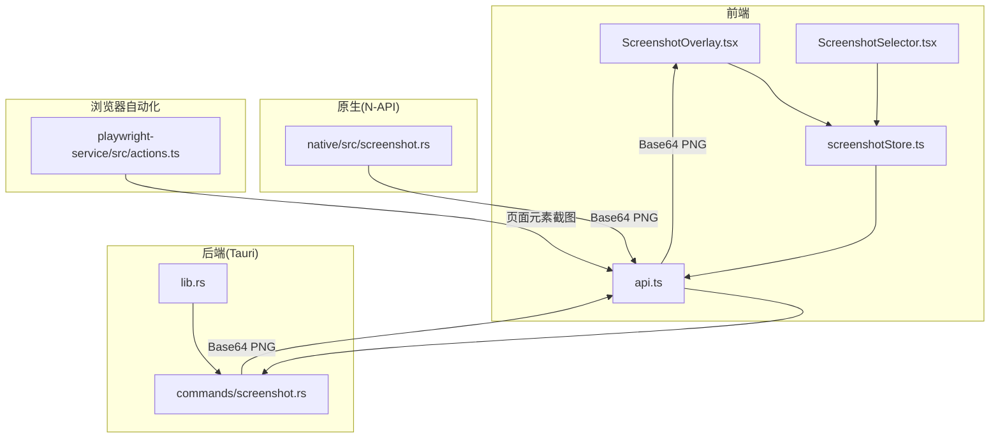
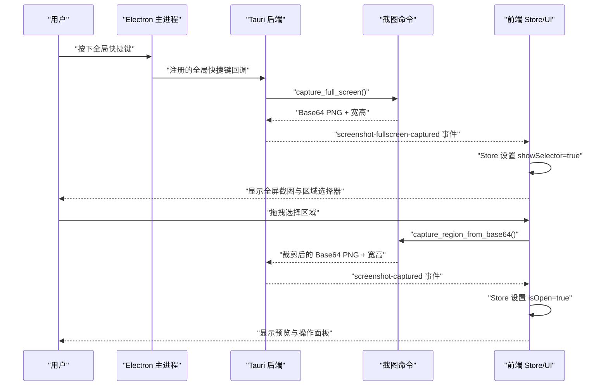
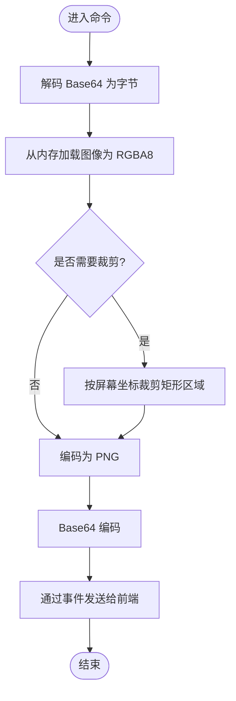
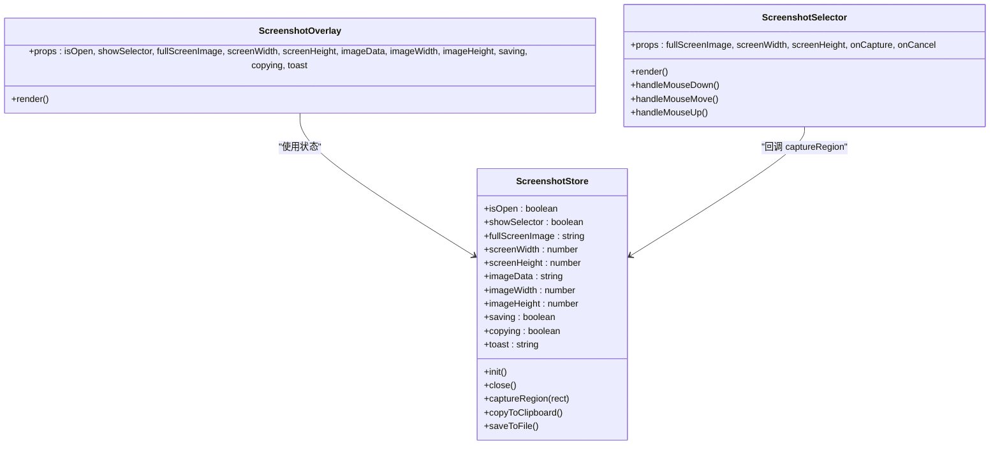
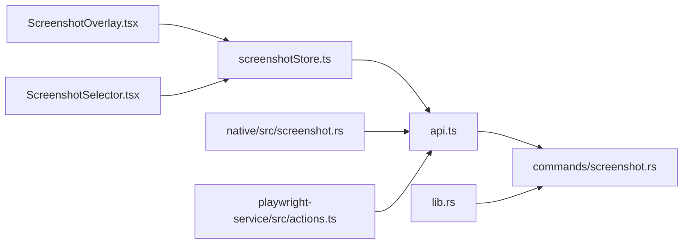

# 截图工具

<cite>
**本文档引用的文件**
- [src-tauri/src/commands/screenshot.rs](file://src-tauri/src/commands/screenshot.rs)
- [native/src/screenshot.rs](file://native/src/screenshot.rs)
- [src-web/src/components/ui/ScreenshotSelector.tsx](file://src-web/src/components/ui/ScreenshotSelector.tsx)
- [src-web/src/components/ui/ScreenshotOverlay.tsx](file://src-web/src/components/ui/ScreenshotOverlay.tsx)
- [src-web/src/stores/screenshotStore.ts](file://src-web/src/stores/screenshotStore.ts)
- [src-web/src/lib/api.ts](file://src-web/src/lib/api.ts)
- [src-tauri/src/lib.rs](file://src-tauri/src/lib.rs)
- [electron/main.ts](file://electron/main.ts)
- [playwright-service/src/actions.ts](file://playwright-service/src/actions.ts)
</cite>

## 目录
1. [简介](#简介)
2. [项目结构](#项目结构)
3. [核心组件](#核心组件)
4. [架构总览](#架构总览)
5. [详细组件分析](#详细组件分析)
6. [依赖关系分析](#依赖关系分析)
7. [性能考虑](#性能考虑)
8. [故障排查指南](#故障排查指南)
9. [结论](#结论)
10. [附录](#附录)

## 简介
本文件系统性梳理 CoSurf 的截图工具功能，覆盖设计目标、应用场景、技术实现、UI 交互、性能优化、权限与隐私保护以及扩展与第三方集成。截图工具支持全屏截图、区域截图、页面元素截图，并提供复制到剪贴板、保存为文件、预览与编辑等能力。前端通过 Store 管理状态，后端通过 Tauri/N-API 命令实现屏幕捕获与图像处理，采用 Base64 编码传输 PNG 图像，确保跨平台一致性与易用性。

## 项目结构
截图工具涉及前后端多层协作：
- 前端（React + Zustand）：负责 UI 展示、事件监听、用户交互、状态管理与文件对话框调用。
- 后端（Tauri）：提供全局快捷键注册、IPC 命令处理、屏幕捕获与图像处理。
- 原生模块（N-API）：提供与 Tauri 命令相同的截图能力，便于扩展或独立使用。
- Playwright 服务：提供页面级截图能力，与浏览器自动化结合。

图表来源
- [src-web/src/components/ui/ScreenshotOverlay.tsx:1-153](file://src-web/src/components/ui/ScreenshotOverlay.tsx#L1-L153)
- [src-web/src/components/ui/ScreenshotSelector.tsx:1-160](file://src-web/src/components/ui/ScreenshotSelector.tsx#L1-L160)
- [src-web/src/stores/screenshotStore.ts:1-174](file://src-web/src/stores/screenshotStore.ts#L1-L174)
- [src-web/src/lib/api.ts:345-360](file://src-web/src/lib/api.ts#L345-L360)
- [src-tauri/src/lib.rs:75-93](file://src-tauri/src/lib.rs#L75-L93)
- [src-tauri/src/commands/screenshot.rs:14-58](file://src-tauri/src/commands/screenshot.rs#L14-L58)
- [native/src/screenshot.rs:10-40](file://native/src/screenshot.rs#L10-L40)
- [playwright-service/src/actions.ts:90-106](file://playwright-service/src/actions.ts#L90-L106)

章节来源
- [src-web/src/components/ui/ScreenshotOverlay.tsx:1-153](file://src-web/src/components/ui/ScreenshotOverlay.tsx#L1-L153)
- [src-web/src/components/ui/ScreenshotSelector.tsx:1-160](file://src-web/src/components/ui/ScreenshotSelector.tsx#L1-L160)
- [src-web/src/stores/screenshotStore.ts:1-174](file://src-web/src/stores/screenshotStore.ts#L1-L174)
- [src-web/src/lib/api.ts:345-360](file://src-web/src/lib/api.ts#L345-L360)
- [src-tauri/src/lib.rs:75-93](file://src-tauri/src/lib.rs#L75-L93)
- [src-tauri/src/commands/screenshot.rs:14-58](file://src-tauri/src/commands/screenshot.rs#L14-L58)
- [native/src/screenshot.rs:10-40](file://native/src/screenshot.rs#L10-L40)
- [playwright-service/src/actions.ts:90-106](file://playwright-service/src/actions.ts#L90-L106)

## 核心组件
- 全屏截图命令：触发屏幕捕获，编码为 PNG 并以 Base64 通过事件传递给前端。
- 区域截图命令：从前端传入的全屏 Base64 截图中裁剪指定矩形区域，返回裁剪后的 Base64 PNG。
- 保存与复制：将 Base64 截图写入文件或复制到系统剪贴板。
- 前端 Store：管理截图状态、事件监听、快捷键触发、文件保存对话框、Toast 提示。
- UI 组件：全屏预览、区域选择器、操作面板（复制、保存、取消）。
- 原生 N-API：提供与 Tauri 命令一致的截图能力，便于扩展或独立调用。
- Playwright 页面截图：支持页面全页或元素截图，输出 Base64 PNG。

章节来源
- [src-tauri/src/commands/screenshot.rs:14-165](file://src-tauri/src/commands/screenshot.rs#L14-L165)
- [native/src/screenshot.rs:10-129](file://native/src/screenshot.rs#L10-L129)
- [src-web/src/stores/screenshotStore.ts:1-174](file://src-web/src/stores/screenshotStore.ts#L1-L174)
- [src-web/src/components/ui/ScreenshotOverlay.tsx:1-153](file://src-web/src/components/ui/ScreenshotOverlay.tsx#L1-L153)
- [src-web/src/components/ui/ScreenshotSelector.tsx:1-160](file://src-web/src/components/ui/ScreenshotSelector.tsx#L1-L160)
- [playwright-service/src/actions.ts:90-106](file://playwright-service/src/actions.ts#L90-L106)

## 架构总览
截图工具采用“前端事件驱动 + 后端命令处理”的架构。全局快捷键触发后端命令，后端捕获屏幕并以 Base64 PNG 事件形式回传前端；前端 Store 监听事件，切换 UI 状态并提供区域选择与操作面板。页面元素截图由 Playwright 服务提供，与浏览器自动化流程无缝衔接。

图表来源
- [src-tauri/src/lib.rs:75-93](file://src-tauri/src/lib.rs#L75-L93)
- [src-tauri/src/commands/screenshot.rs:14-58](file://src-tauri/src/commands/screenshot.rs#L14-L58)
- [src-web/src/stores/screenshotStore.ts:38-92](file://src-web/src/stores/screenshotStore.ts#L38-L92)
- [src-web/src/components/ui/ScreenshotOverlay.tsx:50-61](file://src-web/src/components/ui/ScreenshotOverlay.tsx#L50-L61)
- [src-web/src/components/ui/ScreenshotSelector.tsx:61-102](file://src-web/src/components/ui/ScreenshotSelector.tsx#L61-L102)

## 详细组件分析

### 全屏截图与区域截图命令
- 全屏截图：使用屏幕库捕获当前主显示器图像，转为 RGBA8，编码为 PNG，再进行 Base64 编码并通过事件发送给前端。
- 区域截图：接收前端传入的全屏 Base64 截图，解码为图像，按屏幕坐标与矩形参数裁剪，再编码为 PNG 返回前端。
- 保存与复制：将 Base64 截图写入文件或复制到系统剪贴板，使用系统剪贴板库进行像素数据写入。

图表来源
- [src-tauri/src/commands/screenshot.rs:61-119](file://src-tauri/src/commands/screenshot.rs#L61-L119)

章节来源
- [src-tauri/src/commands/screenshot.rs:14-165](file://src-tauri/src/commands/screenshot.rs#L14-L165)

### 前端状态与 UI 交互
- Store 管理：打开状态、选择器状态、全屏与裁剪后的图像数据、尺寸、保存/复制状态、Toast 提示。
- 事件监听：监听全局快捷键触发与后端事件，切换 UI 状态。
- 区域选择器：计算图片实际显示尺寸与缩放比例，将鼠标坐标映射到屏幕物理像素，绘制选区并显示尺寸提示。
- 操作面板：复制到剪贴板、保存为文件、取消；保存时弹出文件对话框，默认文件名为带时间戳的 PNG。

图表来源
- [src-web/src/stores/screenshotStore.ts:5-23](file://src-web/src/stores/screenshotStore.ts#L5-L23)
- [src-web/src/components/ui/ScreenshotOverlay.tsx:9-25](file://src-web/src/components/ui/ScreenshotOverlay.tsx#L9-L25)
- [src-web/src/components/ui/ScreenshotSelector.tsx:4-10](file://src-web/src/components/ui/ScreenshotSelector.tsx#L4-L10)

章节来源
- [src-web/src/stores/screenshotStore.ts:1-174](file://src-web/src/stores/screenshotStore.ts#L1-L174)
- [src-web/src/components/ui/ScreenshotOverlay.tsx:1-153](file://src-web/src/components/ui/ScreenshotOverlay.tsx#L1-L153)
- [src-web/src/components/ui/ScreenshotSelector.tsx:1-160](file://src-web/src/components/ui/ScreenshotSelector.tsx#L1-L160)

### 原生 N-API 截图模块
- 提供与 Tauri 命令一致的截图能力，便于在非 Tauri 环境或扩展场景下使用。
- 支持全屏截图、区域裁剪、保存、复制到剪贴板，均以 JSON 字符串返回结果，包含 Base64 图像与宽高。

章节来源
- [native/src/screenshot.rs:10-129](file://native/src/screenshot.rs#L10-L129)

### 页面元素截图（Playwright）
- 支持页面全页截图或指定元素截图，根据请求类型选择相应 API，返回 Base64 PNG 与 MIME 类型。
- 与浏览器自动化流程结合，适合网页内容分析与 AI 辅助场景。

章节来源
- [playwright-service/src/actions.ts:90-106](file://playwright-service/src/actions.ts#L90-L106)

## 依赖关系分析
- 前端依赖：
  - Store 依赖事件系统与 API 适配层。
  - UI 组件依赖 Store 状态与工具函数。
- 后端依赖：
  - Tauri 插件：全局快捷键、对话框、文件系统、HTTP、通知、窗口状态等。
  - 截图命令依赖图像处理库与屏幕捕获库。
- 原生依赖：
  - N-API 依赖图像处理库与剪贴板库。
- 第三方服务：
  - Playwright 服务提供页面截图能力。

图表来源
- [src-web/src/lib/api.ts:345-360](file://src-web/src/lib/api.ts#L345-L360)
- [src-tauri/src/lib.rs:108-214](file://src-tauri/src/lib.rs#L108-L214)
- [src-web/src/stores/screenshotStore.ts:1-174](file://src-web/src/stores/screenshotStore.ts#L1-L174)
- [src-web/src/components/ui/ScreenshotOverlay.tsx:1-153](file://src-web/src/components/ui/ScreenshotOverlay.tsx#L1-L153)
- [src-web/src/components/ui/ScreenshotSelector.tsx:1-160](file://src-web/src/components/ui/ScreenshotSelector.tsx#L1-L160)
- [native/src/screenshot.rs:10-129](file://native/src/screenshot.rs#L10-L129)
- [playwright-service/src/actions.ts:90-106](file://playwright-service/src/actions.ts#L90-L106)

章节来源
- [src-web/src/lib/api.ts:345-360](file://src-web/src/lib/api.ts#L345-L360)
- [src-tauri/src/lib.rs:108-214](file://src-tauri/src/lib.rs#L108-L214)

## 性能考虑
- 异步处理：全局快捷键触发后端命令采用异步运行时，避免阻塞 UI。
- 增量更新：前端通过事件驱动状态变更，减少不必要的重渲染。
- 图像处理：在内存中进行解码、裁剪与编码，尽量避免临时文件写入。
- Base64 传输：统一以 Base64 PNG 传输，简化跨平台兼容性，但注意内存占用与 CPU 开销。
- 压缩与分辨率：当前实现使用 PNG 编码，未见显式压缩参数；若需更小体积可考虑 JPEG 与质量参数（页面截图已体现）。

章节来源
- [src-tauri/src/lib.rs:78-86](file://src-tauri/src/lib.rs#L78-L86)
- [src-tauri/src/commands/screenshot.rs:14-58](file://src-tauri/src/commands/screenshot.rs#L14-L58)
- [playwright-service/src/actions.ts:90-106](file://playwright-service/src/actions.ts#L90-L106)

## 故障排查指南
- 全局快捷键无效
  - 检查后端是否成功注册快捷键，确认平台差异（macOS 使用 Command+Shift+X，Windows/Linux 使用 Control+Shift+X）。
  - 查看日志输出，确认快捷键回调是否触发。
- 截图失败
  - 检查屏幕捕获库是否可用，确认显示器枚举与捕获是否成功。
  - 检查 Base64 解码与图像编码过程中的错误信息。
- 区域选择无效
  - 确认图片加载完成后再计算显示尺寸与缩放比例。
  - 检查坐标转换逻辑，确保将屏幕坐标映射到物理像素。
- 复制/保存失败
  - 检查剪贴板访问权限与系统剪贴板库初始化。
  - 检查文件路径与权限，确认对话框返回的路径有效。

章节来源
- [src-tauri/src/lib.rs:75-93](file://src-tauri/src/lib.rs#L75-L93)
- [electron/main.ts:147-157](file://electron/main.ts#L147-L157)
- [src-tauri/src/commands/screenshot.rs:9-165](file://src-tauri/src/commands/screenshot.rs#L9-L165)
- [src-web/src/stores/screenshotStore.ts:134-172](file://src-web/src/stores/screenshotStore.ts#L134-L172)

## 结论
CoSurf 的截图工具通过前后端协同，实现了全屏截图、区域截图、页面元素截图、复制与保存等功能。其架构清晰、扩展性强，既可通过全局快捷键一键触发，也可在页面内进行精确选择。后续可在保证用户体验的前提下，引入更灵活的图像格式与压缩策略，并完善权限与隐私保护机制。

## 附录

### 截图模式与实现机制
- 全屏捕获：后端调用屏幕捕获库，返回 Base64 PNG 与尺寸，前端显示全屏预览与区域选择器。
- 区域选择：前端计算图片实际显示尺寸与缩放比例，将鼠标坐标映射到屏幕物理像素，绘制选区并触发后端裁剪。
- 页面元素截图：通过 Playwright 服务对页面或元素进行截图，返回 Base64 PNG，便于与 AI 分析流程结合。

章节来源
- [src-tauri/src/commands/screenshot.rs:14-119](file://src-tauri/src/commands/screenshot.rs#L14-L119)
- [src-web/src/components/ui/ScreenshotSelector.tsx:20-102](file://src-web/src/components/ui/ScreenshotSelector.tsx#L20-L102)
- [playwright-service/src/actions.ts:90-106](file://playwright-service/src/actions.ts#L90-L106)

### 截图质量控制与优化策略
- 当前实现使用 PNG 编码，保持无损质量；如需减小体积可考虑 JPEG 与质量参数（页面截图已体现）。
- Base64 编码增加约 33% 体积，传输效率略低；可考虑二进制传输或压缩后再编码。
- 内存管理：图像解码与编码在内存中完成，建议在大分辨率场景下限制最大尺寸或采用分块处理。

章节来源
- [src-tauri/src/commands/screenshot.rs:31-38](file://src-tauri/src/commands/screenshot.rs#L31-L38)
- [playwright-service/src/actions.ts:90-106](file://playwright-service/src/actions.ts#L90-L106)

### 截图与 AI 功能结合
- 页面内容分析：页面截图可与 AI 内容分析流程结合，先进行页面截图，再进行内容识别与智能标注。
- 读取与理解：页面截图可用于网页内容分析师，帮助用户快速理解页面核心主题、要点与结构。

章节来源
- [playwright-service/src/actions.ts:90-106](file://playwright-service/src/actions.ts#L90-L106)
- [src-web/src/lib/api.ts:325-343](file://src-web/src/lib/api.ts#L325-L343)

### 存储与管理
- 文件命名：保存时默认使用带时间戳的 PNG 文件名，便于区分与检索。
- 分类整理：可结合浏览器历史与标签页管理，将截图与浏览记录关联。
- 批量处理：当前未见批量处理接口，可通过外部脚本或扩展实现。

章节来源
- [src-web/src/stores/screenshotStore.ts:155-165](file://src-web/src/stores/screenshotStore.ts#L155-L165)

### 用户界面设计
- 选择器：半透明遮罩、十字光标、实时绘制选区与尺寸提示。
- 预览：居中显示截图，支持 Esc 关闭与点击遮罩关闭。
- 编辑功能：当前提供复制与保存，后续可扩展标注与标记功能。

章节来源
- [src-web/src/components/ui/ScreenshotOverlay.tsx:65-151](file://src-web/src/components/ui/ScreenshotOverlay.tsx#L65-L151)
- [src-web/src/components/ui/ScreenshotSelector.tsx:104-158](file://src-web/src/components/ui/ScreenshotSelector.tsx#L104-L158)

### 权限控制与隐私保护
- 全局快捷键：跨平台注册，需遵循系统权限与快捷键冲突处理。
- 剪贴板访问：需确保剪贴板库初始化成功，避免权限不足导致失败。
- 文件保存：通过对话框选择路径，避免硬编码路径带来的安全风险。

章节来源
- [src-tauri/src/lib.rs:75-93](file://src-tauri/src/lib.rs#L75-L93)
- [src-tauri/src/commands/screenshot.rs:135-165](file://src-tauri/src/commands/screenshot.rs#L135-L165)
- [src-web/src/stores/screenshotStore.ts:150-172](file://src-web/src/stores/screenshotStore.ts#L150-L172)

### 扩展接口与第三方集成
- N-API 模块：提供与 Tauri 命令一致的截图能力，便于在其他环境或扩展中复用。
- Playwright 服务：与浏览器自动化结合，支持页面级截图，便于与 AI 分析与技能执行流程集成。
- IPC 适配层：统一的 API 适配层封装 IPC 调用，便于替换与扩展。

章节来源
- [native/src/screenshot.rs:10-129](file://native/src/screenshot.rs#L10-L129)
- [playwright-service/src/actions.ts:90-106](file://playwright-service/src/actions.ts#L90-L106)
- [src-web/src/lib/api.ts:13-19](file://src-web/src/lib/api.ts#L13-L19)