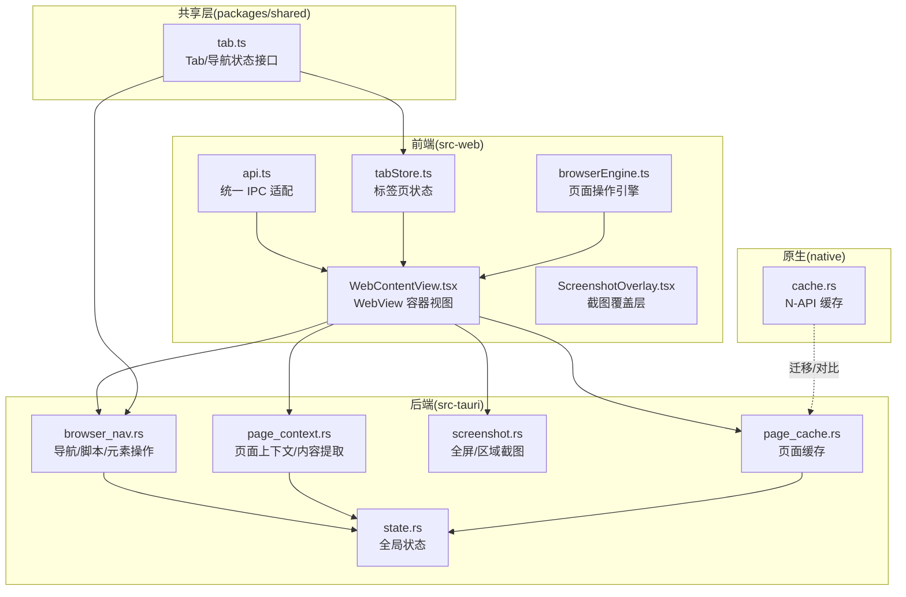
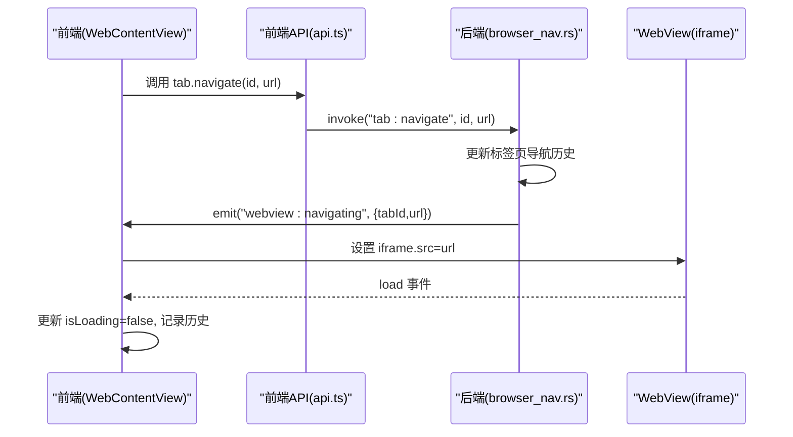
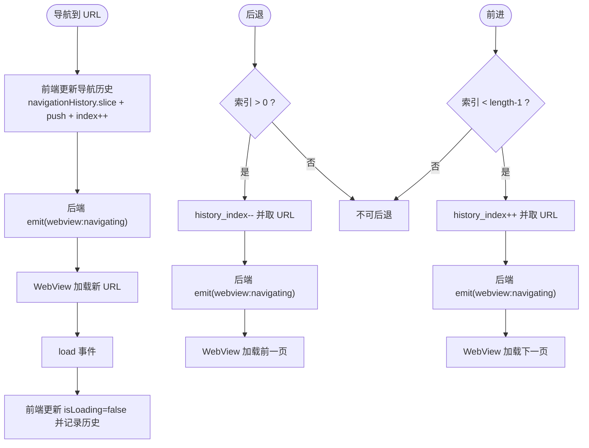
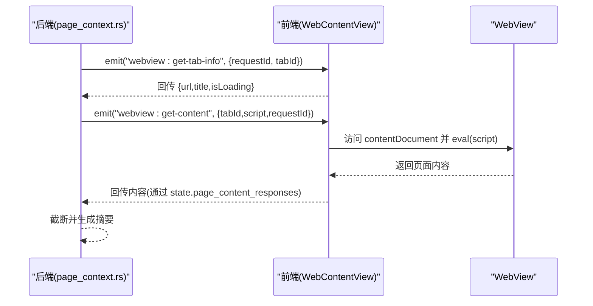
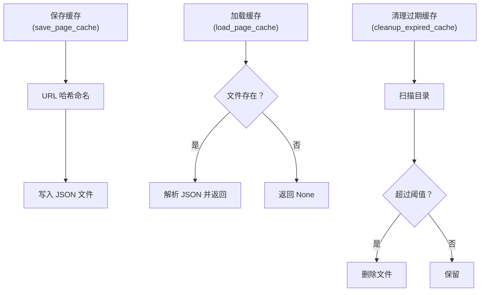
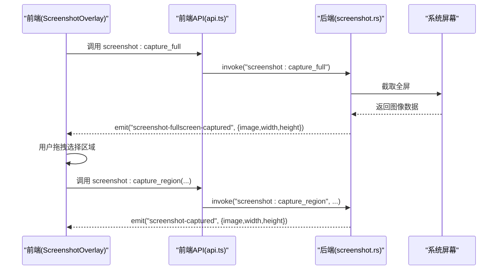
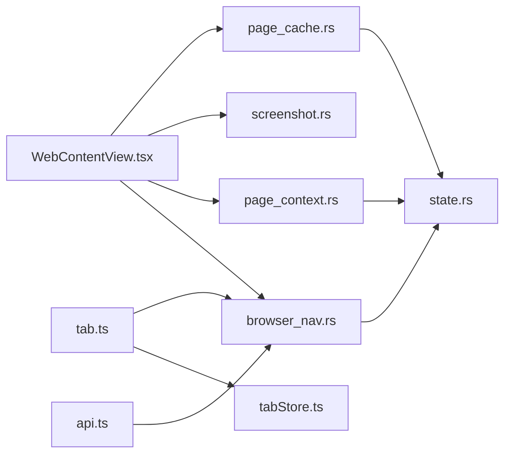

# 浏览器集成

<cite>
**本文档引用的文件**
- [browserEngine.ts](file://src-web/src/lib/browserEngine.ts)
- [WebView2Container.tsx](file://src-web/src/components/layout/WebView2Container.tsx)
- [WebContentView.tsx](file://src-web/src/components/layout/WebContentView.tsx)
- [tabStore.ts](file://src-web/src/stores/tabStore.ts)
- [tab.ts](file://packages/shared/src/tab.ts)
- [api.ts](file://src-web/src/lib/api.ts)
- [browser_nav.rs](file://src-tauri/src/commands/browser_nav.rs)
- [browser.rs](file://src-tauri/src/commands/browser.rs)
- [page_context.rs](file://src-tauri/src/commands/page_context.rs)
- [screenshot.rs](file://src-tauri/src/commands/screenshot.rs)
- [page_cache.rs](file://src-tauri/src/commands/page_cache.rs)
- [cache.rs](file://native/src/cache.rs)
- [state.rs](file://src-tauri/src/state.rs)
- [ScreenshotOverlay.tsx](file://src-web/src/components/ui/ScreenshotOverlay.tsx)
- [ScreenshotSelector.tsx](file://src-web/src/components/ui/ScreenshotSelector.tsx)
</cite>

## 目录
1. [简介](#简介)
2. [项目结构](#项目结构)
3. [核心组件](#核心组件)
4. [架构总览](#架构总览)
5. [详细组件分析](#详细组件分析)
6. [依赖关系分析](#依赖关系分析)
7. [性能考虑](#性能考虑)
8. [故障排查指南](#故障排查指南)
9. [结论](#结论)
10. [附录](#附录)

## 简介
本文件面向 CoSurf 的浏览器集成功能，系统性阐述以下方面：
- WebView2 内核的集成方式与配置要点
- 多标签页管理系统（创建、切换、关闭、导航历史）
- 页面上下文提取机制（供 AI 使用）
- 页面缓存系统设计与实现
- 浏览器控制命令（导航、刷新、后退、前进、脚本执行）
- 页面内容提取与处理流程
- 截图工具（全屏与区域截图）
- 与外部浏览器的兼容性与限制
- 性能优化与内存管理策略

## 项目结构
CoSurf 采用前端 React + Tauri 的混合架构，浏览器相关能力主要分布在：
- 前端层（src-web）：负责 UI、事件、IPC 适配与页面交互
- 后端层（src-tauri）：负责 WebView 控制、导航历史、页面上下文、截图、缓存等
- 共享层（packages/shared）：定义 Tab、导航状态等共享数据结构
- 原生桥接（native）：提供 N-API 缓存能力（迁移自后端）

图表来源
- [api.ts:286-339](file://src-web/src/lib/api.ts#L286-L339)
- [WebContentView.tsx:114-292](file://src-web/src/components/layout/WebContentView.tsx#L114-L292)
- [tabStore.ts:38-229](file://src-web/src/stores/tabStore.ts#L38-L229)
- [browser_nav.rs:32-81](file://src-tauri/src/commands/browser_nav.rs#L32-L81)
- [page_context.rs:21-107](file://src-tauri/src/commands/page_context.rs#L21-L107)
- [screenshot.rs:14-58](file://src-tauri/src/commands/screenshot.rs#L14-L58)
- [page_cache.rs:162-193](file://src-tauri/src/commands/page_cache.rs#L162-L193)
- [state.rs:9-23](file://src-tauri/src/state.rs#L9-L23)
- [cache.rs:61-81](file://native/src/cache.rs#L61-L81)

章节来源
- [api.ts:286-339](file://src-web/src/lib/api.ts#L286-L339)
- [WebContentView.tsx:114-292](file://src-web/src/components/layout/WebContentView.tsx#L114-L292)
- [tabStore.ts:38-229](file://src-web/src/stores/tabStore.ts#L38-L229)
- [tab.ts:1-32](file://packages/shared/src/tab.ts#L1-L32)

## 核心组件
- WebView2 容器与页面加载：前端通过 iframe 承载页面，后端通过事件驱动导航与刷新；为规避 Tauri 动态创建 WebView 的限制，采用 iframe 方案并修复 shell.open 权限问题。
- 标签页状态管理：前端使用 Zustand 管理标签页集合与活动标签页，后端维护每个标签页的导航历史与索引。
- 页面上下文提取：后端向前端发出“获取页面内容”事件，前端在可访问范围内提取内容并回传，用于 AI 上下文与总结。
- 页面缓存：后端实现基于文件系统的页面缓存（URL 哈希命名），支持保存、加载与过期清理；原生模块提供 N-API 缓存能力。
- 截图系统：后端截取全屏并编码为 Base64，前端展示覆盖层与区域选择器，支持复制到剪贴板与保存文件。
- 浏览器控制命令：后端提供导航、刷新、后退、前进、脚本执行、元素点击/输入、滚动等命令。

章节来源
- [WebView2Container.tsx:1-13](file://src-web/src/components/layout/WebView2Container.tsx#L1-L13)
- [WebContentView.tsx:114-292](file://src-web/src/components/layout/WebContentView.tsx#L114-L292)
- [tabStore.ts:38-229](file://src-web/src/stores/tabStore.ts#L38-L229)
- [browser_nav.rs:32-81](file://src-tauri/src/commands/browser_nav.rs#L32-L81)
- [page_context.rs:21-107](file://src-tauri/src/commands/page_context.rs#L21-L107)
- [page_cache.rs:162-193](file://src-tauri/src/commands/page_cache.rs#L162-L193)
- [screenshot.rs:14-58](file://src-tauri/src/commands/screenshot.rs#L14-L58)

## 架构总览
前端与后端通过事件与 IPC 通信，形成“命令-事件-响应”的闭环：
- 前端发起命令（导航、刷新、脚本执行、截图、缓存操作）
- 后端通过 WebView 事件驱动页面行为
- 后端向前端请求页面上下文/内容，前端在可访问范围内提取并回传
- 全局状态（导航历史、页面内容响应缓存、最近打开 URL）由后端维护

图表来源
- [api.ts:299-300](file://src-web/src/lib/api.ts#L299-L300)
- [browser_nav.rs:32-81](file://src-tauri/src/commands/browser_nav.rs#L32-L81)
- [WebContentView.tsx:596-617](file://src-web/src/components/layout/WebContentView.tsx#L596-L617)

## 详细组件分析

### WebView2 集成与配置
- 集成方案：前端使用 iframe 承载页面，避免 Tauri 2.x 动态创建多个 WebView 的限制；同时通过注入脚本与事件拦截，解决 shell.open 权限问题与跨域链接处理。
- 配置要点：
  - 通过 postMessage 与 window.open 拦截，将外部链接与新标签页请求转交给父窗口处理
  - 静默处理 iframe 中的 shell.open 错误，避免影响用户体验
  - 对跨域网站，标题与内容提取通过后端辅助（HTTP 请求与事件回传）

章节来源
- [WebView2Container.tsx:1-13](file://src-web/src/components/layout/WebView2Container.tsx#L1-L13)
- [WebContentView.tsx:17-108](file://src-web/src/components/layout/WebContentView.tsx#L17-L108)
- [WebContentView.tsx:770-772](file://src-web/src/components/layout/WebContentView.tsx#L770-L772)

### 多标签页管理系统
- 前端状态：
  - 使用 Zustand 管理 tabs、activeTabId、导航历史与索引
  - 支持添加、关闭、切换、重排、导航到指定 URL、后退/前进、判断可用性
- 后端状态：
  - 使用全局 HashMap 维护每个标签页的 current_url、navigation_history、history_index
  - 提供 browser_get_state、browser_close_tab 等命令
- 导航历史：
  - 前端与后端均维护 navigationHistory 与 navigationIndex
  - goBack/goForward 会裁剪历史记录并更新索引

图表来源
- [tabStore.ts:151-214](file://src-web/src/stores/tabStore.ts#L151-L214)
- [browser_nav.rs:32-81](file://src-tauri/src/commands/browser_nav.rs#L32-L81)
- [browser_nav.rs:95-175](file://src-tauri/src/commands/browser_nav.rs#L95-L175)
- [WebContentView.tsx:596-617](file://src-web/src/components/layout/WebContentView.tsx#L596-L617)

章节来源
- [tabStore.ts:38-229](file://src-web/src/stores/tabStore.ts#L38-L229)
- [tab.ts:1-32](file://packages/shared/src/tab.ts#L1-L32)
- [browser_nav.rs:9-12](file://src-tauri/src/commands/browser_nav.rs#L9-L12)

### 导航历史系统
- 前端：每个标签页维护 navigationHistory 与 navigationIndex，goBack/goForward 仅在索引边界内生效
- 后端：维护每个标签页的 TabState（current_url、navigation_history、history_index），提供 browser_get_state 查询状态
- 历史记录存储与检索：
  - 前端：navigateTo 时裁剪历史并追加新 URL
  - 后端：browser_navigate 时同样裁剪并追加，保持一致性

章节来源
- [tabStore.ts:151-171](file://src-web/src/stores/tabStore.ts#L151-L171)
- [browser_nav.rs:32-62](file://src-tauri/src/commands/browser_nav.rs#L32-L62)
- [browser.rs:7-64](file://src-tauri/src/commands/browser.rs#L7-L64)

### 页面上下文提取机制
- 目标：为 AI 提供当前页面的 URL、标题、域名、安全状态与内容摘要
- 流程：
  - 后端调用 get_page_context，向前端发出 webview:get-tab-info 请求
  - 前端 WebContentView 响应并回传标签页信息
  - 后端进一步请求 webview:get-content，前端在可访问范围内执行脚本提取内容并回传
  - 后端将内容截断并返回摘要，或在跨域/超时情况下返回错误提示
- 安全与跨域：
  - 对于同源页面，可直接 eval 提取内容
  - 对于跨域页面，通过 HTTP 请求获取标题，内容提取受限

图表来源
- [page_context.rs:21-107](file://src-tauri/src/commands/page_context.rs#L21-L107)
- [WebContentView.tsx:619-684](file://src-web/src/components/layout/WebContentView.tsx#L619-L684)
- [state.rs:14-15](file://src-tauri/src/state.rs#L14-L15)

章节来源
- [page_context.rs:21-107](file://src-tauri/src/commands/page_context.rs#L21-L107)
- [WebContentView.tsx:619-684](file://src-web/src/components/layout/WebContentView.tsx#L619-L684)
- [state.rs:14-15](file://src-tauri/src/state.rs#L14-L15)

### 页面缓存系统
- 设计目标：持久化页面内容，减少重复抓取与网络开销
- 后端实现：
  - 文件系统缓存：URL 哈希命名，保存 JSON（含 url、title、content、timestamp、content_length）
  - 提供 save/load/cleanup 命令，默认保留 24 小时
- 原生模块（N-API）：
  - 提供 cache_save/cache_load/cache_cleanup，与后端逻辑对应
- 使用建议：
  - 对于 AI 总结与上下文提取，优先使用缓存内容
  - 定期清理过期缓存，控制磁盘占用

图表来源
- [page_cache.rs:54-89](file://src-tauri/src/commands/page_cache.rs#L54-L89)
- [page_cache.rs:91-124](file://src-tauri/src/commands/page_cache.rs#L91-L124)
- [page_cache.rs:126-159](file://src-tauri/src/commands/page_cache.rs#L126-L159)
- [cache.rs:61-108](file://native/src/cache.rs#L61-L108)

章节来源
- [page_cache.rs:162-253](file://src-tauri/src/commands/page_cache.rs#L162-L253)
- [cache.rs:61-108](file://native/src/cache.rs#L61-L108)

### 浏览器控制命令
- 导航与刷新：
  - browser_navigate：更新历史并通知前端设置 iframe.src
  - browser_reload：通知前端刷新当前页面
- 后退/前进：
  - browser_go_back / browser_go_forward：更新索引并加载对应 URL
- 页面操作：
  - browser_execute_script：在 WebView 中执行脚本
  - browser_get_page_content：提取页面内容（供 AI 上下文）
  - browser_screenshot：预留截图命令（当前为占位）
- 元素交互：
  - browser_toggle_select_mode：启用/禁用元素选择模式
  - browser_click_element / browser_input_text / browser_scroll：在页面中执行点击/输入/滚动

章节来源
- [browser_nav.rs:32-81](file://src-tauri/src/commands/browser_nav.rs#L32-L81)
- [browser_nav.rs:83-93](file://src-tauri/src/commands/browser_nav.rs#L83-L93)
- [browser_nav.rs:95-175](file://src-tauri/src/commands/browser_nav.rs#L95-L175)
- [browser_nav.rs:221-266](file://src-tauri/src/commands/browser_nav.rs#L221-L266)
- [browser_nav.rs:268-277](file://src-tauri/src/commands/browser_nav.rs#L268-L277)
- [browser_nav.rs:279-364](file://src-tauri/src/commands/browser_nav.rs#L279-L364)
- [browser_nav.rs:366-461](file://src-tauri/src/commands/browser_nav.rs#L366-L461)

### 页面内容提取与处理
- 前端策略：
  - 对于同源页面：直接访问 contentDocument 并执行脚本提取内容
  - 对于跨域页面：通过后端 HTTP 请求获取标题，内容提取受限
- 后端策略：
  - 提供 get_page_context 与 summarize_page，结合前端响应生成摘要
  - 对超时/跨域等情况返回明确错误提示，引导用户手动复制内容

章节来源
- [WebContentView.tsx:619-684](file://src-web/src/components/layout/WebContentView.tsx#L619-L684)
- [page_context.rs:141-217](file://src-tauri/src/commands/page_context.rs#L141-L217)

### 截图工具
- 全屏截图：
  - 后端使用 xcap 获取屏幕图像，编码为 PNG 并通过事件发送到前端
- 区域截图：
  - 前端显示全屏截图并提供拖拽选择区域，后端裁剪并返回
- 前端交互：
  - ScreenshotOverlay 展示预览与操作栏（复制到剪贴板、保存文件）
  - ScreenshotSelector 实现坐标换算与区域选择

图表来源
- [screenshot.rs:14-58](file://src-tauri/src/commands/screenshot.rs#L14-L58)
- [screenshot.rs:60-119](file://src-tauri/src/commands/screenshot.rs#L60-L119)
- [ScreenshotOverlay.tsx:9-36](file://src-web/src/components/ui/ScreenshotOverlay.tsx#L9-L36)
- [ScreenshotSelector.tsx:12-50](file://src-web/src/components/ui/ScreenshotSelector.tsx#L12-L50)

章节来源
- [screenshot.rs:14-165](file://src-tauri/src/commands/screenshot.rs#L14-L165)
- [ScreenshotOverlay.tsx:9-153](file://src-web/src/components/ui/ScreenshotOverlay.tsx#L9-L153)
- [ScreenshotSelector.tsx:12-160](file://src-web/src/components/ui/ScreenshotSelector.tsx#L12-L160)

### 与外部浏览器的兼容性与限制
- WebView2 内核：通过 Tauri 的 WebView2 支持加载任意网站，但受跨域限制影响
- 跨域限制：
  - 同源页面：可直接访问 contentDocument 并提取内容
  - 跨域页面：无法直接访问，需通过后端 HTTP 请求标题，内容提取受限
- 链接拦截与权限：
  - 注入脚本与 postMessage/window.open 拦截，防止页面脚本滥用 shell.open
  - 对外部链接与 target="_blank" 的处理，统一通过父窗口创建新标签页

章节来源
- [WebContentView.tsx:17-108](file://src-web/src/components/layout/WebContentView.tsx#L17-L108)
- [WebContentView.tsx:712-772](file://src-web/src/components/layout/WebContentView.tsx#L712-L772)

## 依赖关系分析
- 前端依赖后端命令与事件：
  - WebContentView 监听 webview:navigating/webview:reload/webview:get-content 等事件
  - api.ts 封装 invoke 调用，统一命令入口
- 后端状态依赖：
  - 全局 HashMap 维护标签页导航状态
  - AppState 维护页面内容响应缓存、最近打开 URL 等
- 共享接口：
  - packages/shared 定义 Tab/导航状态，前后端一致

图表来源
- [api.ts:286-339](file://src-web/src/lib/api.ts#L286-L339)
- [WebContentView.tsx:596-684](file://src-web/src/components/layout/WebContentView.tsx#L596-L684)
- [browser_nav.rs:9-12](file://src-tauri/src/commands/browser_nav.rs#L9-L12)
- [page_context.rs:47-68](file://src-tauri/src/commands/page_context.rs#L47-L68)
- [page_cache.rs:162-193](file://src-tauri/src/commands/page_cache.rs#L162-L193)
- [state.rs:9-23](file://src-tauri/src/state.rs#L9-L23)
- [tabStore.ts:38-229](file://src-web/src/stores/tabStore.ts#L38-L229)
- [tab.ts:1-32](file://packages/shared/src/tab.ts#L1-L32)

章节来源
- [api.ts:286-339](file://src-web/src/lib/api.ts#L286-L339)
- [WebContentView.tsx:596-684](file://src-web/src/components/layout/WebContentView.tsx#L596-L684)
- [browser_nav.rs:9-12](file://src-tauri/src/commands/browser_nav.rs#L9-L12)
- [state.rs:9-23](file://src-tauri/src/state.rs#L9-L23)
- [tabStore.ts:38-229](file://src-web/src/stores/tabStore.ts#L38-L229)
- [tab.ts:1-32](file://packages/shared/src/tab.ts#L1-L32)

## 性能考虑
- 标签页焦点与加载：
  - WebPageView 在激活时进行多级聚焦（主窗口、容器、iframe、iframe 内容窗口），并设置加载超时保护，避免长时间卡顿
- 内容提取：
  - 对于跨域页面，优先使用后端 HTTP 请求标题；内容提取采用截断策略，避免大文本传输
- 截图：
  - 全屏截图后端直接编码为 PNG，前端仅展示与二次裁剪，降低内存压力
- 缓存：
  - 页面缓存采用文件系统与哈希命名，定期清理过期文件，控制磁盘占用
- 事件与锁：
  - 导航状态与页面内容响应使用 Mutex 保护，避免并发冲突

章节来源
- [WebContentView.tsx:433-511](file://src-web/src/components/layout/WebContentView.tsx#L433-L511)
- [WebContentView.tsx:561-593](file://src-web/src/components/layout/WebContentView.tsx#L561-L593)
- [page_context.rs:197-217](file://src-tauri/src/commands/page_context.rs#L197-L217)
- [screenshot.rs:14-58](file://src-tauri/src/commands/screenshot.rs#L14-L58)
- [page_cache.rs:126-159](file://src-tauri/src/commands/page_cache.rs#L126-L159)
- [state.rs:9-23](file://src-tauri/src/state.rs#L9-L23)

## 故障排查指南
- 页面无法加载或空白：
  - 检查 iframe load 事件是否触发，关注跨域与 X-Frame-Options 限制
  - 对于跨域网站，标题与内容提取会受限，需通过后端辅助
- 导航历史无效：
  - 确认前端 navigateTo 是否正确裁剪历史并更新索引
  - 后端 browser_navigate 是否正确更新 TabState
- 页面内容提取失败：
  - 同源页面：检查 contentDocument 可访问性
  - 跨域页面：确认后端 HTTP 请求标题是否成功，内容提取是否超时
- 截图异常：
  - 确认后端屏幕捕获权限与前端事件接收
  - 区域选择坐标换算是否正确
- 缓存问题：
  - 检查缓存目录是否存在与可写
  - 清理过期缓存后是否仍保留旧文件

章节来源
- [WebContentView.tsx:775-800](file://src-web/src/components/layout/WebContentView.tsx#L775-L800)
- [browser_nav.rs:32-62](file://src-tauri/src/commands/browser_nav.rs#L32-L62)
- [page_context.rs:197-217](file://src-tauri/src/commands/page_context.rs#L197-L217)
- [screenshot.rs:60-119](file://src-tauri/src/commands/screenshot.rs#L60-L119)
- [page_cache.rs:32-44](file://src-tauri/src/commands/page_cache.rs#L32-L44)

## 结论
CoSurf 的浏览器集成功能通过前端 iframe + 后端 WebView 的组合，实现了稳定的页面承载与丰富的控制能力。导航历史、页面上下文提取、缓存与截图等模块协同工作，既满足 AI 场景需求，又兼顾了跨域与权限限制下的兼容性。建议在生产环境中配合缓存清理与事件超时策略，持续优化加载与提取性能。

## 附录
- 前端页面操作引擎（browserEngine.ts）提供了智能选择器生成、元素等待、点击、输入、滚动、内容提取、表单自动填充等能力，便于在 AI 场景中快速构建页面交互动作。

章节来源
- [browserEngine.ts:22-521](file://src-web/src/lib/browserEngine.ts#L22-L521)