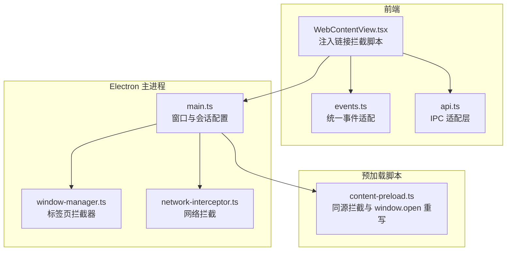
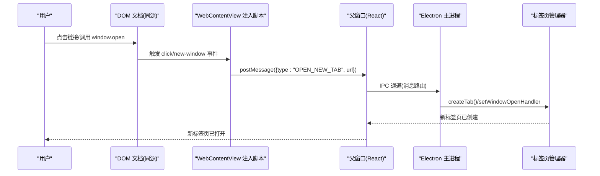
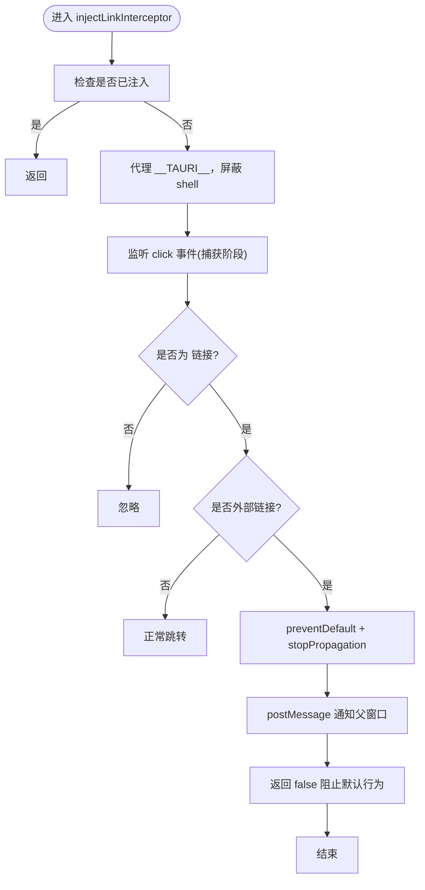
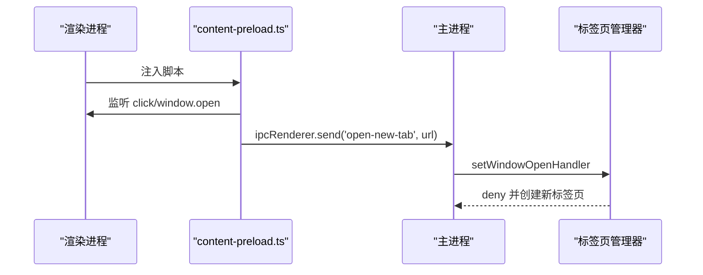
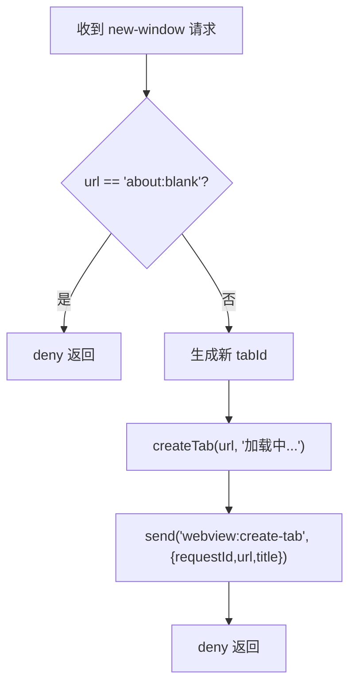
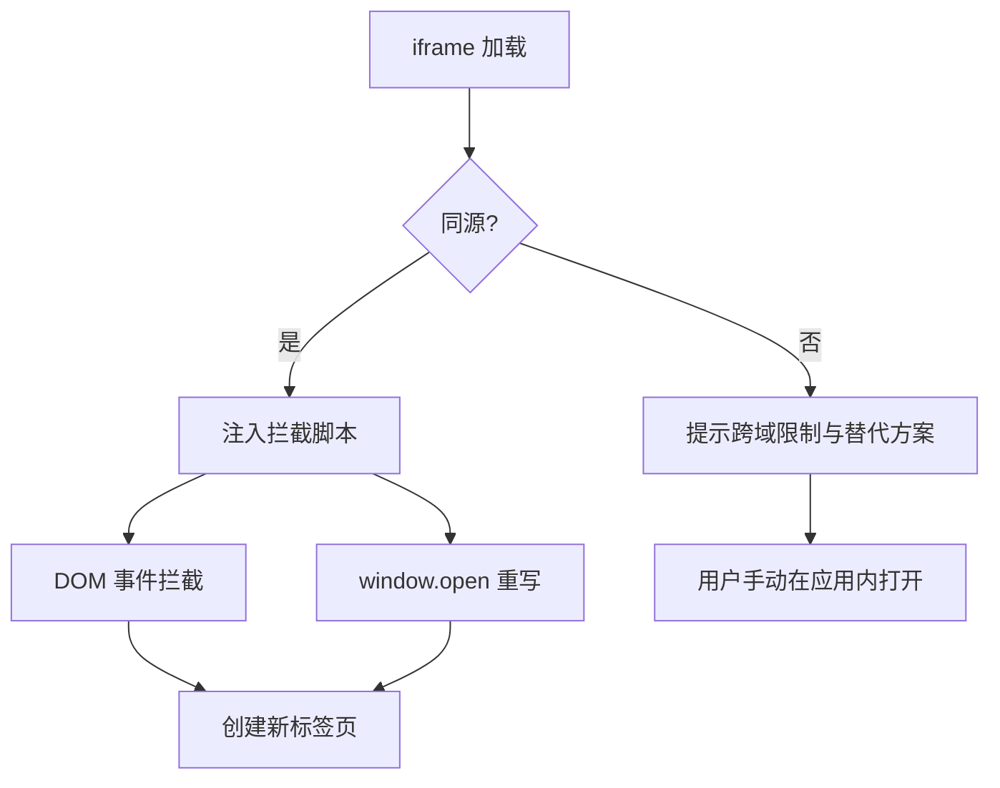
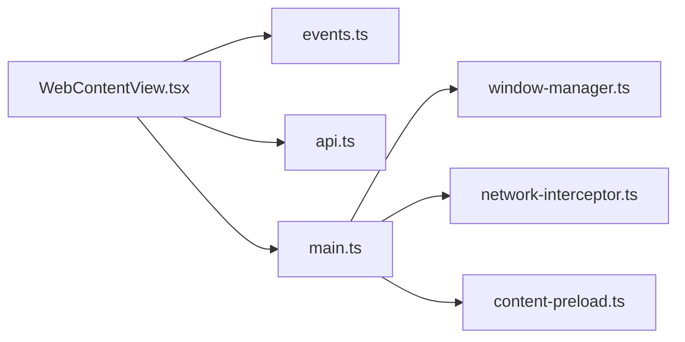

# 链接拦截机制

<cite>
**本文档引用的文件**
- [WebContentView.tsx](file://src-web/src/components/layout/WebContentView.tsx)
- [content-preload.ts](file://electron/content-preload.ts)
- [window-manager.ts](file://electron/window-manager.ts)
- [main.ts](file://electron/main.ts)
- [api.ts](file://src-web/src/lib/api.ts)
- [events.ts](file://src-web/src/lib/events.ts)
- [network-interceptor.ts](file://electron/network-interceptor.ts)
- [settings.ts](file://packages/shared/src/settings.ts)
- [bookmark.ts](file://packages/shared/src/bookmark.ts)
- [BookmarksPanel.tsx](file://src-web/src/components/sidebar/BookmarksPanel.tsx)
- [tauri.conf.json](file://src-tauri/tauri.conf.json)
</cite>

## 目录
1. [简介](#简介)
2. [项目结构](#项目结构)
3. [核心组件](#核心组件)
4. [架构总览](#架构总览)
5. [详细组件分析](#详细组件分析)
6. [依赖关系分析](#依赖关系分析)
7. [性能考量](#性能考量)
8. [故障排除指南](#故障排除指南)
9. [结论](#结论)
10. [附录](#附录)

## 简介
本文件系统性阐述 CoSurf 的链接拦截机制，覆盖设计目标、安全考虑、实现原理、策略类型、跨域处理、与浏览器默认行为的协调、安全防护、日志与调试、配置与自定义规则、与其他功能集成以及性能影响与优化策略。目标是在保证用户体验一致性的同时，有效防止恶意链接、控制新标签页打开、保护用户隐私。

## 项目结构
CoSurf 的链接拦截涉及前端 React 组件、Electron 主进程与预加载脚本、IPC 通信以及后端能力配置。整体采用“前端注入 + 主进程拦截 + IPC 协调”的分层架构。

**图表来源**
- [WebContentView.tsx:17-108](file://src-web/src/components/layout/WebContentView.tsx#L17-L108)
- [content-preload.ts:63-90](file://electron/content-preload.ts#L63-L90)
- [window-manager.ts:48-73](file://electron/window-manager.ts#L48-L73)
- [main.ts:58-78](file://electron/main.ts#L58-L78)

**章节来源**
- [WebContentView.tsx:17-108](file://src-web/src/components/layout/WebContentView.tsx#L17-L108)
- [content-preload.ts:63-90](file://electron/content-preload.ts#L63-L90)
- [window-manager.ts:48-73](file://electron/window-manager.ts#L48-L73)
- [main.ts:58-78](file://electron/main.ts#L58-L78)

## 核心组件
- 前端注入拦截器：在同源页面中通过 DOM 事件监听与 window.open 重写，拦截 target="_blank"、外部链接及 window.open 调用，统一通过 postMessage 通知父窗口创建新标签页。
- Electron 预加载脚本：在渲染进程内拦截 target="_blank" 链接与 window.open，发送 IPC 消息到主进程。
- 主进程标签页拦截器：拦截 iframe 中的弹出窗口请求，统一在应用内创建新标签页并阻止外部浏览器弹窗。
- 会话级安全策略：移除 CSP/X-Frame-Options，配合预加载脚本实现跨域页面的 window.open 拦截与消息通信。
- IPC 与事件系统：统一的事件适配层与 API 适配层，屏蔽 Tauri/Electron 的差异，提供一致的调用体验。

**章节来源**
- [WebContentView.tsx:17-108](file://src-web/src/components/layout/WebContentView.tsx#L17-L108)
- [content-preload.ts:63-90](file://electron/content-preload.ts#L63-L90)
- [window-manager.ts:48-73](file://electron/window-manager.ts#L48-L73)
- [main.ts:58-78](file://electron/main.ts#L58-L78)

## 架构总览
下图展示从用户点击链接到新标签页创建的完整流程，涵盖 DOM 事件、window.open 重写、postMessage/IPC 通信以及主进程拦截。

**图表来源**
- [WebContentView.tsx:46-105](file://src-web/src/components/layout/WebContentView.tsx#L46-L105)
- [content-preload.ts:63-90](file://electron/content-preload.ts#L63-L90)
- [window-manager.ts:48-73](file://electron/window-manager.ts#L48-L73)

## 详细组件分析

### 组件 A：前端注入拦截器（同源）
- 设计目标：在同源页面中拦截 target="_blank"、外部链接与 window.open 调用，统一交由应用内创建新标签页，防止恶意链接与权限滥用。
- 实现要点：
  - DOM 事件监听：在捕获阶段优先处理，阻止默认行为并阻止事件冒泡。
  - 外部链接判定：基于 target="_blank"、rel 包含 noopener、或协议为 http 且与当前主机不同。
  - window.open 重写：拦截调用，通过 postMessage 通知父窗口创建新标签页。
  - Tauri API 屏蔽：对 __TAURI__.shell 进行代理，阻止页面脚本直接调用 shell.open。
- 安全考虑：防止 XSS 与权限滥用；对跨域页面仅依赖浏览器默认行为与 iframe 的 allow-popups。

**图表来源**
- [WebContentView.tsx:17-108](file://src-web/src/components/layout/WebContentView.tsx#L17-L108)

**章节来源**
- [WebContentView.tsx:17-108](file://src-web/src/components/layout/WebContentView.tsx#L17-L108)

### 组件 B：Electron 预加载脚本（同源）
- 设计目标：在渲染进程内拦截 target="_blank" 链接与 window.open，统一通过 IPC 发送到主进程。
- 实现要点：
  - 仅拦截 target="_blank" 链接，避免过度干预。
  - 重写 window.open，统一发送 IPC 消息。
  - 页面加载完成时上报 DOMContentLoaded 事件。
- 与前端协作：前端通过 postMessage 与父窗口通信，预加载脚本通过 IPC 与主进程通信。

**图表来源**
- [content-preload.ts:63-90](file://electron/content-preload.ts#L63-L90)
- [window-manager.ts:48-73](file://electron/window-manager.ts#L48-L73)

**章节来源**
- [content-preload.ts:63-90](file://electron/content-preload.ts#L63-L90)
- [window-manager.ts:48-73](file://electron/window-manager.ts#L48-L73)

### 组件 C：主进程标签页拦截器
- 设计目标：拦截 iframe 中的弹出窗口请求，统一在应用内创建新标签页，阻止外部浏览器弹窗。
- 实现要点：
  - setWindowOpenHandler 拦截 url != "about:blank" 的弹窗请求。
  - 使用 setImmediate 避免事件处理中的同步调用。
  - 通过 webContents.send 通知前端创建新标签页。
  - 生成唯一 tabId 并维护标签页状态。

**图表来源**
- [window-manager.ts:48-73](file://electron/window-manager.ts#L48-L73)

**章节来源**
- [window-manager.ts:48-73](file://electron/window-manager.ts#L48-L73)

### 组件 D：跨域链接拦截与限制
- 同源场景：前端注入脚本可直接访问 iframe.contentDocument，进行 DOM 事件拦截与 window.open 重写。
- 跨域场景：由于同源策略限制，无法访问 iframe 内容，仅能依赖浏览器默认行为与 iframe 的 allow-popups。前端在跨域页面中提示用户使用右键菜单或 AI 助手等方式在应用内打开链接。
- 会话级策略：主进程移除 CSP/X-Frame-Options，使页面可在 iframe 中加载，但不改变浏览器对跨域页面的限制。

**图表来源**
- [WebContentView.tsx:779-800](file://src-web/src/components/layout/WebContentView.tsx#L779-L800)
- [main.ts:58-78](file://electron/main.ts#L58-L78)

**章节来源**
- [WebContentView.tsx:779-800](file://src-web/src/components/layout/WebContentView.tsx#L779-L800)
- [main.ts:58-78](file://electron/main.ts#L58-L78)

### 组件 E：与浏览器默认行为的协调
- 对于 target="_blank" 且 rel 未包含 noopener 的链接，仍遵循浏览器默认行为，避免破坏现有页面交互。
- 对于 window.open 的调用，统一通过拦截器重定向至应用内新标签页，确保用户体验一致性。
- 对于跨域页面，仅在 iframe 允许弹窗的前提下，允许浏览器默认弹窗行为。

**章节来源**
- [WebContentView.tsx:52-56](file://src-web/src/components/layout/WebContentView.tsx#L52-L56)
- [content-preload.ts:80-90](file://electron/content-preload.ts#L80-L90)

### 组件 F：安全防护措施
- 防止 XSS 攻击：前端注入脚本对 __TAURI__.shell 进行代理，阻止页面脚本直接调用 shell.open。
- 防止权限滥用：拦截所有 window.open 调用，统一通过 IPC 与主进程协商，避免页面脚本滥用系统权限。
- 静默处理错误：前端静默处理 shell.open 相关的 Promise 拒绝与错误事件，避免向用户暴露内部错误。
- 网络拦截：主进程移除 CSP/X-Frame-Options，同时对追踪域名进行拦截，减少隐私泄露风险。

**章节来源**
- [WebContentView.tsx:24-43](file://src-web/src/components/layout/WebContentView.tsx#L24-L43)
- [WebContentView.tsx:153-180](file://src-web/src/components/layout/WebContentView.tsx#L153-L180)
- [network-interceptor.ts:44-50](file://electron/network-interceptor.ts#L44-L50)

### 组件 G：日志记录与调试
- 前端日志：注入脚本与 WebContentView 对关键事件（如拦截链接、postMessage 成功/失败、window.open 调用）进行详细日志输出，便于定位问题。
- 主进程日志：预加载脚本与标签页管理器记录拦截动作与 IPC 通信，帮助排查跨域与弹窗问题。
- 调试建议：结合浏览器开发者工具与应用日志，逐步缩小问题范围。

**章节来源**
- [WebContentView.tsx:60-72](file://src-web/src/components/layout/WebContentView.tsx#L60-L72)
- [WebContentView.tsx:88-98](file://src-web/src/components/layout/WebContentView.tsx#L88-L98)
- [content-preload.ts:75-87](file://electron/content-preload.ts#L75-L87)

### 组件 H：配置选项与自定义规则
- 隐私设置：AppSettings 中包含隐私模式与 AI 数据隐私开关，可用于控制是否在拦截过程中收集与上报数据。
- 书签系统：通过 BookmarksPanel 与数据库交互，支持用户收藏与管理链接，间接辅助链接拦截与导航。
- 能力配置：Tauri 能力文件定义了动态创建的 tab-* webview 的权限，确保 IPC 通道安全可控。

**章节来源**
- [settings.ts:5-17](file://packages/shared/src/settings.ts#L5-L17)
- [BookmarksPanel.tsx:1-37](file://src-web/src/components/sidebar/BookmarksPanel.tsx#L1-L37)
- [tauri.conf.json:29-31](file://src-tauri/tauri.conf.json#L29-L31)

### 组件 I：与其他功能的集成
- AI 助手：跨域页面提示用户可通过 AI Agent 在应用内打开链接或点击按钮，实现与 AI 助手的无缝集成。
- 书签系统：用户可将常用链接加入书签，通过书签面板快速在应用内打开，提升使用效率。
- 页面内容提取：WebContentView 支持通过自定义事件返回页面内容，便于 AI 总结与分析。

**章节来源**
- [WebContentView.tsx:788-795](file://src-web/src/components/layout/WebContentView.tsx#L788-L795)
- [WebContentView.tsx:677-742](file://src-web/src/components/layout/WebContentView.tsx#L677-L742)

## 依赖关系分析
- 前端依赖：WebContentView 依赖 events.ts 与 api.ts 提供的统一事件与 IPC 适配；依赖 window-manager 的标签页管理能力。
- 主进程依赖：main.ts 依赖 window-manager 进行标签页拦截；依赖 network-interceptor 进行网络请求拦截；依赖 content-preload.ts 提供预加载脚本能力。
- 跨域限制：受浏览器同源策略约束，跨域页面无法被前端脚本直接访问，需依赖 iframe 的 allow-popups 与浏览器默认行为。

**图表来源**
- [WebContentView.tsx:137-151](file://src-web/src/components/layout/WebContentView.tsx#L137-L151)
- [main.ts:196-200](file://electron/main.ts#L196-L200)

**章节来源**
- [WebContentView.tsx:137-151](file://src-web/src/components/layout/WebContentView.tsx#L137-L151)
- [main.ts:196-200](file://electron/main.ts#L196-L200)

## 性能考量
- DOM 事件监听：在捕获阶段优先处理，减少对页面脚本的干扰，降低事件冒泡成本。
- 注入时机：仅在同源页面注入拦截脚本，避免对跨域页面造成额外负担。
- IPC 通信：通过事件与 IPC 通道进行解耦，避免频繁的 DOM 访问与跨上下文通信。
- 超时与错误处理：对跨域页面加载超时进行合理处理，避免长时间阻塞 UI。

[本节为通用性能讨论，无需列出具体文件来源]

## 故障排除指南
- 问题：跨域页面无法拦截链接
  - 现象：点击链接后浏览器默认弹窗而非应用内新标签页
  - 原因：同源策略限制，无法访问 iframe 内容
  - 解决：使用右键菜单“在新标签页中打开”或通过 AI 助手在应用内打开
- 问题：window.open 仍然弹出外部浏览器
  - 现象：调用 window.open 未被拦截
  - 原因：预加载脚本未生效或跨域页面
  - 解决：确认预加载脚本注入与 IPC 通道；跨域页面依赖浏览器默认行为
- 问题：页面加载超时或显示错误
  - 现象：长时间加载或显示“页面加载失败”
  - 原因：CSP/X-Frame-Options 阻止嵌入或网络问题
  - 解决：检查会话级 CSP/X-Frame-Options 移除逻辑与网络状况

**章节来源**
- [WebContentView.tsx:784-795](file://src-web/src/components/layout/WebContentView.tsx#L784-L795)
- [WebContentView.tsx:876-897](file://src-web/src/components/layout/WebContentView.tsx#L876-L897)
- [main.ts:58-78](file://electron/main.ts#L58-L78)

## 结论
CoSurf 的链接拦截机制通过前端注入、预加载脚本与主进程拦截的协同，实现了对 target="_blank"、外部链接与 window.open 的统一管控。在保证用户体验一致性的同时，有效防止恶意链接与权限滥用，并通过隐私设置与网络拦截进一步强化安全防护。对于跨域页面，系统遵循浏览器默认行为并在可行范围内提供替代方案，确保功能可用性与安全性并重。

[本节为总结性内容，无需列出具体文件来源]

## 附录

### A. 链接拦截策略清单
- target="_blank"：拦截并创建应用内新标签页
- 外部链接：拦截并创建应用内新标签页
- window.open：拦截并创建应用内新标签页
- 跨域页面：依赖浏览器默认行为与 iframe 的 allow-popups

**章节来源**
- [WebContentView.tsx:52-56](file://src-web/src/components/layout/WebContentView.tsx#L52-L56)
- [content-preload.ts:80-90](file://electron/content-preload.ts#L80-L90)

### B. 安全防护措施清单
- 代理 __TAURI__.shell，阻止页面脚本调用 shell.open
- 静默处理 shell.open 相关错误
- 移除 CSP/X-Frame-Options，减少隐私泄露风险
- 对追踪域名进行网络拦截

**章节来源**
- [WebContentView.tsx:24-43](file://src-web/src/components/layout/WebContentView.tsx#L24-L43)
- [WebContentView.tsx:153-180](file://src-web/src/components/layout/WebContentView.tsx#L153-L180)
- [network-interceptor.ts:44-50](file://electron/network-interceptor.ts#L44-L50)

### C. 日志与调试清单
- 前端：拦截链接、postMessage 成功/失败、window.open 调用
- 主进程：预加载脚本拦截动作、IPC 通信
- 调试建议：结合浏览器开发者工具与应用日志

**章节来源**
- [WebContentView.tsx:60-72](file://src-web/src/components/layout/WebContentView.tsx#L60-L72)
- [WebContentView.tsx:88-98](file://src-web/src/components/layout/WebContentView.tsx#L88-L98)
- [content-preload.ts:75-87](file://electron/content-preload.ts#L75-L87)

### D. 配置与自定义规则清单
- 隐私设置：隐私模式、AI 数据隐私
- 书签系统：收藏与管理链接
- 能力配置：Tauri 能力文件定义 IPC 权限

**章节来源**
- [settings.ts:5-17](file://packages/shared/src/settings.ts#L5-L17)
- [BookmarksPanel.tsx:1-37](file://src-web/src/components/sidebar/BookmarksPanel.tsx#L1-L37)
- [tauri.conf.json:29-31](file://src-tauri/tauri.conf.json#L29-L31)