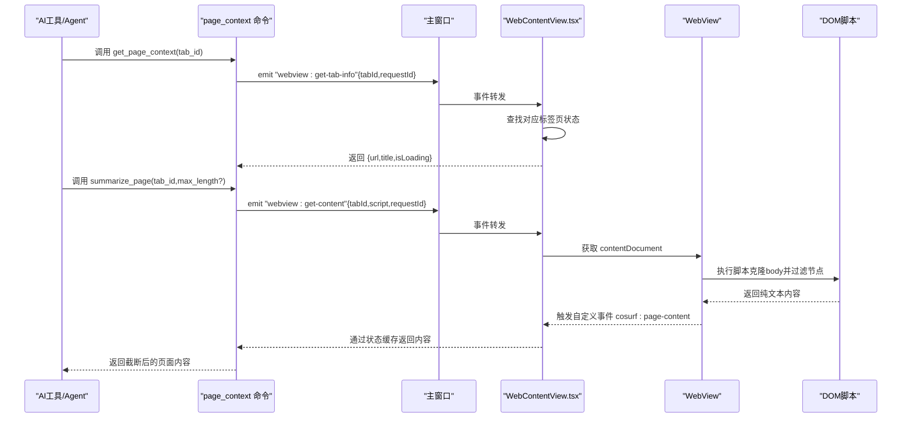
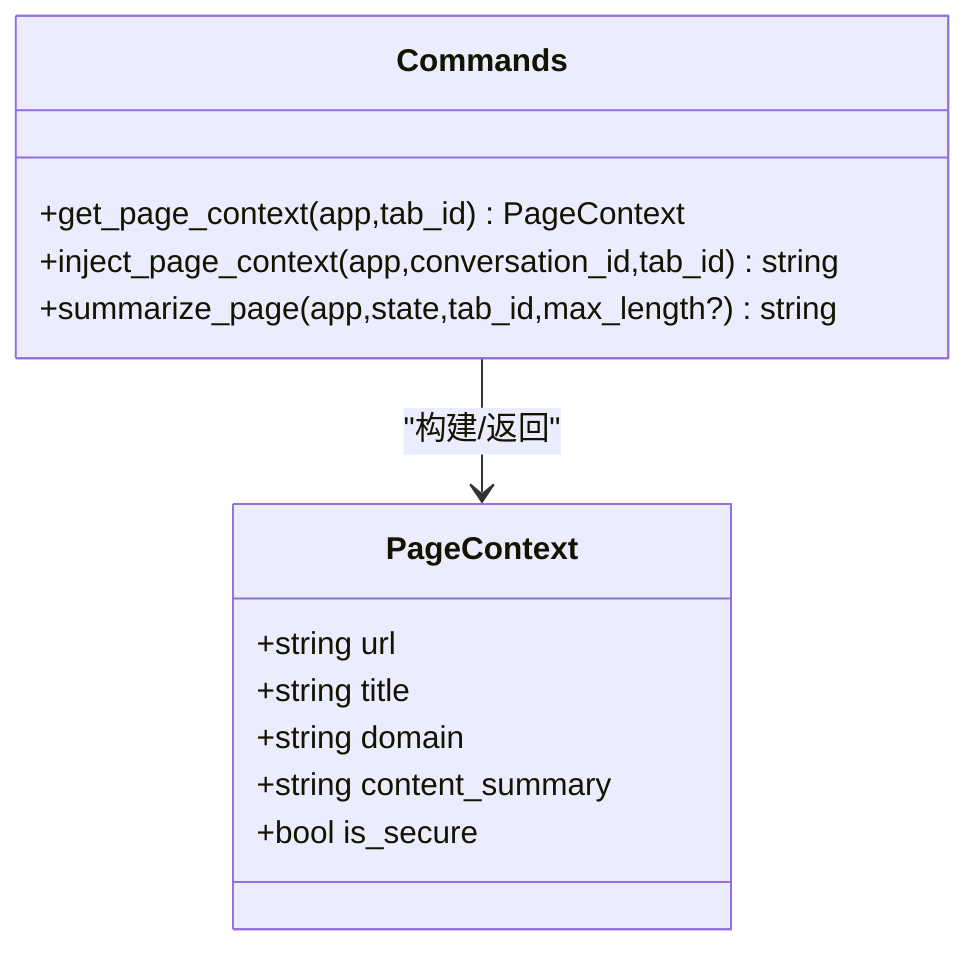
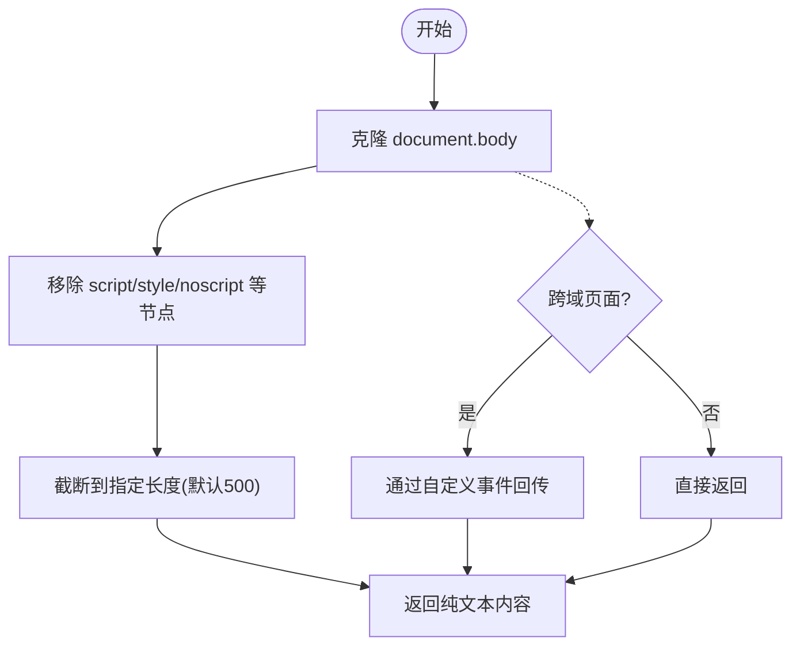
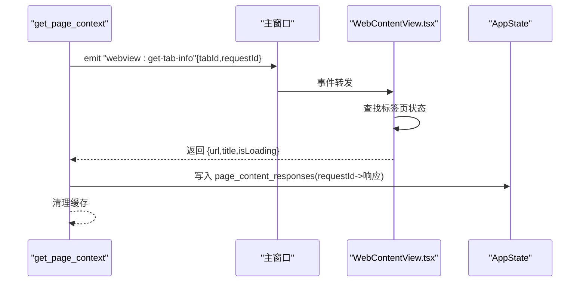
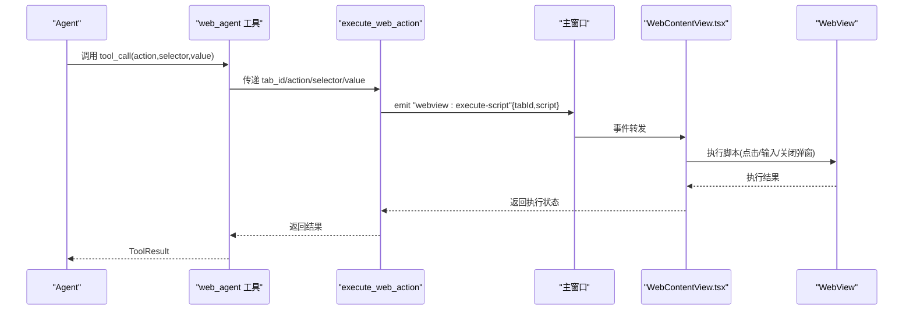
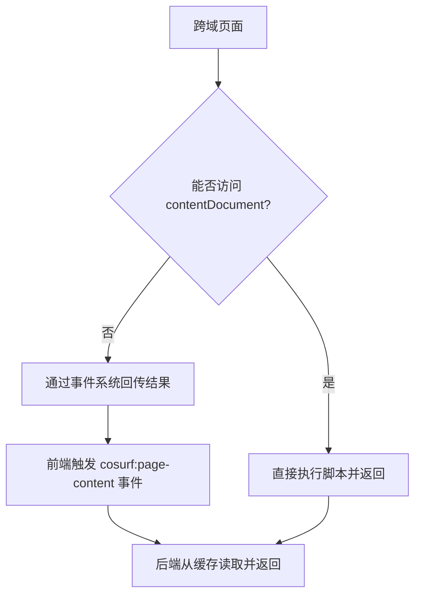
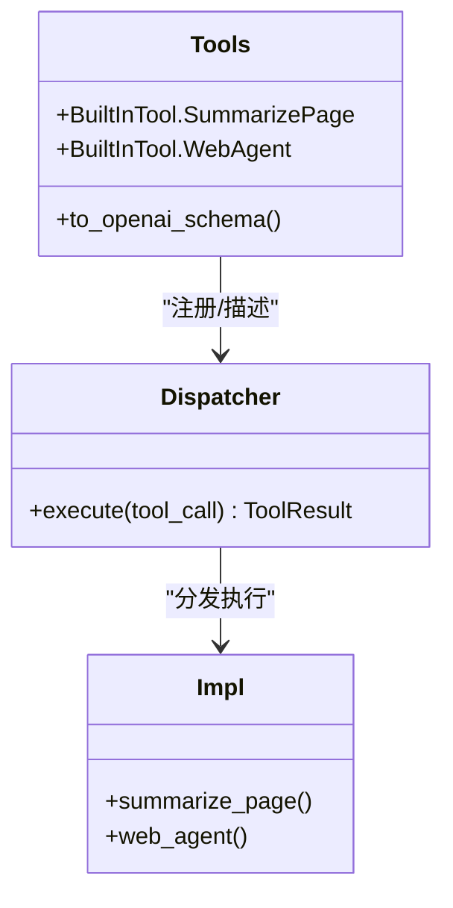
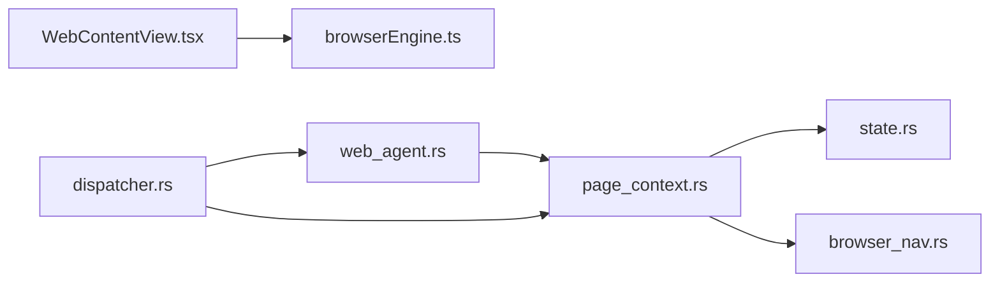

# 页面上下文提取

<cite>
**本文档引用的文件**
- [page_context.rs](file://src-tauri/src/commands/page_context.rs)
- [browserEngine.ts](file://src-web/src/lib/browserEngine.ts)
- [WebContentView.tsx](file://src-web/src/components/layout/WebContentView.tsx)
- [browser_nav.rs](file://src-tauri/src/commands/browser_nav.rs)
- [state.rs](file://src-tauri/src/state.rs)
- [lib.rs](file://src-tauri/src/lib.rs)
- [tools.rs](file://src-tauri/src/ai/tools.rs)
- [web_agent.rs](file://src-tauri/src/ai/tools_impl/web_agent.rs)
- [dispatcher.rs](file://src-tauri/src/ai/tools_impl/dispatcher.rs)
- [page_cache.rs](file://src-tauri/src/commands/page_cache.rs)
</cite>

## 目录
1. [简介](#简介)
2. [项目结构](#项目结构)
3. [核心组件](#核心组件)
4. [架构总览](#架构总览)
5. [详细组件分析](#详细组件分析)
6. [依赖关系分析](#依赖关系分析)
7. [性能考虑](#性能考虑)
8. [故障排查指南](#故障排查指南)
9. [结论](#结论)
10. [附录](#附录)

## 简介
本文件围绕 CoSurf 的“页面上下文提取”能力进行系统化技术文档整理，涵盖页面上下文的概念与重要性、前端与后端的协同机制、DOM 解析与内容过滤、结构化数据提取、跨域限制与应对方案、安全与隐私处理、缓存与性能优化、以及与 AI 功能的集成（如智能摘要、内容理解、问答系统）。文档同时提供可视化流程图与序列图，帮助读者快速理解从页面到 AI 的完整链路。

## 项目结构
CoSurf 采用 Rust 后端 + TypeScript 前端的混合架构，页面上下文提取贯穿 Tauri 命令层、WebView 层与前端工具层：
- 后端（Rust）：通过 Tauri 命令暴露页面上下文提取、内容总结、网页自动化等能力，并维护全局状态与缓存。
- 前端（React + TypeScript）：负责 WebView 渲染、事件监听、DOM 内容提取、用户交互与安全拦截。
- AI 工具层：封装内置工具（如总结页面、网页代理）与外部 MCP 工具，统一调度执行。

```mermaid
graph TB
subgraph "后端(Rust)"
PC["page_context 命令<br/>获取页面上下文/总结页面/执行动作"]
BN["browser_nav 命令<br/>导航/脚本执行/页面内容获取"]
ST["AppState<br/>全局状态/响应缓存"]
PC --> ST
BN --> ST
end
subgraph "前端(React/TS)"
WCV["WebContentView.tsx<br/>WebView容器/事件监听"]
BE["browserEngine.ts<br/>DOM提取/表单操作/脚本执行"]
WCV --> BE
end
subgraph "AI工具层"
DT["tools.rs<br/>内置工具定义"]
WD["web_agent.rs<br/>WebAgent工具实现"]
DP["dispatcher.rs<br/>工具调度器"]
DT --> WD
DT --> DP
WD --> PC
end
PC <- --> WCV
BN <- --> WCV
DP --> PC
```

图表来源
- [page_context.rs:1-327](file://src-tauri/src/commands/page_context.rs#L1-L327)
- [browserEngine.ts:1-521](file://src-web/src/lib/browserEngine.ts#L1-L521)
- [WebContentView.tsx:1-1024](file://src-web/src/components/layout/WebContentView.tsx#L1-L1024)
- [browser_nav.rs:1-532](file://src-tauri/src/commands/browser_nav.rs#L1-L532)
- [state.rs:1-81](file://src-tauri/src/state.rs#L1-L81)
- [tools.rs:1-621](file://src-tauri/src/ai/tools.rs#L1-L621)
- [web_agent.rs:1-79](file://src-tauri/src/ai/tools_impl/web_agent.rs#L1-L79)
- [dispatcher.rs:1-238](file://src-tauri/src/ai/tools_impl/dispatcher.rs#L1-L238)

章节来源
- [lib.rs:108-214](file://src-tauri/src/lib.rs#L108-L214)

## 核心组件
- 页面上下文数据结构：包含 URL、标题、域名、内容摘要、是否 HTTPS 等字段，用于 AI 对话注入与展示。
- 页面内容提取：通过前端 WebView 执行脚本，过滤脚本与样式节点，提取纯文本内容；支持最大长度截断。
- 标签页信息获取：后端向前端发出“获取标签页信息”事件，前端返回当前 URL、标题、加载状态等。
- 网页自动化：支持点击、输入、关闭弹窗等操作，供 AI 工具调用。
- 缓存与持久化：提供页面缓存的保存、加载与过期清理，提升后续访问效率。

章节来源
- [page_context.rs:10-107](file://src-tauri/src/commands/page_context.rs#L10-L107)
- [page_context.rs:141-217](file://src-tauri/src/commands/page_context.rs#L141-L217)
- [browserEngine.ts:274-312](file://src-web/src/lib/browserEngine.ts#L274-L312)
- [WebContentView.tsx:182-250](file://src-web/src/components/layout/WebContentView.tsx#L182-L250)
- [web_agent.rs:12-49](file://src-tauri/src/ai/tools_impl/web_agent.rs#L12-L49)
- [page_cache.rs:9-124](file://src-tauri/src/commands/page_cache.rs#L9-L124)

## 架构总览
页面上下文提取的关键流程如下：
- 后端命令发起：通过 Tauri 命令触发前端 WebView 执行脚本或获取标签页信息。
- 前端响应：WebView 监听事件，执行脚本或返回标签页状态。
- 数据汇聚：后端将 URL、标题、域名、HTTPS 标识与内容摘要组合为 PageContext。
- AI 集成：将 PageContext 注入到对话系统，或调用总结工具生成摘要。
- 缓存策略：可选地将页面内容写入本地缓存，加速后续访问。



图表来源
- [page_context.rs:20-107](file://src-tauri/src/commands/page_context.rs#L20-L107)
- [page_context.rs:141-217](file://src-tauri/src/commands/page_context.rs#L141-L217)
- [WebContentView.tsx:677-742](file://src-web/src/components/layout/WebContentView.tsx#L677-L742)
- [browserEngine.ts:274-312](file://src-web/src/lib/browserEngine.ts#L274-L312)

## 详细组件分析

### 页面上下文数据结构与注入
- PageContext 字段：URL、标题、域名、内容摘要、是否 HTTPS。
- 注入策略：将 PageContext 组装为系统提示词，随用户问题一并发送给 AI，辅助其回答。



图表来源
- [page_context.rs:10-107](file://src-tauri/src/commands/page_context.rs#L10-L107)
- [page_context.rs:109-139](file://src-tauri/src/commands/page_context.rs#L109-L139)

章节来源
- [page_context.rs:10-139](file://src-tauri/src/commands/page_context.rs#L10-L139)

### DOM 解析与内容过滤
- 前端脚本：克隆 document.body，移除 script/style/noscript/nav/footer/header 等节点，保留正文文本。
- 长度控制：默认截断至 500 字符，可由调用方设置上限。
- 跨域限制：对于跨域页面，无法直接访问 contentDocument，需通过后端事件系统回传。



图表来源
- [page_context.rs:161-174](file://src-tauri/src/commands/page_context.rs#L161-L174)
- [browserEngine.ts:296-302](file://src-web/src/lib/browserEngine.ts#L296-L302)
- [WebContentView.tsx:691-714](file://src-web/src/components/layout/WebContentView.tsx#L691-L714)

章节来源
- [browserEngine.ts:274-312](file://src-web/src/lib/browserEngine.ts#L274-L312)
- [WebContentView.tsx:677-742](file://src-web/src/components/layout/WebContentView.tsx#L677-L742)

### 标签页信息获取与实时状态
- 后端通过 emit 事件请求前端标签页信息，前端在事件回调中查找对应标签页并返回 URL、标题、加载状态。
- AppState 中维护 page_content_responses 哈希表，用于事件驱动的异步响应缓存。



图表来源
- [page_context.rs:20-107](file://src-tauri/src/commands/page_context.rs#L20-L107)
- [WebContentView.tsx:182-216](file://src-web/src/components/layout/WebContentView.tsx#L182-L216)
- [state.rs:14-15](file://src-tauri/src/state.rs#L14-L15)

章节来源
- [page_context.rs:20-107](file://src-tauri/src/commands/page_context.rs#L20-L107)
- [state.rs:9-23](file://src-tauri/src/state.rs#L9-L23)

### 网页自动化与交互
- WebAgent 工具：接收 action、selector、value 参数，自动获取当前活跃标签页 ID，调用后端 execute_web_action 执行点击/填写等操作。
- 支持关闭弹窗（模态/对话框/ESC）等常见场景。



图表来源
- [web_agent.rs:12-49](file://src-tauri/src/ai/tools_impl/web_agent.rs#L12-L49)
- [page_context.rs:235-327](file://src-tauri/src/commands/page_context.rs#L235-L327)
- [WebContentView.tsx:744-756](file://src-web/src/components/layout/WebContentView.tsx#L744-L756)

章节来源
- [web_agent.rs:12-79](file://src-tauri/src/ai/tools_impl/web_agent.rs#L12-L79)
- [page_context.rs:235-327](file://src-tauri/src/commands/page_context.rs#L235-L327)

### 跨域页面上下文提取的限制与解决方案
- 限制：跨域页面无法直接访问 contentDocument，导致 DOM 脚本执行受限。
- 方案：
  - 使用后端事件系统：前端监听 webview:get-content 事件，通过 contentDocument.defaultView.eval 执行脚本并回传结果。
  - 降级策略：若无法提取，返回错误提示，建议用户手动复制内容或改用 AI 总结工具。



图表来源
- [WebContentView.tsx:691-714](file://src-web/src/components/layout/WebContentView.tsx#L691-L714)
- [page_context.rs:176-190](file://src-tauri/src/commands/page_context.rs#L176-L190)

章节来源
- [WebContentView.tsx:691-742](file://src-web/src/components/layout/WebContentView.tsx#L691-L742)
- [page_context.rs:141-217](file://src-tauri/src/commands/page_context.rs#L141-L217)

### 安全处理与隐私保护
- Shell API 拦截：前端注入链接拦截脚本，屏蔽页面脚本对 shell.open 的调用，防止越权打开外部链接。
- 权限抑制：对未处理的 shell.open 错误进行静默处理，避免弹窗干扰。
- HTTPS 标识：在 UI 层展示站点安全状态，提醒用户站点是否为 HTTPS。

章节来源
- [WebContentView.tsx:17-108](file://src-web/src/components/layout/WebContentView.tsx#L17-L108)
- [WebContentView.tsx:153-180](file://src-web/src/components/layout/WebContentView.tsx#L153-L180)
- [page_context.rs:81-87](file://src-tauri/src/commands/page_context.rs#L81-L87)

### 存储与缓存策略
- 内存缓存：AppState.page_content_responses 用于事件驱动的异步响应缓存，避免丢失请求-响应配对。
- 文件缓存：提供页面缓存的保存、加载与过期清理，使用 SHA256 生成文件名，24 小时默认过期。
- 使用建议：对频繁访问的页面内容启用缓存，减少重复提取成本。

章节来源
- [state.rs:14-15](file://src-tauri/src/state.rs#L14-L15)
- [page_cache.rs:9-124](file://src-tauri/src/commands/page_cache.rs#L9-L124)
- [page_cache.rs:161-253](file://src-tauri/src/commands/page_cache.rs#L161-L253)

### 与 AI 功能的结合
- 工具定义：tools.rs 定义内置工具（如 summarize_page、web_agent），并提供 OpenAI function calling 格式。
- 调度器：dispatcher.rs 根据工具名分发到具体实现，支持内置工具与 MCP 工具。
- 集成路径：AI 通过工具调用触发页面上下文注入或内容总结，实现智能摘要与问答。



图表来源
- [tools.rs:19-195](file://src-tauri/src/ai/tools.rs#L19-L195)
- [dispatcher.rs:11-55](file://src-tauri/src/ai/tools_impl/dispatcher.rs#L11-L55)
- [web_agent.rs:12-49](file://src-tauri/src/ai/tools_impl/web_agent.rs#L12-L49)

章节来源
- [tools.rs:19-208](file://src-tauri/src/ai/tools.rs#L19-L208)
- [dispatcher.rs:11-55](file://src-tauri/src/ai/tools_impl/dispatcher.rs#L11-L55)

## 依赖关系分析
- page_context 命令依赖：
  - Tauri 窗口事件系统（emit/on）
  - AppState 全局状态（page_content_responses）
  - URL 解析与 HTTPS 判断
- WebContentView 依赖：
  - 事件监听（webview:get-content、element-selected 等）
  - WebView 容器（webview 标签，禁用 webSecurity）
  - DOM 脚本执行（eval）
- AI 工具依赖：
  - tools.rs 定义工具接口
  - dispatcher.rs 调度工具执行
  - web_agent.rs 读取当前活跃标签页 ID



图表来源
- [page_context.rs:1-10](file://src-tauri/src/commands/page_context.rs#L1-L10)
- [state.rs:1-8](file://src-tauri/src/state.rs#L1-L8)
- [web_agent.rs:1-10](file://src-tauri/src/ai/tools_impl/web_agent.rs#L1-L10)
- [dispatcher.rs:1-9](file://src-tauri/src/ai/tools_impl/dispatcher.rs#L1-L9)

章节来源
- [lib.rs:108-214](file://src-tauri/src/lib.rs#L108-L214)

## 性能考虑
- DOM 过滤成本：移除 script/style/noscript 等节点会增加克隆与遍历开销，建议在大体量页面上限制截断长度。
- 事件轮询：后端通过定时轮询 AppState.page_content_responses 获取响应，建议合理设置超时与清理策略。
- 缓存命中：启用页面缓存可显著降低重复提取成本；注意定期清理过期缓存，避免磁盘膨胀。
- 跨域回退：跨域页面无法直接执行脚本，需依赖事件回传，建议在 UI 层提示用户“无法自动提取”。

## 故障排查指南
- 页面内容为空或报错：
  - 检查是否跨域页面（无法访问 contentDocument）。
  - 确认 WebView 是否正确监听 webview:get-content 事件。
  - 查看后端日志与前端控制台错误。
- 标签页信息缺失：
  - 确认前端已监听 webview:get-tab-info 事件并返回对应标签页状态。
  - 检查 AppState.page_content_responses 是否正确写入与清理。
- 自动化操作失败：
  - 检查 CSS 选择器是否正确。
  - 确认页面是否加载完成（isLoading=false）。
  - 对于弹窗类页面，尝试使用“关闭弹窗”动作。

章节来源
- [WebContentView.tsx:677-742](file://src-web/src/components/layout/WebContentView.tsx#L677-L742)
- [page_context.rs:20-107](file://src-tauri/src/commands/page_context.rs#L20-L107)
- [web_agent.rs:51-79](file://src-tauri/src/ai/tools_impl/web_agent.rs#L51-L79)

## 结论
CoSurf 的页面上下文提取通过“后端命令 + 前端 WebView + 事件系统”的协作，实现了对页面元数据、内容结构与用户交互信息的统一抽象。配合 AI 工具层与缓存策略，能够在保证安全与隐私的前提下，高效支撑智能摘要、内容理解与问答等高级功能。针对跨域限制，项目提供了事件驱动的回退方案与明确的错误提示，便于用户与开发者定位问题。

## 附录
- 调试与监控建议：
  - 后端：开启 tracing 日志，关注 webview:get-content、cosurf:page-content 等事件的往返。
  - 前端：在控制台观察事件监听与脚本执行结果，留意跨域错误与 shell.open 抑制日志。
- 最佳实践：
  - 对大页面设置合理的 max_length，避免内存与网络压力。
  - 对频繁访问的页面启用缓存，并定期清理过期文件。
  - 在 UI 层明确提示跨域与自动化限制，引导用户采取替代方案。