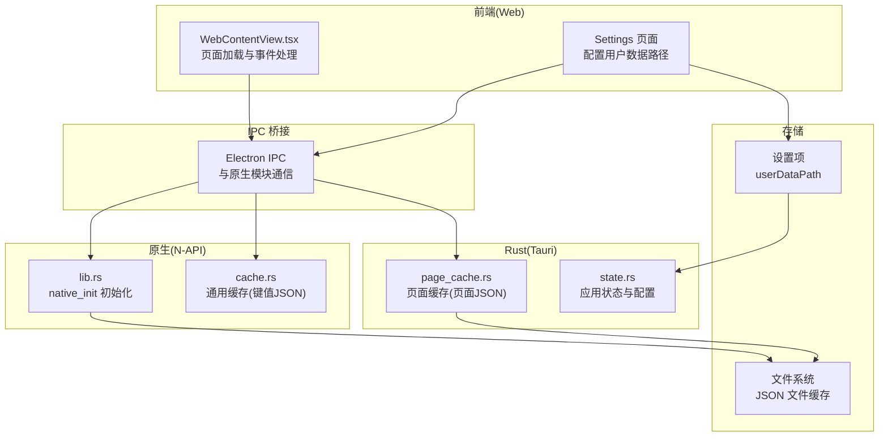
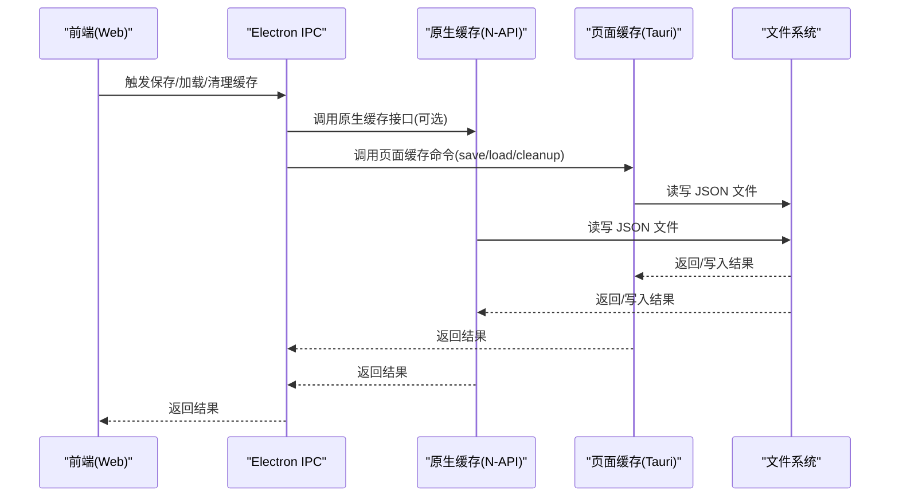
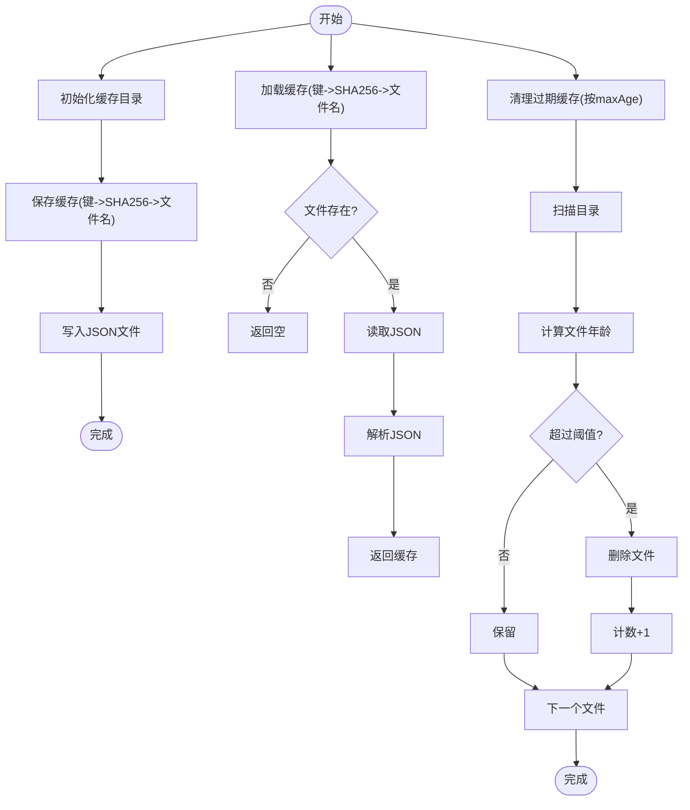
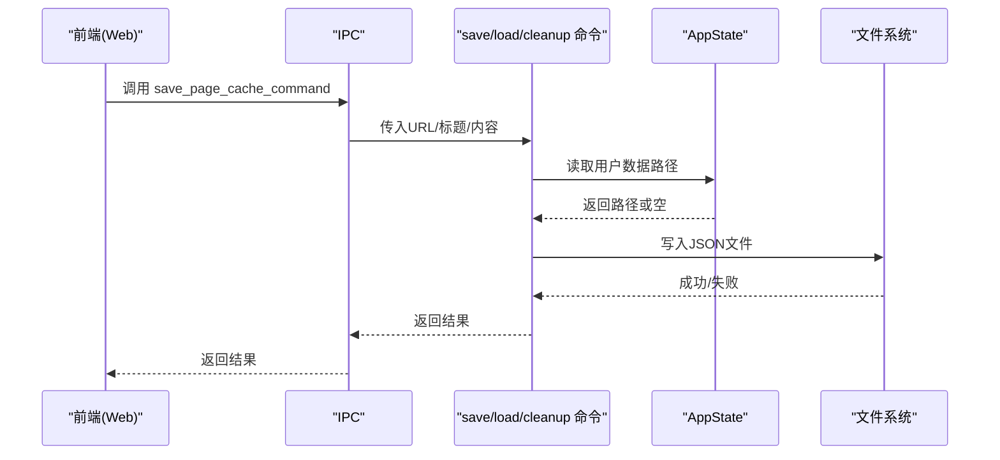
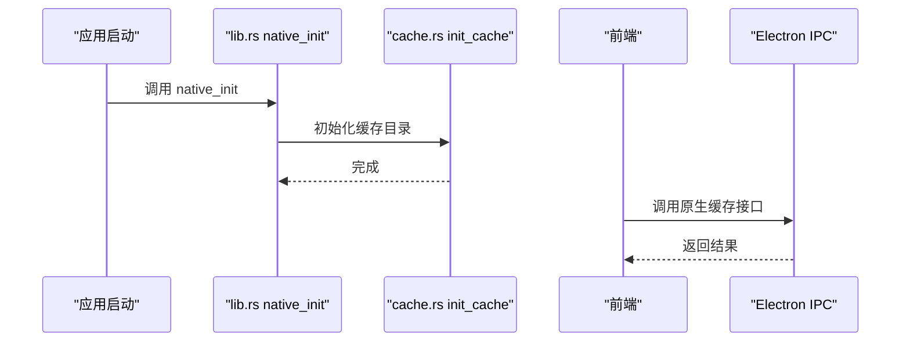
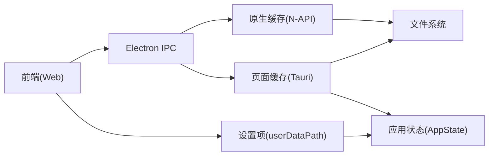

# 页面缓存系统

<cite>
**本文档引用的文件**
- [page_cache.rs](file://src-tauri/src/commands/page_cache.rs)
- [cache.rs](file://native/src/cache.rs)
- [lib.rs](file://native/src/lib.rs)
- [state.rs](file://src-tauri/src/state.rs)
- [settings.ts](file://packages/shared/src/settings.ts)
- [network-interceptor.ts](file://electron/network-interceptor.ts)
- [WebContentView.tsx](file://src-web/src/components/layout/WebContentView.tsx)
- [tauri.ts](file://src-web/src/lib/tauri.ts)
</cite>

## 目录
1. [简介](#简介)
2. [项目结构](#项目结构)
3. [核心组件](#核心组件)
4. [架构总览](#架构总览)
5. [详细组件分析](#详细组件分析)
6. [依赖关系分析](#依赖关系分析)
7. [性能考量](#性能考量)
8. [故障排查指南](#故障排查指南)
9. [结论](#结论)
10. [附录](#附录)

## 简介
本文件针对 CoSurf 的页面缓存系统进行深入文档化，涵盖设计理念、架构设计、缓存策略、存储机制、失效规则、数据类型与结构、生命周期管理、命中率优化、存储位置与容量管理、缓存一致性、与网络请求的集成、性能监控与分析、配置选项与自定义策略，以及故障恢复与数据完整性检查机制。目标是帮助开发者与使用者全面理解并高效使用页面缓存能力。

## 项目结构
页面缓存系统主要分布在以下层次：
- 原生层（Electron/N-API）：提供通用缓存能力（键值型 JSON 文件缓存，SHA256 命名），用于跨平台与高性能场景。
- Rust 层（Tauri）：提供页面缓存专用的数据结构与命令，基于文件系统持久化，支持过期清理。
- 前端层（React）：通过 Electron IPC 与原生模块交互，实现页面内容的提取、缓存读写与清理。
- 网络拦截层（Electron）：为页面加载与脚本注入提供基础环境，间接影响缓存的可用性与一致性。

**图表来源**
- [WebContentView.tsx](file://src-web/src/components/layout/WebContentView.tsx)
- [network-interceptor.ts](file://electron/network-interceptor.ts)
- [lib.rs](file://native/src/lib.rs)
- [cache.rs](file://native/src/cache.rs)
- [page_cache.rs](file://src-tauri/src/commands/page_cache.rs)
- [state.rs](file://src-tauri/src/state.rs)
- [settings.ts](file://packages/shared/src/settings.ts)

**章节来源**
- [WebContentView.tsx](file://src-web/src/components/layout/WebContentView.tsx)
- [network-interceptor.ts](file://electron/network-interceptor.ts)
- [lib.rs](file://native/src/lib.rs)
- [cache.rs](file://native/src/cache.rs)
- [page_cache.rs](file://src-tauri/src/commands/page_cache.rs)
- [state.rs](file://src-tauri/src/state.rs)
- [settings.ts](file://packages/shared/src/settings.ts)

## 核心组件
- 通用缓存模块（N-API）
  - 提供键值型 JSON 文件缓存，文件名通过 SHA256(url/key) 命名，便于快速定位与去重。
  - 支持保存、加载、清理过期文件，清理阈值可配置（默认 24 小时）。
  - 由原生初始化函数统一设置缓存根目录。
- 页面缓存模块（Tauri）
  - 专用于页面内容缓存，结构包含 URL、标题、HTML 内容、时间戳、内容长度等字段。
  - 提供保存、加载、清理过期命令，支持用户自定义数据目录。
- 原生初始化与桥接
  - 原生模块初始化时调用缓存初始化，确保缓存目录存在并可用。
  - 前端通过 Electron IPC 与原生模块交互，实现缓存操作。
- 应用状态与配置
  - 应用状态维护用户数据目录路径，页面缓存命令会读取该路径决定存储位置。
  - 设置项中提供用户数据路径字段，用于覆盖默认存储位置。

**章节来源**
- [cache.rs](file://native/src/cache.rs)
- [page_cache.rs](file://src-tauri/src/commands/page_cache.rs)
- [lib.rs](file://native/src/lib.rs)
- [state.rs](file://src-tauri/src/state.rs)
- [settings.ts](file://packages/shared/src/settings.ts)

## 架构总览
页面缓存系统采用“前端触发 + IPC 桥接 + 原生/后端持久化”的分层架构：
- 前端负责页面内容提取与缓存操作触发。
- IPC 层负责与原生模块通信，传递参数与接收结果。
- 原生层提供通用缓存能力；后端层提供页面缓存专用能力。
- 存储层统一使用文件系统，以 JSON 文件形式持久化。

**图表来源**
- [WebContentView.tsx](file://src-web/src/components/layout/WebContentView.tsx)
- [cache.rs](file://native/src/cache.rs)
- [page_cache.rs](file://src-tauri/src/commands/page_cache.rs)

## 详细组件分析

### 通用缓存模块（N-API）
- 设计理念
  - 通用键值 JSON 缓存，适合跨场景复用；文件名使用 SHA256 哈希，避免路径冲突与目录膨胀。
  - 支持按最大年龄清理过期文件，默认 24 小时。
- 数据结构
  - PageCache 结构体：URL、标题、内容、时间戳、内容长度。
  - 通用键值缓存：键为任意字符串，值为 JSON 字符串。
- 生命周期
  - 初始化：原生初始化时设置缓存目录。
  - 保存：根据键生成文件名，写入 JSON。
  - 加载：根据键定位文件，读取 JSON。
  - 清理：遍历目录，按修改时间判断是否过期并删除。
- 性能与可靠性
  - 文件系统 IO，适合中小规模缓存；哈希命名避免目录扫描成本。
  - 日志记录保存/加载/清理过程，便于排障。

**图表来源**
- [cache.rs](file://native/src/cache.rs)

**章节来源**
- [cache.rs](file://native/src/cache.rs)
- [lib.rs](file://native/src/lib.rs)

### 页面缓存模块（Tauri）
- 设计理念
  - 专用于页面内容缓存，结构包含 URL、标题、HTML 内容、时间戳、内容长度。
  - 支持用户自定义数据目录，若未配置则使用系统临时目录下的默认路径。
- 数据结构
  - PageCache：URL、标题、内容、时间戳、内容长度。
- 生命周期
  - 保存：序列化为 JSON，写入文件。
  - 加载：读取 JSON，反序列化为结构体。
  - 清理：遍历目录，按修改时间判断并删除过期文件。
- 与应用状态的集成
  - 页面缓存命令从应用状态中读取用户数据路径配置，支持动态覆盖。

**图表来源**
- [page_cache.rs](file://src-tauri/src/commands/page_cache.rs)
- [state.rs](file://src-tauri/src/state.rs)

**章节来源**
- [page_cache.rs](file://src-tauri/src/commands/page_cache.rs)
- [state.rs](file://src-tauri/src/state.rs)

### 原生初始化与桥接
- 原生模块初始化
  - 初始化日志、数据库、Skills 管理器、MCP 服务器等。
  - 调用缓存初始化函数，设置缓存目录。
- 前端桥接
  - 前端通过 Electron IPC 与原生模块交互，实现缓存操作。
  - 旧的 Tauri IPC 模块已标记为废弃，当前使用 Electron IPC。

**图表来源**
- [lib.rs](file://native/src/lib.rs)
- [cache.rs](file://native/src/cache.rs)
- [tauri.ts](file://src-web/src/lib/tauri.ts)

**章节来源**
- [lib.rs](file://native/src/lib.rs)
- [cache.rs](file://native/src/cache.rs)
- [tauri.ts](file://src-web/src/lib/tauri.ts)

### 存储位置与容量管理
- 存储位置
  - 通用缓存：原生初始化时设置的目录（通常位于应用数据目录下的子目录）。
  - 页面缓存：优先使用用户配置的用户数据路径；若为空则使用系统临时目录下的默认路径。
- 容量管理
  - 无自动配额限制，建议结合清理策略控制目录大小。
  - 提供按最大年龄清理过期文件的能力，减少空间占用。

**章节来源**
- [cache.rs](file://native/src/cache.rs)
- [page_cache.rs](file://src-tauri/src/commands/page_cache.rs)
- [settings.ts](file://packages/shared/src/settings.ts)

### 缓存一致性与网络请求集成
- 缓存一致性
  - 页面缓存包含时间戳，可用于判断新鲜度；清理策略按修改时间过期。
  - 前端页面加载与事件处理中，对跨域限制、脚本注入、链接拦截等进行处理，间接影响缓存的可用性与准确性。
- 网络请求集成
  - 网络拦截器移除限制性 CSP、阻断追踪域名、拦截特定 API 请求并记录，为页面加载与缓存提供良好环境。
  - 前端通过 IPC 与后端交互，实现页面内容提取与缓存操作。

**章节来源**
- [page_cache.rs](file://src-tauri/src/commands/page_cache.rs)
- [network-interceptor.ts](file://electron/network-interceptor.ts)
- [WebContentView.tsx](file://src-web/src/components/layout/WebContentView.tsx)

## 依赖关系分析
- 组件耦合
  - 原生缓存模块与应用状态解耦，通过初始化函数设置目录；页面缓存命令从状态读取用户数据路径。
  - 前端仅通过 IPC 与原生模块交互，降低前端复杂度。
- 外部依赖
  - 文件系统：作为唯一持久化介质。
  - Electron IPC：前后端通信桥梁。
  - 日志库：用于记录缓存操作与异常。

**图表来源**
- [WebContentView.tsx](file://src-web/src/components/layout/WebContentView.tsx)
- [cache.rs](file://native/src/cache.rs)
- [page_cache.rs](file://src-tauri/src/commands/page_cache.rs)
- [state.rs](file://src-tauri/src/state.rs)
- [settings.ts](file://packages/shared/src/settings.ts)

**章节来源**
- [WebContentView.tsx](file://src-web/src/components/layout/WebContentView.tsx)
- [cache.rs](file://native/src/cache.rs)
- [page_cache.rs](file://src-tauri/src/commands/page_cache.rs)
- [state.rs](file://src-tauri/src/state.rs)
- [settings.ts](file://packages/shared/src/settings.ts)

## 性能考量
- 命名与寻址
  - 使用 SHA256 哈希命名，避免目录扫描与路径冲突，提升查找效率。
- IO 模式
  - 顺序读写 JSON 文件，适合中小规模缓存；大规模场景建议引入内存缓存或压缩策略。
- 清理策略
  - 按最大年龄清理过期文件，减少目录膨胀；默认 24 小时可按需调整。
- 前端交互
  - 页面加载与事件处理中尽量避免频繁触发缓存操作，减少 IO 压力。

[本节为通用性能讨论，无需具体文件分析]

## 故障排查指南
- 常见问题
  - 缓存目录不存在：检查原生初始化是否成功，确认缓存目录创建。
  - 文件读写失败：检查文件权限与磁盘空间。
  - 过期清理无效：确认最大年龄参数与系统时间。
  - 跨域限制导致页面内容提取失败：前端对跨域站点无法直接访问内容文档。
- 排查步骤
  - 查看日志输出，定位保存/加载/清理阶段的错误。
  - 验证用户数据路径配置是否正确。
  - 检查网络拦截器是否正确移除了限制性 CSP，避免脚本注入失败。

**章节来源**
- [cache.rs](file://native/src/cache.rs)
- [page_cache.rs](file://src-tauri/src/commands/page_cache.rs)
- [WebContentView.tsx](file://src-web/src/components/layout/WebContentView.tsx)

## 结论
CoSurf 的页面缓存系统通过“原生通用缓存 + Rust 页面缓存 + 前端 IPC 桥接”的架构，实现了稳定、可扩展的页面内容缓存能力。其设计强调简单可靠（文件系统 JSON）、易于部署（无需额外依赖）、可维护（清晰的日志与清理策略）。配合网络拦截与前端事件处理，系统在实际使用中具备良好的一致性与可用性。建议在生产环境中结合清理策略与容量监控，持续优化缓存效果。

[本节为总结性内容，无需具体文件分析]

## 附录

### 缓存数据类型与结构
- 通用键值缓存
  - 键：任意字符串
  - 值：JSON 字符串
- 页面缓存
  - 字段：URL、标题、HTML 内容、时间戳、内容长度

**章节来源**
- [cache.rs](file://native/src/cache.rs)
- [page_cache.rs](file://src-tauri/src/commands/page_cache.rs)

### 缓存生命周期管理
- 创建：保存缓存（序列化 JSON 写入文件）
- 更新：再次保存相同键，覆盖旧内容
- 删除：按键删除对应文件
- 清理：按最大年龄扫描并删除过期文件

**章节来源**
- [cache.rs](file://native/src/cache.rs)
- [page_cache.rs](file://src-tauri/src/commands/page_cache.rs)

### 缓存命中率优化策略
- 智能预加载：在用户即将访问的页面前触发内容提取与缓存保存。
- 热点数据缓存：识别高频访问 URL，优先保留其缓存文件。
- 增量更新：仅在内容发生显著变化时更新缓存，减少无效写入。

[本节为通用优化建议，无需具体文件分析]

### 缓存存储位置与容量管理
- 存储位置
  - 通用缓存：原生初始化设置的目录
  - 页面缓存：用户配置的用户数据路径；若为空则使用默认路径
- 容量管理
  - 通过清理过期文件控制目录大小；建议定期执行清理任务

**章节来源**
- [cache.rs](file://native/src/cache.rs)
- [page_cache.rs](file://src-tauri/src/commands/page_cache.rs)
- [settings.ts](file://packages/shared/src/settings.ts)

### 缓存一致性保证机制
- 时间戳：页面缓存包含时间戳，可用于判断新鲜度
- 清理策略：按修改时间过期，确保数据时效性
- 跨域限制：前端对跨域站点无法直接访问内容文档，需通过后端获取

**章节来源**
- [page_cache.rs](file://src-tauri/src/commands/page_cache.rs)
- [WebContentView.tsx](file://src-web/src/components/layout/WebContentView.tsx)

### 缓存与网络请求的集成
- 网络拦截：移除限制性 CSP、阻断追踪域名、拦截特定 API 请求并记录
- 页面加载：前端通过 IPC 与后端交互，实现页面内容提取与缓存操作

**章节来源**
- [network-interceptor.ts](file://electron/network-interceptor.ts)
- [WebContentView.tsx](file://src-web/src/components/layout/WebContentView.tsx)

### 缓存性能监控与分析
- 日志记录：保存/加载/清理过程均记录日志，便于监控与排障
- 建议：结合系统监控工具观察磁盘 IO 与目录大小变化

**章节来源**
- [cache.rs](file://native/src/cache.rs)
- [page_cache.rs](file://src-tauri/src/commands/page_cache.rs)

### 缓存配置选项与自定义策略
- 用户数据路径：可通过设置项配置，影响页面缓存的存储位置
- 最大年龄：清理过期文件时可指定最大年龄（秒）

**章节来源**
- [settings.ts](file://packages/shared/src/settings.ts)
- [page_cache.rs](file://src-tauri/src/commands/page_cache.rs)
- [cache.rs](file://native/src/cache.rs)

### 缓存故障恢复与数据完整性检查
- 故障恢复：缓存文件损坏时，加载失败会返回空；可重新触发保存流程
- 数据完整性：保存前进行序列化与写入，加载前进行反序列化与解析；失败时记录警告并返回空

**章节来源**
- [page_cache.rs](file://src-tauri/src/commands/page_cache.rs)
- [cache.rs](file://native/src/cache.rs)