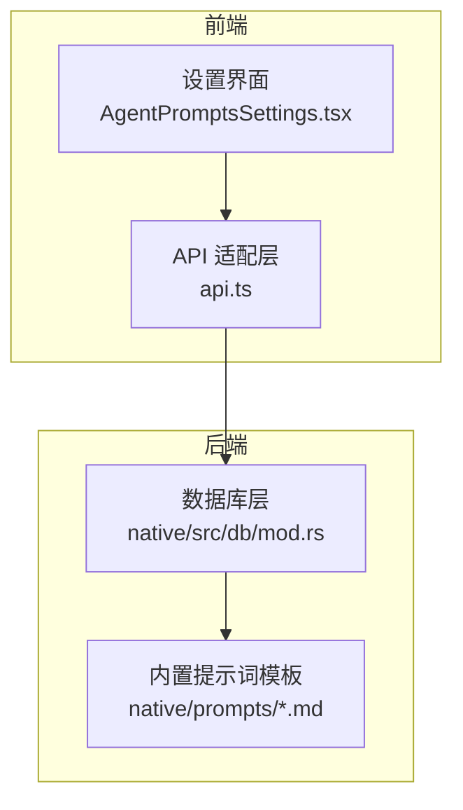
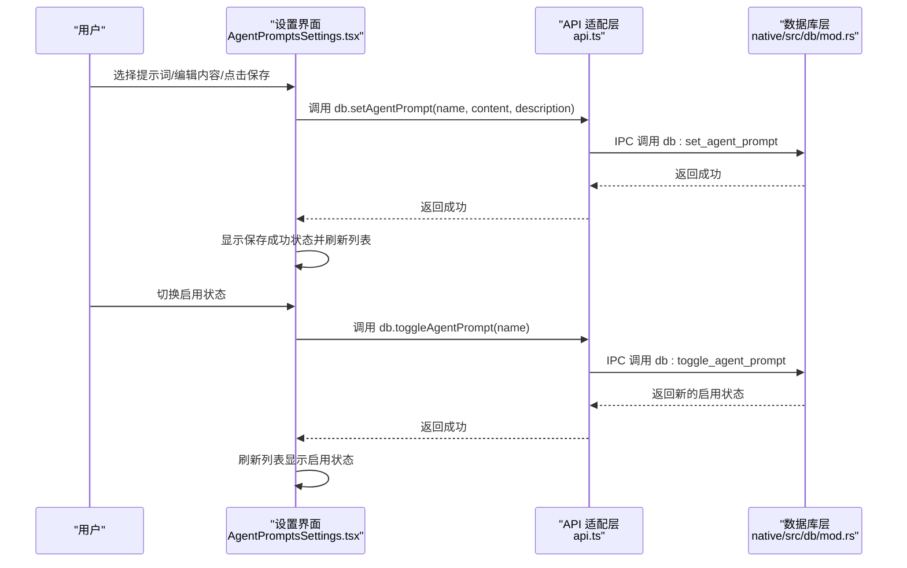
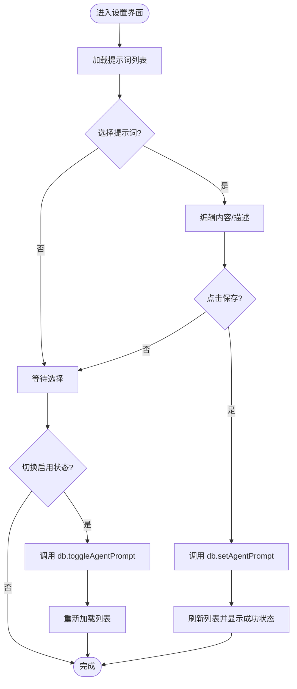
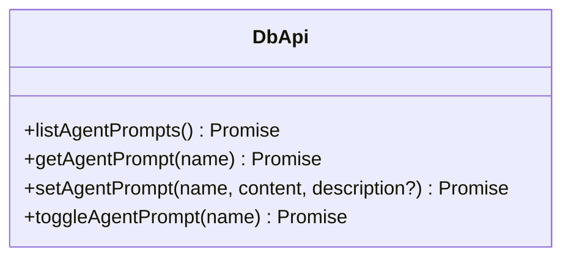
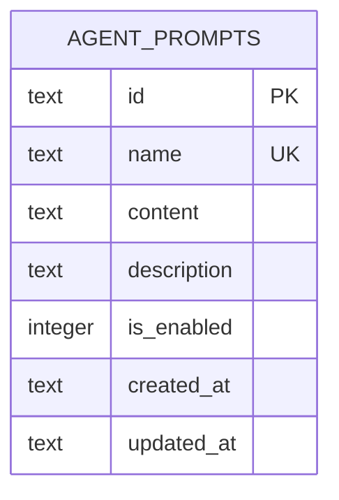
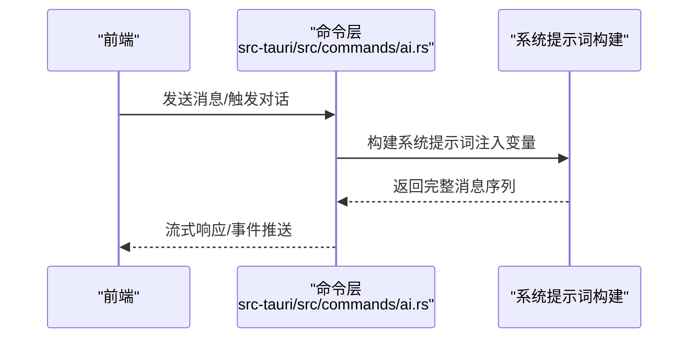

# Agent 提示词设置

<cite>
**本文档引用的文件**
- [AgentPromptsSettings.tsx](file://src-web/src/components/settings/AgentPromptsSettings.tsx)
- [api.ts](file://src-web/src/lib/api.ts)
- [mod.rs](file://native/src/db/mod.rs)
- [agent.md](file://native/prompts/agent.md)
- [decision.md](file://native/prompts/decision.md)
- [memory.md](file://native/prompts/memory.md)
- [reader.md](file://native/prompts/reader.md)
- [remember.md](file://native/prompts/remember.md)
- [agent.rs](file://src-tauri/src/ai/agent.rs)
- [ai.rs](file://src-tauri/src/commands/ai.rs)
- [ai_agent.rs](file://src-tauri/src/commands/ai_agent.rs)
- [agent.md](file://agent.md)
</cite>

## 目录
1. [简介](#简介)
2. [项目结构](#项目结构)
3. [核心组件](#核心组件)
4. [架构总览](#架构总览)
5. [详细组件分析](#详细组件分析)
6. [依赖关系分析](#依赖关系分析)
7. [性能考量](#性能考量)
8. [故障排查指南](#故障排查指南)
9. [结论](#结论)
10. [附录](#附录)

## 简介
本文件面向 CoSurf Agent 的提示词设置，系统性说明 Agent Prompt 的配置与自定义能力，涵盖系统提示词、用户提示词、工具提示词等类型；解释提示词模板结构与变量替换机制；阐述提示词的编辑、保存、版本管理；说明提示词对 Agent 行为的影响与调优方法；介绍内置提示词模板与使用建议；解释国际化支持与多语言配置；提供不同应用场景下的提示词优化策略与效果对比；最后给出调试与测试方法。

## 项目结构
CoSurf 的提示词设置由前端设置界面、统一 API 适配层与后端数据库共同组成。前端负责展示与编辑；API 层负责与后端 IPC 通信；后端通过 SQLite 存储提示词，并提供默认内置模板初始化与查询更新能力。

**图表来源**
- [AgentPromptsSettings.tsx:15-224](file://src-web/src/components/settings/AgentPromptsSettings.tsx#L15-L224)
- [api.ts:235-249](file://src-web/src/lib/api.ts#L235-L249)
- [mod.rs:152-241](file://native/src/db/mod.rs#L152-L241)

**章节来源**
- [AgentPromptsSettings.tsx:15-224](file://src-web/src/components/settings/AgentPromptsSettings.tsx#L15-L224)
- [api.ts:235-249](file://src-web/src/lib/api.ts#L235-L249)
- [mod.rs:152-241](file://native/src/db/mod.rs#L152-L241)

## 核心组件
- 设置界面组件：负责列出、选择、编辑、保存、切换启用状态 Agent 提示词，以及显示保存状态反馈。
- API 适配层：封装数据库相关 IPC 调用，提供 list、get、set、toggle 等方法。
- 数据库层：维护 agent_prompts 表，提供默认内置模板初始化与查询更新。
- 内置提示词模板：位于 native/prompts 目录，包含主 Agent、记忆提取、读模块、记模块、想模块、决模块等模板。

**章节来源**
- [AgentPromptsSettings.tsx:5-92](file://src-web/src/components/settings/AgentPromptsSettings.tsx#L5-L92)
- [api.ts:235-249](file://src-web/src/lib/api.ts#L235-L249)
- [mod.rs:152-241](file://native/src/db/mod.rs#L152-L241)
- [agent.md:1-49](file://native/prompts/agent.md#L1-L49)
- [decision.md:1-52](file://native/prompts/decision.md#L1-L52)
- [memory.md:1-41](file://native/prompts/memory.md#L1-L41)
- [reader.md:1-36](file://native/prompts/reader.md#L1-L36)
- [remember.md:1-45](file://native/prompts/remember.md#L1-L45)

## 架构总览
前端设置界面通过 API 适配层调用后端数据库命令，实现对 agent_prompts 表的读写与启用状态切换。数据库层在初始化时插入默认内置模板，开发者可在界面上覆盖这些模板内容。

**图表来源**
- [AgentPromptsSettings.tsx:43-92](file://src-web/src/components/settings/AgentPromptsSettings.tsx#L43-L92)
- [api.ts:235-249](file://src-web/src/lib/api.ts#L235-L249)
- [mod.rs:1327-1366](file://native/src/db/mod.rs#L1327-L1366)

## 详细组件分析

### 设置界面组件（AgentPromptsSettings）
- 列表展示：加载所有 agent_prompts，支持按名称选择与启用状态切换。
- 编辑功能：支持编辑 content 与 description，保存时调用 db.setAgentPrompt。
- 重置功能：恢复到数据库中该提示词的原始内容。
- 状态反馈：保存成功/失败状态提示，避免重复保存。

**图表来源**
- [AgentPromptsSettings.tsx:24-92](file://src-web/src/components/settings/AgentPromptsSettings.tsx#L24-L92)

**章节来源**
- [AgentPromptsSettings.tsx:15-224](file://src-web/src/components/settings/AgentPromptsSettings.tsx#L15-L224)

### API 适配层（db.*）
- listAgentPrompts：获取所有提示词列表。
- getAgentPrompt：按名称获取单个提示词详情。
- setAgentPrompt：保存提示词内容与描述（按 name 唯一键更新）。
- toggleAgentPrompt：切换启用状态并返回新状态。

**图表来源**
- [api.ts:235-249](file://src-web/src/lib/api.ts#L235-L249)

**章节来源**
- [api.ts:235-249](file://src-web/src/lib/api.ts#L235-L249)

### 数据库层（agent_prompts 表与默认模板）
- 表结构：包含 id、name（唯一）、content、description、is_enabled、created_at、updated_at。
- 默认模板初始化：在数据库迁移时插入主 Agent、记忆提取、读模块、记模块、想模块、决模块等内置模板。
- 查询与更新：提供 list、get、set、toggle 等 N-API 导出方法，供前端调用。

**图表来源**
- [mod.rs:152-161](file://native/src/db/mod.rs#L152-L161)

**章节来源**
- [mod.rs:152-241](file://native/src/db/mod.rs#L152-L241)
- [mod.rs:1278-1366](file://native/src/db/mod.rs#L1278-L1366)

### 内置提示词模板
- 主 Agent（agent.md）：定义角色、核心能力、可用工具、交互风格等。
- 决策辅助（decision.md）：提供结构化决策支持框架与输出格式。
- 记忆提取（memory.md）：提取用户偏好、行为与陈述维度，输出 JSON 结构。
- 网页内容分析（reader.md）：提供分析维度与 Markdown 输出格式。
- 智能笔记（remember.md）：提取要点、结构化沉淀、关键数据与阅读轨迹记录。
- 知识召回（recall.md）：用于知识关联与检索（模板文件存在，具体实现依项目而定）。

**章节来源**
- [agent.md:1-49](file://native/prompts/agent.md#L1-L49)
- [decision.md:1-52](file://native/prompts/decision.md#L1-L52)
- [memory.md:1-41](file://native/prompts/memory.md#L1-L41)
- [reader.md:1-36](file://native/prompts/reader.md#L1-L36)
- [remember.md:1-45](file://native/prompts/remember.md#L1-L45)

### 提示词模板结构与变量替换机制
- 模板结构：内置模板采用 Markdown 格式，包含角色设定、能力说明、工具列表、交互风格与输出格式等。
- 变量替换：在对话构建阶段，系统会将用户名称等上下文变量注入到系统提示词中，形成最终的完整提示词序列。
- 调试输出：后端在构建完整提示词时会打印调试日志，便于定位问题。

**图表来源**
- [ai.rs:164-204](file://src-tauri/src/commands/ai.rs#L164-L204)

**章节来源**
- [ai.rs:164-204](file://src-tauri/src/commands/ai.rs#L164-L204)

### 提示词编辑、保存与版本管理
- 编辑：在设置界面中选择提示词后，可编辑 content 与 description。
- 保存：调用 db.setAgentPrompt，按 name 唯一键进行更新，同时更新 updated_at。
- 版本管理：数据库层保留 created_at 与 updated_at 字段，可用于追踪变更时间；前端在保存成功后短暂显示状态并刷新列表。

**章节来源**
- [AgentPromptsSettings.tsx:50-82](file://src-web/src/components/settings/AgentPromptsSettings.tsx#L50-L82)
- [mod.rs:1327-1348](file://native/src/db/mod.rs#L1327-L1348)

### 提示词对 Agent 行为的影响与调优
- 角色与工具：主 Agent 模板定义角色与可用工具，直接影响 Agent 的行为边界与能力范围。
- 决策框架：决策辅助模板提供结构化输出格式，有助于生成可解释的决策报告。
- 记忆提取：记忆提取模板定义提取维度与输出格式，影响用户画像构建质量。
- 读写模块：读模块与记模块模板分别影响内容分析与知识沉淀的质量与格式。
- 调优建议：通过调整角色设定、工具列表、交互风格与输出格式，可引导 Agent 更贴合特定场景。

**章节来源**
- [agent.md:1-49](file://native/prompts/agent.md#L1-L49)
- [decision.md:1-52](file://native/prompts/decision.md#L1-L52)
- [memory.md:1-41](file://native/prompts/memory.md#L1-L41)
- [reader.md:1-36](file://native/prompts/reader.md#L1-L36)
- [remember.md:1-45](file://native/prompts/remember.md#L1-L45)

### 国际化支持与多语言配置
- 现状：内置模板与设置界面均使用中文；系统提示词构建阶段会注入用户名称等上下文变量。
- 建议：若需多语言支持，可在前端设置界面增加语言选择，并在模板中预留变量占位；后端在构建提示词时根据语言配置注入相应变量。

**章节来源**
- [ai.rs:164-171](file://src-tauri/src/commands/ai.rs#L164-L171)

### 应用场景下的提示词优化策略与效果对比
- 场景一：技术文档阅读与摘要
  - 优化策略：强化“网页内容分析”与“智能笔记”模板，明确输出格式与关键数据提取规则。
  - 效果：提升摘要准确性与知识沉淀效率。
- 场景二：跨文章决策支持
  - 优化策略：强化“决策辅助”模板，明确对比维度与证据引用格式。
  - 效果：提高决策报告的结构化程度与可解释性。
- 场景三：个性化记忆构建
  - 优化策略：细化“记忆提取”模板的维度与置信度评估。
  - 效果：改善用户画像质量与个性化推荐效果。

[本节为概念性说明，无需“章节来源”]

### 调试与测试方法
- 日志调试：后端在构建完整提示词时会输出调试日志，包含消息总数与各条消息预览，便于定位问题。
- 界面反馈：前端保存成功/失败状态提示，可快速确认操作是否生效。
- 数据验证：通过数据库层查询 agent_prompts 表，核对 content、description、is_enabled、updated_at 等字段。

**章节来源**
- [ai.rs:189-201](file://src-tauri/src/commands/ai.rs#L189-L201)
- [AgentPromptsSettings.tsx:180-191](file://src-web/src/components/settings/AgentPromptsSettings.tsx#L180-L191)
- [mod.rs:1278-1298](file://native/src/db/mod.rs#L1278-L1298)

## 依赖关系分析
- 前端依赖：AgentPromptsSettings 依赖 api.ts 提供的 db.* 方法；api.ts 通过 IPC 调用后端数据库命令。
- 后端依赖：数据库层依赖 SQLite 与 rusqlite；初始化时读取内置模板文件并插入默认提示词。
- 模板依赖：内置模板文件位于 native/prompts 目录，初始化时通过 include_str! 引入。

**图表来源**
- [AgentPromptsSettings.tsx:1-4](file://src-web/src/components/settings/AgentPromptsSettings.tsx#L1-L4)
- [api.ts:235-249](file://src-web/src/lib/api.ts#L235-L249)
- [mod.rs:190-241](file://native/src/db/mod.rs#L190-L241)

**章节来源**
- [AgentPromptsSettings.tsx:1-4](file://src-web/src/components/settings/AgentPromptsSettings.tsx#L1-L4)
- [api.ts:235-249](file://src-web/src/lib/api.ts#L235-L249)
- [mod.rs:190-241](file://native/src/db/mod.rs#L190-L241)

## 性能考量
- 数据库查询：列表与获取提示词均为轻量查询，性能开销较小。
- 保存更新：按 name 唯一键更新，SQLite 的索引与事务保证一致性与性能。
- 前端渲染：列表项较少，渲染开销可忽略。
- 建议：避免在提示词中使用过长的工具描述，以免影响系统提示词构建时的上下文长度。

[本节为一般性指导，无需“章节来源”]

## 故障排查指南
- 无法加载提示词列表
  - 检查数据库是否初始化成功，确认 agent_prompts 表是否存在。
  - 查看前端控制台是否有 IPC 调用错误。
- 保存失败
  - 确认网络/IPC 正常；查看前端保存状态提示。
  - 检查数据库层返回的错误信息。
- 启用状态切换无效
  - 确认调用 db.toggleAgentPrompt 是否返回新状态。
  - 检查数据库层 is_enabled 字段是否更新。
- 提示词未生效
  - 检查系统提示词构建日志，确认变量注入是否正确。
  - 核对模板内容是否被覆盖为期望值。

**章节来源**
- [AgentPromptsSettings.tsx:37-39](file://src-web/src/components/settings/AgentPromptsSettings.tsx#L37-L39)
- [mod.rs:1351-1366](file://native/src/db/mod.rs#L1351-L1366)
- [ai.rs:189-201](file://src-tauri/src/commands/ai.rs#L189-L201)

## 结论
CoSurf 的 Agent 提示词设置提供了完善的前端编辑界面与后端数据库支持，结合内置模板与灵活的保存/切换机制，能够满足不同场景下的提示词定制需求。通过合理的模板结构与变量替换机制，可以有效引导 Agent 的行为；借助调试日志与状态反馈，可快速定位与解决问题。建议在多语言场景下扩展模板变量与语言选择，以提升国际化体验。

## 附录
- 项目概览与开发指南可参考项目文档，其中包含目录结构、开发命令、核心架构模式、数据库 Schema 等详细信息。

**章节来源**
- [agent.md:1-382](file://agent.md#L1-L382)