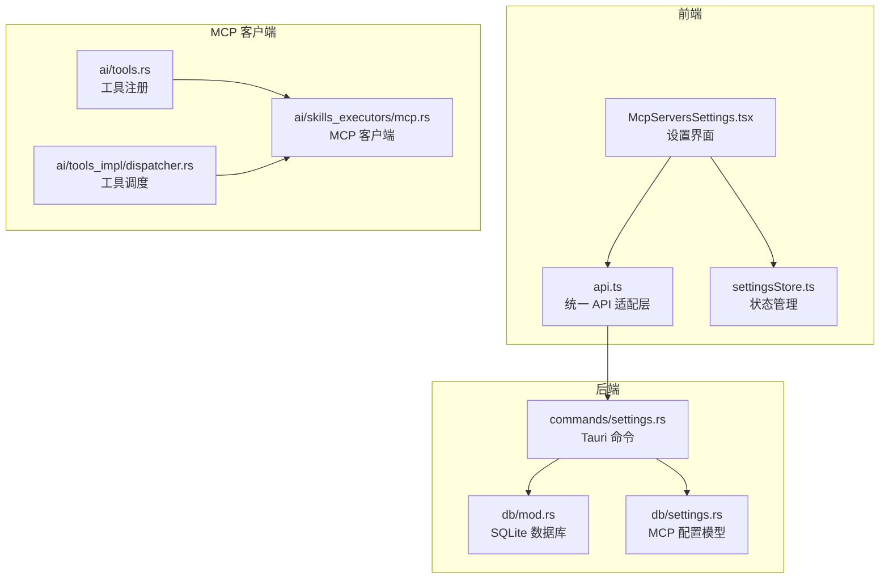
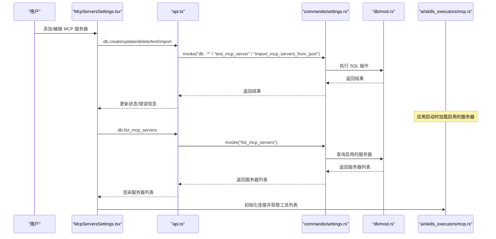
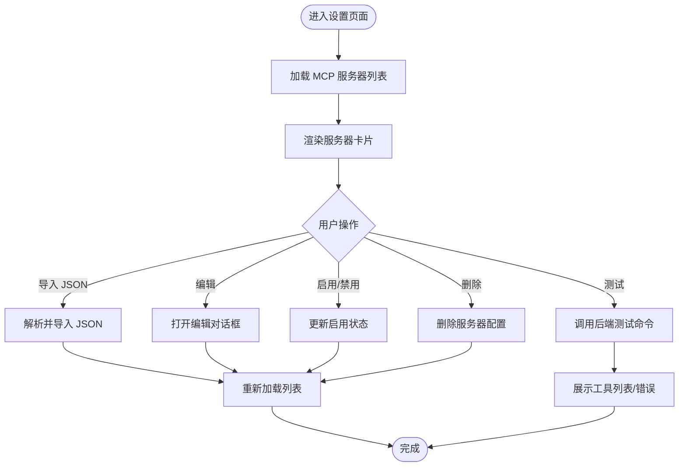
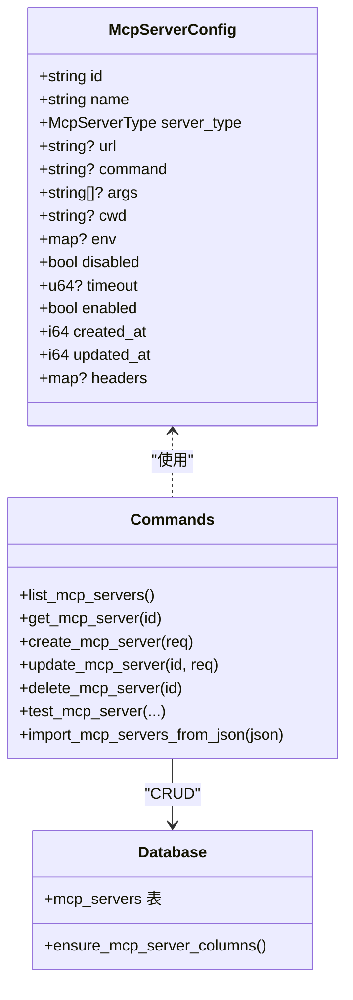
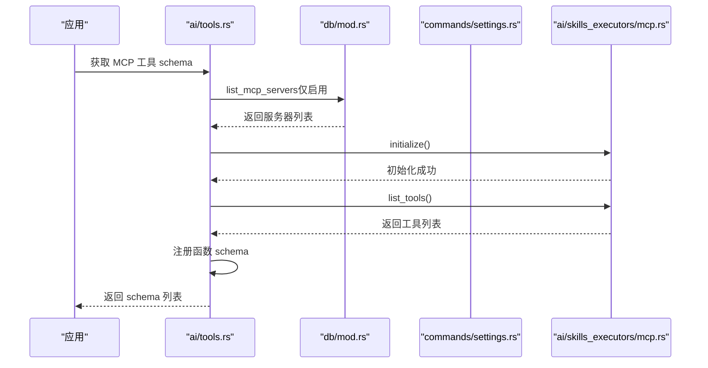
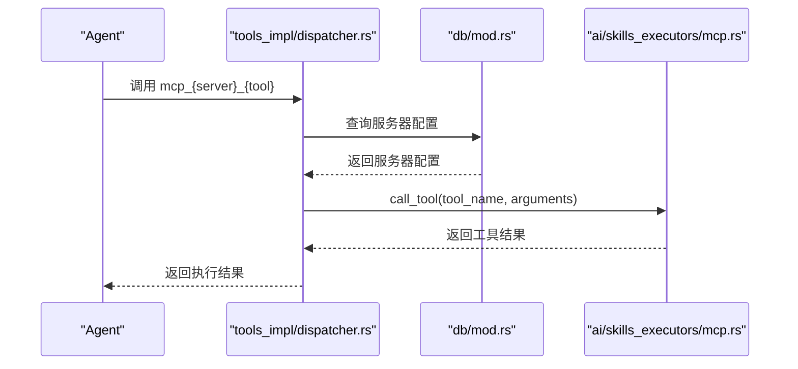
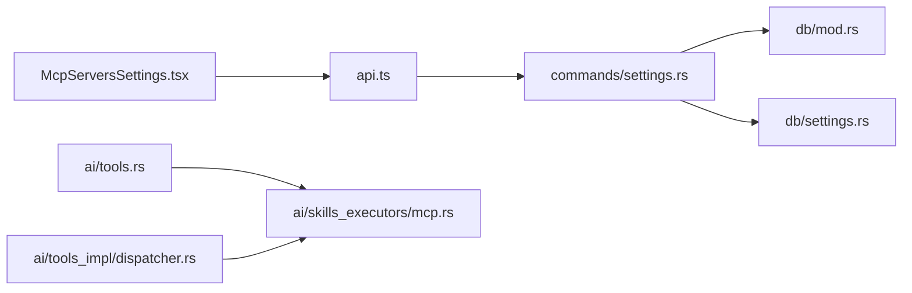

# MCP 服务器设置

<cite>
**本文档引用的文件**
- [McpServersSettings.tsx](file://src-web/src/components/settings/McpServersSettings.tsx)
- [api.ts](file://src-web/src/lib/api.ts)
- [settingsStore.ts](file://src-web/src/stores/settingsStore.ts)
- [settings.rs](file://src-tauri/src/db/settings.rs)
- [settings.rs](file://src-tauri/src/commands/settings.rs)
- [mod.rs](file://src-tauri/src/db/mod.rs)
- [mcp.rs](file://src-tauri/src/ai/skills_executors/mcp.rs)
- [mcp.rs](file://src-tauri/src/ai/tools.rs)
- [dispatcher.rs](file://src-tauri/src/ai/tools_impl/dispatcher.rs)
- [MCP_STANDARD_CONFIG.md](file://docs/MCP_STANDARD_CONFIG.md)
- [MCP_QUICK_START.md](file://docs/MCP_QUICK_START.md)
- [MCP_SKILL_IMPLEMENTATION.md](file://docs/MCP_SKILL_IMPLEMENTATION.md)
</cite>

## 目录
1. [简介](#简介)
2. [项目结构](#项目结构)
3. [核心组件](#核心组件)
4. [架构总览](#架构总览)
5. [详细组件分析](#详细组件分析)
6. [依赖关系分析](#依赖关系分析)
7. [性能考虑](#性能考虑)
8. [故障排除指南](#故障排除指南)
9. [结论](#结论)
10. [附录](#附录)

## 简介
本文件面向 CoSurf 的 MCP（Model Context Protocol）服务器设置，系统性阐述 MCP 服务器的添加、配置、连接管理、传输模式、认证与安全、健康检查与故障诊断、以及最佳实践。文档同时覆盖前端设置界面、后端数据库与命令、以及 MCP 客户端实现，帮助开发者与使用者高效完成 MCP 服务器的接入与运维。

## 项目结构
CoSurf 的 MCP 服务器设置涉及前端 React 组件、统一 API 层、Tauri 命令与数据库、以及 Rust MCP 客户端实现。整体采用分层架构：
- 前端层：设置页面组件负责 MCP 服务器的增删改查、导入导出、测试连接与工具列表展示
- API 层：封装 Electron IPC 与 Tauri invoke，提供统一的数据库与 MCP 命令调用接口
- 后端层：Tauri 命令处理 MCP 服务器配置、测试连接、批量导入；SQLite 数据库存储配置
- MCP 客户端层：Rust 实现的 MCP 客户端，支持 HTTP/Streamable HTTP/SSE 传输模式，负责初始化、工具列表获取与工具调用

图表来源
- [McpServersSettings.tsx:1-688](file://src-web/src/components/settings/McpServersSettings.tsx#L1-688)
- [api.ts:178-218](file://src-web/src/lib/api.ts#L178-218)
- [settings.rs:199-306](file://src-tauri/src/commands/settings.rs#L199-306)
- [mod.rs:114-129](file://src-tauri/src/db/mod.rs#L114-129)
- [settings.rs:71-114](file://src-tauri/src/db/settings.rs#L71-114)
- [mcp.rs:92-101](file://src-tauri/src/ai/skills_executors/mcp.rs#L92-101)
- [mcp.rs:274-454](file://src-tauri/src/ai/tools.rs#L274-454)
- [dispatcher.rs:139-174](file://src-tauri/src/ai/tools_impl/dispatcher.rs#L139-174)

章节来源
- [McpServersSettings.tsx:1-688](file://src-web/src/components/settings/McpServersSettings.tsx#L1-688)
- [api.ts:178-218](file://src-web/src/lib/api.ts#L178-218)
- [settings.rs:199-306](file://src-tauri/src/commands/settings.rs#L199-306)
- [mod.rs:114-129](file://src-tauri/src/db/mod.rs#L114-129)
- [settings.rs:71-114](file://src-tauri/src/db/settings.rs#L71-114)
- [mcp.rs:92-101](file://src-tauri/src/ai/skills_executors/mcp.rs#L92-101)
- [mcp.rs:274-454](file://src-tauri/src/ai/tools.rs#L274-454)
- [dispatcher.rs:139-174](file://src-tauri/src/ai/tools_impl/dispatcher.rs#L139-174)

## 核心组件
- MCP 服务器配置模型：支持 HTTP/Streamable HTTP/SSE/stdio 四种传输模式，包含名称、URL、命令、参数、工作目录、环境变量、超时、启用状态、自定义头部等字段
- 前端设置界面：提供 MCP 服务器列表、导入 JSON、编辑、测试连接、启用/禁用、删除等操作
- 统一 API 层：封装数据库与 MCP 命令调用，前端通过 window.electronAPI.invoke 调用
- Tauri 命令：提供 MCP 服务器的 CRUD、测试连接、批量导入等命令
- MCP 客户端：实现 JSON-RPC 2.0 协议，支持 initialize/initialized 流程与 tools/list/tools/call

章节来源
- [settings.rs:71-114](file://src-tauri/src/db/settings.rs#L71-114)
- [McpServersSettings.tsx:18-53](file://src-web/src/components/settings/McpServersSettings.tsx#L18-53)
- [api.ts:178-218](file://src-web/src/lib/api.ts#L178-218)
- [settings.rs:199-306](file://src-tauri/src/commands/settings.rs#L199-306)
- [mcp.rs:92-101](file://src-tauri/src/ai/skills_executors/mcp.rs#L92-101)

## 架构总览
MCP 服务器设置的端到端流程如下：
- 用户在前端设置界面添加/编辑 MCP 服务器配置
- 前端通过 API 层调用 Tauri 命令，写入 SQLite 数据库
- 应用启动时加载启用的 MCP 服务器，通过 MCP 客户端初始化连接并获取工具列表
- Agent 执行时，根据工具名路由到对应的 MCP 服务器并调用具体工具

图表来源
- [McpServersSettings.tsx:104-127](file://src-web/src/components/settings/McpServersSettings.tsx#L104-127)
- [api.ts:178-218](file://src-web/src/lib/api.ts#L178-218)
- [settings.rs:199-306](file://src-tauri/src/commands/settings.rs#L199-306)
- [mod.rs:114-129](file://src-tauri/src/db/mod.rs#L114-129)
- [mcp.rs:92-101](file://src-tauri/src/ai/skills_executors/mcp.rs#L92-101)

## 详细组件分析

### 前端设置界面组件
- 功能概览
  - 列表展示：显示服务器名称、类型、目标地址/命令、环境变量、启用状态
  - 导入 JSON：支持标准 MCP JSON 配置批量导入
  - 编辑：以 JSON 格式编辑单个服务器配置
  - 测试：调用后端命令测试连接并返回可用工具列表
  - 启用/禁用：切换服务器启用状态
  - 删除：删除服务器配置
- 关键交互
  - 加载服务器：首次渲染时读取数据库并尝试加载启用的服务器
  - 自动加载工具：为每个启用的服务器异步获取工具列表
  - 错误处理：统一捕获并展示错误信息

图表来源
- [McpServersSettings.tsx:104-184](file://src-web/src/components/settings/McpServersSettings.tsx#L104-184)
- [McpServersSettings.tsx:217-237](file://src-web/src/components/settings/McpServersSettings.tsx#L217-237)
- [McpServersSettings.tsx:239-275](file://src-web/src/components/settings/McpServersSettings.tsx#L239-275)
- [McpServersSettings.tsx:291-338](file://src-web/src/components/settings/McpServersSettings.tsx#L291-338)
- [McpServersSettings.tsx:340-352](file://src-web/src/components/settings/McpServersSettings.tsx#L340-352)

章节来源
- [McpServersSettings.tsx:104-184](file://src-web/src/components/settings/McpServersSettings.tsx#L104-184)
- [McpServersSettings.tsx:217-237](file://src-web/src/components/settings/McpServersSettings.tsx#L217-237)
- [McpServersSettings.tsx:239-275](file://src-web/src/components/settings/McpServersSettings.tsx#L239-275)
- [McpServersSettings.tsx:291-338](file://src-web/src/components/settings/McpServersSettings.tsx#L291-338)
- [McpServersSettings.tsx:340-352](file://src-web/src/components/settings/McpServersSettings.tsx#L340-352)

### 统一 API 层
- 职责
  - 封装 window.electronAPI.invoke，统一返回值解析（JSON 字符串转对象）
  - 提供 db.*、mcp.* 等方法，前端通过 db.listMcpServers、db.updateMcpServer、db.testMcpServer、db.importMcpServersFromJson 等调用
- 关键点
  - parseJSON/parseJSONOrNull：处理后端返回的 JSON 字符串
  - mcp.loadServers：用于加载启用的 MCP 服务器（在前端设置界面中调用）

章节来源
- [api.ts:13-49](file://src-web/src/lib/api.ts#L13-49)
- [api.ts:178-218](file://src-web/src/lib/api.ts#L178-218)
- [api.ts:437-444](file://src-web/src/lib/api.ts#L437-444)

### 后端命令与数据库
- 命令
  - list_mcp_servers/get_mcp_server/create_mcp_server/update_mcp_server/delete_mcp_server：CRUD 操作
  - test_mcp_server：测试连接并返回工具列表
  - import_mcp_servers_from_json：批量导入标准 MCP JSON 配置
- 数据库
  - mcp_servers 表：存储服务器配置，包含 server_type、url、command、args、cwd、env、disabled、timeout、enabled、created_at、updated_at、headers 等字段
  - 索引：idx_mcp_servers_enabled（按启用状态索引）

图表来源
- [settings.rs:71-114](file://src-tauri/src/db/settings.rs#L71-114)
- [settings.rs:199-306](file://src-tauri/src/commands/settings.rs#L199-306)
- [mod.rs:114-129](file://src-tauri/src/db/mod.rs#L114-129)

章节来源
- [settings.rs:71-114](file://src-tauri/src/db/settings.rs#L71-114)
- [settings.rs:199-306](file://src-tauri/src/commands/settings.rs#L199-306)
- [mod.rs:114-129](file://src-tauri/src/db/mod.rs#L114-129)

### MCP 客户端与工具注册
- 客户端
  - 支持 Streamable HTTP 与 SSE 两种传输模式
  - 实现 initialize/initialized 流程与 tools/list/tools/call
  - 自动设置 Content-Type、Authorization（Bearer）、自定义 headers
- 工具注册
  - 从启用的 MCP 服务器拉取工具列表，生成函数 schema 并注册到 Agent Loop
  - 命名规则：mcp_{server_safe_name}_{tool_name}

图表来源
- [mcp.rs:274-454](file://src-tauri/src/ai/tools.rs#L274-454)
- [mod.rs:114-129](file://src-tauri/src/db/mod.rs#L114-129)
- [settings.rs:199-306](file://src-tauri/src/commands/settings.rs#L199-306)
- [mcp.rs:92-101](file://src-tauri/src/ai/skills_executors/mcp.rs#L92-101)

章节来源
- [mcp.rs:274-454](file://src-tauri/src/ai/tools.rs#L274-454)
- [mcp.rs:92-101](file://src-tauri/src/ai/skills_executors/mcp.rs#L92-101)

### 工具调度与执行
- 调度流程
  - Agent 调用工具时，根据函数名查找注册表，定位到对应 MCP 服务器与工具
  - 通过 MCP 客户端执行 tools/call，返回结果
- 错误处理
  - 若工具未找到，返回明确的错误信息
  - 若 MCP 服务器断开，返回断开提示

图表来源
- [dispatcher.rs:139-174](file://src-tauri/src/ai/tools_impl/dispatcher.rs#L139-174)
- [mod.rs:114-129](file://src-tauri/src/db/mod.rs#L114-129)
- [mcp.rs:92-101](file://src-tauri/src/ai/skills_executors/mcp.rs#L92-101)

章节来源
- [dispatcher.rs:139-174](file://src-tauri/src/ai/tools_impl/dispatcher.rs#L139-174)

## 依赖关系分析
- 前端依赖
  - McpServersSettings.tsx 依赖 api.ts 提供的 db.* 方法
  - settingsStore.ts 依赖 db.* 方法管理全局设置
- 后端依赖
  - commands/settings.rs 依赖 db/mod.rs 与 db/settings.rs
  - ai/skills_executors/mcp.rs 为工具注册与调度提供客户端能力
- 数据库依赖
  - mcp_servers 表字段与索引确保查询效率与兼容性

图表来源
- [McpServersSettings.tsx:104-127](file://src-web/src/components/settings/McpServersSettings.tsx#L104-127)
- [api.ts:178-218](file://src-web/src/lib/api.ts#L178-218)
- [settings.rs:199-306](file://src-tauri/src/commands/settings.rs#L199-306)
- [mod.rs:114-129](file://src-tauri/src/db/mod.rs#L114-129)
- [settings.rs:71-114](file://src-tauri/src/db/settings.rs#L71-114)
- [mcp.rs:274-454](file://src-tauri/src/ai/tools.rs#L274-454)
- [dispatcher.rs:139-174](file://src-tauri/src/ai/tools_impl/dispatcher.rs#L139-174)

章节来源
- [McpServersSettings.tsx:104-127](file://src-web/src/components/settings/McpServersSettings.tsx#L104-127)
- [api.ts:178-218](file://src-web/src/lib/api.ts#L178-218)
- [settings.rs:199-306](file://src-tauri/src/commands/settings.rs#L199-306)
- [mod.rs:114-129](file://src-tauri/src/db/mod.rs#L114-129)
- [settings.rs:71-114](file://src-tauri/src/db/settings.rs#L71-114)
- [mcp.rs:274-454](file://src-tauri/src/ai/tools.rs#L274-454)
- [dispatcher.rs:139-174](file://src-tauri/src/ai/tools_impl/dispatcher.rs#L139-174)

## 性能考虑
- 连接复用：MCP 客户端使用 reqwest 的默认连接池，减少连接开销
- 异步非阻塞：前端异步加载工具列表，避免阻塞 UI
- 索引优化：mcp_servers 表按 enabled 字段建立索引，提升查询效率
- 超时控制：HTTP 客户端默认超时，避免长时间阻塞
- 批量导入：支持一次性导入多个服务器配置，减少多次往返

章节来源
- [mcp.rs:92-101](file://src-tauri/src/ai/skills_executors/mcp.rs#L92-101)
- [mod.rs:131](file://src-tauri/src/db/mod.rs#L131)
- [McpServersSettings.tsx:129-184](file://src-web/src/components/settings/McpServersSettings.tsx#L129-184)

## 故障排除指南
- 常见问题与解决
  - 认证失败：检查 Authorization 头或自定义头部（如 X-API-Key）是否正确设置
  - 连接超时：确认服务器 URL 正确、网络可达、必要时增加超时时间
  - 工具不存在：检查工具名称拼写、确认服务器支持该工具
  - 服务器无法启动（stdio 模式）：检查命令是否存在、参数是否正确、工作目录是否存在
  - 环境变量不生效：确认 env 字段格式为对象而非字符串
- 前端调试
  - 查看控制台日志，关注 initialize、tools/list、call_tool 的输出
  - 使用“测试连接”按钮验证服务器连通性
- 后端调试
  - 检查数据库中的 mcp_servers 表，确认字段完整（server_type、url、command、args、cwd、env、timeout、enabled、headers）
  - 使用 test_mcp_server 命令验证连接与工具列表

章节来源
- [MCP_QUICK_START.md:174-198](file://docs/MCP_QUICK_START.md#L174-L198)
- [MCP_STANDARD_CONFIG.md:444-491](file://docs/MCP_STANDARD_CONFIG.md#L444-L491)
- [settings.rs:264-306](file://src-tauri/src/commands/settings.rs#L264-L306)
- [mod.rs:235-266](file://src-tauri/src/db/mod.rs#L235-L266)

## 结论
CoSurf 的 MCP 服务器设置提供了完整的配置、测试、注册与执行链路。前端界面直观易用，后端命令与数据库提供可靠的数据持久化，MCP 客户端遵循标准协议，支持多种传输模式。通过合理的超时与错误处理，系统具备良好的稳定性与可维护性。建议在生产环境中结合健康检查与重试策略，进一步提升可靠性。

## 附录

### 传输模式与使用场景
- HTTP/Streamable HTTP
  - 适用：远程 MCP 服务器，支持标准 JSON-RPC
  - 特点：无需本地进程，便于跨平台部署
- SSE
  - 适用：需要流式响应的场景
  - 特点：先建立 SSE 连接获取 endpoint，再 POST JSON-RPC
- stdio
  - 适用：本地 MCP 服务器，通过子进程通信
  - 特点：适合本地开发与私有部署

章节来源
- [mcp.rs:80-88](file://src-tauri/src/ai/skills_executors/mcp.rs#L80-L88)
- [settings.rs:289-293](file://src-tauri/src/commands/settings.rs#L289-L293)

### 服务器连接参数设置
- 主机地址与端口：HTTP 模式下通过 url 字段配置
- 认证方式：支持 Authorization 头（Bearer Token）与自定义头部（如 X-API-Key）
- 环境变量：通过 env 字段注入，避免硬编码
- 工作目录：通过 cwd 字段设置，stdio 模式下尤为重要
- 超时：通过 timeout 字段设置，单位秒

章节来源
- [settings.rs:71-114](file://src-tauri/src/db/settings.rs#L71-L114)
- [mcp.rs:136-145](file://src-tauri/src/ai/skills_executors/mcp.rs#L136-L145)

### 发现与注册机制
- 发现：应用启动时通过 db.list_mcp_servers 获取启用的服务器
- 注册：工具注册阶段调用 MCP 客户端初始化并获取工具列表，生成函数 schema
- 调度：Agent 执行时根据函数名路由到对应服务器与工具

章节来源
- [mcp.rs:274-454](file://src-tauri/src/ai/tools.rs#L274-L454)
- [dispatcher.rs:139-174](file://src-tauri/src/ai/tools_impl/dispatcher.rs#L139-L174)

### 健康检查与故障诊断
- 健康检查：前端“测试连接”按钮调用 test_mcp_server 命令，验证服务器连通性与工具列表
- 故障诊断：查看前端控制台日志、检查数据库表字段完整性、确认网络与认证配置

章节来源
- [McpServersSettings.tsx:291-338](file://src-web/src/components/settings/McpServersSettings.tsx#L291-L338)
- [settings.rs:264-306](file://src-tauri/src/commands/settings.rs#L264-L306)
- [MCP_QUICK_START.md:160-173](file://docs/MCP_QUICK_START.md#L160-L173)

### 常见配置示例与最佳实践
- 标准 MCP JSON 配置示例与字段说明
- 最佳实践：避免硬编码敏感信息、合理设置超时、使用环境变量管理密钥
- 常见问题排查与解决方案

章节来源
- [MCP_STANDARD_CONFIG.md:13-57](file://docs/MCP_STANDARD_CONFIG.md#L13-L57)
- [MCP_STANDARD_CONFIG.md:141-275](file://docs/MCP_STANDARD_CONFIG.md#L141-L275)
- [MCP_STANDARD_CONFIG.md:444-491](file://docs/MCP_STANDARD_CONFIG.md#L444-L491)

### 安全考虑与权限控制
- 认证：优先使用 Authorization 头或自定义头部（如 X-API-Key），避免在 url 中携带敏感信息
- 环境变量：通过 env 字段注入，避免硬编码
- 权限控制：通过 enabled/disabled 字段控制服务器启用状态，减少不必要的暴露
- 日志：仅记录必要的调试信息，避免泄露敏感数据

章节来源
- [mcp.rs:136-145](file://src-tauri/src/ai/skills_executors/mcp.rs#L136-L145)
- [MCP_STANDARD_CONFIG.md:408-424](file://docs/MCP_STANDARD_CONFIG.md#L408-L424)
- [MCP_SKILL_IMPLEMENTATION.md:322-348](file://docs/MCP_SKILL_IMPLEMENTATION.md#L322-L348)