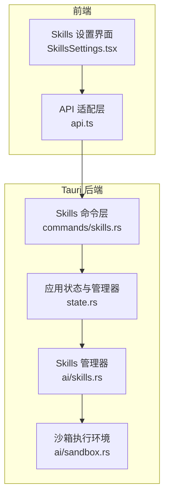
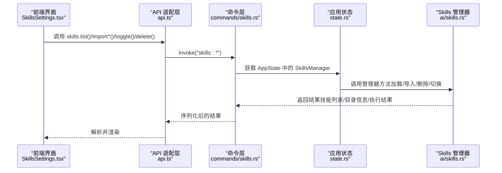
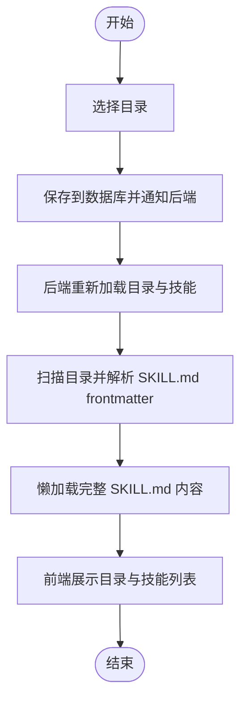
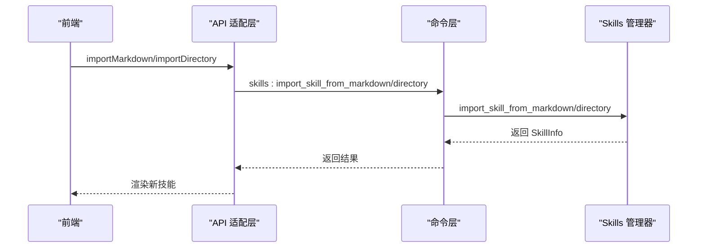
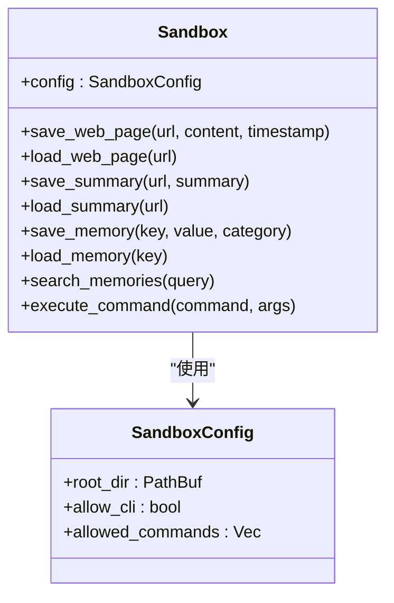

# Skills 设置

<cite>
**本文引用的文件**
- [SkillsSettings.tsx](file://src-web/src/components/settings/SkillsSettings.tsx)
- [api.ts](file://src-web/src/lib/api.ts)
- [skills.rs（命令层）](file://src-tauri/src/commands/skills.rs)
- [skills.rs（管理器）](file://src-tauri/src/ai/skills.rs)
- [state.rs](file://src-tauri/src/state.rs)
- [sandbox.rs](file://src-tauri/src/ai/sandbox.rs)
- [MCP 技术实现文档](file://docs/MCP_SKILL_IMPLEMENTATION.md)
- [MCP 配置 JSON 文档](file://docs/MCP_JSON_CONFIG.md)
- [IQS 配置解耦文档](file://docs/IQS_SKILLS_CONFIG_DECOUPLING.md)
- [SKILL.md 示例（Python 计算器）](file://examples/skills/python-calculator/SKILL.md)
- [SKILL.md 示例（网页总结器）](file://examples/skills/web-summarizer/SKILL.md)
</cite>

## 目录
1. [简介](#简介)
2. [项目结构](#项目结构)
3. [核心组件](#核心组件)
4. [架构总览](#架构总览)
5. [详细组件分析](#详细组件分析)
6. [依赖关系分析](#依赖关系分析)
7. [性能考量](#性能考量)
8. [故障排查指南](#故障排查指南)
9. [结论](#结论)
10. [附录](#附录)

## 简介
本文件面向 CoSurf 的 Skills 设置系统，围绕 Skills 目录的配置与管理、技能导入/编辑/删除/启停、元数据管理、执行环境与沙箱隔离、验证与调试、最佳实践与安全、以及更新与版本兼容等方面进行系统化说明。文档既适用于开发者，也便于具备有限技术背景的用户理解与使用。

## 项目结构
Skills 设置系统由前端 React 组件、统一 API 适配层、Tauri 命令层、Rust Skills 管理器与沙箱执行环境构成，形成“前端设置界面 → API 适配 → 命令层 → 管理器/沙箱”的分层架构。

**图表来源**
- [SkillsSettings.tsx:1-550](file://src-web/src/components/settings/SkillsSettings.tsx#L1-L550)
- [api.ts:365-389](file://src-web/src/lib/api.ts#L365-L389)
- [skills.rs（命令层）:1-152](file://src-tauri/src/commands/skills.rs#L1-L152)
- [skills.rs（管理器）:1-576](file://src-tauri/src/ai/skills.rs#L1-L576)
- [state.rs:1-81](file://src-tauri/src/state.rs#L1-L81)
- [sandbox.rs:1-251](file://src-tauri/src/ai/sandbox.rs#L1-L251)

**章节来源**
- [SkillsSettings.tsx:1-550](file://src-web/src/components/settings/SkillsSettings.tsx#L1-L550)
- [api.ts:365-389](file://src-web/src/lib/api.ts#L365-L389)
- [skills.rs（命令层）:1-152](file://src-tauri/src/commands/skills.rs#L1-L152)
- [skills.rs（管理器）:1-576](file://src-tauri/src/ai/skills.rs#L1-L576)
- [state.rs:1-81](file://src-tauri/src/state.rs#L1-L81)
- [sandbox.rs:1-251](file://src-tauri/src/ai/sandbox.rs#L1-L251)

## 核心组件
- 前端设置界面：提供 Skills 目录配置、目录列表、已加载技能列表、导入/删除/启停/预览等交互。
- API 适配层：封装与后端的 IPC 调用，统一返回值解析。
- 命令层：暴露 Tauri 命令，供前端调用，如列出技能、导入、删除、切换启用状态、读取目录文件等。
- Skills 管理器：负责 Skills 目录扫描、SKILL.md 解析与懒加载、导入/删除/启停、目录信息统计等。
- 沙箱执行环境：提供受限的 CLI 命令执行与数据存储能力，用于 CLI/脚本类技能的安全执行。

**章节来源**
- [SkillsSettings.tsx:1-550](file://src-web/src/components/settings/SkillsSettings.tsx#L1-L550)
- [api.ts:365-389](file://src-web/src/lib/api.ts#L365-L389)
- [skills.rs（命令层）:1-152](file://src-tauri/src/commands/skills.rs#L1-L152)
- [skills.rs（管理器）:1-576](file://src-tauri/src/ai/skills.rs#L1-L576)
- [sandbox.rs:1-251](file://src-tauri/src/ai/sandbox.rs#L1-L251)

## 架构总览
前端通过 API 适配层调用 Tauri 命令，命令层访问应用状态中的 Skills 管理器，管理器负责文件系统层面的 Skills 操作；对于需要执行的技能，结合沙箱执行环境进行安全隔离。

**图表来源**
- [SkillsSettings.tsx:36-223](file://src-web/src/components/settings/SkillsSettings.tsx#L36-L223)
- [api.ts:365-389](file://src-web/src/lib/api.ts#L365-L389)
- [skills.rs（命令层）:42-151](file://src-tauri/src/commands/skills.rs#L42-L151)
- [skills.rs（管理器）:172-284](file://src-tauri/src/ai/skills.rs#L172-L284)
- [state.rs:25-79](file://src-tauri/src/state.rs#L25-L79)

## 详细组件分析

### Skills 目录配置与管理
- 目录选择与保存：前端提供目录选择对话框与保存流程，保存后调用数据库接口持久化，并通知后端更新目录与重新加载。
- 目录扫描与懒加载：后端在 Skills 目录中扫描每个子目录，要求包含 SKILL.md；仅解析 frontmatter（名称、描述、标签、启用状态），完整内容采用懒加载。
- 目录信息展示：列出每个 Skill 目录的文件大小、修改时间、启用状态等，按修改时间排序。

**图表来源**
- [SkillsSettings.tsx:85-128](file://src-web/src/components/settings/SkillsSettings.tsx#L85-L128)
- [api.ts:157-167](file://src-web/src/lib/api.ts#L157-L167)
- [skills.rs（命令层）:126-151](file://src-tauri/src/commands/skills.rs#L126-L151)
- [skills.rs（管理器）:172-296](file://src-tauri/src/ai/skills.rs#L172-L296)

**章节来源**
- [SkillsSettings.tsx:85-128](file://src-web/src/components/settings/SkillsSettings.tsx#L85-L128)
- [api.ts:157-167](file://src-web/src/lib/api.ts#L157-L167)
- [skills.rs（命令层）:126-151](file://src-tauri/src/commands/skills.rs#L126-L151)
- [skills.rs（管理器）:172-296](file://src-tauri/src/ai/skills.rs#L172-L296)

### 技能导入、编辑、删除与启停
- 导入方式：
  - 从 Markdown 文本导入：解析 frontmatter 生成目录名（kebab-case），写入 SKILL.md 并登记到内存。
  - 从文件夹导入：校验源目录包含 SKILL.md，复制到目标目录，重新加载。
- 编辑：通过更新 SKILL.md frontmatter 中的 enabled 字段实现启停；也可在前端直接切换后端持久化。
- 删除：删除对应目录，清理文件系统。

**图表来源**
- [SkillsSettings.tsx:137-173](file://src-web/src/components/settings/SkillsSettings.tsx#L137-L173)
- [api.ts:375-382](file://src-web/src/lib/api.ts#L375-L382)
- [skills.rs（命令层）:92-124](file://src-tauri/src/commands/skills.rs#L92-L124)
- [skills.rs（管理器）:359-447](file://src-tauri/src/ai/skills.rs#L359-L447)

**章节来源**
- [SkillsSettings.tsx:137-173](file://src-web/src/components/settings/SkillsSettings.tsx#L137-L173)
- [api.ts:375-382](file://src-web/src/lib/api.ts#L375-L382)
- [skills.rs（命令层）:92-124](file://src-tauri/src/commands/skills.rs#L92-L124)
- [skills.rs（管理器）:359-447](file://src-tauri/src/ai/skills.rs#L359-L447)

### 元数据管理（名称、描述、版本、作者等）
- 元数据来源：SKILL.md 的 YAML frontmatter，包含 name、description、tags、enabled 等字段。
- 版本与作者：当前实现未强制要求 version/author 字段；若需扩展，可在 frontmatter 中增加并由管理器解析。
- 元数据持久化：frontmatter 中的 enabled 字段会在启停操作时写回 SKILL.md。

**章节来源**
- [skills.rs（管理器）:51-60](file://src-tauri/src/ai/skills.rs#L51-L60)
- [skills.rs（管理器）:478-510](file://src-tauri/src/ai/skills.rs#L478-L510)

### 执行环境与沙箱隔离
- CLI/脚本类技能：通过沙箱执行受限命令，支持白名单命令与工作目录隔离。
- MCP 类技能：遵循 MCP 协议，支持 HTTP/SSE 与 JSON-RPC，可配置 API Key 与超时。
- 懒加载：SKILL.md 的正文内容仅在需要时读取，降低内存与 IO 压力。

**图表来源**
- [sandbox.rs:12-46](file://src-tauri/src/ai/sandbox.rs#L12-L46)
- [sandbox.rs:49-251](file://src-tauri/src/ai/sandbox.rs#L49-L251)

**章节来源**
- [sandbox.rs:1-251](file://src-tauri/src/ai/sandbox.rs#L1-L251)
- [MCP 技术实现文档:1-526](file://docs/MCP_SKILL_IMPLEMENTATION.md#L1-L526)

### 验证、测试与调试
- 前端调试：导入模态框支持粘贴 SKILL.md 内容进行导入与预览；预览面板展示 SKILL.md 原文。
- 后端验证：导入时校验 SKILL.md frontmatter 与目录结构；启停时更新 frontmatter；懒加载时读取文件。
- 常见问题定位：检查目录是否存在、SKILL.md 是否存在、frontmatter 格式是否正确、命令是否在白名单内。

**章节来源**
- [SkillsSettings.tsx:175-193](file://src-web/src/components/settings/SkillsSettings.tsx#L175-L193)
- [skills.rs（管理器）:231-272](file://src-tauri/src/ai/skills.rs#L231-L272)
- [sandbox.rs:215-244](file://src-tauri/src/ai/sandbox.rs#L215-L244)

### 不同类型技能的配置差异与特殊要求
- CLI 技能：依赖沙箱的受限命令执行，需在 allowed_commands 白名单中；适合简单命令组合。
- 脚本技能：可扩展为 Python/Node 等脚本执行（当前仓库未提供具体脚本执行器实现，但管理器支持导入与懒加载）。
- MCP 技能：遵循 MCP 协议，支持 HTTP/SSE 与 JSON-RPC；可通过 JSON 配置批量导入多个 MCP 服务器，支持环境变量注入与 API Key 管理。

**章节来源**
- [sandbox.rs:17-44](file://src-tauri/src/ai/sandbox.rs#L17-L44)
- [MCP 配置 JSON 文档:1-461](file://docs/MCP_JSON_CONFIG.md#L1-L461)
- [MCP 技术实现文档:1-526](file://docs/MCP_SKILL_IMPLEMENTATION.md#L1-L526)

### 更新机制与版本兼容
- 目录同步：种子示例技能会复制到用户 Skills 目录，始终覆盖以确保最新。
- 前端按需加载：Skills 目录与 IQS API Key 解耦，切换标签时按需加载，避免不必要请求。
- 版本兼容：frontmatter 字段变更时，管理器仍可解析默认值（如 enabled 默认 true），保证向前兼容。

**章节来源**
- [skills.rs（管理器）:99-170](file://src-tauri/src/ai/skills.rs#L99-L170)
- [IQS 配置解耦文档:1-343](file://docs/IQS_SKILLS_CONFIG_DECOUPLING.md#L1-L343)

## 依赖关系分析
- 前端依赖 API 适配层，API 适配层依赖 Tauri invoke 通道。
- 命令层依赖应用状态中的 SkillsManager，管理器依赖文件系统与 YAML 解析。
- 沙箱执行环境与管理器解耦，仅在需要时被调用。

**图表来源**
- [SkillsSettings.tsx:1-550](file://src-web/src/components/settings/SkillsSettings.tsx#L1-L550)
- [api.ts:365-389](file://src-web/src/lib/api.ts#L365-L389)
- [skills.rs（命令层）:1-152](file://src-tauri/src/commands/skills.rs#L1-L152)
- [skills.rs（管理器）:1-576](file://src-tauri/src/ai/skills.rs#L1-L576)
- [state.rs:1-81](file://src-tauri/src/state.rs#L1-L81)
- [sandbox.rs:1-251](file://src-tauri/src/ai/sandbox.rs#L1-L251)

**章节来源**
- [SkillsSettings.tsx:1-550](file://src-web/src/components/settings/SkillsSettings.tsx#L1-L550)
- [api.ts:365-389](file://src-web/src/lib/api.ts#L365-L389)
- [skills.rs（命令层）:1-152](file://src-tauri/src/commands/skills.rs#L1-L152)
- [skills.rs（管理器）:1-576](file://src-tauri/src/ai/skills.rs#L1-L576)
- [state.rs:1-81](file://src-tauri/src/state.rs#L1-L81)
- [sandbox.rs:1-251](file://src-tauri/src/ai/sandbox.rs#L1-L251)

## 性能考量
- 懒加载：SKILL.md 正文仅在需要时读取，减少内存与 IO 压力。
- 目录扫描：仅遍历目录并读取 frontmatter，避免大文件解析。
- 按需加载：前端按标签切换时才加载对应配置，避免冗余请求。
- 沙箱命令白名单：限制可执行命令，降低风险与资源消耗。

[本节为通用指导，无需特定文件引用]

## 故障排查指南
- 无法找到 SKILL.md：确认目录结构与文件存在。
- frontmatter 格式错误：检查 YAML 语法与分隔符。
- 启停后未生效：确认 frontmatter 中 enabled 字段已更新。
- 命令执行失败：检查命令是否在沙箱白名单内，工作目录是否正确。
- MCP 连接失败：检查 server_url、API Key、超时设置与网络连通性。

**章节来源**
- [skills.rs（管理器）:231-272](file://src-tauri/src/ai/skills.rs#L231-L272)
- [sandbox.rs:215-244](file://src-tauri/src/ai/sandbox.rs#L215-L244)
- [MCP 技术实现文档:280-348](file://docs/MCP_SKILL_IMPLEMENTATION.md#L280-L348)

## 结论
CoSurf 的 Skills 设置系统通过清晰的分层架构实现了目录配置、技能管理、元数据解析与懒加载、以及安全的执行环境。前端提供直观的设置界面，后端以管理器为核心完成文件系统操作与协议执行，沙箱与 MCP 支持保障了执行的安全性与灵活性。按需加载与解耦设计提升了性能与可维护性。

[本节为总结，无需特定文件引用]

## 附录

### 示例与参考
- 示例技能：Python 计算器与网页总结器的 SKILL.md。
- MCP 配置：支持 JSON 批量导入 MCP 服务器配置。
- IQS 配置解耦：Skills 目录与 IQS API Key 的加载解耦，提升性能与可维护性。

**章节来源**
- [SKILL.md 示例（Python 计算器）:1-39](file://examples/skills/python-calculator/SKILL.md#L1-L39)
- [SKILL.md 示例（网页总结器）:1-57](file://examples/skills/web-summarizer/SKILL.md#L1-L57)
- [MCP 配置 JSON 文档:1-461](file://docs/MCP_JSON_CONFIG.md#L1-L461)
- [IQS 配置解耦文档:1-343](file://docs/IQS_SKILLS_CONFIG_DECOUPLING.md#L1-L343)