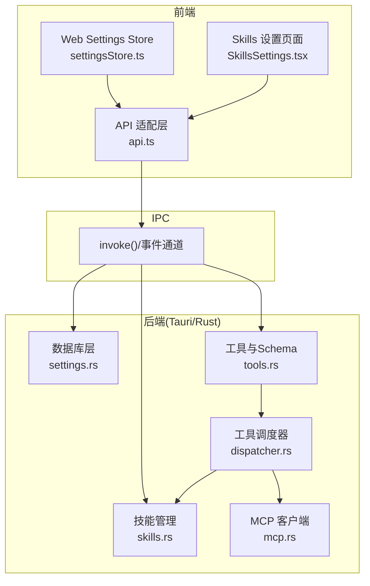
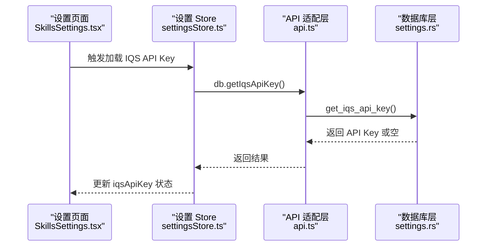
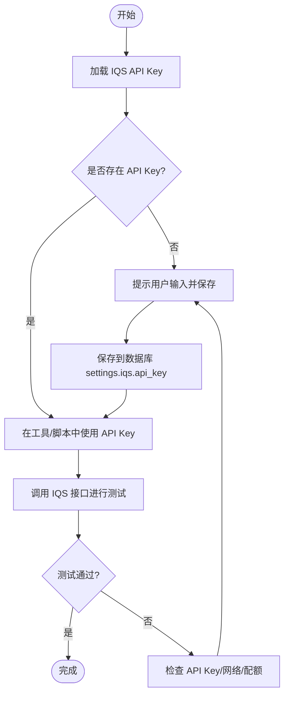
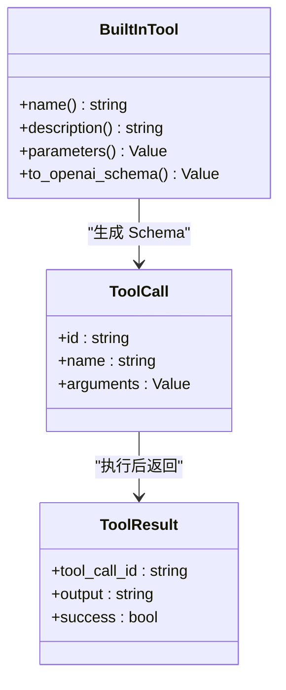
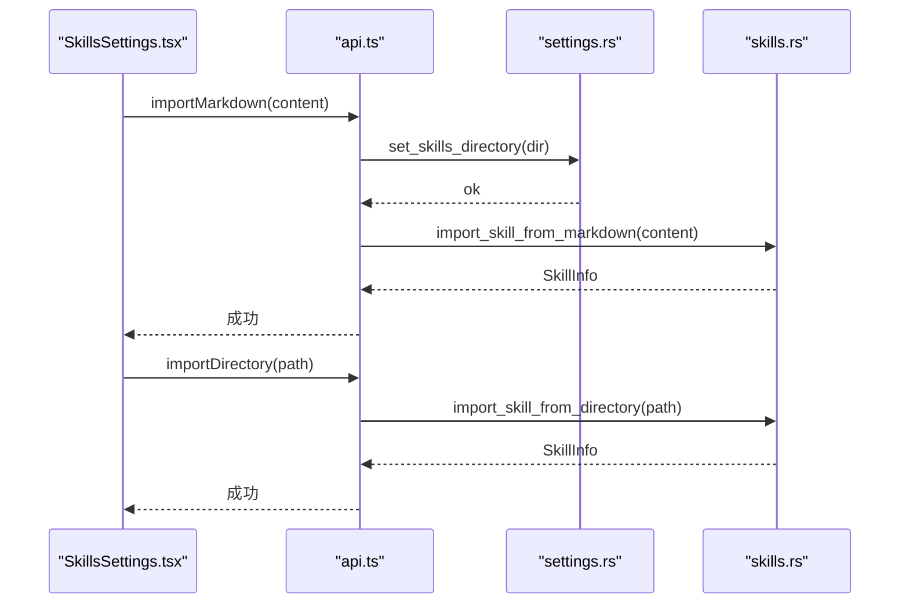
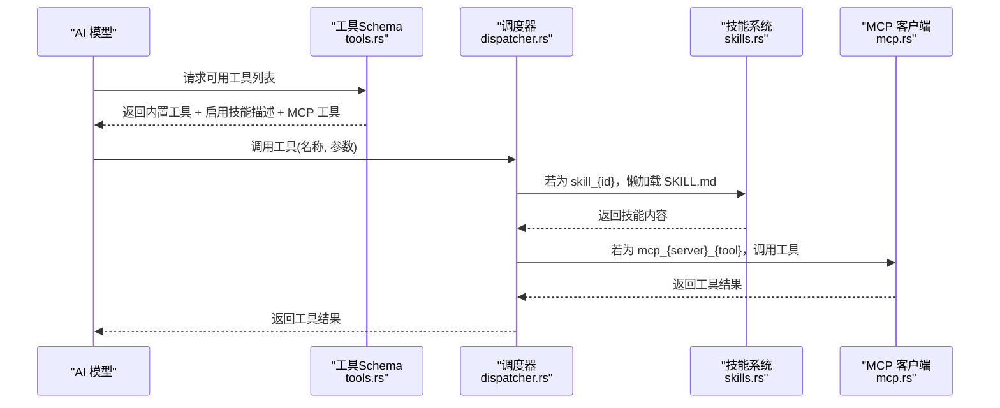
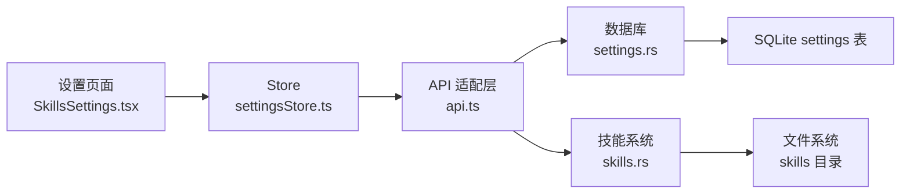

# 工具设置

<cite>
**本文引用的文件**
- [settings.ts](file://packages/shared/src/settings.ts)
- [settingsStore.ts](file://src-web/src/stores/settingsStore.ts)
- [SkillsSettings.tsx](file://src-web/src/components/settings/SkillsSettings.tsx)
- [api.ts](file://src-web/src/lib/api.ts)
- [settings.rs](file://src-tauri/src/db/settings.rs)
- [skills.rs](file://src-tauri/src/ai/skills.rs)
- [tools.rs](file://src-tauri/src/ai/tools.rs)
- [dispatcher.rs](file://src-tauri/src/ai/tools_impl/dispatcher.rs)
- [mcp.rs](file://src-tauri/src/ai/skills_executors/mcp.rs)
- [alibabacloud-iqs-search-skill.json](file://examples/alibabacloud-iqs-search-skill.json)
- [SKILL.md（示例）](file://examples/skills/alibaba-iqs-search/SKILL.md)
- [tool.ts](file://packages/shared/src/tool.ts)
</cite>

## 目录
1. [简介](#简介)
2. [项目结构](#项目结构)
3. [核心组件](#核心组件)
4. [架构总览](#架构总览)
5. [详细组件分析](#详细组件分析)
6. [依赖分析](#依赖分析)
7. [性能考量](#性能考量)
8. [故障排查指南](#故障排查指南)
9. [结论](#结论)
10. [附录](#附录)

## 简介
本文件面向 CoSurf 工具设置系统，围绕以下目标展开：
- IQS（阿里云智能查询服务）API Key 的配置与管理：获取方式、安全存储、连接测试与使用注意事项
- 内置工具的启用/禁用控制机制与分类说明
- 工具配置的数据结构与存储方式
- 工具权限管理与安全考虑
- 工具配置的导入导出与备份恢复思路
- 工具使用的最佳实践与性能优化建议
- 工具与 AI 模型的集成关系与调用流程

## 项目结构
CoSurf 的工具设置系统横跨前端 React、共享类型定义、IPC 适配层与后端 Tauri/Rust：
- 前端：设置 Store、设置页面组件、API 适配层
- 后端：数据库层（settings.rs）、技能管理（skills.rs）、工具与调度（tools.rs、dispatcher.rs）、MCP 客户端（mcp.rs）

图表来源
- [settingsStore.ts:1-201](file://src-web/src/stores/settingsStore.ts#L1-L201)
- [SkillsSettings.tsx:1-541](file://src-web/src/components/settings/SkillsSettings.tsx#L1-L541)
- [api.ts:1-429](file://src-web/src/lib/api.ts#L1-L429)
- [settings.rs:1-540](file://src-tauri/src/db/settings.rs#L1-L540)
- [skills.rs:1-567](file://src-tauri/src/ai/skills.rs#L1-L567)
- [tools.rs:1-418](file://src-tauri/src/ai/tools.rs#L1-L418)
- [dispatcher.rs:1-141](file://src-tauri/src/ai/tools_impl/dispatcher.rs#L1-L141)
- [mcp.rs:1-555](file://src-tauri/src/ai/skills_executors/mcp.rs#L1-L555)

章节来源
- [settings.ts:1-47](file://packages/shared/src/settings.ts#L1-L47)
- [settingsStore.ts:1-201](file://src-web/src/stores/settingsStore.ts#L1-L201)
- [SkillsSettings.tsx:1-541](file://src-web/src/components/settings/SkillsSettings.tsx#L1-L541)
- [api.ts:1-429](file://src-web/src/lib/api.ts#L1-L429)
- [settings.rs:1-540](file://src-tauri/src/db/settings.rs#L1-L540)
- [skills.rs:1-567](file://src-tauri/src/ai/skills.rs#L1-L567)
- [tools.rs:1-418](file://src-tauri/src/ai/tools.rs#L1-L418)
- [dispatcher.rs:1-141](file://src-tauri/src/ai/tools_impl/dispatcher.rs#L1-L141)
- [mcp.rs:1-555](file://src-tauri/src/ai/skills_executors/mcp.rs#L1-L555)

## 核心组件
- 设置 Store 与共享类型
  - Store 负责 IQS API Key 与 Skills 目录的独立加载与持久化
  - 共享类型定义 AppSettings、ShortcutConfig 等
- 设置页面组件
  - Skills 设置页提供导入/导出、启用/禁用、目录管理、内容预览等
- API 适配层
  - 统一封装 invoke 调用，提供 db、skills 等命名空间方法
- 数据库层
  - settings.rs 提供 get/set settings、模型配置、MCP 服务器配置、IQS API Key 存储
- 技能系统
  - skills.rs 实现技能目录扫描、懒加载、导入导出、启用/禁用与内容读取
- 工具与调度
  - tools.rs 定义内置工具 Schema；dispatcher.rs 根据工具名分发到具体实现
- MCP 客户端
  - mcp.rs 实现 Streamable HTTP/SSE 传输协议，支持工具发现与调用

章节来源
- [settings.ts:1-47](file://packages/shared/src/settings.ts#L1-L47)
- [settingsStore.ts:1-201](file://src-web/src/stores/settingsStore.ts#L1-L201)
- [SkillsSettings.tsx:1-541](file://src-web/src/components/settings/SkillsSettings.tsx#L1-L541)
- [api.ts:1-429](file://src-web/src/lib/api.ts#L1-L429)
- [settings.rs:1-540](file://src-tauri/src/db/settings.rs#L1-L540)
- [skills.rs:1-567](file://src-tauri/src/ai/skills.rs#L1-L567)
- [tools.rs:1-418](file://src-tauri/src/ai/tools.rs#L1-L418)
- [dispatcher.rs:1-141](file://src-tauri/src/ai/tools_impl/dispatcher.rs#L1-L141)
- [mcp.rs:1-555](file://src-tauri/src/ai/skills_executors/mcp.rs#L1-L555)

## 架构总览
工具设置系统采用“前端 Store + API 适配层 + IPC + 后端数据库/业务模块”的分层架构。IQS API Key 与 Skills 目录分别由独立的 Store 方法加载，避免不必要的耦合与性能浪费。

图表来源
- [SkillsSettings.tsx:168-184](file://src-web/src/components/settings/SkillsSettings.tsx#L168-L184)
- [settingsStore.ts:172-181](file://src-web/src/stores/settingsStore.ts#L172-L181)
- [api.ts:168-176](file://src-web/src/lib/api.ts#L168-L176)
- [settings.rs:368-376](file://src-tauri/src/db/settings.rs#L368-L376)

## 详细组件分析

### IQS（阿里云）API Key 配置与管理
- 获取方式
  - 在阿里云官网创建服务并获取 API Key
  - 在 CoSurf 设置中粘贴保存（Store 独立加载，避免与 Skills 目录加载耦合）
- 安全存储
  - 通过数据库 settings 表以键值形式持久化（键为 iqs.api_key）
  - 建议结合系统密钥链（Windows Credential Manager、macOS Keychain、Linux Secret Service API）进一步强化安全
- 连接测试与使用
  - 示例技能“阿里云 IQS 搜索”展示了如何在脚本中读取环境变量或配置文件中的 API Key，并发起请求
  - 建议在前端提供“连接测试”按钮，调用后端接口验证 API Key 可用性（当前未见专用测试接口，可参考 MCP 测试模式扩展）

图表来源
- [settingsStore.ts:172-181](file://src-web/src/stores/settingsStore.ts#L172-L181)
- [settings.rs:368-376](file://src-tauri/src/db/settings.rs#L368-L376)
- [alibabacloud-iqs-search-skill.json:8-43](file://examples/alibabacloud-iqs-search-skill.json#L8-L43)

章节来源
- [settingsStore.ts:172-181](file://src-web/src/stores/settingsStore.ts#L172-L181)
- [settings.rs:368-376](file://src-tauri/src/db/settings.rs#L368-L376)
- [alibabacloud-iqs-search-skill.json:8-43](file://examples/alibabacloud-iqs-search-skill.json#L8-L43)

### 内置工具的启用/禁用与分类
- 启用/禁用控制
  - 通过 Tools 设置页或技能页的开关控制工具可用性
  - 后端通过工具 Schema 暴露给模型，模型据此决定是否调用
- 工具分类与功能
  - 网页类：总结、网页操作 Agent、截图与视觉理解
  - 知识类：导出 Markdown
  - 搜索类：联网搜索（需配置搜索 API Key）
  - 其他：OpenUrl、Translate、ExportMarkdown、WebSearch、RunCommand 等

图表来源
- [tools.rs:19-195](file://src-tauri/src/ai/tools.rs#L19-L195)
- [tools.rs:197-225](file://src-tauri/src/ai/tools.rs#L197-L225)

章节来源
- [tools.rs:19-195](file://src-tauri/src/ai/tools.rs#L19-L195)
- [tool.ts:29-87](file://packages/shared/src/tool.ts#L29-L87)

### 工具配置的数据结构与存储
- 共享类型定义
  - ToolDefinition：工具定义（id、name、description、category、icon、enabled、configSchema）
  - ToolInstance：工具实例（toolId、enabled、config）
- 数据库存储
  - settings 表：键值对存储（如 iqs.api_key、skills.directory）
  - model_configs 表：模型配置
  - mcp_servers 表：MCP 服务器配置（含类型、URL、命令、工作目录、环境变量、超时等）
- 技能目录结构
  - skills/<skill-id>/SKILL.md：技能描述与执行步骤，前端懒加载内容

章节来源
- [tool.ts:1-87](file://packages/shared/src/tool.ts#L1-L87)
- [settings.rs:7-23](file://src-tauri/src/db/settings.rs#L7-L23)
- [settings.rs:339-364](file://src-tauri/src/db/settings.rs#L339-L364)
- [skills.rs:24-45](file://src-tauri/src/ai/skills.rs#L24-L45)

### 工具权限管理与安全考虑
- 权限与能力
  - 新增功能需在 Tauri 能力配置中声明相应 permission（如 shell:allow-open、dialog:allow-save、fs:default、http:default）
- API Key 安全
  - 建议使用系统密钥链存储敏感信息，避免明文写入磁盘
  - 对外暴露的脚本/工具应从环境变量或受控文件读取密钥
- 网络与传输
  - MCP 服务器支持 Streamable HTTP 与 SSE 两种传输，需确保 HTTPS 与正确的认证头
- 文件系统与目录权限
  - 建议限制 skills 目录权限，避免被非预期程序读写

章节来源
- [settings.rs:25-114](file://src-tauri/src/db/settings.rs#L25-L114)
- [mcp.rs:103-159](file://src-tauri/src/ai/skills_executors/mcp.rs#L103-L159)
- [SKILLS_PERSISTENCE.md:330-351](file://docs/README.md#L330-L351)

### 工具配置的导入导出与备份恢复
- 技能导入/导出
  - 支持从 Markdown 文本导入技能（创建目录结构并写入 SKILL.md）
  - 支持从文件夹导入技能（复制目录到 skills 目录）
  - 支持列出技能目录、读取 SKILL.md 内容、启用/禁用、删除
- 备份与恢复
  - skills 目录可整体备份；默认路径位于用户主目录下的 .cosurf/skills
  - 建议将 skills 目录纳入版本控制或云同步，便于团队协作与恢复

图表来源
- [SkillsSettings.tsx:128-164](file://src-web/src/components/settings/SkillsSettings.tsx#L128-L164)
- [api.ts:371-378](file://src-web/src/lib/api.ts#L371-L378)
- [settings.rs:361-364](file://src-tauri/src/db/settings.rs#L361-L364)
- [skills.rs:92-124](file://src-tauri/src/ai/skills.rs#L92-L124)

章节来源
- [SkillsSettings.tsx:128-164](file://src-web/src/components/settings/SkillsSettings.tsx#L128-L164)
- [api.ts:371-378](file://src-web/src/lib/api.ts#L371-L378)
- [settings.rs:361-364](file://src-tauri/src/db/settings.rs#L361-L364)
- [skills.rs:92-124](file://src-tauri/src/ai/skills.rs#L92-L124)

### 工具与 AI 模型的集成关系与调用流程
- Schema 暴露
  - 内置工具通过 to_openai_schema 暴露给模型
  - 技能工具仅暴露 description，模型调用 skill_{id} 后再懒加载完整内容
  - MCP 工具通过连接服务器动态发现并注册为独立 function
- 调度与执行
  - dispatcher 根据工具名分发到对应实现（内置工具、技能、MCP）
  - MCP 工具通过客户端初始化、列出工具、调用工具并解析响应

图表来源
- [tools.rs:197-225](file://src-tauri/src/ai/tools.rs#L197-L225)
- [tools.rs:227-272](file://src-tauri/src/ai/tools.rs#L227-L272)
- [tools.rs:274-396](file://src-tauri/src/ai/tools.rs#L274-L396)
- [dispatcher.rs:14-141](file://src-tauri/src/ai/tools_impl/dispatcher.rs#L14-L141)
- [skills.rs:252-263](file://src-tauri/src/ai/skills.rs#L252-L263)
- [mcp.rs:167-198](file://src-tauri/src/ai/skills_executors/mcp.rs#L167-L198)

章节来源
- [tools.rs:197-225](file://src-tauri/src/ai/tools.rs#L197-L225)
- [tools.rs:227-272](file://src-tauri/src/ai/tools.rs#L227-L272)
- [tools.rs:274-396](file://src-tauri/src/ai/tools.rs#L274-L396)
- [dispatcher.rs:14-141](file://src-tauri/src/ai/tools_impl/dispatcher.rs#L14-L141)
- [skills.rs:252-263](file://src-tauri/src/ai/skills.rs#L252-L263)
- [mcp.rs:167-198](file://src-tauri/src/ai/skills_executors/mcp.rs#L167-L198)

## 依赖分析
- 组件耦合
  - Store 与 API 适配层松耦合，通过统一 invoke 接口交互
  - 前端设置页面与后端数据库/业务模块通过 IPC 解耦
- 外部依赖
  - MCP 协议（Streamable HTTP/SSE）与第三方服务（如 IQS）的网络调用
  - 文件系统（skills 目录）与 SQLite（settings 表）

图表来源
- [SkillsSettings.tsx:1-541](file://src-web/src/components/settings/SkillsSettings.tsx#L1-L541)
- [settingsStore.ts:1-201](file://src-web/src/stores/settingsStore.ts#L1-L201)
- [api.ts:1-429](file://src-web/src/lib/api.ts#L1-L429)
- [settings.rs:1-540](file://src-tauri/src/db/settings.rs#L1-L540)
- [skills.rs:1-567](file://src-tauri/src/ai/skills.rs#L1-L567)

章节来源
- [SkillsSettings.tsx:1-541](file://src-web/src/components/settings/SkillsSettings.tsx#L1-L541)
- [settingsStore.ts:1-201](file://src-web/src/stores/settingsStore.ts#L1-L201)
- [api.ts:1-429](file://src-web/src/lib/api.ts#L1-L429)
- [settings.rs:1-540](file://src-tauri/src/db/settings.rs#L1-L540)
- [skills.rs:1-567](file://src-tauri/src/ai/skills.rs#L1-L567)

## 性能考量
- 懒加载策略
  - 技能仅解析 frontmatter，完整 SKILL.md 在模型调用 skill_{id} 后才懒加载，降低初始加载成本
- 按需加载
  - Store 将 IQS API Key 与 Skills 目录加载分离，避免不必要的耦合与 IO
- 并发与超时
  - MCP 工具发现设置超时保护，避免阻塞 Agent Loop
- 建议
  - 对频繁变更的配置（如 MCP 服务器）可引入热重载或文件监控
  - 对工具调用结果进行缓存（如页面总结结果）

章节来源
- [skills.rs:252-263](file://src-tauri/src/ai/skills.rs#L252-L263)
- [settingsStore.ts:172-181](file://src-web/src/stores/settingsStore.ts#L172-L181)
- [tools.rs:329-348](file://src-tauri/src/ai/tools.rs#L329-L348)

## 故障排查指南
- IQS API Key 无法使用
  - 检查是否正确保存至 settings.iqs.api_key
  - 确认网络连通与配额状态
  - 参考示例脚本的密钥读取逻辑
- 技能导入失败
  - 确认 SKILL.md 格式正确（frontmatter + 内容）
  - 检查 skills 目录权限与磁盘空间
- MCP 工具不可用
  - 检查服务器类型与 URL 配置
  - 确认传输模式（Streamable HTTP/SSE）与认证头
- 前端设置页无响应
  - 查看 Store 日志与 API 调用链路
  - 确认 IPC 通道与后端命令注册

章节来源
- [settings.rs:368-376](file://src-tauri/src/db/settings.rs#L368-L376)
- [alibabacloud-iqs-search-skill.json:8-43](file://examples/alibabacloud-iqs-search-skill.json#L8-L43)
- [skills.rs:350-401](file://src-tauri/src/ai/skills.rs#L350-L401)
- [mcp.rs:167-198](file://src-tauri/src/ai/skills_executors/mcp.rs#L167-L198)
- [SkillsSettings.tsx:128-164](file://src-web/src/components/settings/SkillsSettings.tsx#L128-L164)

## 结论
CoSurf 工具设置系统通过前后端分层与 IPC 解耦，实现了 IQS API Key 与技能配置的独立管理、工具 Schema 的灵活暴露与调度执行。建议在生产环境中结合系统密钥链与严格的目录权限策略，持续优化 MCP 工具发现与工具调用的并发与缓存机制，以提升安全性与性能。

## 附录
- 示例技能：阿里云 IQS 搜索
  - 展示了工具参数、执行步骤与示例调用
- 技能目录结构
  - skills/<skill-id>/SKILL.md：技能描述与执行步骤
- 最佳实践
  - 将 skills 目录纳入版本控制或云同步
  - 使用系统密钥链存储敏感 API Key
  - 为工具调用添加超时与重试策略

章节来源
- [SKILL.md（示例）:1-49](file://examples/skills/alibaba-iqs-search/SKILL.md#L1-L49)
- [alibabacloud-iqs-search-skill.json:1-45](file://examples/alibabacloud-iqs-search-skill.json#L1-L45)