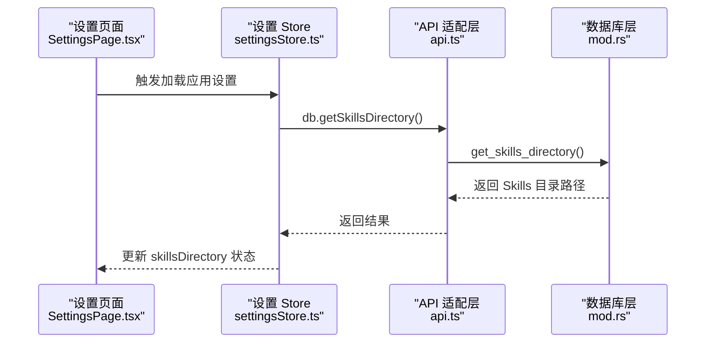
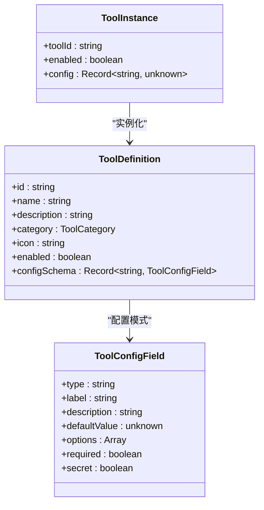
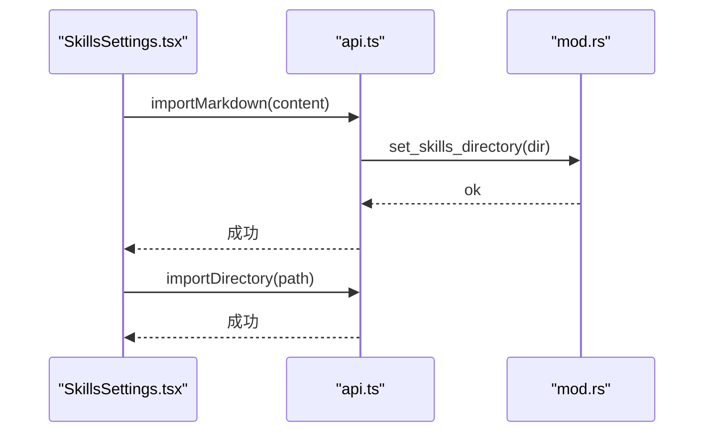
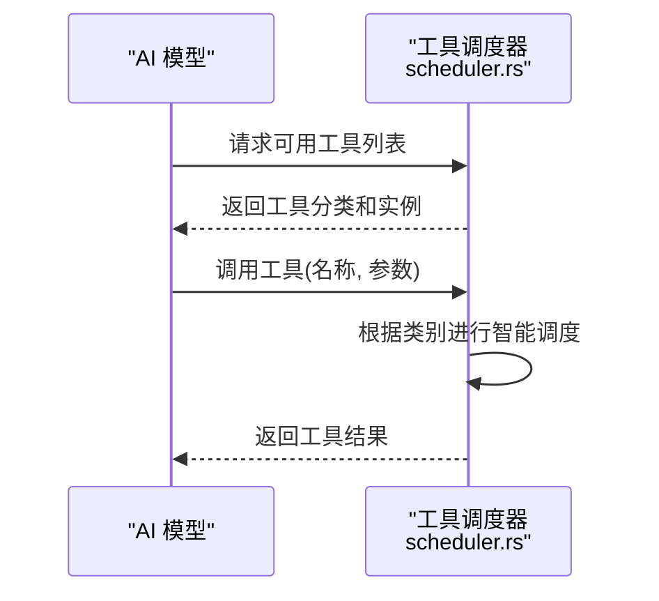
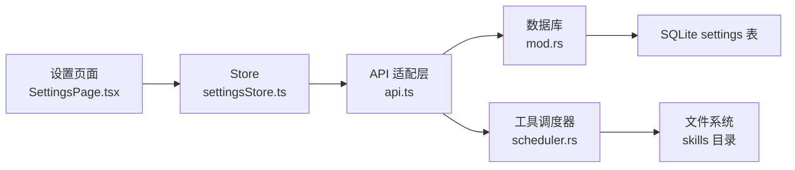

# 工具设置

<cite>
**本文引用的文件**
- [settings.ts](file://packages/shared/src/settings.ts)
- [settingsStore.ts](file://src-web/src/stores/settingsStore.ts)
- [SkillsSettings.tsx](file://src-web/src/components/settings/SkillsSettings.tsx)
- [SettingsPage.tsx](file://src-web/src/components/settings/SettingsPage.tsx)
- [api.ts](file://src-web/src/lib/api.ts)
- [mod.rs](file://native/src/db/mod.rs)
- [scheduler.rs](file://native/src/ai/scheduler.rs)
- [tool.ts](file://packages/shared/src/tool.ts)
- [tools.rs](file://native/src/ai/tools.rs)
- [ToolDemo.tsx](file://src-web/src/components/layout/ToolDemo.tsx)
- [ToolboxPanel.tsx](file://src-web/src/components/layout/ToolboxPanel.tsx)
- [ToolPage.tsx](file://src-web/src/components/tools/ToolPage.tsx)
- [tools.ts](file://src-web/src/lib/tools.ts)
</cite>

## 更新摘要
**所做更改**
- 移除了 IQS API Key 配置相关的所有内容和界面
- 简化了工具设置界面，移除了 IQS 搜索配置区域
- 更新了工具设置页面的导航结构，移除了工具标签页
- 移除了 IQS API Key 的存储和加载逻辑
- 更新了工具配置的数据结构说明，移除了 IQS 相关字段
- 新增了内置工具演示和工具箱功能说明

## 目录
1. [简介](#简介)
2. [项目结构](#项目结构)
3. [核心组件](#核心组件)
4. [架构总览](#架构总览)
5. [详细组件分析](#详细组件分析)
6. [依赖分析](#依赖分析)
7. [性能考量](#性能考量)
8. [故障排查指南](#故障排查指南)
9. [结论](#结论)
10. [附录](#附录)

## 简介
本文件面向 CoSurf 工具设置系统，围绕以下目标展开：
- 内置工具的启用/禁用控制机制与分类说明
- 工具配置的数据结构与存储方式
- 工具权限管理与安全考虑
- 工具配置的导入导出与备份恢复思路
- 工具使用的最佳实践与性能优化建议
- 工具与 AI 模型的集成关系与调用流程

**重要更新**：IQS（阿里云智能查询服务）API Key 配置功能已被完全移除，工具设置界面已简化。现在工具设置页面仅包含内置 AI 工具的启用/禁用控制和工具分类说明。

## 项目结构
CoSurf 的工具设置系统横跨前端 React、共享类型定义、IPC 适配层与后端 N-API：
- 前端：设置 Store、设置页面组件、API 适配层
- 后端：数据库层（mod.rs）、工具调度（scheduler.rs）、工具类型定义（tool.ts）

```mermaid
graph TB
subgraph "前端"
WS["Web Settings Store<br/>settingsStore.ts"]
SP["设置页面<br/>SettingsPage.tsx"]
SS["Skills 设置页面<br/>SkillsSettings.tsx"]
API["API 适配层<br/>api.ts"]
TD["工具演示<br/>ToolDemo.tsx"]
TP["工具箱<br/>ToolboxPanel.tsx"]
end
subgraph "IPC"
INV["invoke()/事件通道"]
end
subgraph "后端(N-API)"
DB["数据库层<br/>mod.rs"]
SC["工具调度器<br/>scheduler.rs"]
TR["工具实现<br/>tools.rs"]
end
WS --> API
SP --> API
SS --> API
TD --> API
TP --> API
API --> INV
INV --> DB
SC --> DB
TR --> DB
```

**图表来源**
- [settingsStore.ts:1-175](file://src-web/src/stores/settingsStore.ts#L1-L175)
- [SettingsPage.tsx:1-643](file://src-web/src/components/settings/SettingsPage.tsx#L1-L643)
- [SkillsSettings.tsx:1-549](file://src-web/src/components/settings/SkillsSettings.tsx#L1-L549)
- [ToolDemo.tsx:1-184](file://src-web/src/components/layout/ToolDemo.tsx#L1-L184)
- [ToolboxPanel.tsx:1-279](file://src-web/src/components/layout/ToolboxPanel.tsx#L1-L279)
- [api.ts:1-429](file://src-web/src/lib/api.ts#L1-L429)
- [mod.rs:470-669](file://native/src/db/mod.rs#L470-L669)
- [scheduler.rs:82-128](file://native/src/ai/scheduler.rs#L82-L128)
- [tools.rs:1-352](file://native/src/ai/tools.rs#L1-L352)

**章节来源**
- [settings.ts:1-46](file://packages/shared/src/settings.ts#L1-L46)
- [settingsStore.ts:1-175](file://src-web/src/stores/settingsStore.ts#L1-L175)
- [SettingsPage.tsx:1-643](file://src-web/src/components/settings/SettingsPage.tsx#L1-L643)
- [SkillsSettings.tsx:1-549](file://src-web/src/components/settings/SkillsSettings.tsx#L1-L549)
- [ToolDemo.tsx:1-184](file://src-web/src/components/layout/ToolDemo.tsx#L1-L184)
- [ToolboxPanel.tsx:1-279](file://src-web/src/components/layout/ToolboxPanel.tsx#L1-L279)
- [api.ts:1-429](file://src-web/src/lib/api.ts#L1-L429)
- [mod.rs:470-669](file://native/src/db/mod.rs#L470-L669)
- [scheduler.rs:82-128](file://native/src/ai/scheduler.rs#L82-L128)
- [tools.rs:1-352](file://native/src/ai/tools.rs#L1-L352)

## 核心组件
- 设置 Store 与共享类型
  - Store 负责应用设置、模型配置、Skills 目录的加载与持久化
  - 共享类型定义 AppSettings、ShortcutConfig 等
- 设置页面组件
  - SettingsPage 提供标签页导航，包含常规、模型、Skills、MCP Servers、Agent Prompts、快捷键等标签
  - SkillsSettings 页面提供导入/导出、启用/禁用、目录管理、内容预览等
- API 适配层
  - 统一封装 invoke 调用，提供 db、skills 等命名空间方法
- 数据库层
  - mod.rs 提供通用设置存储、模型配置、MCP 服务器配置等数据库操作
- 工具调度
  - scheduler.rs 根据工具类别进行智能调度（read、write、network、browser）
- 工具演示与工具箱
  - ToolDemo.tsx 提供浏览器工具测试功能
  - ToolboxPanel.tsx 提供开发工具集合

**章节来源**
- [settings.ts:1-46](file://packages/shared/src/settings.ts#L1-L46)
- [settingsStore.ts:1-175](file://src-web/src/stores/settingsStore.ts#L1-L175)
- [SettingsPage.tsx:1-643](file://src-web/src/components/settings/SettingsPage.tsx#L1-L643)
- [SkillsSettings.tsx:1-549](file://src-web/src/components/settings/SkillsSettings.tsx#L1-L549)
- [ToolDemo.tsx:1-184](file://src-web/src/components/layout/ToolDemo.tsx#L1-L184)
- [ToolboxPanel.tsx:1-279](file://src-web/src/components/layout/ToolboxPanel.tsx#L1-L279)
- [api.ts:1-429](file://src-web/src/lib/api.ts#L1-L429)
- [mod.rs:470-669](file://native/src/db/mod.rs#L470-L669)
- [scheduler.rs:82-128](file://native/src/ai/scheduler.rs#L82-L128)

## 架构总览
工具设置系统采用"前端 Store + API 适配层 + IPC + 后端数据库/业务模块"的分层架构。应用设置、模型配置、Skills 目录等配置项通过独立的 Store 方法加载，避免不必要的耦合与性能浪费。

**图表来源**
- [SettingsPage.tsx:51-71](file://src-web/src/components/settings/SettingsPage.tsx#L51-L71)
- [settingsStore.ts:155-173](file://src-web/src/stores/settingsStore.ts#L155-L173)
- [api.ts:168-176](file://src-web/src/lib/api.ts#L168-L176)
- [mod.rs:470-669](file://native/src/db/mod.rs#L470-L669)

## 详细组件分析

### 内置工具的启用/禁用与分类
- 启用/禁用控制
  - 通过工具设置页面的开关控制工具可用性
  - 工具配置存储在 settings 表中，键值对形式存储（如 tools.toolId.enabled）
  - 后端通过工具 Schema 暴露给模型，模型据此决定是否调用
- 工具分类与功能
  - 网页类：智能总结、网页操作 Agent、截图与视觉理解
  - 知识类：导出 Markdown
  - 搜索类：联网搜索（需配置搜索 API Key）
  - 其他：OpenUrl、Translate、ExportMarkdown、WebSearch、RunCommand 等

**图表来源**
- [tool.ts:1-88](file://packages/shared/src/tool.ts#L1-L88)

**章节来源**
- [tool.ts:1-88](file://packages/shared/src/tool.ts#L1-L88)
- [settingsStore.ts:172-181](file://src-web/src/stores/settingsStore.ts#L172-L181)

### 工具配置的数据结构与存储
- 共享类型定义
  - ToolDefinition：工具定义（id、name、description、category、icon、enabled、configSchema）
  - ToolConfigField：工具配置字段（type、label、description、defaultValue、options、required、secret）
  - ToolInstance：工具实例（toolId、enabled、config）
- 数据库存储
  - settings 表：键值对存储（如 skills.directory、tools.toolId.enabled）
  - model_configs 表：模型配置
  - mcp_servers 表：MCP 服务器配置（含类型、URL、命令、工作目录、环境变量、超时等）
- 技能目录结构
  - skills/<skill-id>/SKILL.md：技能描述与执行步骤，前端懒加载内容

**章节来源**
- [tool.ts:1-88](file://packages/shared/src/tool.ts#L1-L88)
- [mod.rs:470-669](file://native/src/db/mod.rs#L470-L669)
- [settingsStore.ts:155-173](file://src-web/src/stores/settingsStore.ts#L155-L173)

### 工具权限管理与安全考虑
- 权限与能力
  - 新增功能需在 Tauri 能力配置中声明相应 permission（如 shell:allow-open、dialog:allow-save、fs:default、http:default）
- API Key 安全
  - 建议使用系统密钥链存储敏感信息，避免明文写入磁盘
  - 对外暴露的脚本/工具应从环境变量或受控文件读取密钥
- 网络与传输
  - MCP 服务器支持 Streamable HTTP 与 SSE 两种传输，需确保 HTTPS 与正确的认证头
- 文件系统与目录权限
  - 建议限制 skills 目录权限，避免被非预期程序读写

**章节来源**
- [mod.rs:470-669](file://native/src/db/mod.rs#L470-L669)
- [SettingsPage.tsx:1-643](file://src-web/src/components/settings/SettingsPage.tsx#L1-L643)

### 工具配置的导入导出与备份恢复
- 技能导入/导出
  - 支持从 Markdown 文本导入技能（创建目录结构并写入 SKILL.md）
  - 支持从文件夹导入技能（复制目录到 skills 目录）
  - 支持列出技能目录、读取 SKILL.md 内容、启用/禁用、删除
- 备份与恢复
  - skills 目录可整体备份；默认路径位于用户主目录下的 .cosurf/skills
  - 建议将 skills 目录纳入版本控制或云同步，便于团队协作与恢复

**图表来源**
- [SkillsSettings.tsx:137-173](file://src-web/src/components/settings/SkillsSettings.tsx#L137-L173)
- [api.ts:371-378](file://src-web/src/lib/api.ts#L371-L378)
- [mod.rs:470-669](file://native/src/db/mod.rs#L470-L669)

**章节来源**
- [SkillsSettings.tsx:137-173](file://src-web/src/components/settings/SkillsSettings.tsx#L137-L173)
- [api.ts:371-378](file://src-web/src/lib/api.ts#L371-L378)
- [mod.rs:470-669](file://native/src/db/mod.rs#L470-L669)

### 工具与 AI 模型的集成关系与调用流程
- Schema 暴露
  - 内置工具通过 to_openai_schema 暴露给模型
  - 技能工具仅暴露 description，模型调用 skill_{id} 后再懒加载完整内容
  - MCP 工具通过连接服务器动态发现并注册为独立 function
- 调度与执行
  - scheduler 根据工具类别进行智能调度（read、write、network、browser）
  - 工具调用通过 dispatcher 根据工具名分发到对应实现

**图表来源**
- [scheduler.rs:82-128](file://native/src/ai/scheduler.rs#L82-L128)

**章节来源**
- [scheduler.rs:82-128](file://native/src/ai/scheduler.rs#L82-L128)
- [settingsStore.ts:172-181](file://src-web/src/stores/settingsStore.ts#L172-L181)

### 工具演示与工具箱功能
- 工具演示
  - ToolDemo.tsx 提供浏览器工具测试功能，包括智能总结、网页操作、表单填写等
  - 支持监听页面内容提取结果和错误事件
- 工具箱
  - ToolboxPanel.tsx 提供开发工具集合，包括 JSON 工具、正则表达式、二维码等
  - 支持工具搜索和分类展示
  - ToolPage.tsx 处理工具页面路由和内容渲染

**章节来源**
- [ToolDemo.tsx:1-184](file://src-web/src/components/layout/ToolDemo.tsx#L1-L184)
- [ToolboxPanel.tsx:1-279](file://src-web/src/components/layout/ToolboxPanel.tsx#L1-L279)
- [ToolPage.tsx:1-59](file://src-web/src/components/tools/ToolPage.tsx#L1-L59)
- [tools.ts:1-125](file://src-web/src/lib/tools.ts#L1-L125)

## 依赖分析
- 组件耦合
  - Store 与 API 适配层松耦合，通过统一 invoke 接口交互
  - 前端设置页面与后端数据库/业务模块通过 IPC 解耦
- 外部依赖
  - MCP 协议（Streamable HTTP/SSE）与第三方服务（如 IQS）的网络调用
  - 文件系统（skills 目录）与 SQLite（settings 表）

**图表来源**
- [SettingsPage.tsx:1-643](file://src-web/src/components/settings/SettingsPage.tsx#L1-L643)
- [settingsStore.ts:1-175](file://src-web/src/stores/settingsStore.ts#L1-L175)
- [api.ts:1-429](file://src-web/src/lib/api.ts#L1-L429)
- [mod.rs:470-669](file://native/src/db/mod.rs#L470-L669)
- [scheduler.rs:82-128](file://native/src/ai/scheduler.rs#L82-L128)

**章节来源**
- [SettingsPage.tsx:1-643](file://src-web/src/components/settings/SettingsPage.tsx#L1-L643)
- [settingsStore.ts:1-175](file://src-web/src/stores/settingsStore.ts#L1-L175)
- [api.ts:1-429](file://src-web/src/lib/api.ts#L1-L429)
- [mod.rs:470-669](file://native/src/db/mod.rs#L470-L669)
- [scheduler.rs:82-128](file://native/src/ai/scheduler.rs#L82-L128)

## 性能考量
- 懒加载策略
  - 技能仅解析 frontmatter，完整 SKILL.md 在模型调用 skill_{id} 后才懒加载，降低初始加载成本
- 按需加载
  - Store 将应用设置与 Skills 目录加载分离，避免不必要的耦合与 IO
- 并发与超时
  - MCP 工具发现设置超时保护，避免阻塞 Agent Loop
- 建议
  - 对频繁变更的配置（如 MCP 服务器）可引入热重载或文件监控
  - 对工具调用结果进行缓存（如页面总结结果）

**章节来源**
- [SkillsSettings.tsx:225-229](file://src-web/src/components/settings/SkillsSettings.tsx#L225-L229)
- [settingsStore.ts:155-173](file://src-web/src/stores/settingsStore.ts#L155-L173)
- [scheduler.rs:82-128](file://native/src/ai/scheduler.rs#L82-L128)

## 故障排查指南
- 技能导入失败
  - 确认 SKILL.md 格式正确（frontmatter + 内容）
  - 检查 skills 目录权限与磁盘空间
- MCP 工具不可用
  - 检查服务器类型与 URL 配置
  - 确认传输模式（Streamable HTTP/SSE）与认证头
- 前端设置页无响应
  - 查看 Store 日志与 API 调用链路
  - 确认 IPC 通道与后端命令注册
- 工具演示功能异常
  - 检查活动标签页是否存在
  - 确认工具调用参数格式正确

**章节来源**
- [SkillsSettings.tsx:137-173](file://src-web/src/components/settings/SkillsSettings.tsx#L137-L173)
- [mod.rs:470-669](file://native/src/db/mod.rs#L470-L669)
- [SettingsPage.tsx:51-71](file://src-web/src/components/settings/SettingsPage.tsx#L51-L71)
- [ToolDemo.tsx:1-184](file://src-web/src/components/layout/ToolDemo.tsx#L1-L184)

## 结论
CoSurf 工具设置系统通过前后端分层与 IPC 解耦，实现了应用设置、模型配置、Skills 目录的独立管理与工具 Schema 的灵活暴露与调度执行。建议在生产环境中结合系统密钥链与严格的目录权限策略，持续优化 MCP 工具发现与工具调用的并发与缓存机制，以提升安全性与性能。

## 附录
- 技能目录结构
  - skills/<skill-id>/SKILL.md：技能描述与执行步骤
- 最佳实践
  - 将 skills 目录纳入版本控制或云同步
  - 使用系统密钥链存储敏感 API Key
  - 为工具调用添加超时与重试策略
- 工具演示使用指南
  - 在工具演示中测试浏览器操作功能
  - 使用工具箱快速访问常用开发工具

**章节来源**
- [SkillsSettings.tsx:1-549](file://src-web/src/components/settings/SkillsSettings.tsx#L1-L549)
- [SettingsPage.tsx:1-643](file://src-web/src/components/settings/SettingsPage.tsx#L1-L643)
- [ToolDemo.tsx:1-184](file://src-web/src/components/layout/ToolDemo.tsx#L1-L184)
- [ToolboxPanel.tsx:1-279](file://src-web/src/components/layout/ToolboxPanel.tsx#L1-L279)