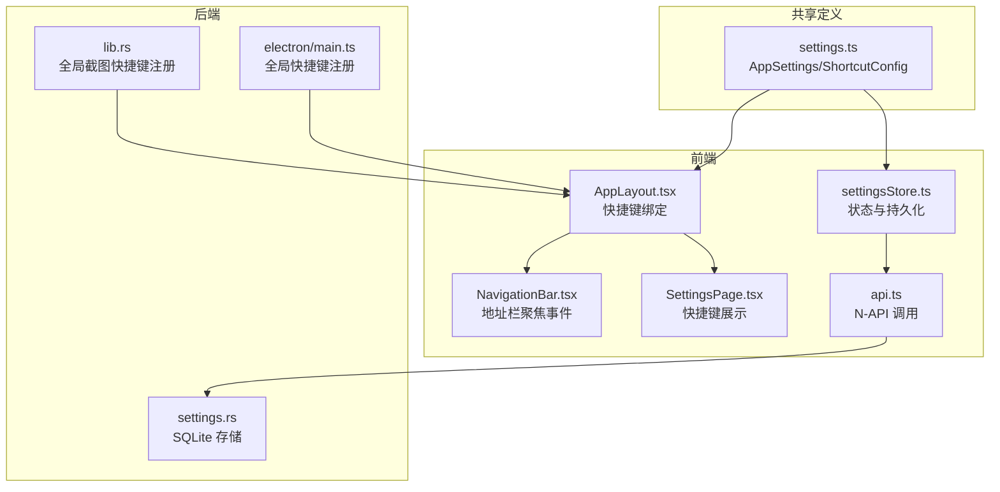
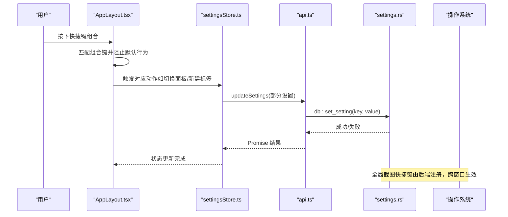
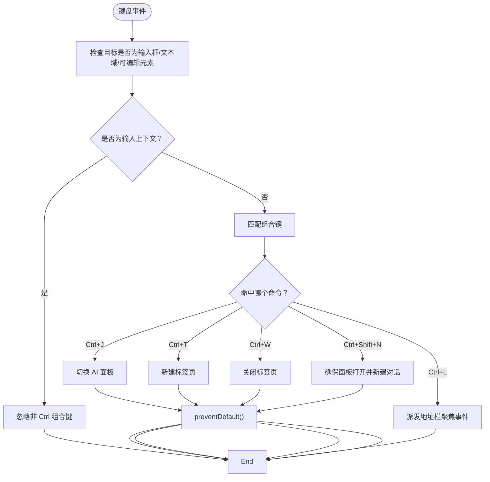
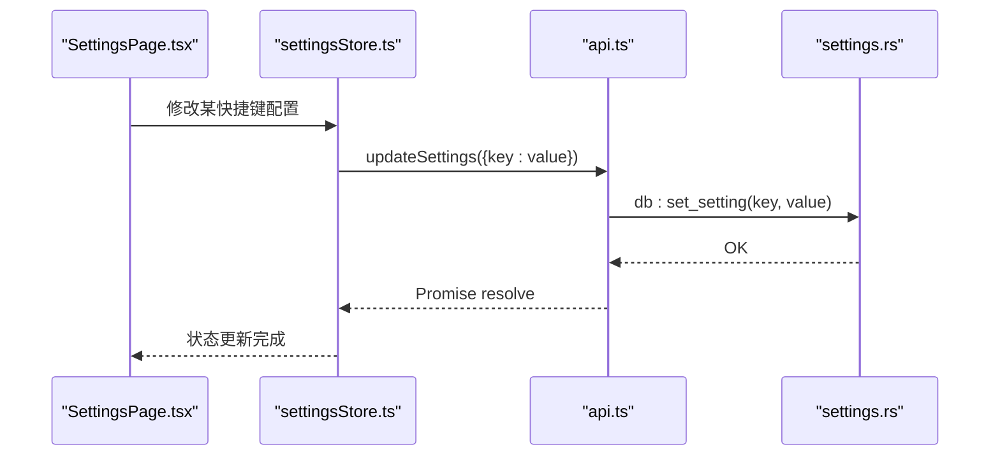
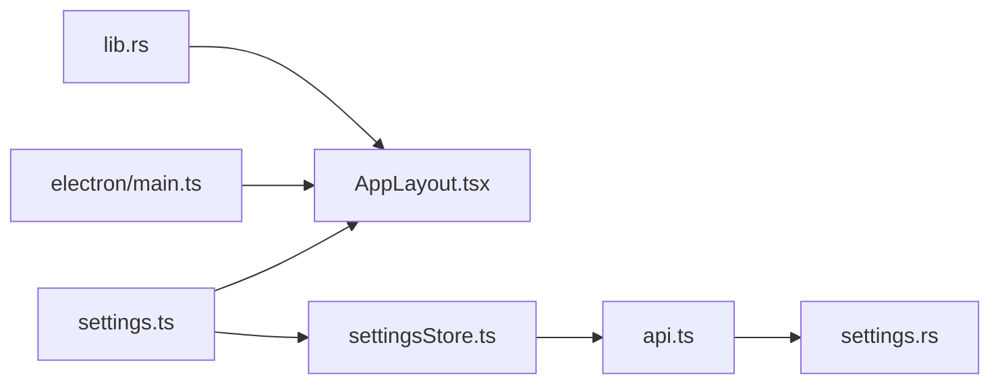

# 快捷键设置

<cite>
**本文档引用的文件**
- [settings.ts](file://packages/shared/src/settings.ts)
- [AppLayout.tsx](file://src-web/src/components/layout/AppLayout.tsx)
- [NavigationBar.tsx](file://src-web/src/components/layout/NavigationBar.tsx)
- [SettingsPage.tsx](file://src-web/src/components/settings/SettingsPage.tsx)
- [settingsStore.ts](file://src-web/src/stores/settingsStore.ts)
- [api.ts](file://src-web/src/lib/api.ts)
- [settings.rs](file://src-tauri/src/db/settings.rs)
- [lib.rs](file://src-tauri/src/lib.rs)
- [main.ts](file://electron/main.ts)
- [ScreenshotOverlay.tsx](file://src-web/src/components/ui/ScreenshotOverlay.tsx)
</cite>

## 目录
1. [简介](#简介)
2. [项目结构](#项目结构)
3. [核心组件](#核心组件)
4. [架构总览](#架构总览)
5. [详细组件分析](#详细组件分析)
6. [依赖关系分析](#依赖关系分析)
7. [性能考量](#性能考量)
8. [故障排查指南](#故障排查指南)
9. [结论](#结论)
10. [附录](#附录)

## 简介
本文件面向 CoSurf 的快捷键系统，完整说明所有可用的快捷键命令及默认组合，并深入解释其自定义配置方法、冲突检测机制、生效范围与上下文相关性、存储格式与同步机制、导入导出能力，以及与系统快捷键的冲突处理与优先级规则。同时提供常用快捷键组合的推荐方案与效率提升建议。

## 项目结构
快捷键涉及的关键模块分布于前端 React 组件、共享类型定义、状态管理、数据库与后端桥接层，以及跨平台全局快捷键注册处：

- 共享类型与默认配置：packages/shared/src/settings.ts
- 前端快捷键绑定与 UI：src-web/src/components/layout/AppLayout.tsx、src-web/src/components/layout/NavigationBar.tsx、src-web/src/components/settings/SettingsPage.tsx
- 状态与持久化：src-web/src/stores/settingsStore.ts、src-web/src/lib/api.ts、src-tauri/src/db/settings.rs
- 全局快捷键注册：src-tauri/src/lib.rs、electron/main.ts
- 截图覆盖层与键盘交互：src-web/src/components/ui/ScreenshotOverlay.tsx

**图表来源**
- [AppLayout.tsx:25-84](file://src-web/src/components/layout/AppLayout.tsx#L25-L84)
- [NavigationBar.tsx:84-92](file://src-web/src/components/layout/NavigationBar.tsx#L84-L92)
- [SettingsPage.tsx:139-139](file://src-web/src/components/settings/SettingsPage.tsx#L139-L139)
- [settingsStore.ts:76-90](file://src-web/src/stores/settingsStore.ts#L76-L90)
- [api.ts:118-126](file://src-web/src/lib/api.ts#L118-L126)
- [settings.rs:180-197](file://src-tauri/src/db/settings.rs#L180-L197)
- [lib.rs:75-93](file://src-tauri/src/lib.rs#L75-L93)
- [main.ts:146-157](file://electron/main.ts#L146-L157)

**章节来源**
- [settings.ts:5-46](file://packages/shared/src/settings.ts#L5-L46)
- [AppLayout.tsx:25-84](file://src-web/src/components/layout/AppLayout.tsx#L25-L84)
- [SettingsPage.tsx:139-139](file://src-web/src/components/settings/SettingsPage.tsx#L139-L139)

## 核心组件
- 快捷键配置模型与默认值：位于共享包中，定义了 shortcuts 字段及各命令的默认组合。
- 前端快捷键绑定：在应用布局组件中统一监听键盘事件，按组合键执行对应动作；另有地址栏聚焦事件。
- 设置页面展示：在“快捷键”标签页展示当前配置项。
- 状态与持久化：通过 store 更新 settings 并调用数据库接口写入；数据库层以键值对形式存储。
- 全局快捷键：后端注册全局截图快捷键，跨窗口生效。

**章节来源**
- [settings.ts:19-46](file://packages/shared/src/settings.ts#L19-L46)
- [AppLayout.tsx:31-84](file://src-web/src/components/layout/AppLayout.tsx#L31-L84)
- [SettingsPage.tsx:731-759](file://src-web/src/components/settings/SettingsPage.tsx#L731-L759)
- [settingsStore.ts:76-90](file://src-web/src/stores/settingsStore.ts#L76-L90)
- [settings.rs:180-197](file://src-tauri/src/db/settings.rs#L180-L197)
- [lib.rs:75-93](file://src-tauri/src/lib.rs#L75-L93)
- [main.ts:146-157](file://electron/main.ts#L146-L157)

## 架构总览
快捷键从“配置定义—前端绑定—状态持久化—后端注册—系统交互”的链路如下：

**图表来源**
- [AppLayout.tsx:31-84](file://src-web/src/components/layout/AppLayout.tsx#L31-L84)
- [settingsStore.ts:76-90](file://src-web/src/stores/settingsStore.ts#L76-L90)
- [api.ts:118-126](file://src-web/src/lib/api.ts#L118-L126)
- [settings.rs:180-197](file://src-tauri/src/db/settings.rs#L180-L197)

## 详细组件分析

### 快捷键命令与默认组合
- 切换 AI 面板：Ctrl+J
- 新建标签页：Ctrl+T
- 关闭标签页：Ctrl+W
- 聚焦地址栏：Ctrl+L
- 新建对话：Ctrl+Shift+N
- 截图：Ctrl+Shift+X（全局）

上述默认值来源于共享类型定义，前端在 AppLayout 中进行匹配与执行。

**章节来源**
- [settings.ts:28-46](file://packages/shared/src/settings.ts#L28-L46)
- [AppLayout.tsx:42-79](file://src-web/src/components/layout/AppLayout.tsx#L42-L79)

### 前端快捷键绑定与上下文相关性
- 绑定位置：AppLayout 的全局键盘监听，统一处理上述组合键。
- 上下文相关性：
  - 忽略输入框内非 Ctrl 组合键，避免干扰输入法与文本编辑。
  - Ctrl+L 通过自定义事件触发地址栏聚焦，确保焦点正确落在导航栏输入框。
  - Ctrl+Shift+N 自动确保 AI 面板打开后再新建对话。

**图表来源**
- [AppLayout.tsx:31-84](file://src-web/src/components/layout/AppLayout.tsx#L31-L84)
- [NavigationBar.tsx:84-92](file://src-web/src/components/layout/NavigationBar.tsx#L84-L92)

**章节来源**
- [AppLayout.tsx:31-84](file://src-web/src/components/layout/AppLayout.tsx#L31-L84)
- [NavigationBar.tsx:84-92](file://src-web/src/components/layout/NavigationBar.tsx#L84-L92)

### 设置页面中的快捷键展示
- “快捷键”标签页直接展示 shortcuts 下的各项配置，便于用户查看当前生效的组合键。

**章节来源**
- [SettingsPage.tsx:731-759](file://src-web/src/components/settings/SettingsPage.tsx#L731-L759)

### 自定义配置与持久化流程
- 配置更新：通过 store 的 updateSettings 方法逐项写入数据库。
- 数据库存储：键值对形式，键为配置项标识，值为字符串化的配置值。
- 读取时机：应用启动或设置页面打开时，从数据库读取并注入到 store。

**图表来源**
- [SettingsPage.tsx:139-139](file://src-web/src/components/settings/SettingsPage.tsx#L139-L139)
- [settingsStore.ts:76-90](file://src-web/src/stores/settingsStore.ts#L76-L90)
- [api.ts:118-126](file://src-web/src/lib/api.ts#L118-L126)
- [settings.rs:180-197](file://src-tauri/src/db/settings.rs#L180-L197)

**章节来源**
- [settingsStore.ts:76-90](file://src-web/src/stores/settingsStore.ts#L76-L90)
- [api.ts:118-126](file://src-web/src/lib/api.ts#L118-L126)
- [settings.rs:180-197](file://src-tauri/src/db/settings.rs#L180-L197)

### 全局生效范围与系统快捷键冲突
- 全局截图快捷键：后端在不同平台分别注册全局快捷键（Windows/Linux 使用 Control+Shift+X，macOS 使用 Command+Shift+X），跨窗口生效，优先于浏览器默认行为。
- 冲突处理：
  - 若系统或浏览器已占用相同组合键，系统可能拦截或提示冲突；此时应调整 CoSurf 的全局快捷键组合。
  - 前端快捷键仅在应用窗口内生效，不会影响系统或浏览器默认行为。

**章节来源**
- [lib.rs:75-93](file://src-tauri/src/lib.rs#L75-L93)
- [main.ts:146-157](file://electron/main.ts#L146-L157)

### 截图快捷键与覆盖层交互
- 全局快捷键触发后端截图逻辑，前端通过覆盖层展示截图选择器与结果，Esc 键可关闭覆盖层。
- 覆盖层内部还监听键盘事件以支持 Esc 关闭。

**章节来源**
- [lib.rs:75-93](file://src-tauri/src/lib.rs#L75-L93)
- [ScreenshotOverlay.tsx:38-46](file://src-web/src/components/ui/ScreenshotOverlay.tsx#L38-L46)

## 依赖关系分析
- 类型依赖：共享类型定义 AppSettings/ShortcutConfig 为前后端共同契约。
- 绑定依赖：AppLayout 依赖 UI 状态与对话/标签页 store 执行动作。
- 存储依赖：store 依赖 api.ts 的 db 接口，db 接口最终落到 settings.rs 的 SQLite 存储。
- 全局依赖：lib.rs/electron/main.ts 注册全局快捷键，与前端事件解耦。

**图表来源**
- [settings.ts:5-46](file://packages/shared/src/settings.ts#L5-L46)
- [AppLayout.tsx:25-84](file://src-web/src/components/layout/AppLayout.tsx#L25-L84)
- [settingsStore.ts:76-90](file://src-web/src/stores/settingsStore.ts#L76-L90)
- [api.ts:118-126](file://src-web/src/lib/api.ts#L118-L126)
- [settings.rs:180-197](file://src-tauri/src/db/settings.rs#L180-L197)
- [main.ts:146-157](file://electron/main.ts#L146-L157)
- [lib.rs:75-93](file://src-tauri/src/lib.rs#L75-L93)

**章节来源**
- [settings.ts:5-46](file://packages/shared/src/settings.ts#L5-L46)
- [AppLayout.tsx:25-84](file://src-web/src/components/layout/AppLayout.tsx#L25-L84)
- [settingsStore.ts:76-90](file://src-web/src/stores/settingsStore.ts#L76-L90)
- [api.ts:118-126](file://src-web/src/lib/api.ts#L118-L126)
- [settings.rs:180-197](file://src-tauri/src/db/settings.rs#L180-L197)
- [main.ts:146-157](file://electron/main.ts#L146-L157)
- [lib.rs:75-93](file://src-tauri/src/lib.rs#L75-L93)

## 性能考量
- 前端快捷键监听采用一次性绑定与事件冒泡控制，避免重复计算与误触发。
- 全局快捷键由系统底层处理，延迟低、开销小。
- 数据库写入为轻量键值对更新，单次操作耗时短，适合频繁变更场景。

## 故障排查指南
- 快捷键无效
  - 检查是否处于输入框上下文，非 Ctrl 组合键会被忽略。
  - 确认设置页面中快捷键组合未被其他应用占用。
- 地址栏无法聚焦
  - 确认 Ctrl+L 是否被系统或其他扩展占用。
  - 检查自定义事件是否正常派发与接收。
- 全局截图快捷键不生效
  - 确认平台差异（Windows/Linux vs macOS）与权限。
  - 查看后端日志确认是否成功注册全局快捷键。
- 配置未持久化
  - 检查数据库写入是否成功，确认键值对已写入 settings 表。

**章节来源**
- [AppLayout.tsx:37-40](file://src-web/src/components/layout/AppLayout.tsx#L37-L40)
- [NavigationBar.tsx:84-92](file://src-web/src/components/layout/NavigationBar.tsx#L84-L92)
- [lib.rs:75-93](file://src-tauri/src/lib.rs#L75-L93)
- [settings.rs:180-197](file://src-tauri/src/db/settings.rs#L180-L197)

## 结论
CoSurf 的快捷键系统以共享类型定义为核心，前端统一绑定、后端持久化存储，并通过全局快捷键增强跨窗口体验。当前实现具备良好的上下文感知与冲突规避策略，满足日常高效浏览与对话需求。后续可在设置页面增加“快捷键自定义编辑器”与“冲突检测提示”，进一步提升用户体验。

## 附录

### 快捷键命令与默认组合一览
- 切换 AI 面板：Ctrl+J
- 新建标签页：Ctrl+T
- 关闭标签页：Ctrl+W
- 聚焦地址栏：Ctrl+L
- 新建对话：Ctrl+Shift+N
- 截图：Ctrl+Shift+X（全局）

**章节来源**
- [settings.ts:28-46](file://packages/shared/src/settings.ts#L28-L46)
- [AppLayout.tsx:42-79](file://src-web/src/components/layout/AppLayout.tsx#L42-L79)

### 自定义配置方法与存储格式
- 自定义入口：设置页面“快捷键”标签页（当前为只读展示，实际修改可通过 store 的 updateSettings 方法写入）。
- 存储格式：键值对（settings 表），键为配置项标识，值为字符串化后的配置值。
- 同步机制：每次配置变更通过 db:set_setting 写入数据库，读取时从数据库恢复到 store。

**章节来源**
- [SettingsPage.tsx:731-759](file://src-web/src/components/settings/SettingsPage.tsx#L731-L759)
- [settingsStore.ts:76-90](file://src-web/src/stores/settingsStore.ts#L76-L90)
- [api.ts:118-126](file://src-web/src/lib/api.ts#L118-L126)
- [settings.rs:180-197](file://src-tauri/src/db/settings.rs#L180-L197)

### 导入导出能力
- 技术现状：当前未发现快捷键配置的专用导入/导出功能。
- 建议：可基于数据库导出/导入（settings 表）实现配置迁移，或在设置页面新增“导出配置为 JSON”“从 JSON 导入配置”按钮。

**章节来源**
- [settings.rs:199-215](file://src-tauri/src/db/settings.rs#L199-L215)

### 常用快捷键组合推荐与效率提升
- 高频操作组合：
  - Ctrl+J：快速切换 AI 面板，配合 Ctrl+Shift+N 新建对话。
  - Ctrl+T/Ctrl+W：快速新建/关闭标签页，提升多任务切换效率。
  - Ctrl+L：一键聚焦地址栏，减少鼠标移动。
  - Ctrl+Shift+X：全局截图，快速捕获屏幕。
- 效率建议：
  - 将常用操作集中在 Ctrl/Alt 组合，减少跨键位移动。
  - 避免与系统/浏览器默认快捷键冲突，必要时调整组合键。

**章节来源**
- [settings.ts:28-46](file://packages/shared/src/settings.ts#L28-L46)
- [AppLayout.tsx:42-79](file://src-web/src/components/layout/AppLayout.tsx#L42-L79)

### 与系统快捷键的冲突处理与优先级
- 系统/浏览器默认：优先级高，可能拦截或覆盖应用快捷键。
- 应用全局快捷键：由后端注册，跨窗口生效，优先于浏览器默认行为。
- 处理策略：
  - 若冲突，优先调整应用快捷键组合。
  - 在设置页面增加冲突检测与提示，帮助用户规避冲突。

**章节来源**
- [lib.rs:75-93](file://src-tauri/src/lib.rs#L75-L93)
- [main.ts:146-157](file://electron/main.ts#L146-L157)