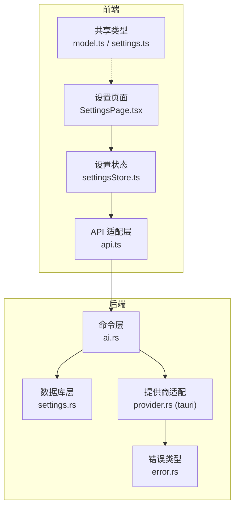
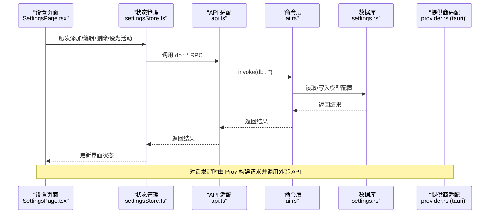
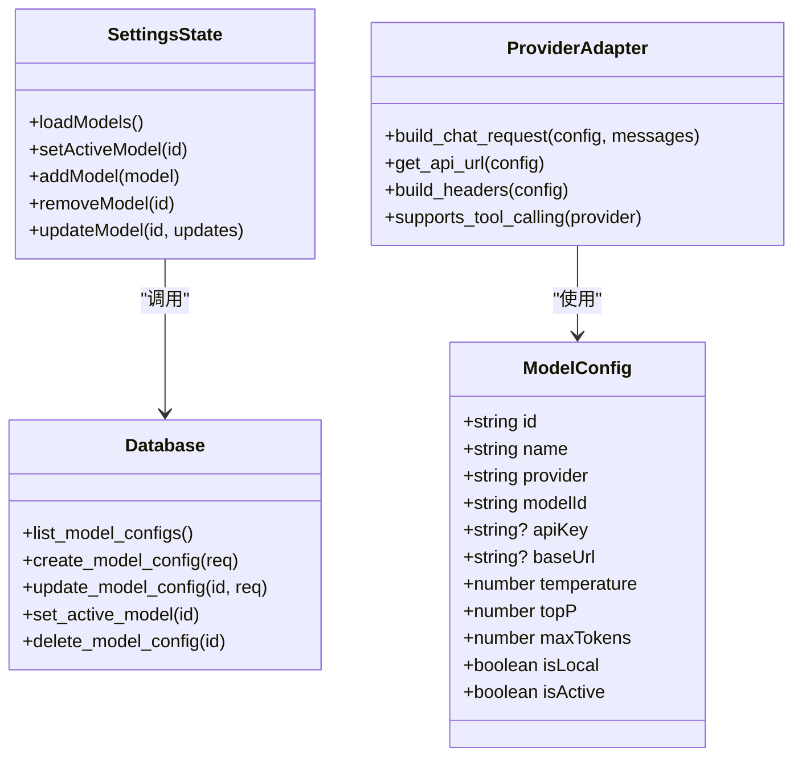

# 模型设置

<cite>
**本文引用的文件**
- [model.ts](file://packages/shared/src/model.ts)
- [settings.ts](file://packages/shared/src/settings.ts)
- [SettingsPage.tsx](file://src-web/src/components/settings/SettingsPage.tsx)
- [settingsStore.ts](file://src-web/src/stores/settingsStore.ts)
- [api.ts](file://src-web/src/lib/api.ts)
- [settings.rs](file://src-tauri/src/db/settings.rs)
- [provider.rs（native）](file://native/src/ai/provider.rs)
- [provider.rs（tauri）](file://src-tauri/src/ai/provider.rs)
- [ai.rs](file://src-tauri/src/commands/ai.rs)
- [error.rs](file://src-tauri/src/error.rs)
- [README.md](file://README.md)
</cite>

## 目录
1. [简介](#简介)
2. [项目结构](#项目结构)
3. [核心组件](#核心组件)
4. [架构总览](#架构总览)
5. [详细组件分析](#详细组件分析)
6. [依赖关系分析](#依赖关系分析)
7. [性能考虑](#性能考虑)
8. [故障排查指南](#故障排查指南)
9. [结论](#结论)
10. [附录](#附录)

## 简介
本文件面向 CoSurf AI 模型设置系统，围绕“多提供商模型配置”展开，覆盖 OpenAI、Anthropic、Google Gemini、智谱、Kimi、DeepSeek、豆包、通义千问、Ollama 等服务的配置与使用；详述模型的添加、编辑、删除流程；解释温度、Top-P、最大 Token 等超参数的作用与调优建议；说明本地模型（Ollama）的配置差异；阐述活动模型切换与优先级管理；并提供配置验证、连接测试、错误处理与不同场景下的推荐配置及性能优化建议。

## 项目结构
CoSurf 采用前端（React/Vite）+ 后端（Tauri/Rust）的桌面应用架构，模型配置涉及前端设置界面、状态管理、IPC 通信以及后端数据库与 AI 提供商适配层。

图表来源
- [SettingsPage.tsx:28-145](file://src-web/src/components/settings/SettingsPage.tsx#L28-L145)
- [settingsStore.ts:33-201](file://src-web/src/stores/settingsStore.ts#L33-L201)
- [api.ts:118-156](file://src-web/src/lib/api.ts#L118-L156)
- [ai.rs:16-77](file://src-tauri/src/commands/ai.rs#L16-L77)
- [settings.rs:217-339](file://src-tauri/src/db/settings.rs#L217-L339)
- [provider.rs（tauri）:91-135](file://src-tauri/src/ai/provider.rs#L91-L135)
- [error.rs:4-64](file://src-tauri/src/error.rs#L4-L64)

章节来源
- [SettingsPage.tsx:28-145](file://src-web/src/components/settings/SettingsPage.tsx#L28-L145)
- [settingsStore.ts:33-201](file://src-web/src/stores/settingsStore.ts#L33-L201)
- [api.ts:118-156](file://src-web/src/lib/api.ts#L118-L156)
- [settings.rs:217-339](file://src-tauri/src/db/settings.rs#L217-L339)
- [provider.rs（tauri）:91-135](file://src-tauri/src/ai/provider.rs#L91-L135)
- [error.rs:4-64](file://src-tauri/src/error.rs#L4-L64)

## 核心组件
- 模型配置数据结构与提供商预设
  - 定义模型配置字段与提供商枚举，提供默认 Base URL 与模型列表
  - 支持本地模型标记与活动模型标识
- 设置页面与状态管理
  - 提供模型列表展示、新增/编辑/删除、设为活动模型等操作
  - 通过状态管理器与数据库层交互，持久化配置
- 数据库层
  - 模型配置的增删改查、活动模型切换、默认值处理
- AI 提供商适配层
  - 构建请求、拼接 API URL、设置请求头、工具调用支持判定
- 错误处理
  - 统一错误类型与错误响应，便于前端展示与定位

章节来源
- [model.ts:1-104](file://packages/shared/src/model.ts#L1-L104)
- [settings.ts:1-47](file://packages/shared/src/settings.ts#L1-L47)
- [SettingsPage.tsx:269-362](file://src-web/src/components/settings/SettingsPage.tsx#L269-L362)
- [settingsStore.ts:101-159](file://src-web/src/stores/settingsStore.ts#L101-L159)
- [settings.rs:217-339](file://src-tauri/src/db/settings.rs#L217-L339)
- [provider.rs（tauri）:91-135](file://src-tauri/src/ai/provider.rs#L91-L135)
- [error.rs:4-64](file://src-tauri/src/error.rs#L4-L64)

## 架构总览
模型设置系统的关键流程：前端设置页面触发状态变更，状态管理器通过 API 适配层调用后端命令，命令层访问数据库获取/更新模型配置，随后在对话发起时由提供商适配层构建请求并调用外部 API。

图表来源
- [SettingsPage.tsx:269-362](file://src-web/src/components/settings/SettingsPage.tsx#L269-L362)
- [settingsStore.ts:101-159](file://src-web/src/stores/settingsStore.ts#L101-L159)
- [api.ts:128-156](file://src-web/src/lib/api.ts#L128-L156)
- [ai.rs:16-77](file://src-tauri/src/commands/ai.rs#L16-L77)
- [settings.rs:217-339](file://src-tauri/src/db/settings.rs#L217-L339)
- [provider.rs（tauri）:91-135](file://src-tauri/src/ai/provider.rs#L91-L135)

## 详细组件分析

### 模型配置数据结构与提供商预设
- 数据结构
  - 字段：id、name、provider、modelId、apiKey、baseUrl、temperature、topP、maxTokens、isLocal、isActive
  - 默认值：temperature=0.7、topP=1.0、maxTokens=4096
- 提供商预设
  - 包含 OpenAI、Anthropic、Google Gemini、智谱、Kimi、DeepSeek、豆包、通义千问、Ollama 等
  - 每个预设包含默认 Base URL 与可用模型列表，且区分本地模型
- 本地模型差异
  - Ollama 默认 Base URL 为本地服务地址，isLocal=true

章节来源
- [model.ts:13-33](file://packages/shared/src/model.ts#L13-L33)
- [model.ts:35-104](file://packages/shared/src/model.ts#L35-L104)

### 设置页面与模型管理
- 模型列表展示
  - 展示名称、提供商、模型 ID、是否本地、是否活动
  - 支持编辑与删除
- 添加/编辑模型
  - 提供商选择联动默认 Base URL、模型列表与本地模型标记
  - 支持填写显示名称、模型 ID、API Key、Base URL、温度、Top-P、最大 Token、本地模型勾选
- 设为活动模型
  - 点击列表项即设为活动模型，前端状态与数据库同步

章节来源
- [SettingsPage.tsx:269-362](file://src-web/src/components/settings/SettingsPage.tsx#L269-L362)
- [SettingsPage.tsx:364-590](file://src-web/src/components/settings/SettingsPage.tsx#L364-L590)
- [settingsStore.ts:101-159](file://src-web/src/stores/settingsStore.ts#L101-L159)

### 状态管理与 IPC 通信
- 状态管理器
  - 提供加载模型、设置活动模型、新增/更新/删除模型等方法
  - 异步调用数据库层，捕获错误并抛出
- API 适配层
  - 统一封装 db:* RPC 调用，解析 JSON 返回值
  - 模型相关接口：列出、获取、创建、更新、设为活动、删除

章节来源
- [settingsStore.ts:16-31](file://src-web/src/stores/settingsStore.ts#L16-L31)
- [settingsStore.ts:41-56](file://src-web/src/stores/settingsStore.ts#L41-L56)
- [settingsStore.ts:92-99](file://src-web/src/stores/settingsStore.ts#L92-L99)
- [settingsStore.ts:101-159](file://src-web/src/stores/settingsStore.ts#L101-L159)
- [api.ts:128-156](file://src-web/src/lib/api.ts#L128-L156)

### 数据库层（模型配置）
- 查询与排序
  - 按活动优先、名称排序返回模型列表
- 新增模型
  - 未指定参数使用默认值（温度、Top-P、最大 Token、本地标记）
- 更新模型
  - 支持部分字段更新（名称、API Key、Base URL、温度、Top-P、最大 Token）
- 设为活动模型
  - 先清空所有活动标记，再将目标模型置为活动
- 删除模型
  - 删除指定模型，若不存在则报错

章节来源
- [settings.rs:217-247](file://src-tauri/src/db/settings.rs#L217-L247)
- [settings.rs:275-297](file://src-tauri/src/db/settings.rs#L275-L297)
- [settings.rs:299-317](file://src-tauri/src/db/settings.rs#L299-L317)
- [settings.rs:319-329](file://src-tauri/src/db/settings.rs#L319-L329)
- [settings.rs:331-337](file://src-tauri/src/db/settings.rs#L331-L337)

### AI 提供商适配层
- 构建聊天请求
  - 依据模型配置构造请求体（模型 ID、消息、温度、Top-P、最大 Token、流式）
- API URL 与请求头
  - 不同提供商的 API URL 路径不同（Anthropic 使用 messages，其他使用 chat/completions）
  - 不同提供商的鉴权头不同（Anthropic 使用 x-api-key，其他使用 Authorization: Bearer）
- 工具调用支持
  - 列举支持工具调用的提供商集合

章节来源
- [provider.rs（tauri）:91-135](file://src-tauri/src/ai/provider.rs#L91-L135)
- [provider.rs（native）:146-198](file://native/src/ai/provider.rs#L146-L198)

### 对话发起与活动模型
- 命令层
  - 发起对话前从数据库读取活动模型配置，若无活动模型则返回错误
  - 打印模型配置用于调试
- 错误处理
  - 统一转换为错误响应，前端可据此提示用户配置模型

章节来源
- [ai.rs:16-77](file://src-tauri/src/commands/ai.rs#L16-L77)
- [error.rs:47-61](file://src-tauri/src/error.rs#L47-L61)

### 模型参数配置详解与调优建议
- Temperature（温度）
  - 控制采样随机性。数值越高越随机，越低越稳定。适合创造性任务时提高，适合事实性任务时降低。
- Top-P（核采样）
  - 限制累积概率阈值。与 Temperature 协同调节，更易平衡多样性与稳定性。
- Max Tokens（最大 Token）
  - 控制单次生成长度。长文档摘要、多轮对话需适当增大；短问答可减小以节省成本与延迟。
- 调优建议
  - 创意写作：Temperature 0.7–0.9，Top-P 0.9–1.0
  - 事实问答：Temperature 0.2–0.5，Top-P 0.8–1.0
  - 长文本生成：Max Tokens 2048–16384，结合分段策略
  - 本地模型（Ollama）：根据硬件性能调整温度与最大 Token，避免过高的并发与过长上下文

章节来源
- [model.ts:20-25](file://packages/shared/src/model.ts#L20-L25)
- [provider.rs（tauri）:91-100](file://src-tauri/src/ai/provider.rs#L91-L100)

### 本地模型（Ollama）配置与差异
- 配置要点
  - 提供商选择为 Ollama，Base URL 指向本地服务（默认 http://localhost:11434/v1）
  - 模型 ID 为本地已拉取的模型名称（如 llama3、qwen2）
  - isLocal 标记为 true
- 差异说明
  - 无需公网 API Key
  - 延迟更低、可控性强，但受本地硬件性能影响
  - 适合隐私敏感场景与离线使用

章节来源
- [model.ts:96-102](file://packages/shared/src/model.ts#L96-L102)
- [README.md:414-422](file://README.md#L414-L422)

### 活动模型切换与优先级管理
- 切换机制
  - 设为活动模型时，先将所有模型的活动标记清零，再将目标模型置为活动
- 优先级
  - 列表按活动优先、名称排序；活动模型在顶部突出显示
- 使用场景
  - 多模型并存时，确保对话使用正确的模型配置

章节来源
- [settingsStore.ts:92-99](file://src-web/src/stores/settingsStore.ts#L92-L99)
- [settings.rs:319-329](file://src-tauri/src/db/settings.rs#L319-L329)
- [SettingsPage.tsx:305-359](file://src-web/src/components/settings/SettingsPage.tsx#L305-L359)

### 配置验证、连接测试与错误处理
- 配置验证
  - 前端表单校验：必填字段、数值范围（温度、Top-P、最大 Token）
  - 后端校验：缺失 Base URL 时返回配置错误
- 连接测试
  - 对话发起前检查是否存在活动模型；若无则提示用户先配置模型
- 错误处理
  - 统一错误类型与错误响应，前端可据此展示错误状态与提示

章节来源
- [SettingsPage.tsx:404-428](file://src-web/src/components/settings/SettingsPage.tsx#L404-L428)
- [ai.rs:31-37](file://src-tauri/src/commands/ai.rs#L31-L37)
- [error.rs:4-64](file://src-tauri/src/error.rs#L4-L64)

### 不同场景下的模型推荐配置
- 通用问答
  - OpenAI/Gemini/通义千问：Temperature 0.5–0.7，Top-P 0.9，Max Tokens 1024–2048
- 创意写作
  - OpenAI/Gemini/通义千问：Temperature 0.7–0.9，Top-P 0.9–1.0，Max Tokens 2048–8192
- 长文档摘要
  - Google/通义千问：Max Tokens 4096–16384，Temperature 0.3–0.5
- 本地离线
  - Ollama：根据硬件性能适度降低温度与最大 Token，避免过载

章节来源
- [README.md:375-422](file://README.md#L375-L422)

## 依赖关系分析

图表来源
- [model.ts:13-25](file://packages/shared/src/model.ts#L13-L25)
- [settingsStore.ts:16-31](file://src-web/src/stores/settingsStore.ts#L16-L31)
- [settings.rs:217-339](file://src-tauri/src/db/settings.rs#L217-L339)
- [provider.rs（tauri）:91-135](file://src-tauri/src/ai/provider.rs#L91-L135)

章节来源
- [model.ts:13-25](file://packages/shared/src/model.ts#L13-L25)
- [settingsStore.ts:16-31](file://src-web/src/stores/settingsStore.ts#L16-L31)
- [settings.rs:217-339](file://src-tauri/src/db/settings.rs#L217-L339)
- [provider.rs（tauri）:91-135](file://src-tauri/src/ai/provider.rs#L91-L135)

## 性能考虑
- 本地模型（Ollama）
  - 合理设置温度与最大 Token，避免过高的并发与过长上下文导致内存与显存压力
  - 根据硬件性能选择合适模型（如较小模型适合轻量任务）
- 公有云模型
  - 控制最大 Token 与上下文长度，减少往返次数
  - 使用流式响应（SSE）提升交互体验，降低首字延迟
- 错误与重试
  - 对网络异常与鉴权错误进行分类处理，必要时提供重试与降级策略

## 故障排查指南
- 无法发起对话
  - 检查是否存在活动模型；若无，先在设置中添加并设为活动
- API Key 无效或鉴权失败
  - 确认提供商与 API Key 是否正确；不同提供商鉴权头不同
- Base URL 配置错误
  - 确认 Base URL 末尾无多余斜杠，路径与提供商要求一致
- 本地模型无法连接
  - 确认 Ollama 服务已启动，Base URL 指向本地服务端口
- 错误响应
  - 查看错误码与错误信息，定位具体问题（配置错误、HTTP 错误、内部错误）

章节来源
- [ai.rs:31-37](file://src-tauri/src/commands/ai.rs#L31-L37)
- [provider.rs（tauri）:102-135](file://src-tauri/src/ai/provider.rs#L102-L135)
- [error.rs:47-61](file://src-tauri/src/error.rs#L47-L61)

## 结论
CoSurf 的模型设置系统以清晰的数据结构、完善的前端 UI、可靠的数据库持久化与严谨的错误处理为基础，实现了对多提供商模型的统一配置与管理。通过合理的参数调优与本地模型配置，可在不同场景下获得稳定的性能与体验。建议在生产环境中持续关注模型参数与硬件资源的平衡，并建立完善的配置验证与错误处理机制。

## 附录
- 快速配置清单
  - 选择提供商与模型 ID
  - 填写 API Key（公有云）或确认本地服务（Ollama）
  - 填写 Base URL（默认通常可省略）
  - 调整温度、Top-P、最大 Token
  - 保存并设为活动模型
- 参考文档
  - [README.md:375-422](file://README.md#L375-L422)