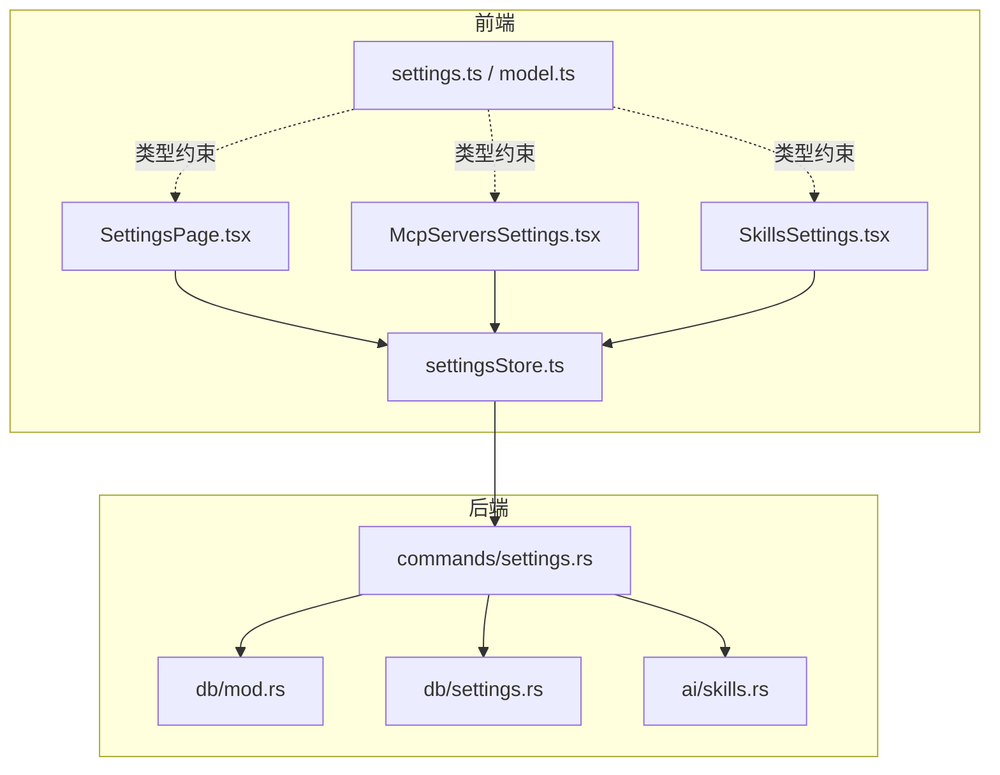
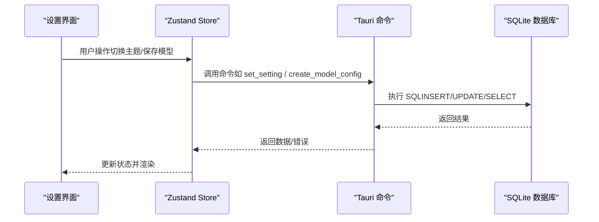
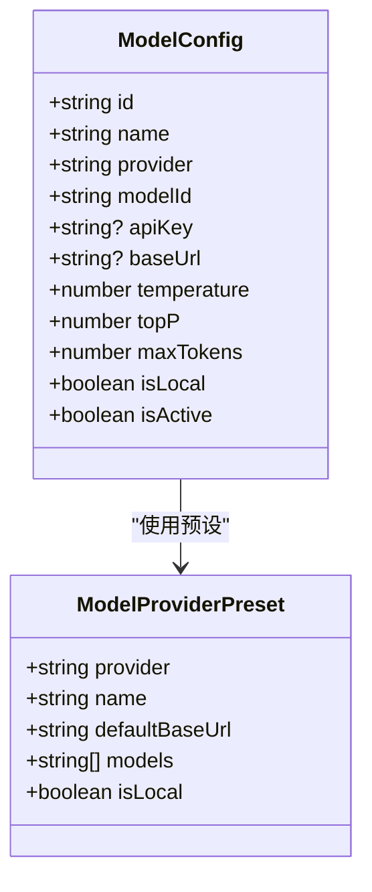
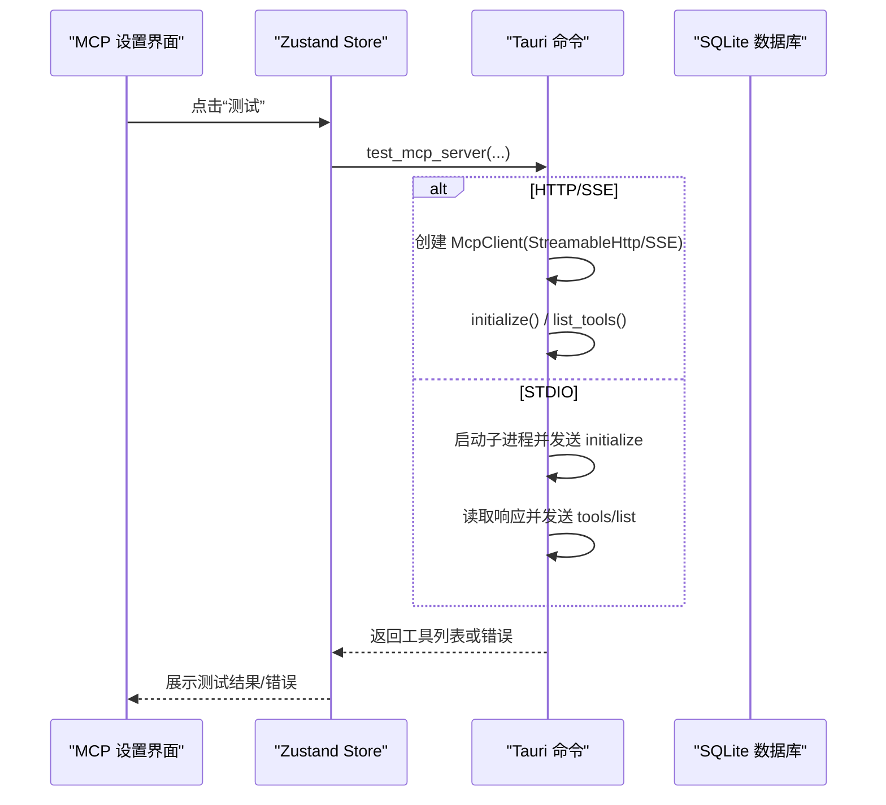
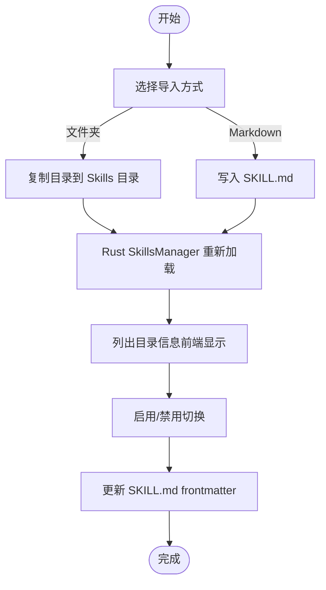
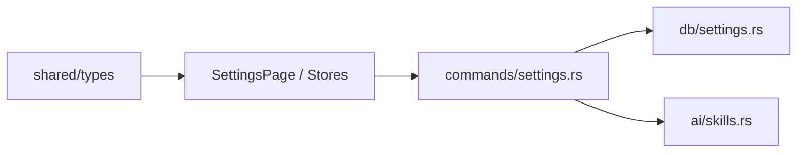

# 设置和配置

<cite>
**本文引用的文件**
- [settings.ts](file://packages/shared/src/settings.ts)
- [model.ts](file://packages/shared/src/model.ts)
- [SettingsPage.tsx](file://src-web/src/components/settings/SettingsPage.tsx)
- [McpServersSettings.tsx](file://src-web/src/components/settings/McpServersSettings.tsx)
- [SkillsSettings.tsx](file://src-web/src/components/settings/SkillsSettings.tsx)
- [settingsStore.ts](file://src-web/src/stores/settingsStore.ts)
- [settings.rs](file://src-tauri/src/db/settings.rs)
- [settings.rs（commands）](file://src-tauri/src/commands/settings.rs)
- [mod.rs（db）](file://src-tauri/src/db/mod.rs)
- [skills.rs](file://src-tauri/src/ai/skills.rs)
- [MCP 标准配置文档](file://docs/MCP_STANDARD_CONFIG.md)
- [IQS API Key 持久化修复](file://docs/IQS_API_KEY_PERSISTENCE_FIX.md)
</cite>

## 目录
1. [简介](#简介)
2. [项目结构](#项目结构)
3. [核心组件](#核心组件)
4. [架构总览](#架构总览)
5. [详细组件分析](#详细组件分析)
6. [依赖关系分析](#依赖关系分析)
7. [性能考量](#性能考量)
8. [故障排查指南](#故障排查指南)
9. [结论](#结论)
10. [附录](#附录)

## 简介
本文件面向 CoSurf 的“设置与配置”系统，系统性梳理应用设置的各个方面，包括：
- AI 模型配置：多提供商支持、API Key 管理、模型切换、参数调整
- MCP Servers 设置：添加、连接测试、传输模式配置、连接参数验证
- Skills 设置：导入、配置编辑、启用/禁用控制、权限管理
- 设置数据持久化与迁移策略
- 设置界面的用户交互设计与体验
- 配置文件结构与手动编辑指南
- 设置项之间的依赖关系与冲突处理
- 常见配置问题排查与解决方案

## 项目结构
设置与配置系统由三层组成：
- 前端设置界面层：React 组件与 Zustand 状态管理
- 共享类型与常量层：跨平台共享的类型定义与默认值
- 后端持久化与命令层：Tauri 命令、SQLite 数据库与业务逻辑

图表来源
- [SettingsPage.tsx:1-145](file://src-web/src/components/settings/SettingsPage.tsx#L1-L145)
- [settingsStore.ts:1-201](file://src-web/src/stores/settingsStore.ts#L1-L201)
- [settings.rs（commands）:1-615](file://src-tauri/src/commands/settings.rs#L1-L615)
- [settings.rs（db）:1-540](file://src-tauri/src/db/settings.rs#L1-L540)
- [mod.rs（db）:95-129](file://src-tauri/src/db/mod.rs#L95-L129)
- [skills.rs:1-567](file://src-tauri/src/ai/skills.rs#L1-L567)
- [settings.ts:1-47](file://packages/shared/src/settings.ts#L1-L47)
- [model.ts:1-104](file://packages/shared/src/model.ts#L1-L104)

章节来源
- [SettingsPage.tsx:1-145](file://src-web/src/components/settings/SettingsPage.tsx#L1-L145)
- [settingsStore.ts:1-201](file://src-web/src/stores/settingsStore.ts#L1-L201)
- [settings.rs（commands）:1-615](file://src-tauri/src/commands/settings.rs#L1-L615)
- [settings.rs（db）:1-540](file://src-tauri/src/db/settings.rs#L1-L540)
- [mod.rs（db）:95-129](file://src-tauri/src/db/mod.rs#L95-L129)
- [skills.rs:1-567](file://src-tauri/src/ai/skills.rs#L1-L567)
- [settings.ts:1-47](file://packages/shared/src/settings.ts#L1-L47)
- [model.ts:1-104](file://packages/shared/src/model.ts#L1-L104)

## 核心组件
- 应用设置类型与默认值：定义主题、语言、字体大小、面板尺寸、隐私模式、快捷键等
- 模型配置类型与提供商预设：统一的模型配置结构与多提供商默认基地址、模型列表
- 设置页面容器：导航与视图切换、按标签异步加载配置
- 设置状态管理：Zustand Store，封装 CRUD 与持久化调用
- 数据库与命令：SQLite 存储 settings、model_configs、mcp_servers；Tauri 命令桥接前端与后端

章节来源
- [settings.ts:1-47](file://packages/shared/src/settings.ts#L1-L47)
- [model.ts:1-104](file://packages/shared/src/model.ts#L1-L104)
- [SettingsPage.tsx:1-145](file://src-web/src/components/settings/SettingsPage.tsx#L1-L145)
- [settingsStore.ts:1-201](file://src-web/src/stores/settingsStore.ts#L1-L201)
- [settings.rs（db）:1-540](file://src-tauri/src/db/settings.rs#L1-L540)
- [settings.rs（commands）:1-615](file://src-tauri/src/commands/settings.rs#L1-L615)

## 架构总览
设置系统采用“前端 UI + 共享类型 + 后端命令/数据库”的分层架构。前端通过 Zustand Store 调用 Tauri 命令，命令层访问数据库完成读写；数据库采用 SQLite，配合 WAL 模式与索引优化。

图表来源
- [settingsStore.ts:76-90](file://src-web/src/stores/settingsStore.ts#L76-L90)
- [settings.rs（commands）:27-34](file://src-tauri/src/commands/settings.rs#L27-L34)
- [settings.rs（db）:190-197](file://src-tauri/src/db/settings.rs#L190-L197)

## 详细组件分析

### 应用设置与主题/语言/快捷键
- 主题模式：支持 light、dark、system 三种模式，UI 展示与切换
- 语言：zh-CN、en-US
- 字体大小与面板默认高度：范围滑条调节
- 隐私模式：影响历史记录保存策略
- 快捷键：集中展示与可编辑（当前 UI 未提供直接编辑入口）

章节来源
- [settings.ts:1-47](file://packages/shared/src/settings.ts#L1-L47)
- [SettingsPage.tsx:147-267](file://src-web/src/components/settings/SettingsPage.tsx#L147-L267)

### AI 模型配置
- 多提供商支持：通过 MODEL_PROVIDER_PRESETS 提供 OpenAI、Anthropic、Google、智谱、月之暗面、DeepSeek、豆包、通义千问、Ollama 等
- API Key 管理：每个模型可单独配置 apiKey；也可使用全局 IQS API Key（独立字段）
- 模型切换：设置当前激活模型，数据库中仅允许一个激活模型
- 参数调整：temperature、topP、maxTokens、是否本地模型（isLocal）

图表来源
- [model.ts:13-33](file://packages/shared/src/model.ts#L13-L33)
- [settings.rs（db）:9-23](file://src-tauri/src/db/settings.rs#L9-L23)

章节来源
- [model.ts:1-104](file://packages/shared/src/model.ts#L1-L104)
- [SettingsPage.tsx:269-362](file://src-web/src/components/settings/SettingsPage.tsx#L269-L362)
- [settingsStore.ts:101-159](file://src-web/src/stores/settingsStore.ts#L101-L159)
- [settings.rs（db）:217-337](file://src-tauri/src/db/settings.rs#L217-L337)

### MCP Servers 设置
- 支持的传输模式：stdio、http、streamableHttp、sse
- 配置字段：name、serverType、url、command/args/cwd、env、headers、disabled/timeout
- 功能：
  - 导入 JSON：支持开源标准 MCP JSON 格式，批量导入
  - 连接测试：HTTP/SSE 使用 StreamableHttp 客户端；stdio 启动子进程并进行 JSON-RPC 交互
  - 启用/禁用：通过 enabled/disabled 字段映射
  - 编辑与删除：基于 Tauri 命令更新/删除数据库记录

图表来源
- [McpServersSettings.tsx:226-250](file://src-web/src/components/settings/McpServersSettings.tsx#L226-L250)
- [settings.rs（commands）:264-306](file://src-tauri/src/commands/settings.rs#L264-L306)

章节来源
- [McpServersSettings.tsx:1-600](file://src-web/src/components/settings/McpServersSettings.tsx#L1-L600)
- [settings.rs（commands）:197-306](file://src-tauri/src/commands/settings.rs#L197-L306)
- [settings.rs（db）:25-114](file://src-tauri/src/db/settings.rs#L25-L114)

### Skills 设置
- 目录管理：设置 Skills 目录路径，保存到 settings 表；同时触发 Rust SkillsManager 重新加载
- 导入方式：
  - 从 Markdown：解析 frontmatter，创建目录并写入 SKILL.md
  - 从文件夹：复制整个目录到 Skills 目录，要求包含 SKILL.md
- 启用/禁用：更新内存中 Skill 的 enabled 字段，并同步到 SKILL.md frontmatter
- 删除：删除目录
- 懒加载：仅解析 frontmatter，实际内容在模型选择 Skill 后再加载

图表来源
- [SkillsSettings.tsx:1-541](file://src-web/src/components/settings/SkillsSettings.tsx#L1-L541)
- [skills.rs:350-501](file://src-tauri/src/ai/skills.rs#L350-L501)

章节来源
- [SkillsSettings.tsx:1-541](file://src-web/src/components/settings/SkillsSettings.tsx#L1-L541)
- [settings.rs（commands）:119-165](file://src-tauri/src/commands/settings.rs#L119-L165)
- [skills.rs:1-567](file://src-tauri/src/ai/skills.rs#L1-L567)

### 设置数据持久化与迁移
- settings 表：键值对存储通用设置
- model_configs 表：模型配置集合，含唯一激活模型标记
- mcp_servers 表：MCP 服务器配置，包含 server_type、url/command/args/env/headers/disabled/timeout 等
- 迁移策略：
  - WAL 模式提升并发写入性能
  - 索引：mcp_servers.enabled
  - 列补全：ensure_mcp_server_columns 确保新增列存在
  - 数据迁移：messages 表的 thinking_content 字段迁移

章节来源
- [mod.rs（db）:95-148](file://src-tauri/src/db/mod.rs#L95-L148)
- [settings.rs（db）:199-231](file://src-tauri/src/db/settings.rs#L199-L231)

### 配置文件结构与手动编辑指南
- settings 表：键值对，值为字符串或 JSON
- model_configs 表：每条记录代表一个模型配置
- mcp_servers 表：每条记录代表一个 MCP 服务器
- 手动编辑建议：
  - 通过 Tauri 命令接口进行导入/更新，避免直接修改数据库
  - MCP 配置可参考开源标准 JSON 格式，支持批量导入

章节来源
- [settings.rs（db）:95-129](file://src-tauri/src/db/settings.rs#L95-L129)
- [MCP 标准配置文档:1-277](file://docs/MCP_STANDARD_CONFIG.md#L1-L277)

## 依赖关系分析
- 前端依赖共享类型：settings.ts 与 model.ts 为 UI 与 Store 提供类型约束
- Store 依赖命令：所有设置变更最终通过 Tauri 命令落到数据库
- 命令依赖数据库：commands/settings.rs 调用 db/settings.rs 的 CRUD 方法
- Skills 管理依赖 Rust：set_skills_directory 命令会重建 SkillsManager 并加载目录

图表来源
- [settings.ts:1-47](file://packages/shared/src/settings.ts#L1-L47)
- [model.ts:1-104](file://packages/shared/src/model.ts#L1-L104)
- [SettingsPage.tsx:1-145](file://src-web/src/components/settings/SettingsPage.tsx#L1-L145)
- [settingsStore.ts:1-201](file://src-web/src/stores/settingsStore.ts#L1-L201)
- [settings.rs（commands）:1-615](file://src-tauri/src/commands/settings.rs#L1-L615)
- [settings.rs（db）:1-540](file://src-tauri/src/db/settings.rs#L1-L540)
- [skills.rs:1-567](file://src-tauri/src/ai/skills.rs#L1-L567)

## 性能考量
- SQLite WAL 模式与外键开启，提升并发与一致性
- mcp_servers 表对 enabled 建立索引，加速筛选
- 懒加载：Skills 仅解析 frontmatter，减少 IO 开销
- Store 层按需加载：设置页面打开时才加载模型/技能/IQS 配置，避免首屏阻塞

章节来源
- [mod.rs（db）:24-26](file://src-tauri/src/db/mod.rs#L24-L26)
- [mod.rs（db）:131-131](file://src-tauri/src/db/mod.rs#L131-L131)
- [skills.rs:172-220](file://src-tauri/src/ai/skills.rs#L172-L220)
- [SettingsPage.tsx:47-90](file://src-web/src/components/settings/SettingsPage.tsx#L47-L90)

## 故障排查指南
- IQS API Key 无法显示或保存失败
  - 现象：切换到“工具”标签后看不到已保存的 API Key
  - 原因：早期实现会在设置页面打开时一次性加载所有配置，导致加载顺序与 UI 渲染不一致
  - 解决：将加载逻辑拆分为独立方法，按标签切换时分别加载；前端 Store 也拆分加载方法
  - 参考：IQS API Key 持久化修复文档

- MCP Server 测试失败
  - HTTP/SSE：检查 URL、Headers、API Key；确认服务器可达且支持 StreamableHttp/SSE
  - STDIO：检查命令、参数、工作目录与环境变量；确认进程能正常启动并响应 initialize/tools/list
  - 超时：适当提高 timeout；查看错误码 TIMEOUT/INIT_FAILED/LIST_TOOLS_FAILED

- Skills 目录更改无效
  - 确认 set_skills_directory 命令已执行并创建目录
  - 重启应用后，Rust SkillsManager 会重新加载目录
  - 检查目录内每个 Skill 是否包含 SKILL.md

章节来源
- [IQS API Key 持久化修复:43-238](file://docs/IQS_API_KEY_PERSISTENCE_FIX.md#L43-L238)
- [settings.rs（commands）:264-306](file://src-tauri/src/commands/settings.rs#L264-L306)
- [settings.rs（commands）:308-486](file://src-tauri/src/commands/settings.rs#L308-L486)
- [settings.rs（commands）:119-165](file://src-tauri/src/commands/settings.rs#L119-L165)

## 结论
CoSurf 的设置与配置系统通过清晰的分层架构实现了良好的扩展性与可维护性：
- 前端以 React + Zustand 提供直观的设置界面
- 共享类型保证跨平台一致性
- 后端以 Tauri 命令与 SQLite 数据库为核心，具备完善的持久化与迁移能力
- MCP Servers 与 Skills 管理遵循开源标准，便于生态集成与社区协作

## 附录

### 设置项之间的依赖关系与冲突处理
- 模型激活：数据库中仅允许一个模型处于激活状态，切换时自动取消其他模型的激活标记
- MCP 服务器启用：disabled 与 enabled 字段互斥，导入 JSON 时若未显式提供 enabled，则根据 disabled 推断
- Skills 目录：set_skills_directory 命令会重建 SkillsManager 并加载目录，确保前后端一致

章节来源
- [settings.rs（db）:319-329](file://src-tauri/src/db/settings.rs#L319-L329)
- [settings.rs（commands）:508-614](file://src-tauri/src/commands/settings.rs#L508-L614)