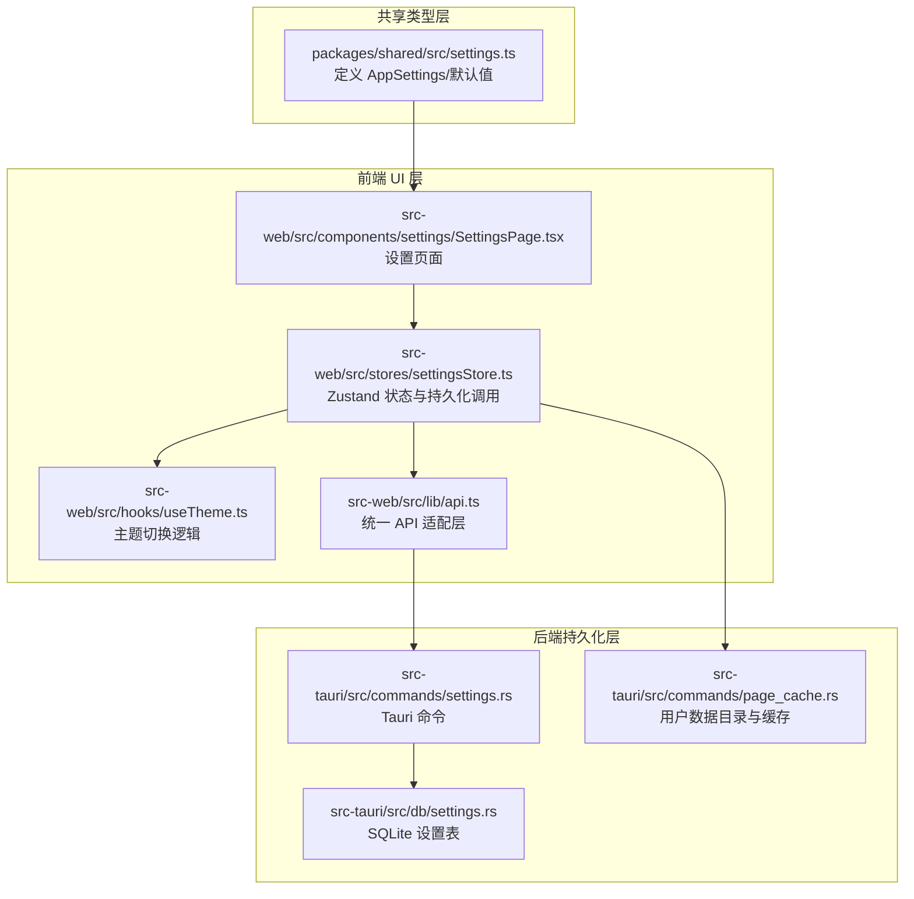
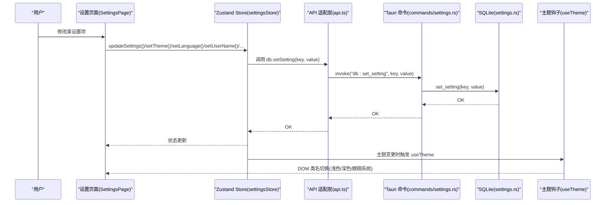
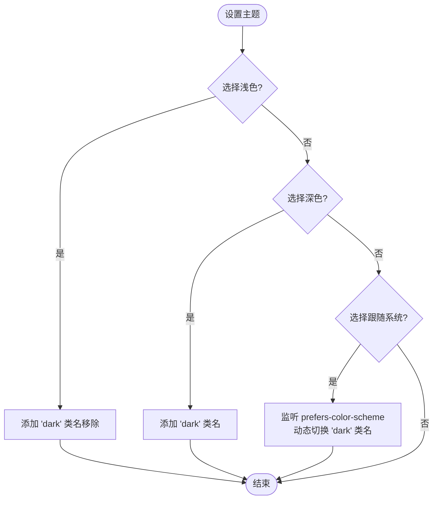
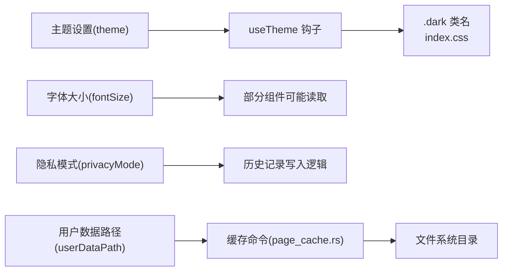

# 通用设置

<cite>
**本文引用的文件**
- [settings.ts](file://packages/shared/src/settings.ts)
- [SettingsPage.tsx](file://src-web/src/components/settings/SettingsPage.tsx)
- [settingsStore.ts](file://src-web/src/stores/settingsStore.ts)
- [useTheme.ts](file://src-web/src/hooks/useTheme.ts)
- [settings.rs](file://src-tauri/src/db/settings.rs)
- [settings.rs（命令）](file://src-tauri/src/commands/settings.rs)
- [api.ts](file://src-web/src/lib/api.ts)
- [AIPanel.tsx](file://src-web/src/components/layout/AIPanel.tsx)
- [index.css](file://src-web/src/index.css)
- [tailwind.config.js](file://src-web/tailwind.config.js)
- [page_cache.rs](file://src-tauri/src/commands/page_cache.rs)
</cite>

## 目录
1. [简介](#简介)
2. [项目结构](#项目结构)
3. [核心组件](#核心组件)
4. [架构总览](#架构总览)
5. [详细组件分析](#详细组件分析)
6. [依赖关系分析](#依赖关系分析)
7. [性能考量](#性能考量)
8. [故障排查指南](#故障排查指南)
9. [结论](#结论)
10. [附录](#附录)

## 简介
本文件面向 CoSurf 的“通用设置”功能，围绕用户名称、主题切换（浅色/深色/跟随系统）、语言设置（简体中文/English）、字体大小调节、AI 面板默认高度设置、隐私模式等核心设置项，系统阐述其数据模型、前端交互、后端存储、实时生效机制以及各设置项之间的关联与依赖，并提供常见问题排查与最佳实践建议。

## 项目结构
通用设置涉及三层协作：
- 共享类型层：定义设置的数据结构与默认值
- 前端 UI 层：提供设置界面与交互，驱动状态变更
- 后端持久化层：通过 SQLite 存储设置键值，提供命令接口

图表来源
- [settings.ts:1-47](file://packages/shared/src/settings.ts#L1-L47)
- [SettingsPage.tsx:147-267](file://src-web/src/components/settings/SettingsPage.tsx#L147-L267)
- [settingsStore.ts:1-201](file://src-web/src/stores/settingsStore.ts#L1-L201)
- [useTheme.ts:1-24](file://src-web/src/hooks/useTheme.ts#L1-L24)
- [api.ts:118-127](file://src-web/src/lib/api.ts#L118-L127)
- [settings.rs（命令）:9-34](file://src-tauri/src/commands/settings.rs#L9-L34)
- [settings.rs:180-215](file://src-tauri/src/db/settings.rs#L180-L215)
- [page_cache.rs:19-44](file://src-tauri/src/commands/page_cache.rs#L19-L44)

章节来源
- [settings.ts:1-47](file://packages/shared/src/settings.ts#L1-L47)
- [SettingsPage.tsx:147-267](file://src-web/src/components/settings/SettingsPage.tsx#L147-L267)
- [settingsStore.ts:1-201](file://src-web/src/stores/settingsStore.ts#L1-L201)
- [useTheme.ts:1-24](file://src-web/src/hooks/useTheme.ts#L1-L24)
- [api.ts:118-127](file://src-web/src/lib/api.ts#L118-L127)
- [settings.rs（命令）:9-34](file://src-tauri/src/commands/settings.rs#L9-L34)
- [settings.rs:180-215](file://src-tauri/src/db/settings.rs#L180-L215)
- [page_cache.rs:19-44](file://src-tauri/src/commands/page_cache.rs#L19-L44)

## 核心组件
- 设置数据模型与默认值：位于共享包，定义主题、语言、字体大小、用户名称、AI 面板默认高度、隐私模式、AI 数据隐私、快捷键、用户数据路径等字段及默认值。
- 设置页面与交互：提供用户名称、主题、语言、字体大小、AI 面板默认高度、隐私模式等设置项的 UI 与交互。
- 状态与持久化：Zustand store 负责本地状态与持久化调用；前端通过统一 API 适配层调用后端命令；后端通过 SQLite settings 表持久化键值。
- 主题切换钩子：根据设置主题动态切换根元素类名，实现浅色/深色/跟随系统。
- 用户数据路径与缓存：用户数据目录可自定义，用于页面缓存等；默认路径由后端计算并确保存在。

章节来源
- [settings.ts:5-17](file://packages/shared/src/settings.ts#L5-L17)
- [settings.ts:28-46](file://packages/shared/src/settings.ts#L28-L46)
- [SettingsPage.tsx:147-267](file://src-web/src/components/settings/SettingsPage.tsx#L147-L267)
- [settingsStore.ts:6-31](file://src-web/src/stores/settingsStore.ts#L6-L31)
- [useTheme.ts:4-23](file://src-web/src/hooks/useTheme.ts#L4-L23)
- [page_cache.rs:19-44](file://src-tauri/src/commands/page_cache.rs#L19-L44)

## 架构总览
设置变更的端到端流程如下：

图表来源
- [SettingsPage.tsx:147-267](file://src-web/src/components/settings/SettingsPage.tsx#L147-L267)
- [settingsStore.ts:76-90](file://src-web/src/stores/settingsStore.ts#L76-L90)
- [api.ts:125-126](file://src-web/src/lib/api.ts#L125-L126)
- [settings.rs（命令）:27-34](file://src-tauri/src/commands/settings.rs#L27-L34)
- [settings.rs:190-197](file://src-tauri/src/db/settings.rs#L190-L197)
- [useTheme.ts:4-23](file://src-web/src/hooks/useTheme.ts#L4-L23)

## 详细组件分析

### 用户名称（userName）
- 作用：作为对话中的显示名称，影响消息展示与上下文识别。
- 有效范围与默认值：字符串，最大长度限制在 UI 层；默认值来自共享类型定义。
- 数据存储：通过 updateSettings 写入 SQLite settings 表。
- 实时生效：本地状态立即更新，后端持久化异步进行。
- UI 交互：文本输入框，支持最大长度限制与占位提示。

章节来源
- [settings.ts:9-10](file://packages/shared/src/settings.ts#L9-L10)
- [settings.ts:32-32](file://packages/shared/src/settings.ts#L32-L32)
- [SettingsPage.tsx:162-176](file://src-web/src/components/settings/SettingsPage.tsx#L162-L176)
- [settingsStore.ts:70-74](file://src-web/src/stores/settingsStore.ts#L70-L74)
- [api.ts:125-126](file://src-web/src/lib/api.ts#L125-L126)
- [settings.rs（命令）:27-34](file://src-tauri/src/commands/settings.rs#L27-L34)
- [settings.rs:190-197](file://src-tauri/src/db/settings.rs#L190-L197)

### 主题切换（ThemeMode：light/dark/system）
- 作用：控制界面明暗风格与系统跟随策略。
- 有效范围与默认值：枚举值 "light"|"dark"|"system"；默认 "system"。
- 数据存储：写入 settings 表 key 为 "theme" 的记录。
- 实时生效：useTheme 钩子在设置变更时，动态添加/移除根元素类名，立即反映到 UI。
- UI 交互：三按钮切换，选中态高亮。

图表来源
- [useTheme.ts:4-23](file://src-web/src/hooks/useTheme.ts#L4-L23)
- [SettingsPage.tsx:178-199](file://src-web/src/components/settings/SettingsPage.tsx#L178-L199)
- [settings.ts:1-1](file://packages/shared/src/settings.ts#L1-L1)
- [settingsStore.ts:58-62](file://src-web/src/stores/settingsStore.ts#L58-L62)

章节来源
- [settings.ts:1-1](file://packages/shared/src/settings.ts#L1-L1)
- [settings.ts:29-29](file://packages/shared/src/settings.ts#L29-L29)
- [SettingsPage.tsx:178-199](file://src-web/src/components/settings/SettingsPage.tsx#L178-L199)
- [useTheme.ts:4-23](file://src-web/src/hooks/useTheme.ts#L4-L23)
- [settingsStore.ts:58-62](file://src-web/src/stores/settingsStore.ts#L58-L62)

### 语言设置（Language：zh-CN/en-US）
- 作用：控制界面文案语言。
- 有效范围与默认值：枚举值 "zh-CN"|"en-US"；默认 "zh-CN"。
- 数据存储：写入 settings 表 key 为 "language" 的记录。
- 实时生效：本地状态立即更新；若需多语言资源切换，通常由国际化库处理，此处仅记录语言键值。
- UI 交互：两按钮切换，选中态高亮。

章节来源
- [settings.ts:3-3](file://packages/shared/src/settings.ts#L3-L3)
- [settings.ts:30-30](file://packages/shared/src/settings.ts#L30-L30)
- [SettingsPage.tsx:201-221](file://src-web/src/components/settings/SettingsPage.tsx#L201-L221)
- [settingsStore.ts:64-67](file://src-web/src/stores/settingsStore.ts#L64-L67)
- [api.ts:125-126](file://src-web/src/lib/api.ts#L125-L126)
- [settings.rs（命令）:27-34](file://src-tauri/src/commands/settings.rs#L27-L34)

### 字体大小（fontSize：数值）
- 作用：控制界面文本字号。
- 有效范围与默认值：数值，范围 12-18；默认 14。
- 数据存储：写入 settings 表 key 为 "fontSize" 的记录。
- 实时生效：本地状态立即更新；可通过 CSS 变量或 Tailwind 配置映射到字号类，但当前项目未见字号类映射，实际生效取决于具体组件是否读取该值。
- UI 交互：滑块输入，显示当前像素值。

章节来源
- [settings.ts:8-8](file://packages/shared/src/settings.ts#L8-L8)
- [settings.ts:31-31](file://packages/shared/src/settings.ts#L31-L31)
- [SettingsPage.tsx:223-237](file://src-web/src/components/settings/SettingsPage.tsx#L223-L237)
- [settingsStore.ts:76-90](file://src-web/src/stores/settingsStore.ts#L76-L90)
- [api.ts:125-126](file://src-web/src/lib/api.ts#L125-L126)
- [settings.rs（命令）:27-34](file://src-tauri/src/commands/settings.rs#L27-L34)

### AI 面板默认高度（panelDefaultHeight：数值）
- 作用：设置 AI 面板的默认高度（单位：px），用于初始布局。
- 有效范围与默认值：数值，范围 200-600；默认 300。
- 数据存储：写入 settings 表 key 为 "panelDefaultHeight" 的记录。
- 实时生效：本地状态立即更新；实际面板高度由布局组件读取并应用，与设置项存在耦合。
- UI 交互：滑块输入，显示当前像素值。

章节来源
- [settings.ts:10-10](file://packages/shared/src/settings.ts#L10-L10)
- [settings.ts:33-33](file://packages/shared/src/settings.ts#L33-L33)
- [SettingsPage.tsx:239-254](file://src-web/src/components/settings/SettingsPage.tsx#L239-L254)
- [settingsStore.ts:76-90](file://src-web/src/stores/settingsStore.ts#L76-L90)
- [api.ts:125-126](file://src-web/src/lib/api.ts#L125-L126)
- [settings.rs（命令）:27-34](file://src-tauri/src/commands/settings.rs#L27-L34)

### 隐私模式（privacyMode：布尔）
- 作用：启用后不保存浏览历史，保护用户隐私。
- 有效范围与默认值：布尔值；默认 false。
- 数据存储：写入 settings 表 key 为 "privacyMode" 的记录。
- 实时生效：本地状态立即更新；具体行为由业务模块（如历史记录写入）读取该标志决定。
- UI 交互：开关控件。

章节来源
- [settings.ts:12-12](file://packages/shared/src/settings.ts#L12-L12)
- [settings.ts:35-35](file://packages/shared/src/settings.ts#L35-L35)
- [SettingsPage.tsx:256-264](file://src-web/src/components/settings/SettingsPage.tsx#L256-L264)
- [settingsStore.ts:76-90](file://src-web/src/stores/settingsStore.ts#L76-L90)
- [api.ts:125-126](file://src-web/src/lib/api.ts#L125-L126)
- [settings.rs（命令）:27-34](file://src-tauri/src/commands/settings.rs#L27-L34)

### 用户数据路径（userDataPath：字符串）
- 作用：自定义用户数据目录，用于页面缓存等数据存放。
- 有效范围与默认值：字符串；空字符串表示使用默认路径（系统临时目录/cosurf/data/pages）。
- 数据存储：写入 settings 表 key 为 "userDataPath" 的记录。
- 实时生效：本地状态立即更新；实际使用由缓存命令读取并确保目录存在。
- UI 交互：设置页面未提供直接编辑入口，通过缓存命令与默认路径逻辑实现。

章节来源
- [settings.ts:15-15](file://packages/shared/src/settings.ts#L15-L15)
- [settings.ts:45-46](file://packages/shared/src/settings.ts#L45-L46)
- [page_cache.rs:19-44](file://src-tauri/src/commands/page_cache.rs#L19-L44)
- [settingsStore.ts:76-90](file://src-web/src/stores/settingsStore.ts#L76-L90)
- [api.ts:125-126](file://src-web/src/lib/api.ts#L125-L126)
- [settings.rs（命令）:27-34](file://src-tauri/src/commands/settings.rs#L27-L34)

### 快捷键（shortcuts：对象）
- 作用：定义常用快捷键组合，如切换 AI 面板、新建标签页等。
- 有效范围与默认值：对象，包含多个快捷键键名；默认值在共享类型中定义。
- 数据存储：写入 settings 表 key 为 "shortcuts" 的记录（序列化为字符串）。
- 实时生效：本地状态立即更新；快捷键绑定由前端模块处理。
- UI 交互：快捷键标签页展示当前组合。

章节来源
- [settings.ts:19-26](file://packages/shared/src/settings.ts#L19-L26)
- [settings.ts:37-44](file://packages/shared/src/settings.ts#L37-L44)
- [SettingsPage.tsx:731-759](file://src-web/src/components/settings/SettingsPage.tsx#L731-L759)
- [settingsStore.ts:76-90](file://src-web/src/stores/settingsStore.ts#L76-L90)
- [api.ts:125-126](file://src-web/src/lib/api.ts#L125-L126)
- [settings.rs（命令）:27-34](file://src-tauri/src/commands/settings.rs#L27-L34)

## 依赖关系分析
- 设置项之间松耦合：主题、语言、字体大小、用户名称、面板高度、隐私模式等均为独立键值，互不影响。
- 主题与 UI：useTheme 钩子依赖设置主题，动态切换根元素类名，影响全局样式。
- 字体大小与 UI：当前项目未见字号类映射，字体大小设置对 UI 的直接影响有限。
- 隐私模式与历史：隐私模式为布尔标志，具体行为由业务模块读取决定。
- 用户数据路径与缓存：缓存命令读取用户数据路径，确保目录存在并执行清理与保存。

图表来源
- [useTheme.ts:4-23](file://src-web/src/hooks/useTheme.ts#L4-L23)
- [index.css:24-41](file://src-web/src/index.css#L24-L41)
- [SettingsPage.tsx:223-237](file://src-web/src/components/settings/SettingsPage.tsx#L223-L237)
- [page_cache.rs:19-44](file://src-tauri/src/commands/page_cache.rs#L19-L44)

章节来源
- [useTheme.ts:4-23](file://src-web/src/hooks/useTheme.ts#L4-L23)
- [index.css:24-41](file://src-web/src/index.css#L24-L41)
- [SettingsPage.tsx:223-237](file://src-web/src/components/settings/SettingsPage.tsx#L223-L237)
- [page_cache.rs:19-44](file://src-tauri/src/commands/page_cache.rs#L19-L44)

## 性能考量
- 设置写入采用逐项异步持久化：updateSettings 逐键写入，避免阻塞 UI。
- 主题切换为轻量级 DOM 操作，性能开销极低。
- 字体大小与面板高度等设置对渲染影响较小，主要体现在布局与组件读取。
- 用户数据路径与缓存目录检查在首次使用时进行，后续读取为常量时间。

[本节为通用指导，无需特定文件引用]

## 故障排查指南
- 设置项未保存或重启后丢失
  - 检查后端命令是否成功：db.set_setting 是否返回成功。
  - 检查 SQLite settings 表是否存在对应 key。
  - 若为快捷键或模型等复杂对象，确认序列化/反序列化是否正确。
- 主题切换无效
  - 确认 useTheme 钩子已运行且未被卸载。
  - 检查根元素是否正确添加/移除 "dark" 类名。
- 字体大小未生效
  - 确认组件是否读取 settings.fontSize 并据此应用样式。
  - 若使用 Tailwind 类，需确保类名映射到字号类。
- 隐私模式不生效
  - 确认业务模块读取 privacyMode 标志并相应地跳过历史写入。
- 用户数据路径异常
  - 检查缓存命令是否正确解析 userDataPath 并创建目录。
  - 确认默认路径计算逻辑与权限。

章节来源
- [settings.rs（命令）:27-34](file://src-tauri/src/commands/settings.rs#L27-L34)
- [settings.rs:190-197](file://src-tauri/src/db/settings.rs#L190-L197)
- [useTheme.ts:4-23](file://src-web/src/hooks/useTheme.ts#L4-L23)
- [page_cache.rs:19-44](file://src-tauri/src/commands/page_cache.rs#L19-L44)

## 结论
CoSurf 的通用设置通过清晰的分层设计与键值持久化，实现了用户名称、主题、语言、字体大小、AI 面板高度、隐私模式等核心设置的配置与持久化。前端以直观的 UI 交互驱动状态变更，后端以 SQLite 保证设置的可靠存储。主题切换具备即时视觉反馈，其他设置项在各自模块中按需读取并生效。建议在后续迭代中完善字体大小与面板高度的样式映射，以提升用户体验的一致性。

[本节为总结，无需特定文件引用]

## 附录

### 设置项清单与默认值
- theme: "system"
- language: "zh-CN"
- fontSize: 14
- userName: "CoCo"
- panelDefaultHeight: 300
- panelOverlayMode: true
- privacyMode: false
- aiDataPrivacy: false
- shortcuts: 预设快捷键组合
- userDataPath: 空字符串（使用默认路径）

章节来源
- [settings.ts:28-46](file://packages/shared/src/settings.ts#L28-L46)

### 设置项的有效范围
- theme: "light"|"dark"|"system"
- language: "zh-CN"|"en-US"
- fontSize: 12-18
- panelDefaultHeight: 200-600
- privacyMode: true|false
- aiDataPrivacy: true|false
- panelOverlayMode: true|false

章节来源
- [settings.ts:1-17](file://packages/shared/src/settings.ts#L1-L17)
- [SettingsPage.tsx:223-254](file://src-web/src/components/settings/SettingsPage.tsx#L223-L254)

### 实时生效机制
- 本地状态立即更新：Zustand store 在 updateSettings 中先更新本地状态。
- 异步持久化：逐键调用 db.setSetting 写入 SQLite。
- 主题即时生效：useTheme 钩子监听设置变更，动态切换根元素类名。
- 其他设置项：由各自模块在渲染或运行时读取最新值。

章节来源
- [settingsStore.ts:76-90](file://src-web/src/stores/settingsStore.ts#L76-L90)
- [useTheme.ts:4-23](file://src-web/src/hooks/useTheme.ts#L4-L23)
- [api.ts:125-126](file://src-web/src/lib/api.ts#L125-L126)
- [settings.rs（命令）:27-34](file://src-tauri/src/commands/settings.rs#L27-L34)