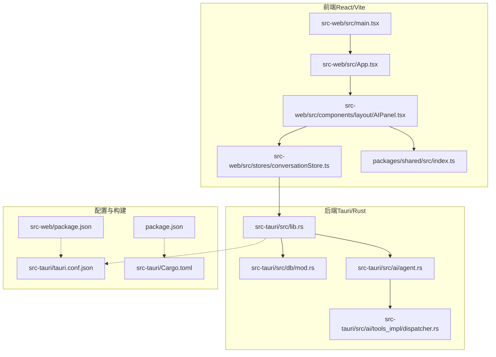
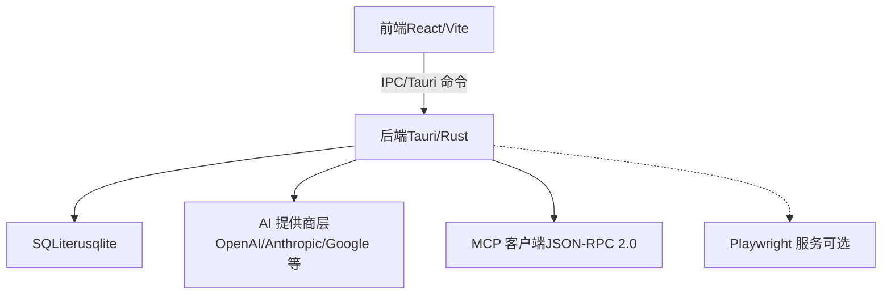
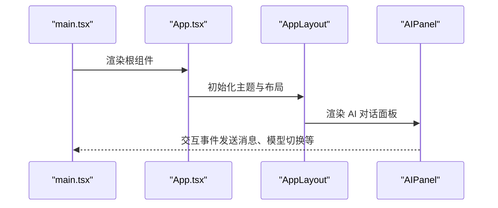
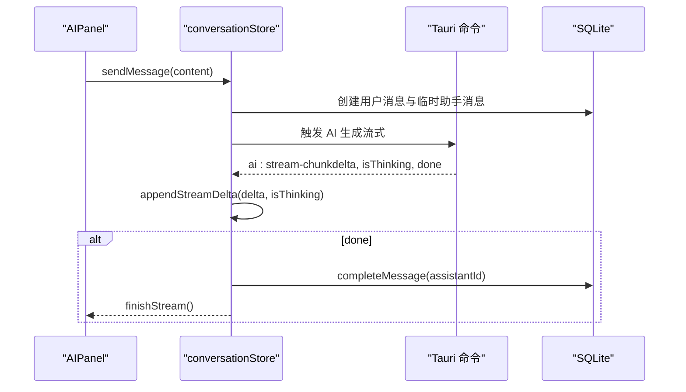
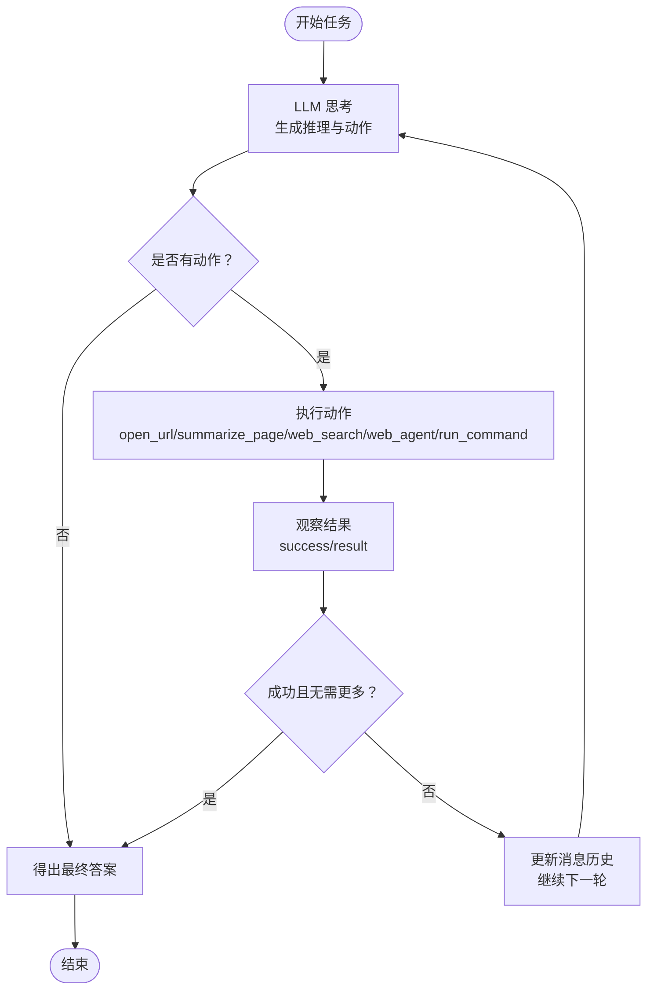
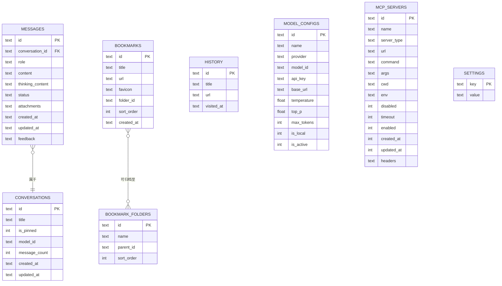
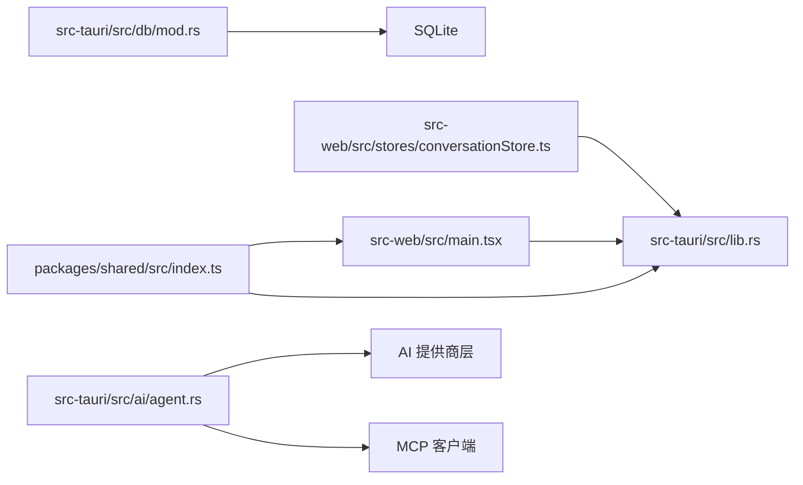

# 项目概述

<cite>
**本文引用的文件**
- [README.md](file://README.md)
- [package.json](file://package.json)
- [src-tauri/Cargo.toml](file://src-tauri/Cargo.toml)
- [src-web/package.json](file://src-web/package.json)
- [src-tauri/tauri.conf.json](file://src-tauri/tauri.conf.json)
- [src-tauri/src/lib.rs](file://src-tauri/src/lib.rs)
- [src-tauri/src/ai/agent.rs](file://src-tauri/src/ai/agent.rs)
- [src-tauri/src/ai/tools_impl/dispatcher.rs](file://src-tauri/src/ai/tools_impl/dispatcher.rs)
- [src-tauri/src/db/mod.rs](file://src-tauri/src/db/mod.rs)
- [src-web/src/main.tsx](file://src-web/src/main.tsx)
- [src-web/src/App.tsx](file://src-web/src/App.tsx)
- [src-web/src/components/layout/AIPanel.tsx](file://src-web/src/components/layout/AIPanel.tsx)
- [src-web/src/stores/conversationStore.ts](file://src-web/src/stores/conversationStore.ts)
- [packages/shared/src/index.ts](file://packages/shared/src/index.ts)
- [src-web/src/lib/tauri.ts](file://src-web/src/lib/tauri.ts)
</cite>

## 目录
1. [引言](#引言)
2. [项目结构](#项目结构)
3. [核心组件](#核心组件)
4. [架构总览](#架构总览)
5. [详细组件分析](#详细组件分析)
6. [依赖关系分析](#依赖关系分析)
7. [性能考虑](#性能考虑)
8. [故障排除指南](#故障排除指南)
9. [结论](#结论)
10. [附录](#附录)

## 引言
CoSurf（伴游）是一个面向桌面端的 AI 阅读伴侣与思考搭档，旨在帮助用户“读得更深、记得更牢、想得更快”。它不是传统阅读器或笔记工具，而是将阅读过程转化为可沉淀的个人知识体系：通过 AI 辅助深度理解网页内容、智能摘要、术语解释与长文拆解；自动标注要点、生成记忆卡片；跨文章关联召回；并在多源信息基础上辅助决策。

项目以“读→记→想→决”为核心路径，结合浏览器能力（WebView2 内核、多标签页、导航历史、书签、历史、下载、截图）与 AI 思考搭档（多模型支持、流式对话、Agent Loop、MCP 协议集成、Skills 系统），形成一体化的阅读与思考体验。

## 项目结构
项目采用前后端分离的桌面应用架构：
- 前端：React 18 + TypeScript + Vite，负责 UI 呈现与用户交互
- 后端：Tauri 2.x + Rust，负责系统集成、数据库、AI 能力与浏览器控制
- 共享层：TypeScript 类型定义，保证前后端契约一致
- 可选自动化：Playwright 服务（侧车）

**图表来源**
- [src-web/src/main.tsx:1-52](file://src-web/src/main.tsx#L1-L52)
- [src-web/src/App.tsx:1-8](file://src-web/src/App.tsx#L1-L8)
- [src-web/src/components/layout/AIPanel.tsx:1-200](file://src-web/src/components/layout/AIPanel.tsx#L1-L200)
- [src-web/src/stores/conversationStore.ts:1-200](file://src-web/src/stores/conversationStore.ts#L1-L200)
- [packages/shared/src/index.ts:1-9](file://packages/shared/src/index.ts#L1-L9)
- [src-tauri/src/lib.rs:1-258](file://src-tauri/src/lib.rs#L1-L258)
- [src-tauri/src/db/mod.rs:1-200](file://src-tauri/src/db/mod.rs#L1-L200)
- [src-tauri/src/ai/agent.rs:1-200](file://src-tauri/src/ai/agent.rs#L1-L200)
- [src-tauri/src/ai/tools_impl/dispatcher.rs:1-200](file://src-tauri/src/ai/tools_impl/dispatcher.rs#L1-L200)
- [src-tauri/tauri.conf.json:1-72](file://src-tauri/tauri.conf.json#L1-L72)
- [src-tauri/Cargo.toml:1-70](file://src-tauri/Cargo.toml#L1-L70)
- [src-web/package.json:1-44](file://src-web/package.json#L1-L44)
- [package.json:1-48](file://package.json#L1-L48)

**章节来源**
- [README.md:213-328](file://README.md#L213-L328)
- [src-tauri/tauri.conf.json:6-11](file://src-tauri/tauri.conf.json#L6-L11)
- [src-web/package.json:7-13](file://src-web/package.json#L7-L13)
- [package.json:14-30](file://package.json#L14-L30)

## 核心组件
- 阅读伴侣核心（读→记→想→决）
  - 读懂：AI 深度理解网页内容，提供智能摘要、术语解释、长文拆解
  - 记住：自动标注要点，生成记忆卡片，提取关键数据
  - 想起：跨文章关联召回，快速定位“我之前读过”
  - 决策：基于阅读历史与多源信息对比，辅助判断
- 浏览器能力
  - WebView2 内核，兼容现代网站
  - 多标签页管理、导航历史、书签管理、浏览历史、下载管理、截图工具
- AI 思考搭档
  - 多模型支持（OpenAI、Anthropic、Google Gemini、智谱、Kimi、DeepSeek、通义千问、Ollama 等）
  - 流式对话（SSE），打字机效果，支持思考过程展示
  - Agent Loop：多轮工具调用，自主完成复杂任务
  - MCP 协议集成：支持 stdio/SSE/Streamable HTTP，无缝接入 MCP Server
  - Skills 系统：支持 CLI、MCP、脚本等自定义扩展
  - 页面上下文感知、消息反馈、对话历史持久化

**章节来源**
- [README.md:20-46](file://README.md#L20-L46)
- [README.md:53-116](file://README.md#L53-L116)

## 架构总览
CoSurf 采用“前端 React + 后端 Tauri/Rust”的桌面应用架构，前端通过 IPC 与后端交互，后端通过 SQLite 存储对话、消息、书签、历史、设置等数据，并通过 AI 模型与工具链完成复杂任务。

**图表来源**
- [README.md:55-100](file://README.md#L55-L100)
- [src-tauri/Cargo.toml:41-46](file://src-tauri/Cargo.toml#L41-L46)
- [src-tauri/src/lib.rs:108-214](file://src-tauri/src/lib.rs#L108-L214)

**章节来源**
- [README.md:53-116](file://README.md#L53-L116)
- [src-tauri/Cargo.toml:21-70](file://src-tauri/Cargo.toml#L21-L70)

## 详细组件分析

### 前端应用入口与布局
- 应用入口负责全局错误边界与根组件挂载
- 主布局组件负责组织 AIPanel、导航栏、侧边栏、标签页与 WebView2 容器

**图表来源**
- [src-web/src/main.tsx:1-52](file://src-web/src/main.tsx#L1-L52)
- [src-web/src/App.tsx:1-8](file://src-web/src/App.tsx#L1-L8)
- [src-web/src/components/layout/AIPanel.tsx:1-200](file://src-web/src/components/layout/AIPanel.tsx#L1-L200)

**章节来源**
- [src-web/src/main.tsx:1-52](file://src-web/src/main.tsx#L1-L52)
- [src-web/src/App.tsx:1-8](file://src-web/src/App.tsx#L1-L8)

### AI 对话与流式消息
- AIPanel 负责渲染对话面板、模型选择、历史查看与输入控件
- conversationStore 管理对话列表、消息流式增量、停止生成、消息反馈与标题生成
- 前端通过事件监听接收后端流式片段，实时更新 UI

**图表来源**
- [src-web/src/components/layout/AIPanel.tsx:67-74](file://src-web/src/components/layout/AIPanel.tsx#L67-L74)
- [src-web/src/stores/conversationStore.ts:103-200](file://src-web/src/stores/conversationStore.ts#L103-L200)
- [src-tauri/src/lib.rs:157-167](file://src-tauri/src/lib.rs#L157-L167)

**章节来源**
- [src-web/src/components/layout/AIPanel.tsx:1-200](file://src-web/src/components/layout/AIPanel.tsx#L1-L200)
- [src-web/src/stores/conversationStore.ts:1-200](file://src-web/src/stores/conversationStore.ts#L1-L200)

### Agent Loop 与工具调度
- ReactAgent 实现 ReAct（推理+行动）模式，循环执行思考、动作与观察
- 工具调度器根据工具名称分发到内置工具、MCP 工具或 Skills 执行器
- 支持重复调用检测、工具调用后续传递与流式输出

**图表来源**
- [src-tauri/src/ai/agent.rs:72-139](file://src-tauri/src/ai/agent.rs#L72-L139)
- [src-tauri/src/ai/tools_impl/dispatcher.rs:14-55](file://src-tauri/src/ai/tools_impl/dispatcher.rs#L14-L55)

**章节来源**
- [src-tauri/src/ai/agent.rs:1-200](file://src-tauri/src/ai/agent.rs#L1-L200)
- [src-tauri/src/ai/tools_impl/dispatcher.rs:1-200](file://src-tauri/src/ai/tools_impl/dispatcher.rs#L1-L200)

### 数据持久化与数据库设计
- 后端通过 SQLite（rusqlite）存储对话、消息、书签、历史、设置与模型配置
- 数据库初始化时启用 WAL 模式与外键约束，并进行迁移以适配字段演进
- 索引优化查询性能（如历史按时间倒序索引）

**图表来源**
- [src-tauri/src/db/mod.rs:42-148](file://src-tauri/src/db/mod.rs#L42-L148)

**章节来源**
- [src-tauri/src/db/mod.rs:1-200](file://src-tauri/src/db/mod.rs#L1-L200)

### 共享类型与跨层契约
- packages/shared 提供前端与后端共享的类型定义（消息、对话、模型、工具、设置、标签页、下载等）
- 保证前后端接口一致性，降低耦合风险

**章节来源**
- [packages/shared/src/index.ts:1-9](file://packages/shared/src/index.ts#L1-L9)

### 技术栈与构建配置
- 前端：React 18 + TypeScript + Vite + Tailwind CSS + Zustand
- 后端：Tauri 2.x + Rust + SQLite（rusqlite）
- HTTP：reqwest + reqwest-eventsource
- 浏览器内核：WebView2（Windows）
- 可选自动化：Playwright（可选侧车服务）
- MCP 客户端：原生 Rust 实现（JSON-RPC 2.0）

**章节来源**
- [README.md:102-116](file://README.md#L102-L116)
- [src-web/package.json:14-26](file://src-web/package.json#L14-L26)
- [src-tauri/Cargo.toml:21-70](file://src-tauri/Cargo.toml#L21-L70)

## 依赖关系分析
- 前端依赖后端提供的 Tauri 命令，通过 invoke 与事件系统进行通信
- 后端依赖 SQLite 进行数据持久化，依赖 AI 提供商 API 与 MCP 客户端
- 共享类型层确保前后端契约稳定

**图表来源**
- [src-web/src/main.tsx:1-52](file://src-web/src/main.tsx#L1-L52)
- [src-tauri/src/lib.rs:108-214](file://src-tauri/src/lib.rs#L108-L214)
- [src-tauri/src/db/mod.rs:1-200](file://src-tauri/src/db/mod.rs#L1-L200)
- [src-tauri/src/ai/agent.rs:1-200](file://src-tauri/src/ai/agent.rs#L1-L200)
- [packages/shared/src/index.ts:1-9](file://packages/shared/src/index.ts#L1-L9)

**章节来源**
- [src-tauri/src/lib.rs:1-258](file://src-tauri/src/lib.rs#L1-L258)

## 性能考虑
- 前端使用 Zustand 管理轻量状态，避免不必要的重渲染
- 后端启用 SQLite WAL 模式与外键约束，提升并发与一致性
- 流式对话采用 SSE，减少一次性大响应带来的延迟
- 工具调度器按需懒加载 Skills 内容，降低启动成本
- 建议在高并发场景下对数据库查询建立合适索引，避免热点表阻塞

## 故障排除指南
- 端口冲突：若 1420 端口被占用，可在前端配置中调整端口
- WebView2 问题：确保 Windows 已安装最新 WebView2 Runtime
- Rust 编译失败：关闭已运行的进程后重试
- MCP 工具调用无结果：检查 MCP Server 是否正常运行与连接参数是否正确
- 数据库异常：使用 SQLite 浏览器工具查看与修复

**章节来源**
- [README.md:548-557](file://README.md#L548-L557)

## 结论
CoSurf 将“阅读”与“思考”深度融合，借助多模型支持、Agent Loop、MCP 协议与 Skills 系统，构建了可扩展、可沉淀的 AI 阅读体验。其前后端分离、数据库持久化的架构设计，既保证了良好的用户体验，也为持续扩展提供了清晰的边界与稳定的契约。

## 附录

### 快速开始指南
- 环境要求
  - Node.js >= 20.0.0
  - pnpm >= 9.0.0
  - Rust >= 1.88.0（Tauri 自动安装）
  - Windows 10/11（WebView2 已内置）
- 克隆与安装
  - 克隆仓库并安装依赖
- 首次使用
  - 启动应用：pnpm dev:full
  - 配置 AI 模型：设置 → 模型 → 添加模型
  - 开始对话：右下角 AI 面板输入问题
  - 体验 Agent Loop：尝试“打开网页 → 总结 → 回答”的复杂任务
- 开发模式
  - 仅前端：pnpm dev
  - 完整开发：pnpm dev:full 或 pnpm dev:tauri
- 构建发布
  - pnpm build:release 或 pnpm build:tauri
  - 产物位于 src-tauri/target/release/bundle/

**章节来源**
- [README.md:117-212](file://README.md#L117-L212)

### 技术栈与版本
- 桌面框架：Tauri 2.x
- 前端：React 18 + TypeScript + Vite 6
- UI：Tailwind CSS 3 + Lucide Icons
- 状态管理：Zustand 5
- 后端：Rust 1.88
- 数据库：SQLite（rusqlite）
- HTTP：reqwest + reqwest-eventsource
- 浏览器内核：WebView2（Windows）
- 自动化：Playwright（可选）
- MCP 客户端：原生 Rust 实现（JSON-RPC 2.0）

**章节来源**
- [README.md:102-116](file://README.md#L102-L116)