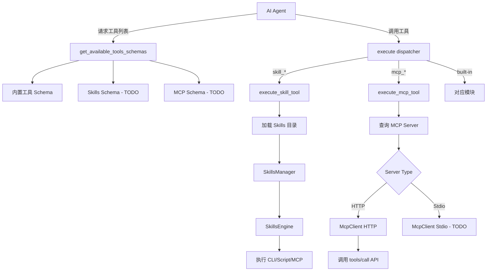

# Agent Loop 动态工具集成指南

## 📋 概述

CoSurf 的 Agent Loop 现已支持动态加载和使用 **Skills** 和 **MCP Server** 工具，让 AI Agent 能够自动发现并调用这些扩展能力。

---

## 🎯 架构设计

### 工具分类

Agent Loop 现在支持三类工具：

1. **内置工具 (Built-in Tools)**
   - `summarize_page` - 总结页面内容
   - `web_agent` - 网页自动化操作
   - `open_url` - 打开新 URL
   - `translate` - 翻译页面
   - `export_markdown` - 导出 Markdown
   - `web_search` - 联网搜索

2. **Skills 工具**
   - 命名格式：`skill_{id}`
   - 从 Skills 目录动态加载
   - 支持 CLI、Script、MCP、BuiltIn 四种类型

3. **MCP Server 工具**
   - 命名格式：`mcp_{server_name}`
   - 从数据库配置的 MCP Servers 动态加载
   - 支持 HTTP 和 stdio 两种模式

---

## 🔧 实现细节

### 1. 工具 Schema 生成

文件：[`src-tauri/src/ai/tools.rs`](file://d:\coding-harness\CoSurf\src-tauri\src\ai\tools.rs)

```rust
pub fn get_available_tools_schemas() -> Vec<serde_json::Value> {
    let mut schemas = vec![
        BuiltInTool::SummarizePage.to_openai_schema(),
        BuiltInTool::WebAgent.to_openai_schema(),
        // ... 其他内置工具
    ];
    
    // TODO: 添加 Skills 工具 schema
    // if let Some(skills_schemas) = get_skills_tool_schemas() {
    //     schemas.extend(skills_schemas);
    // }
    
    // TODO: 添加 MCP Server 工具 schema
    // if let Some(mcp_schemas) = get_mcp_tools_schemas() {
    //     schemas.extend(mcp_schemas);
    // }
    
    schemas
}
```

**当前状态**：
- ✅ 内置工具已启用
- ⏳ Skills 工具待实现（需要异步上下文）
- ⏳ MCP 工具待实现（需要异步上下文）

**技术挑战**：
- `get_available_tools_schemas()` 在同步上下文中调用
- 无法直接访问 `AppState` 和数据库
- 需要在 Agent Loop 启动前预加载工具列表

---

### 2. 工具执行调度器

文件：[`src-tauri/src/ai/tools_impl/dispatcher.rs`](file://d:\coding-harness\CoSurf\src-tauri\src\ai\tools_impl\dispatcher.rs)

#### 工具路由逻辑

```rust
pub async fn execute(app: &AppHandle, tool_call: &ToolCall) -> AppResult<ToolResult> {
    let tool_name = tool_call.name.as_str();
    
    // 检查是否为 Skill 工具（格式：skill_{id}）
    if tool_name.starts_with("skill_") {
        let skill_id = &tool_name[6..];
        return execute_skill_tool(app, skill_id, tool_call).await;
    }
    
    // 检查是否为 MCP 工具（格式：mcp_{server_name}）
    if tool_name.starts_with("mcp_") {
        let server_name = &tool_name[4..];
        return execute_mcp_tool(app, server_name, tool_call).await;
    }
    
    // 内置工具调度
    match tool_name {
        "open_url" => super::open_url::execute(app, tool_call).await,
        "web_search" => super::web_search::execute(app, tool_call).await,
        "summarize_page" => super::summarize_page::execute(app, tool_call).await,
        "web_agent" => super::web_agent::execute(app, tool_call).await,
        _ => Err(AppError::Internal(format!("Unknown tool: {}", tool_name))),
    }
}
```

---

### 3. Skills 工具执行

#### 执行流程

```rust
async fn execute_skill_tool(
    app: &AppHandle,
    skill_id: &str,
    tool_call: &ToolCall,
) -> AppResult<ToolResult> {
    // 1. 获取 Skills 目录路径
    let skills_dir_str = {
        let db = state.db.lock()?;
        db.get_skills_directory()?
    }; // 立即释放数据库锁
    
    // 2. 创建 SkillsManager
    let skills_dir = PathBuf::from(skills_dir_str);
    let mut skills_manager = SkillsManager::new(skills_dir);
    
    // 3. 加载所有 Skills
    skills_manager.load_skills_from_directory()?;
    
    // 4. 执行 Skill
    match skills_manager.execute_skill(skill_id, &tool_call.arguments).await {
        Ok(output) => ToolResult { success: true, output, .. },
        Err(e) => ToolResult { success: false, output: e.to_string(), .. },
    }
}
```

**关键设计**：
- ✅ 数据库锁在异步操作前释放，避免跨 await 持有 MutexGuard
- ✅ 使用 `SkillsEngine` 统一执行不同类型的 Skills
- ✅ 错误处理友好，返回详细的错误信息

---

### 4. MCP Server 工具执行

#### 执行流程

```rust
async fn execute_mcp_tool(
    app: &AppHandle,
    server_name: &str,
    tool_call: &ToolCall,
) -> AppResult<ToolResult> {
    // 1. 查找 MCP Server 配置
    let server = {
        let db = state.db.lock()?;
        let servers = db.list_mcp_servers()?;
        drop(db); // 释放数据库锁
        
        // 匹配服务器名称（处理下划线替换）
        servers.iter().find(|s| 
            s.name == original_name || 
            s.name.replace("-", "_") == server_name
        ).cloned()
    };
    
    // 2. 提取 tool_name 和 arguments
    let mcp_tool_name = tool_call.arguments.get("tool_name")?.as_str();
    let mcp_arguments = tool_call.arguments.get("arguments")?;
    
    // 3. 调用 MCP Server
    call_mcp_server(&server, mcp_tool_name, &mcp_arguments).await
}
```

#### MCP 客户端调用

```rust
async fn call_mcp_server(
    server: &McpServerConfig,
    tool_name: &str,
    arguments: &serde_json::Value,
) -> AppResult<String> {
    match server.server_type {
        McpServerType::Http => {
            let config = McpConfig {
                server_url: server.url.clone(),
                api_key: None, // TODO: 从配置读取
            };
            let mut client = McpClient::new(config);
            client.initialize().await?;
            
            // TODO: 实际调用 tools/call 端点
            // 目前返回模拟数据
            Ok(serde_json::json!({
                "tool": tool_name,
                "status": "simulated"
            }).to_string())
        }
        McpServerType::Stdio => {
            // TODO: 实现 stdio 模式的 MCP 客户端
            Err(AppError::Internal("Stdio mode not implemented"))
        }
    }
}
```

**当前状态**：
- ✅ HTTP 模式基础框架完成
- ⏳ 实际 API 调用待实现（目前是模拟数据）
- ⏳ Stdio 模式待实现

---

## 📊 工作流程图



---

## 🚀 使用方法

### 1. 配置 Skills

将 Skill 文件（`.md` 或 `.json`）放入 Skills 目录：

```bash
~/.cosurf/skills/
├── git-commit.md
├── code-review.json
└── data-analysis.md
```

**示例 Skill 文件** (`git-commit.md`)：

```markdown
---
id: git_commit
name: Git Commit
description: Create a git commit with conventional commits format
type: cli
enabled: true
tags: [git, version-control]
---

## 参数

| 参数 | 类型 | 必填 | 默认值 | 描述 |
|------|------|------|--------|------|
| message | string | 是 | - | Commit message |
| type | string | 否 | feat | Commit type (feat, fix, docs, etc.) |

## 配置

```yaml
command: git
args_template: ["commit", "-m", "{{type}}: {{message}}"]
working_dir: null
timeout: 30
require_confirmation: false
```
```

### 2. 配置 MCP Server

通过 UI 或 JSON 导入 MCP Server 配置：

```json
{
  "mcpServers": {
    "filesystem": {
      "command": "npx",
      "args": ["-y", "@modelcontextprotocol/server-filesystem", "/Users/username/Documents"],
      "env": {
        "HOME": "/Users/username"
      }
    }
  }
}
```

### 3. Agent 自动调用

当 AI Agent 需要执行任务时，会自动选择可用的工具：

**用户请求**：
> "帮我提交代码到 git，消息是 'fix: resolve login bug'"

**Agent 行为**：
1. 分析任务，识别需要执行 git commit
2. 检查可用工具列表，发现 `skill_git_commit`
3. 调用工具：
   ```json
   {
     "name": "skill_git_commit",
     "arguments": {
       "message": "resolve login bug",
       "type": "fix"
     }
   }
   ```
4. 执行 Skill，返回结果
5. 向用户报告成功

---

## 🔍 调试与日志

### 查看工具调用日志

工具执行时会输出详细日志：

```
⚙️  ========== EXECUTE TOOL ==========
Tool name: skill_git_commit
Tool ID: call_abc123
Arguments: {"message": "resolve login bug", "type": "fix"}

🎯 Executing Skill tool: git_commit
✅ Skill executed successfully
```

### 常见问题排查

#### 1. Skill 未找到

**症状**：`Skill not found: xxx`

**解决**：
- 检查 Skills 目录是否正确配置
- 确认 Skill 文件存在且格式正确
- 查看日志中的加载错误信息

#### 2. MCP Server 连接失败

**症状**：`MCP server not found: xxx`

**解决**：
- 检查 MCP Server 是否已启用
- 验证 URL 或 command 配置是否正确
- 测试网络连接（HTTP 模式）

#### 3. 工具执行超时

**症状**：`Timeout after 30 seconds`

**解决**：
- 增加 Skill/MCP 配置的 timeout 值
- 检查命令是否正常执行
- 查看系统资源使用情况

---

## 🛠️ 未来改进方向

### 短期目标

1. **实现动态 Schema 加载**
   - 在 Agent Loop 启动时预加载 Skills 和 MCP 工具列表
   - 缓存工具 schema，避免重复查询

2. **完善 MCP 客户端**
   - 实现真实的 `tools/call` API 调用
   - 支持 stdio 模式的 MCP Server
   - 添加 API Key 认证支持

3. **优化错误处理**
   - 提供更详细的错误信息
   - 支持重试机制
   - 添加超时控制

### 中期目标

1. **工具优先级管理**
   - 根据使用频率排序工具
   - 支持工具分组和标签过滤
   - 智能推荐相关工具

2. **性能优化**
   - 异步并发执行多个工具
   - 缓存工具执行结果
   - 减少数据库查询次数

3. **安全增强**
   - Skills 执行沙箱隔离
   - MCP Server 权限控制
   - 敏感参数加密存储

### 长期愿景

1. **工具市场**
   - 在线分享和下载 Skills
   - 社区贡献的 MCP Server 模板
   - 版本管理和更新通知

2. **智能编排**
   - 自动组合多个工具完成复杂任务
   - 基于历史数据的工具推荐
   - 工作流自动化

---

## 📚 相关文档

- [Skills 系统架构](./SKILLS_ARCHITECTURE.md)
- [MCP Server 标准配置](./MCP_STANDARD_CONFIG.md)
- [MCP JSON 配置指南](./MCP_JSON_CONFIG.md)
- [Agent Loop 工作原理](./AGENT_LOOP.md)

---

## ❓ FAQ

### Q: 为什么 Skills 和 MCP 工具的 schema 还没有动态加载？

A: 因为 `get_available_tools_schemas()` 在同步上下文中调用，而访问数据库需要异步操作。我们正在研究解决方案，可能包括：
- 在 Agent Loop 启动时预加载工具列表
- 使用消息传递机制异步获取 schema
- 重构调用链以支持异步

### Q: MCP Server 的 stdio 模式什么时候支持？

A: Stdio 模式需要实现本地进程管理和 JSON-RPC 通信，工作量较大。预计在下个版本中实现。

### Q: 如何自定义工具的参数验证？

A: 对于 Skills，可以在 Markdown 文件的参数表格中定义；对于 MCP，由 MCP Server 提供 JSON Schema；对于内置工具，参数定义在 `tools.rs` 中。

---

**最后更新**: 2026-05-23  
**版本**: v1.0.0
